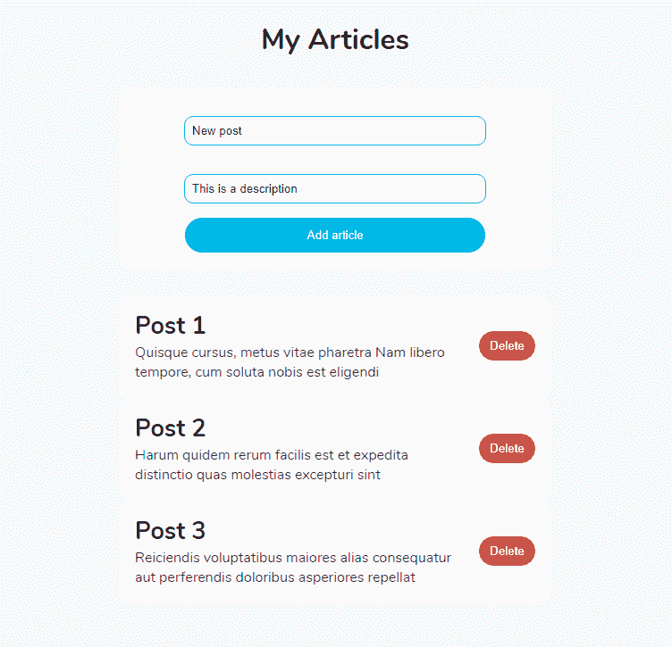

# 如何在 React TypeScript 应用程序中使用 Redux

> 原文：<https://www.freecodecamp.org/news/how-to-use-redux-in-your-react-typescript-app/>

Redux 是 JavaScript 应用程序的可预测状态容器。这是一个用于管理 React 应用程序状态的流行库。

当 Redux 与 TypeScript 一起使用时，它可以提供更好的开发人员体验。TypeScript 是 JavaScript 的一个超集，它对代码进行类型检查，以使其健壮并易于理解。

在本指南中，我将通过构建一个允许您添加、删除和显示文章的应用程序，向您展示如何在 React TypeScript 项目中使用 Redux。

让我们开始吧。

*   [先决条件](#prerequisites)
*   [设置](#setting-up)
*   [创建类型](#create-the-types)
*   [创建动作类型](#create-the-action-types)
*   [创建动作创建者](#create-the-action-creators)
*   [创建一个减速器](#create-a-reducer)
*   [创建商店](#create-a-store)
*   [创建组件](#create-the-components)

## 先决条件

本教程假设您至少对 React、Redux 和 TypeScript 有基本的了解。

所以，如果你不熟悉这些技术，首先试着读一下这个[打字指南](https://www.ibrahima-ndaw.com/blog/a-practical-guide-to-typescript/)或者[这个 React Redux 教程](https://www.ibrahima-ndaw.com/blog/7-steps-to-understand-react-redux/)。否则，我们开始吧。

## 设置项目

要使用 Redux 和 TypeScript，我们需要创建一个新的 React 应用程序。

为此，让我们打开 CLI(命令行界面)并执行以下命令:

```
 npx create-react-app my-app --template typescript 
```

接下来，让我们按如下方式构建项目:

```
├── src
|  ├── components
|  |  ├── AddArticle.tsx
|  |  └── Article.tsx
|  ├── store
|  |  ├── actionCreators.ts
|  |  ├── actionTypes.ts
|  |  └── reducer.ts
|  ├── type.d.ts
|  ├── App.test.tsx
|  ├── App.tsx
|  ├── index.css
|  ├── index.tsx
|  ├── react-app-env.d.ts
|  └── setupTests.ts
├── tsconfig.json
├── package.json
└── yarn.lock 
```

项目的文件结构非常简单。但是，有两件事需要注意:

*   包含 React Redux 相关文件的`store`文件夹。
*   保存 TypeScript 类型的`type.d.ts`文件，现在无需导入即可在其他文件中使用。

也就是说，我们现在可以安装 Redux 并创建我们的第一个商店。

因此，让我们打开项目并运行以下命令:

```
 yarn add redux react-redux redux-thunk 
```

或者使用`npm`时

```
 npm install redux react-redux redux-thunk 
```

我们还必须将它们的类型作为开发依赖项来安装，以帮助 TypeScript 理解这些库。

因此，让我们在 CLI 上再次执行该命令。

```
 yarn add -D @types/redux @types/react-redux @types/redux-thunk 
```

或者对于`npm`:

```
 npm install -D @types/redux @types/react-redux @types/redux-thunk 
```

太好了！经过这一步，我们现在可以在下一节中为项目创建 TypeScript 类型了。

## 创建类型

TypeScript 类型允许您为变量、函数参数等设置类型。

*   类型 d.ts

```
interface IArticle {
  id: number
  title: string
  body: string
}

type ArticleState = {
  articles: IArticle[]
}

type ArticleAction = {
  type: string
  article: IArticle
}

type DispatchType = (args: ArticleAction) => ArticleAction 
```

这里，我们从声明接口`IArticle`开始，它反映了给定文章的形状。

然后，我们有`ArticleState`、`ArticleAction`和`DispatchType`，它们将分别作为 Redux 提供的状态对象、动作创建者和调度函数的类型。

也就是说，我们现在有了开始使用 React Redux 的必要类型。让我们创建动作类型。

## 创建操作类型

*   store/actionTypes.ts

```
export const ADD_ARTICLE = "ADD_ARTICLE"
export const REMOVE_ARTICLE = "REMOVE_ARTICLE" 
```

对于 Redux 商店，我们需要两种操作类型。一个用于添加文章，另一个用于删除。

## 创建动作创建者

*   store/actionCreators.ts

```
import * as actionTypes from "./actionTypes"

export function addArticle(article: IArticle) {
  const action: ArticleAction = {
    type: actionTypes.ADD_ARTICLE,
    article,
  }

  return simulateHttpRequest(action)
}

export function removeArticle(article: IArticle) {
  const action: ArticleAction = {
    type: actionTypes.REMOVE_ARTICLE,
    article,
  }
  return simulateHttpRequest(action)
}

export function simulateHttpRequest(action: ArticleAction) {
  return (dispatch: DispatchType) => {
    setTimeout(() => {
      dispatch(action)
    }, 500)
  }
} 
```

在本教程中，我将通过延迟 0.5 秒来模拟 HTTP 请求。但是，如果您愿意，可以随意使用真正的服务器。

这里，函数`addArticle`将调度一个添加新文章的动作，方法`removeArticle`将做相反的事情。所以删除作为参数传入的对象。

## 创建一个减速器

reducer 是一个纯粹的函数，它接收存储和动作的状态作为参数，然后返回更新后的状态。

*   store/reducer.ts

```
import * as actionTypes from "./actionTypes"

const initialState: ArticleState = {
  articles: [
    {
      id: 1,
      title: "post 1",
      body:
        "Quisque cursus, metus vitae pharetra Nam libero tempore, cum soluta nobis est eligendi",
    },
    {
      id: 2,
      title: "post 2",
      body:
        "Harum quidem rerum facilis est et expedita distinctio quas molestias excepturi sint",
    },
  ],
} 
```

正如您在这里看到的，我们声明了一个初始状态，以便在页面加载时显示一些文章。状态对象需要匹配类型`ArticleState`——否则，TypeScript 将抛出一个错误。

*   store/reducer.ts

```
const reducer = (
  state: ArticleState = initialState,
  action: ArticleAction
): ArticleState => {
  switch (action.type) {
    case actionTypes.ADD_ARTICLE:
      const newArticle: IArticle = {
        id: Math.random(), // not really unique
        title: action.article.title,
        body: action.article.body,
      }
      return {
        ...state,
        articles: state.articles.concat(newArticle),
      }
    case actionTypes.REMOVE_ARTICLE:
      const updatedArticles: IArticle[] = state.articles.filter(
        article => article.id !== action.article.id
      )
      return {
        ...state,
        articles: updatedArticles,
      }
  }
  return state
}

export default reducer 
```

接下来，我们有一个`reducer`函数，它期望前一个状态和一个动作能够更新存储。这里，我们有两个动作:一个用于添加，另一个用于删除。

有了这些，我们现在可以用 reducer 处理状态了。现在让我们为项目创建一个商店。

## 创建商店

Redux store 是你的应用状态所在的地方。

*   index.tsx

```
import * as React from "react"
import { render } from "react-dom"
import { createStore, applyMiddleware, Store } from "redux"
import { Provider } from "react-redux"
import thunk from "redux-thunk"

import App from "./App"
import reducer from "./store/reducer"

const store: Store<ArticleState, ArticleAction> & {
  dispatch: DispatchType
} = createStore(reducer, applyMiddleware(thunk))

const rootElement = document.getElementById("root")
render(
  <Provider store={store}>
    <App />
  </Provider>,
  rootElement
) 
```

如您所见，我们导入了 reducer 函数，然后将其作为参数传递给方法`createStore`,以便创建一个新的 Redux 存储。`redux-thunk`中间件也需要作为方法的第二个参数来处理异步代码。

接下来，我们通过提供`store`对象作为`Provider`组件的道具，将 React 连接到 Redux。

我们现在可以在这个项目中使用 Redux 并访问商店。因此，让我们创建组件来获取和操作数据。

## 创建组件

*   components/AddArticle.tsx

```
import * as React from "react"

type Props = {
  saveArticle: (article: IArticle | any) => void
}

export const AddArticle: React.FC<Props> = ({ saveArticle }) => {
  const [article, setArticle] = React.useState<IArticle | {}>()

  const handleArticleData = (e: React.FormEvent<HTMLInputElement>) => {
    setArticle({
      ...article,
      [e.currentTarget.id]: e.currentTarget.value,
    })
  }

  const addNewArticle = (e: React.FormEvent) => {
    e.preventDefault()
    saveArticle(article)
  }

  return (
    <form onSubmit={addNewArticle} className="Add-article">
      <input
        type="text"
        id="title"
        placeholder="Title"
        onChange={handleArticleData}
      />
      <input
        type="text"
        id="body"
        placeholder="Description"
        onChange={handleArticleData}
      />
      <button disabled={article === undefined ? true : false}>
        Add article
      </button>
    </form>
  )
} 
```

为了添加新文章，我们将使用这个表单组件。它接收函数`saveArticle`作为参数，允许向商店添加新商品。

article 对象应该遵循 type `IArticle`才能让 TypeScript 高兴。

*   components/Article.tsx

```
import * as React from "react"
import { Dispatch } from "redux"
import { useDispatch } from "react-redux"

type Props = {
  article: IArticle
  removeArticle: (article: IArticle) => void
}

export const Article: React.FC<Props> = ({ article, removeArticle }) => {
  const dispatch: Dispatch<any> = useDispatch()

  const deleteArticle = React.useCallback(
    (article: IArticle) => dispatch(removeArticle(article)),
    [dispatch, removeArticle]
  )

  return (
    <div className="Article">
      <div>
        <h1>{article.title}</h1>
        <p>{article.body}</p>
      </div>
      <button onClick={() => deleteArticle(article)}>Delete</button>
    </div>
  )
} 
```

`Article`组件显示一个文章对象。

函数`removeArticle`必须发送以访问商店，从而删除给定的商品。这就是我们在这里使用`useDispatch`钩子的原因，它让 Redux 完成移除动作。

接下来，`useCallback`的使用有助于避免不必要的重新渲染，因为它将值作为依赖项来记忆。

我们终于有了添加和显示文章所需的组件。现在让我们通过在`App.tsx`文件中使用它们来添加最后一块拼图。

*   App.tsx

```
import * as React from "react"
import { useSelector, shallowEqual, useDispatch } from "react-redux"
import "./styles.css"

import { Article } from "./components/Article"
import { AddArticle } from "./components/AddArticle"
import { addArticle, removeArticle } from "./store/actionCreators"
import { Dispatch } from "redux"

const App: React.FC = () => {
  const articles: readonly IArticle[] = useSelector(
    (state: ArticleState) => state.articles,
    shallowEqual
  )

  const dispatch: Dispatch<any> = useDispatch()

  const saveArticle = React.useCallback(
    (article: IArticle) => dispatch(addArticle(article)),
    [dispatch]
  )

  return (
    <main>
      <h1>My Articles</h1>
      <AddArticle saveArticle={saveArticle} />
      {articles.map((article: IArticle) => (
        <Article
          key={article.id}
          article={article}
          removeArticle={removeArticle}
        />
      ))}
    </main>
  )
}

export default App 
```

`useSelector`钩子允许访问商店的状态。这里，我们将`shallowEqual`作为第二个参数传递给方法，告诉 Redux 在检查更改时使用浅层等式。

接下来，我们依靠`useDispatch`来调度在商店中添加商品的动作。最后，我们遍历文章数组，并将每篇文章传递给`Article`组件来显示它。

这样，我们现在可以浏览到项目的根目录，然后执行以下命令:

```
 yarn start 
```

或者对于`npm`:

```
 npm start 
```

如果您在浏览器中打开`http://localhost:3000/`，您应该会看到:



太好了！我们的应用程序看起来不错。至此，我们已经在 React TypeScript 应用程序中完成了 Redux 的使用。

你可以在这个 CodeSandbox 中找到已经完成的项目[。](https://codesandbox.io/s/react-redux-typescript-oc4hi)

你可以在[我的博客](https://www.ibrahima-ndaw.com)上找到类似这样的精彩内容，或者在 Twitter 上关注我[以获得通知。](https://twitter.com/ibrahima92_)

感谢阅读。