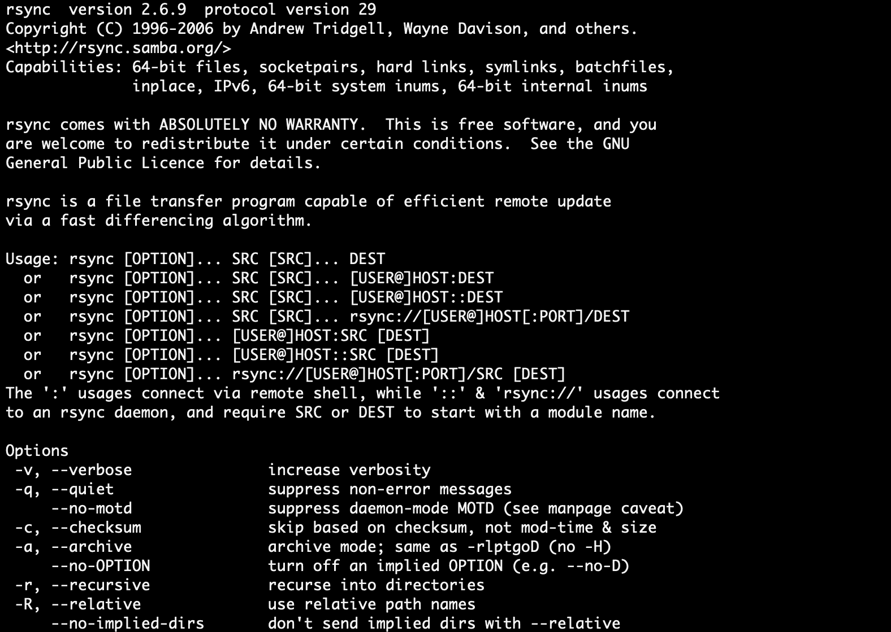

# RSync 示例——RSync 选项以及如何通过 SSH 复制文件

> 原文：<https://www.freecodecamp.org/news/rsync-examples-rsync-options-and-how-to-copy-files-over-ssh/>

Rsync 代表“远程同步”。这是一个远程和本地文件同步工具，帮助您有效地传输文件。

## RSync 是什么

Rsync 比像[安全复制协议(SCP)](https://www.geeksforgeeks.org/scp-command-in-linux-with-examples/) 这样的工具要快。它使用 [delta-transfer](https://www.dynamsoft.com/help/SAW%20Standalone/Getting%20Started/Delta%20Transfer.htm) 算法，通过仅复制文件中已更新的部分来最小化数据传输。

Rsync 的一些附加特性包括:

*   支持复制链接、设备、所有者、组和权限
*   不需要超级用户权限
*   将文件传输到[的管道最小化延迟成本](https://whatis.techtarget.com/definition/latency)

您只能将文件从本地传输到远程或从远程传输到本地。Rsync 不支持远程到远程的文件传输。

## RSync 如何工作

现在您已经知道了 Rsync 是什么，让我们看看如何使用它。

Rsync 的工作方式类似于 SSH 和 SCP 等其他远程服务器管理工具。

下面是 Rsync 的基本语法:

```
rsync [options] source [destination]
```

下面是将文件从本地系统传输到远程服务器的语法。它也称为“推送”操作。

```
rsync local_file_path user@remote-host:remote_file_path
```

以下是如何将文件从远程服务器传输到您的本地系统，也称为“拉”操作。

```
rsync user@remote-host:remote_file_path local_file_path
```

> 注意:使用远程系统时，确保您拥有对远程系统的 [SSH 访问权限。Rsync 使用 SSH 建立连接，以支持文件传输。](https://www.hostinger.in/tutorials/ssh-tutorial-how-does-ssh-work?__cf_chl_jschl_tk__=f550a12fdfece557e30dc21901117b432d5a8e1d-1599060891-0-AQrE-UcUtiSpJOvL7PClSP8WK3uhRkd2Va_WJS_Hr7mHzy4lylrjibVz-sFxPrqTOYzEL8kjWnc_WKPSFQq4_CGDfTHPmPF3uv3IBQyDJnHm3v_FHx9-6uH7IG663DhoKDAdMayU1_iN33sQ5fsuniN5ga8w33sjEXqwdW-0-dKQeXXGPN37aTbwu7NlmtFf8MGAvsqbs2NEFChJ2Mpi9qasX6dy0guXG446JenTxsOz_P3g9wzw1qv8hXZtfC7UOdR4s_guli8xDi_EOuzgNoYVRe2r2nRBQ3jNb0fzLwK5frAhmmbv6LClLgrF5r8NRYqxsBPD4FCXp8wvFo7agjs)

## 如何在 RSync 中使用标志

Rsync 允许您通过命令行标志添加额外的选项。让我们看看几个有用的标志。

### 递归的

如果添加 **-r** 选项，RSync 将执行递归文件传输。这在处理目录时很有用。这里有一个例子:

```
rsync -r user@remote-host:remote_directory/ local_directory
```

### 档案馆

**-a** 标志用于在传输文件时保留[符号链接](https://www.geeksforgeeks.org/soft-hard-links-unixlinux/)。存档标志还保留特殊文件和设备文件、修改时间以及来自源目录的权限。

存档标志也递归地同步文件，所以它比递归标志用得多。以下是您使用它的方法:

```
rsync -a user@remote-host:remote_directory/ local_directory
```

### 压缩

您也可以使用 **-z** 标志来压缩文件。压缩文件可以减少网络负载，加快文件传输速度。

```
rsync -az user@remote-host:remote_directory/ local_directory
```

### 进步

对于大型文件传输，了解操作进度非常有用。您可以使用 **-P** 标志来了解文件传输的进度。使用 Rsync，如果文件传输被中断，您还可以恢复文件传输。

```
rsync -aP user@remote-host:remote_directory/ local_directory
```

### 冗长的

最后，verbose 命令可以帮助您理解文件传输的每个步骤。为此，您可以使用 **-v** 标志。

```
rsync -av user@remote-host:remote_directory/ local_directory
```

您还可以在 RSnsc 中使用 help 命令来获取所有选项和标志的列表。

```
rsync --help
```



rsync help

## 结论

与 SCP 等替代工具相比，Rsync 提供了一个健壮、通用和灵活的工具，从而简化了整个文件传输过程。

RSync 非常适合本地和远程机器之间的维护操作、备份和一般文件操作。

## 参考

*   [https://www . digital ocean . com/community/tutorials/how-to-use-rsync-to-sync-local-and-remote-directory-on-a-VPS](https://www.digitalocean.com/community/tutorials/how-to-use-rsync-to-sync-local-and-remote-directories-on-a-vps)
*   [https://linux.die.net/man/1/rsync](https://linux.die.net/man/1/rsync)
*   [https://www . geeks forgeeks . org/rsync-command-in-Linux-with-examples/](https://www.geeksforgeeks.org/rsync-command-in-linux-with-examples/)

我是 Manish，写关于网络安全、人工智能和 DevOps 的文章。如果你喜欢这篇文章，[你可以在这里找到我的博客](https://medium.com/manishmshiva)。