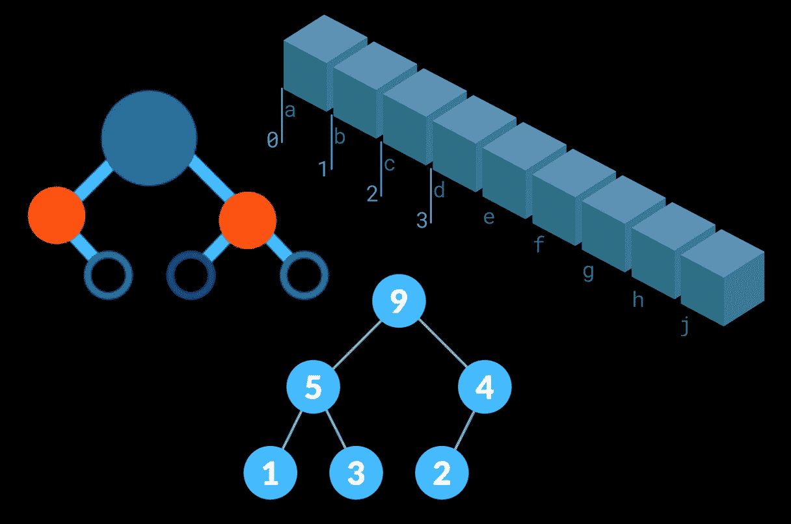

# 解释数据结构——在这个 3 小时的教程中学习计算机科学概念

> 原文：<https://www.freecodecamp.org/news/learn-all-about-data-structures-used-in-computer-science/>

数据结构是开发人员在编程时用来组织数据的工具，以便他们可以在以后访问数据。

freeCodeCamp.org 刚刚发布了一个完整的 3 小时视频课程，将向您介绍计算机科学中一些最重要的数据结构。它将教你各种各样的数据结构概念以及如何使用它们。

在这个过程中，您将看到大量的示例和图表来帮助您理解每个数据结构是如何工作的。

Some visualizations of data structures.

本课程假设你对计算机科学有基本的了解。如果你还没有，不要担心——我们已经为你准备了这个[免费的 2 小时计算机科学初级读本](https://www.freecodecamp.org/news/introduction-to-computer-programming-and-computer-science-course/)。

本课程由来自 NullPointer Exception 的 Steven 教授，是对数据结构的概述。最棒的是，你不需要了解 Java 或 C 或者任何传统上教授数据结构的语言。

没错，本课程完全不受语言限制。(尽管我们建议你至少相当好地了解一种编程语言，比如 JavaScript 或 Python。)

以下是这 3 小时课程中涵盖的一些概念:

*   什么是数据结构？
*   使用 BigO 符号测量效率
*   为什么是 BigO？
*   时间复杂性方程的类型
*   阵列基础
*   平行阵列
*   数组类型
*   填充优先数组
*   稍后填充数组
*   数字索引
*   替换数组中的信息
*   二维数组
*   数组列表
*   添加方法
*   移除方法
*   获取方法
*   永久变形测定法
*   清除方法
*   阵列方法
*   随机存取数据结构
*   顺序存取数据结构
*   堆栈基础
*   推送方法
*   Pop 方法
*   Peek 方法
*   包含方法
*   队列基础
*   排队方法
*   出列方法
*   Peek 方法
*   包含方法
*   链表基础
*   双链接列表基础
*   字典基础
*   索引词典
*   散列表迷你课程
*   树木基础
*   分层数据
*   Trie 基础
*   堆基础
*   最小堆
*   最大堆数
*   图表基础
*   有向图与无向图
*   循环与非循环图
*   加权图
*   更多...

数据结构为你最终要编写的许多程序提供了主干。并且它们中的每一个都有自己特定的用例。在本课程中，您将学习何时以及为何使用每种类型的数据结构。

？在 freeCodeCamp.org YouTube 频道观看[全程(3 小时观看)。](https://youtu.be/zg9ih6SVACc)

？️:如果你想练习构建这些数据结构，freeCodeCamp 有完整的交互式数据结构课程，这是我们编码面试准备部分的一部分。你可以在这里用 JavaScript 构建这些数据结构。