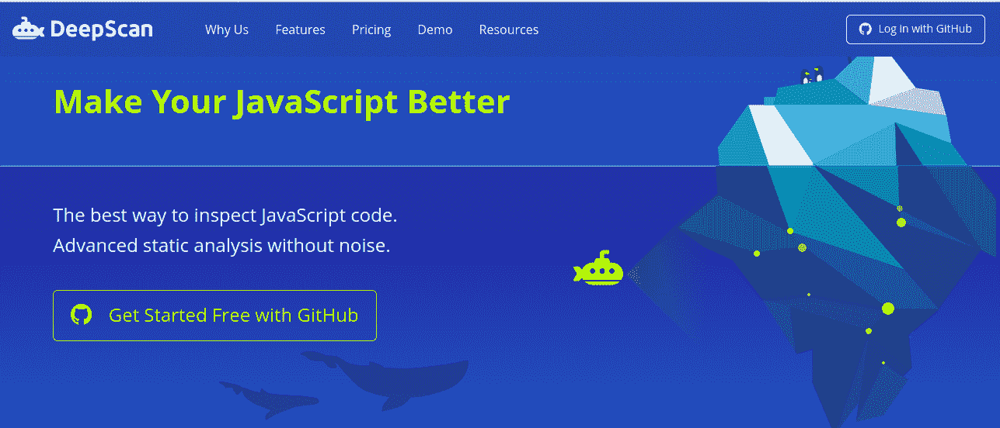
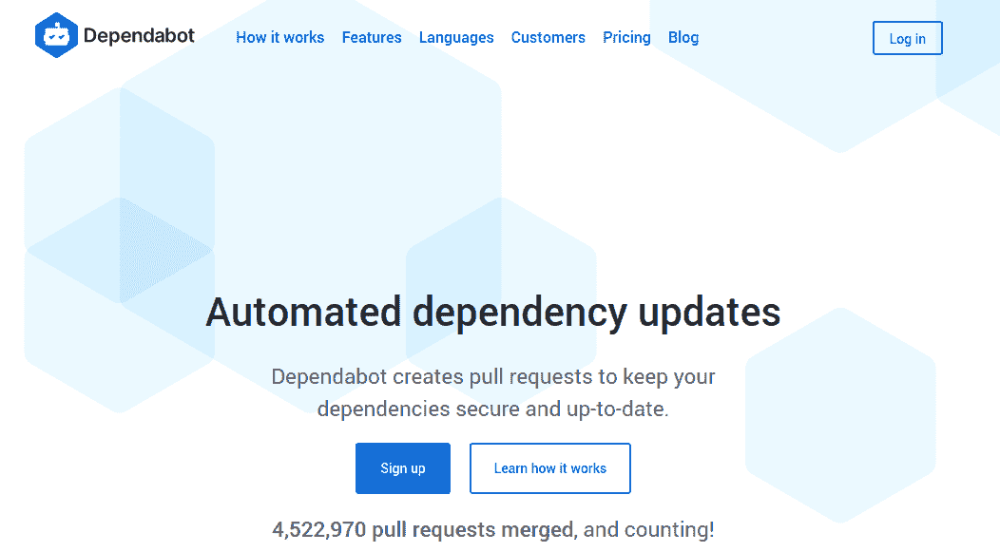
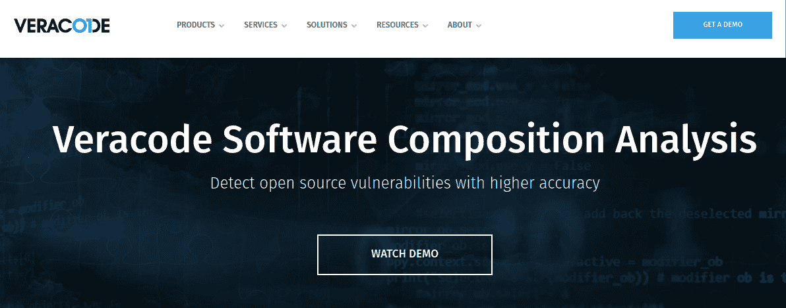
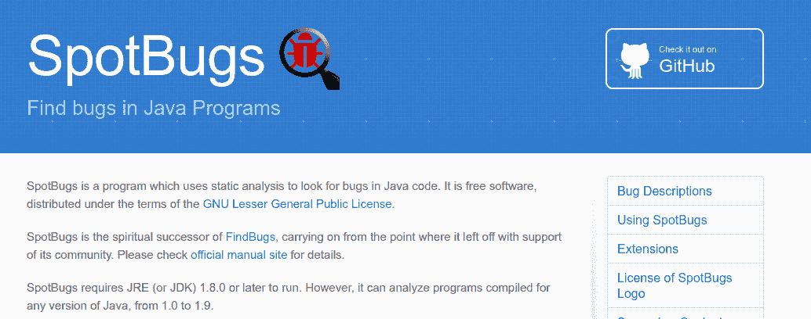
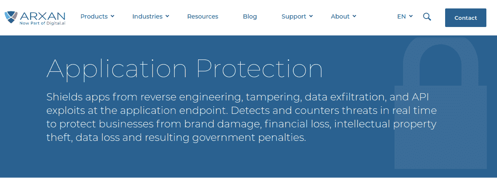
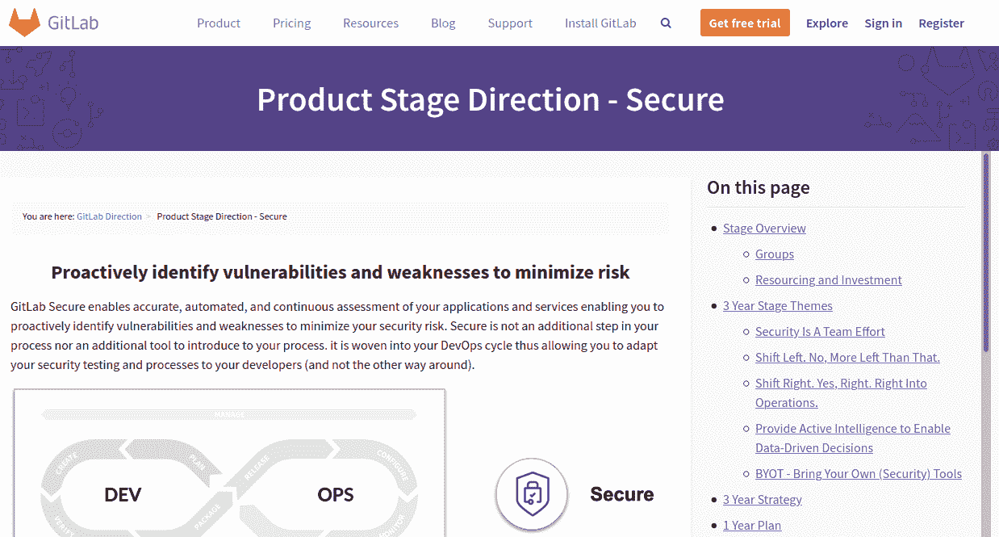

# 2020 年最佳应用安全工具

> 原文：<https://www.freecodecamp.org/news/best-application-security-tools-in-2020ed/>

软件已经变得越来越普遍。开源库被广泛使用，因为它们使开发人员能够更容易地关注他们正在构建的应用程序的核心特性。

使用这些开源库提供了巨大的生产力优势。然而，它也有缺点，即与安全性有关。

网络罪犯和黑客越来越多地利用应用程序和 IT 系统中的漏洞。因此，确保代码库最小化或完全消除漏洞变得越来越重要。

然而，监视项目中所有的漏洞，更不用说更新的漏洞了，是非常令人生畏的。这就是为什么在这篇文章中，我们将看看八个工具，它们可以自动检测和修复项目中的漏洞。

## 深度扫描

DeepScan 是一个分析 JavaScript 和 TypeScript 代码的工具。其核心是，它不仅检查代码质量，还采用数据流分析并查看执行流程。即使不运行代码，也能检测出错误和质量问题。

DeepScan 可以与 React 和 Vue.js 等大多数 JavaScript 库配合使用。

团队可以简单地将他们项目的 GitHub 库与 DeepScan 集成。每次将数据推入存储库时，DeepScan 都会提供一份关于测试结果的实时报告。

这样做的好处之一是代码质量标准更容易执行。DeepScan 通过将项目分为差、一般或好来激励团队编写高质量的代码。

## 索纳库贝

SonarQube 是一个开源平台，可以持续检查项目的代码质量、bug、代码味道甚至安全漏洞。

这是一个用 Java 编写的工具，但是能够通过使用插件来分析其他语言。

与列表中的大多数其他产品不同，SonarQube 没有作为简单的 GitHub 扩展集成到项目中。您需要将它安装在本地计算机上才能使用它。

它的工作方式是接收项目文件作为输入，然后进行必要的分析。然后，它根据分析生成数据，将数据存储在数据库中，并在仪表板中显示。

## 从属机器人

Dependabot 是您在 GitHub 中使用的一个工具，它可以在检测到漏洞时自动创建 pull 请求。

该工具对所有存储库的依赖文件执行扫描，并搜索过期或不安全的依赖文件。然后，它为每个过时或不安全的依赖项生成一个拉请求。然后，开发人员可以检查这些拉请求，并根据需要进行合并。

Dependabot 的伟大之处在于它归 GitHub 所有，因此可以无缝集成到任何存储库中。它会持续监控，并在出现新漏洞时快速更新用户信息。

接收每日通知可能会非常混乱，因此用户可以配置该工具执行扫描和创建拉请求的频率。

## 源清除

SourceClear 是一个帮助开发者了解他们正在使用的开源库的工具。SourceClear 提供了关于这些库的信息，例如谁创建了它们，它们做了什么，以及这些库的哪些依赖项存在漏洞。

SourceClear 与开发人员的工作流程非常契合，并提供关于开源代码风险的实时报告。它有机器学习工具，可以为每个使用的库提供如此详细的信息。

它的主要特性之一是对直接位于代码执行路径中的漏洞进行优先级排序。这可以将大型项目的补救时间减少多达 90%。

## 斑点虫子

SpotBugs 是 FindBugs 的继任者，是一个针对 Java 代码库的静态代码分析器。它既可以作为独立工具使用，也可以集成到其他平台/工具中。

大多数 Java 程序可以干净地编译，但是仍然有问题。编译通常只捕获语法和引用错误等。使用静态分析工具(如 SpotBugs)提供了一个更全面的解决方案来捕获 bug 甚至漏洞。

SpotBugs 检查 Java 字节码(不是源代码)并检查 bug 模式。然后，它根据错误或潜在错误的严重程度对它们进行分类:令人担忧的、麻烦的、可怕的、最可怕的。

这个工具非常擅长识别 bug 模式(超过 400 个)。

## 阿尔山应用保护

阿尔山应用程序保护是“从内到外保护应用程序”的整体解决方案。这个工具的主要卖点——保护应用程序免受逆向工程。

今天的许多攻击，如[点击劫持](https://en.wikipedia.org/wiki/Clickjacking)都是由网络犯罪分子通过黑客攻击应用程序的二进制代码，然后创建一个副本应用程序来策划的。然后，用户被引诱去相信这个假的应用程序，并给出他们的数据，如银行密码。

Arxan 通过在应用程序中插入“代码卫士”来“强化”应用程序的代码，从而保护应用程序免受此类攻击。这些代码卫士是微小的安全单元，保护应用程序和彼此免受损害，并且它们在运行时检测攻击。

## GitLab

GitLab 对开发者的核心价值主张之一是，它是最精致的 devops 工具之一。此外，GitLab 还专注于安全部署。

该平台已将安全性纳入其已加载的 devops 库。开发人员可以专注于编码，同时确信任何安全漏洞都会被快速检测到。这使得使用起来非常愉快，因为不需要额外的工具或集成。

它采用了它所谓的安全阶段，在这个阶段中执行 devops 的所有安全部分。这个“阶段”的目标是在任何漏洞被生产代码利用之前主动识别它们。

## 结论

每种工具都有自己的优缺点，选择使用哪一种取决于开发人员的特殊喜好。通常，有些工具甚至可以一起使用。

底线是，现在我们更有能力在安全问题成为我们的应用程序项目中的大问题之前处理它们。