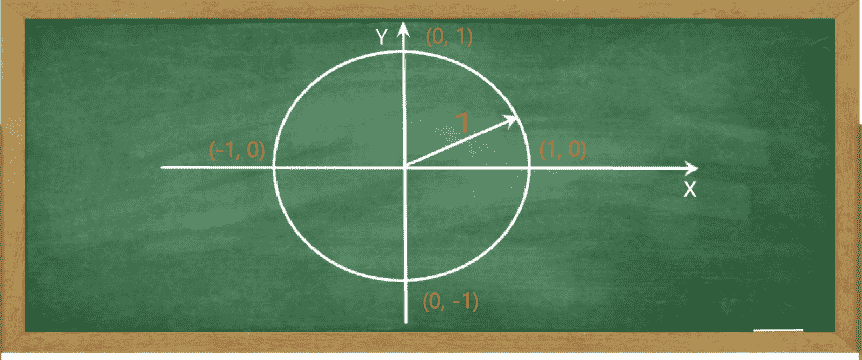
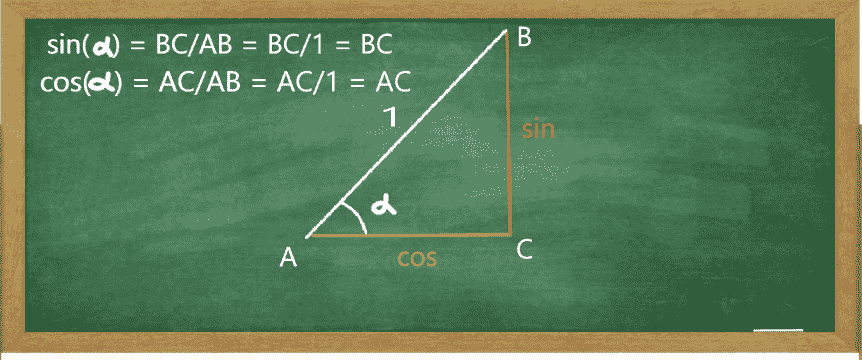
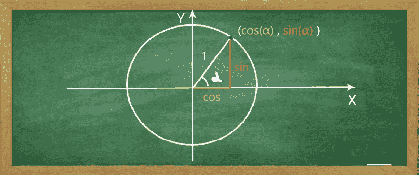
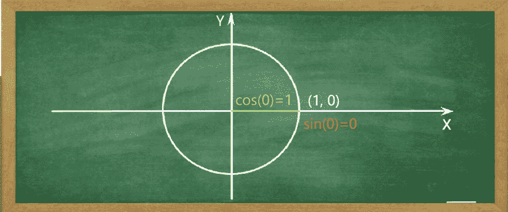
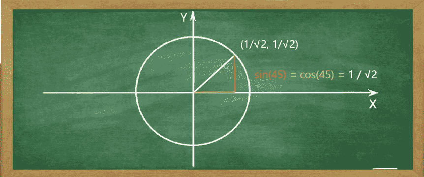
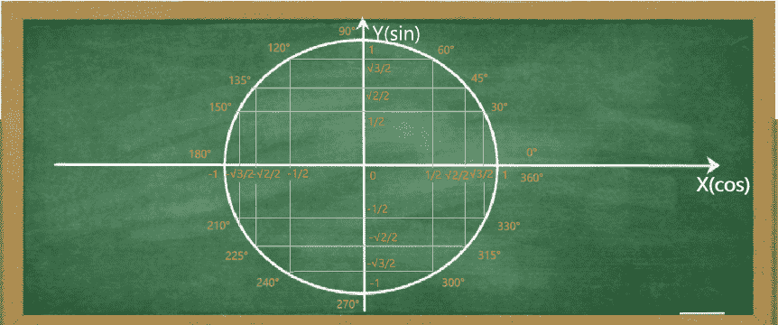

# 单位圆图和三角计算器-余弦 0，正弦 0，正切 0，弧度等

> 原文：<https://www.freecodecamp.org/news/unit-circle-chart-and-trig-calculator/>

**单位圆**是学习三角函数的一个有用的可视化工具。

它有用的关键是它的简单。它消除了记忆不同值的需要，并允许用户简单地为不同的情况导出不同的结果。

让我们进一步了解它，并用我在文章末尾创建的一个方便的三角计算器来测试我们的理解。

## 第一部分。什么是单位圆，如何使用？

单位圆是半径为**一个**单位的圆，圆心位于原点。换句话说，中心被放在一个图形上，在那里 **X** 和 **Y** 轴交叉。

**Fig 1**. The graph of the unit circle with radius = 1 and points of intersection with X and Y axes

半径等于 1 个单位将允许我们创建斜边等于 1 个单位的参考三角形。

正如我们将很快看到的，这允许我们直接测量正弦、**余弦**和**正切**。下面的三角形提醒我们如何定义某个角度的正弦和余弦。

**Fig 2**. Geometric definition of sine and cosine for an angle with hypotenuse equal 1

因为斜边等于 1，任何被 1 除的东西等于它自己，所以α的 sin 等于 BC 的长度。或者 **sin(α) = BC/1 = BC** 。

类似地，余弦将等于 AC 的长度。或者 **cos(α) = AC/1 = AC** 。

接下来，让我们把这个三角形移到我们的单位圆中，这样圆的半径就可以作为斜边。

**Fig 3**. Reference triangle inside Unit Circle. x coordinate = cos(α) and y coordinate = sin(α)

因此，三角形接触圆的点的 **y** 坐标等于 sin(α)，或 **y = sin(α)** 。类似地， **x** 坐标将等于 cos(α)，或者 **x = cos(α)** 。

因此，通过绕圆移动并改变角度，我们可以通过相应地测量 y 和 x 坐标来测量该角度的正弦和余弦。

角度可以用**度**和/或**弧度**来测量。坐标为(1，0)的点对应于 **0** 度(见图 1)。测量值沿逆时针方向增加，因此坐标为(0，1)的点将对应于 **90** 度。一个完整的圆——360 度。

## 第二部分。重要角度及其相应的正弦、余弦和正切值

因为从 0 度开始是有意义的，所以我们的圆看起来像这样:

**Fig 4**. Unit circle showing cos(0) = 1 and sin(0) = 0

因为**正切**等于正弦除以余弦，**tan(0)= sin(0)/cos(0)= 0/1 = 0**。

接下来让我们看看 90 度时会发生什么。对应点的坐标为(0，1)。因此，sin(90) = y = 1，cos(90) = x = 0。这个圆看起来会像这样:

**Fig 5**. Unit circle showing cos(90) = 0 and sin(90) = 1

切线(90°)呢？当余弦度量值接近 0，并且恰好是某个分数的分母时，该分数的值会增加到无穷大。因此 **tan(90)被称为未定义**。

现在你可能会问:当 sin 从 0 到 1，而余弦从 1 到 0，它们会彼此相等吗？答案是肯定的，这正好发生在 45 度的中途！这个圆看起来像这样:

**Fig 6**. Unit circle showing sin(45) = cos(45) = 1 / √2

由于分子与分母相同， **tan(45) = 1** 。

最后，一般参考单位圆。它反映了 X 轴和 Y 轴的正值和负值，并显示了您应该记住的重要值

**Fig 7**. Unit circle showing important sine and cosine values to remember

作为本节的最后一点，记住以下基于[勾股定理](https://en.wikipedia.org/wiki/Pythagorean_theorem)的三角恒等式总是有帮助的:sin²(α)+cos²(α)= 1。

## 第三部分。三角计算器

作为一个有用的练习工具，我添加了一个简单的三角计算器。它接受角度测量的输入，并输出相应的正弦、**余弦**和**正切**函数的值。

您可以选择**度**或**弧度**作为角度的度量。它们各有利弊。对于数量关系，由于 **π** 弧度 **=** 180， **1 弧度**就会是 180 / **π** 或者大致是 **57** 。它可以以任何期望的精度来计算。

计算器的代码包含一些基本的交互性和编辑器约束内的错误处理。它的构造块被标记和注释，因此任何想要修改它的人都可以很容易地这样做。

例如，可以添加 **ctg** 、 **sec** 等新功能，以及不同的配色方案等等。完整的源代码可以通过[点击这里](https://github.com/sandroarobeli/TrigCalculator/blob/master/TrigCalculator.txt)获得。

### 输入度数或弧度，点击提交

### 罪:

### COS:

### 谭:

我希望这篇文章以及计算器源代码能对您有所帮助。期待很快看到它的修改。