# 如何用图标集组织和同步 SVG 文件

> 原文：<https://www.freecodecamp.org/news/how-to-organize-and-sync-svg-files-with-iconset/>

SVG 是一种将矢量图像引入设计和开发工作流的绝佳方式。但是在您的计算机上收集和组织 SVG 文件可能具有挑战性。

Iconset 如何帮助我们消除痛苦，提高工作效率？

*   [什么是 SVG？](#what-is-svg)
*   [什么是 Iconset？](#what-is-iconset)
*   我们要学什么？
*   [第 1 部分:图标集入门](#part-1-getting-started-with-iconset)
*   [第 2 部分:向图标集添加图标](#part-2-adding-icons-to-iconset)
*   [第 3 部分:使用 Iconset 和 Figma 等设计软件](#part-3-using-iconset-with-design-software-like-figma)
*   [第 4 部分:在开发中使用 Iconset，比如使用 React](#part-4-using-iconset-in-development-like-react)
*   [第 5 部分:使用 Dropbox 在多台计算机上同步图标集](#part-5-syncing-iconset-across-multiple-computers-with-dropbox)

[https://www.youtube.com/embed/KXBf5l4rbL4?feature=oembed](https://www.youtube.com/embed/KXBf5l4rbL4?feature=oembed)

## What is SVG？

SVG 是一种近 20 年前的图像文件格式。虽然它已经存在了一段时间，但是直到最近它才在开发社区中获得发展势头。

SVG 很棒，原因有很多。首先，它是一种矢量格式，这意味着它可以根据您的需要缩放。

但是它也很灵活，因为您可以在开发项目中直接使用 SVG，通常文件很小，但规模无限。你甚至可以[制作动画](https://frontend.horse/issues/6/#slash)！

但是试图收集和组织一大堆文件是很有挑战性的。你给它们起了什么名字？你有一台能容易地预览他们的计算机吗？搜索呢？

## 什么是 Iconset？

Iconset 是一个免费的跨平台工具，允许你在一个地方收集和管理所有的 SVG 文件。

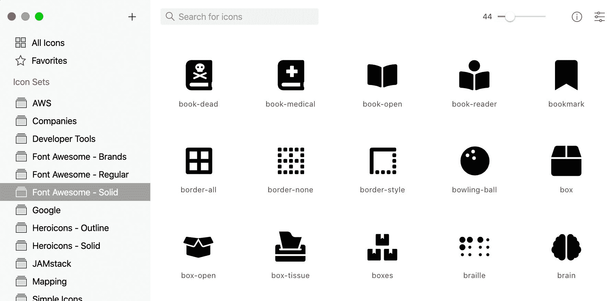

Iconset library

喜欢在[字体牛逼](https://fontawesome.com/)和[英雄图标](https://heroicons.com/)之间快速切换，但不想不停地切换库？您可以使用 Iconset 进行快速搜索，并将其拖放到您的项目中。

如果你计划在一个 [React](https://reactjs.org/) 项目中使用它，你甚至可以把这个文件复制成 JSX，然后把它直接转储到你的项目中！

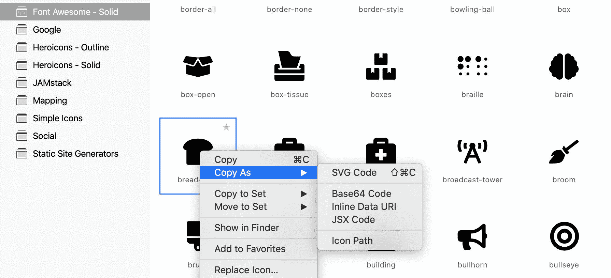

Iconset "Copy As"

## 我们要学什么？

我们将通过几个不同的场景向我们展示 Iconset 的用处。

我们还将介绍如何在不同的计算机或环境之间轻松管理 Iconset，以便您可以在工作的任何地方拥有相同的大型库。

## 第 1 部分:Iconset 入门

首先，您需要在本地安装 Iconset。这应该是一个与任何其他应用程序类似的安装过程。

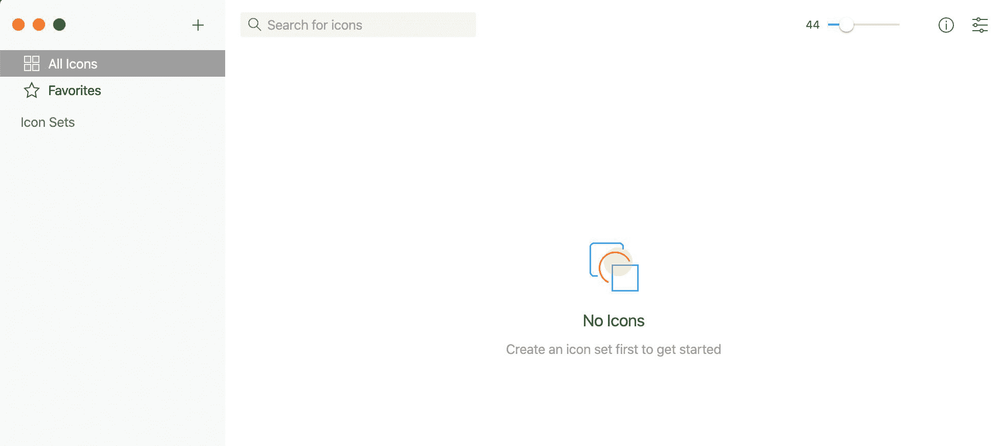

Iconset with no icons

一旦它准备好并在本地可用，您应该能够打开它并看到一个没有图标的 UI，这是意料之中的，因为它开箱时没有任何图标。

## 第 2 部分:向图标集添加图标

向图标集添加图标就像拖动一样简单，但是在这个过程中您有几个选择。

首先，让我们下载免费图标集 [heroicons](https://heroicons.com/) 。

下载地址:[https://heroicons.com/](https://heroicons.com/)。

在 heroicons 网站上，您应该会看到一个大的 Download all 按钮，它将下载一个包含所有文件的 zip 文件。

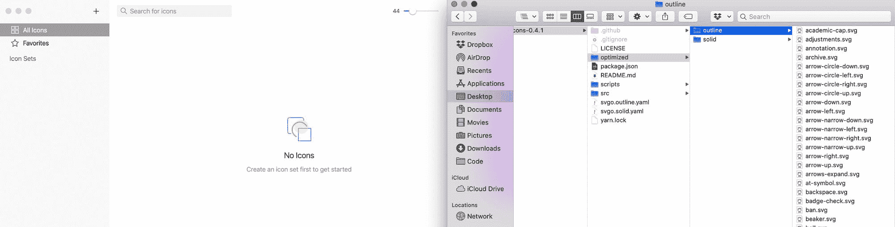

Downloading heroicons

如果您导航到优化的文件夹，您会看到有两个不同的版本:固体和轮廓。

现在，要将它们放入图标集，请单独选择每个文件夹，并将其拖动到图标集。

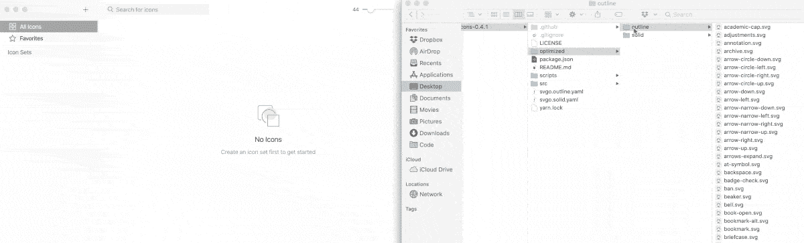

Dragging heroicons into Iconset

一旦到了那里，你有几个选择。

*   **集合:**由于这是我们的第一个集合，您将自动创建一个新集合。如果您有现有的集合，您可以导入到这些集合中。
*   **集合名称:**在这里我们可以给集合命名一些我们会记住的东西。为此，我推荐将其命名为“heroicons - Outline”。
*   **导入选项:**这些是可选设置，但我通常选择优化和清理选项，以确保任何图标都可以立即使用。

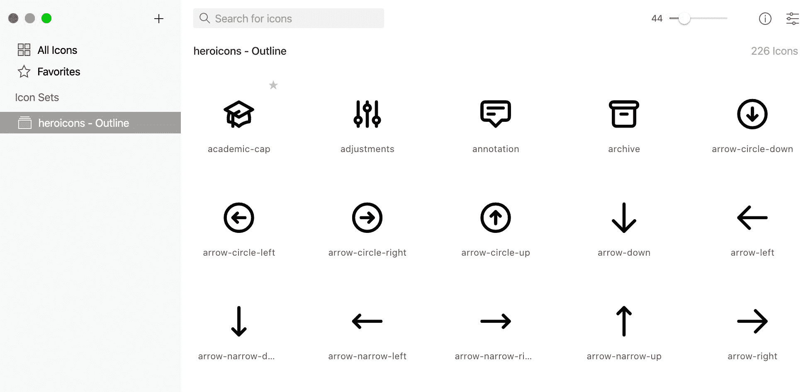

Iconset with heroicons set

一旦你点击导入，它会做它的事情，你现在会有你的第一套图标在图标集中！

您可以继续对固体目录做同样的事情，这样我们现在就可以准备好两套了。

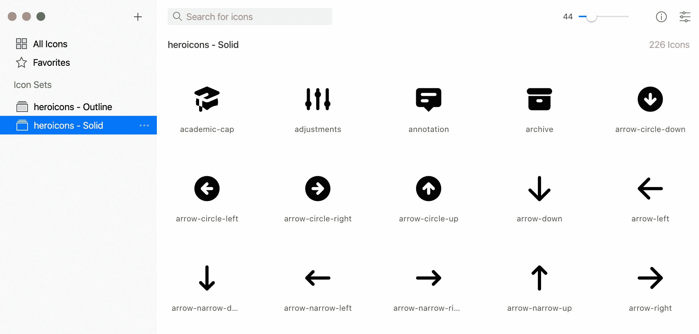

Iconset with Outling and Solid sets of heroicons

此时，您可以使用 Iconset 来搜索您的图标，并查看您的收藏中当前可用的所有文件。

## 第 3 部分:将 Iconset 用于像 Figma 这样的设计软件

Iconset 的伟大之处在于它很容易与像 [Figma](http://figma.com/) 这样的设计软件一起使用。

如果我想在我的网站上添加一个信封图标，这样人们就可以联系我，我可以搜索邮件图标，然后简单地将它拖到画布上:

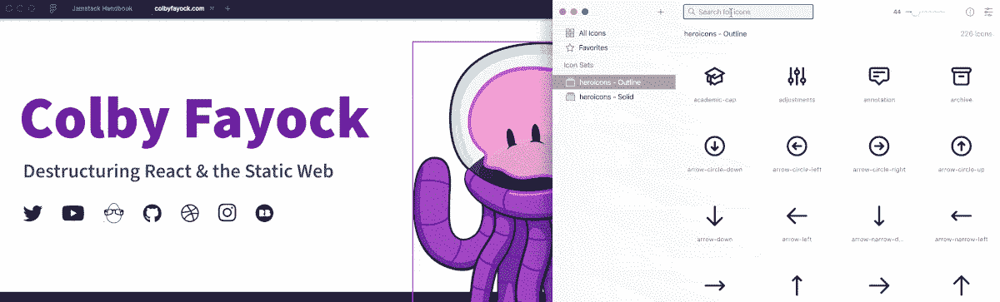

Dragging mail icon into Figma

然后我可以像对待任何其他矢量设计元素一样对待它，并立即在我的项目中使用它。

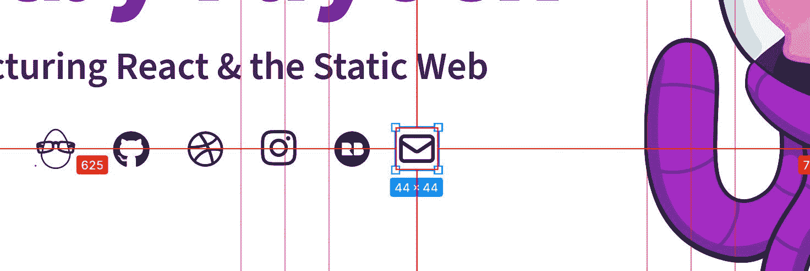

SVG Mail icon in Figma

## 第 4 部分:在开发中使用 Iconset，比如使用 React

另一件很酷的事情是在 React 这样的项目中使用它是多么容易。

开箱即用，你有几种不同的方法可以复制文件，并在开发中使用它，如复制 JSX。

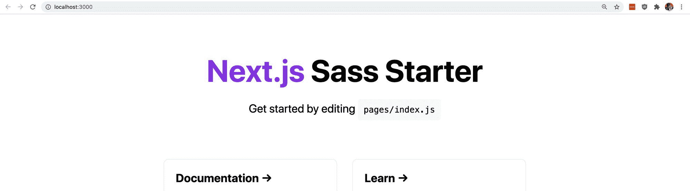

Next.js Sass Starter

如果我觉得我的 [Next.js Sass Starter](https://github.com/colbyfayock/next-sass-starter) 可以使用页面上的一些图标，我可以右键单击任何我想要的图标，在“复制为选择 JSX”下，我可以将它直接粘贴到我的项目中！

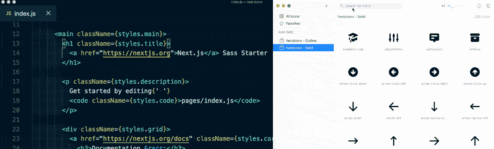

Copying icon from Iconset as JSX

虽然一旦你把它像任何其他图片或图标一样放进去就需要一些样式，但它马上就可以用了。

Using icon JSX in Next.js React app

## 第 5 部分:使用 Dropbox 在多台计算机上同步图标集

使用 Iconset，您可以在不同的库之间切换。但重要的是，你还可以设置你的图书馆的位置。

当 Iconset 创建您的库时，它会将所有内容作为文件和数据库存储在您的计算机上。

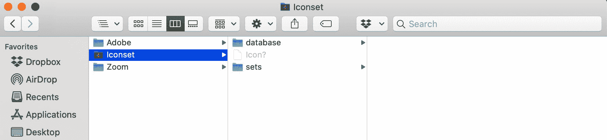

Iconset library folder

在 Iconset UI 中，我们可以移动和切换我们使用的位置。

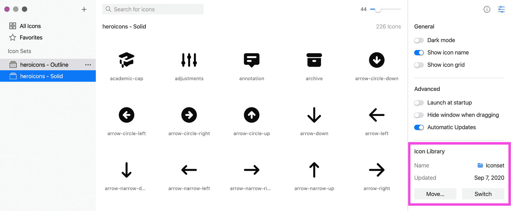

Iconset library settings

如果这是您第一次设置图标集，您可以先单击“移动”，然后选择要同步的位置。

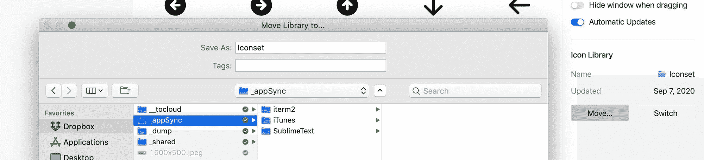

Moving Iconset library location

一旦你点击移动，它会把它移动到那个目录，就像 Dropbox 上的一个文件夹，并像其他任何文件夹和文件一样同步到云。

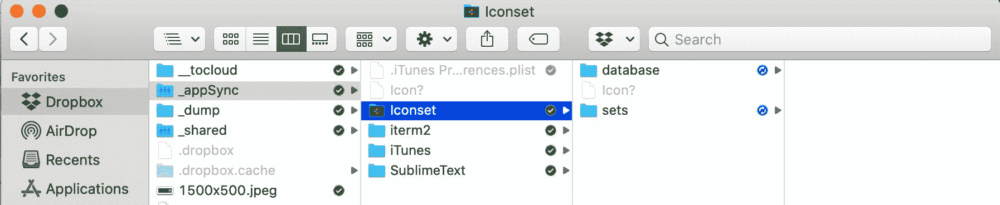

Syncing Iconset library with Dropbox

或者，如果你已经有一个共享图标集库，或者如果你正在一台新电脑上设置它，你可以使用切换选项，并从 Dropbox 中选择该选项。

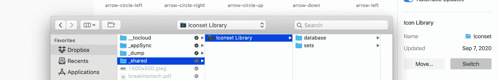

Switching Iconset location

一旦你按下开关，你现在就可以加载你的共享库并准备好开始工作了。

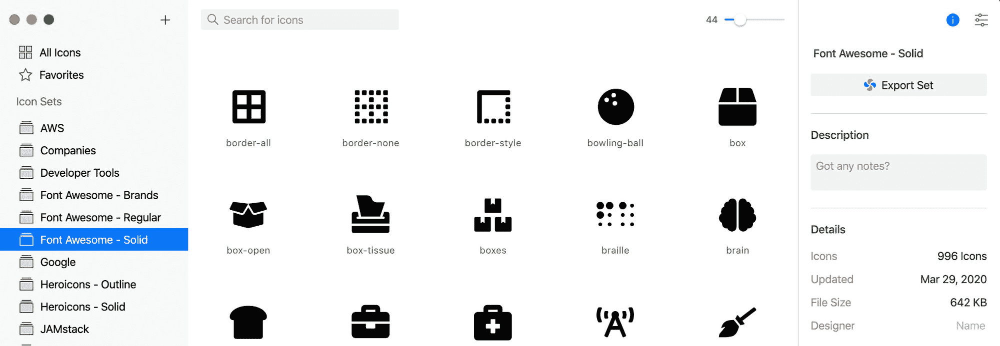

Iconset with full library

## 你还能做什么？

### 发布和共享图标集

另一个很酷的功能是，您可以导出集并共享它们。如果你花了很多时间在一个收藏上，并想与他人分享，导出它，发布它，并与社区分享！

### 更多组织

Iconset 还支持文件夹和收藏夹等功能。这使得分组和收集图标变得更加容易，但是这对你保持工作效率是有意义的。

它还支持标记，使搜索变得更加容易。

*   [？在 Twitter 上关注我](https://twitter.com/colbyfayock)
*   [？订阅我的 Youtube](https://youtube.com/colbyfayock)
*   [✉️注册我的简讯](https://www.colbyfayock.com/newsletter/)
*   [？赞助我](https://github.com/sponsors/colbyfayock)