# Linux LS 命令——如何列出目录中的文件+选项标志

> 原文：<https://www.freecodecamp.org/news/the-linux-ls-command-how-to-list-files-in-a-directory-with-options/>

自从 20 世纪 70 年代 Unix 诞生以来，许多操作系统都以它为基础。这些操作系统中有许多失败了，而另一些成功了。

Linux 是最流行的基于 Unix 的操作系统之一。它是开源的，在世界各地的许多行业都有使用。

Linux 操作系统的一个令人惊奇的特性是命令行界面(CLI ),它允许用户通过外壳与他们的计算机进行交互。Linux shell 是一个 REPL ( **R** ead，**E**value， **P** rint， **L** oop)环境，用户可以在其中输入命令，shell 运行该命令并返回结果。

`ls`命令是众多允许用户从 CLI 列出文件或目录的 Linux 命令之一。

在本文中，我们将深入探讨`ls`命令和一些您日常需要的最重要的标志。

## 先决条件

*   有目录和文件的计算机
*   安装一个 Linux 发行版
*   在 CLI 中导航的基本知识
*   你脸上的笑容:)

## Linux ls 命令

`ls`命令用于在 Linux 和其他基于 Unix 的操作系统中列出文件或目录。

就像你在带有 GUI 的*文件浏览器*或*查找器*中导航一样，`ls`命令允许你默认列出当前目录中的所有文件或目录，并通过命令行与它们进一步交互。

启动您的终端并键入`ls`来看看这是怎么回事:

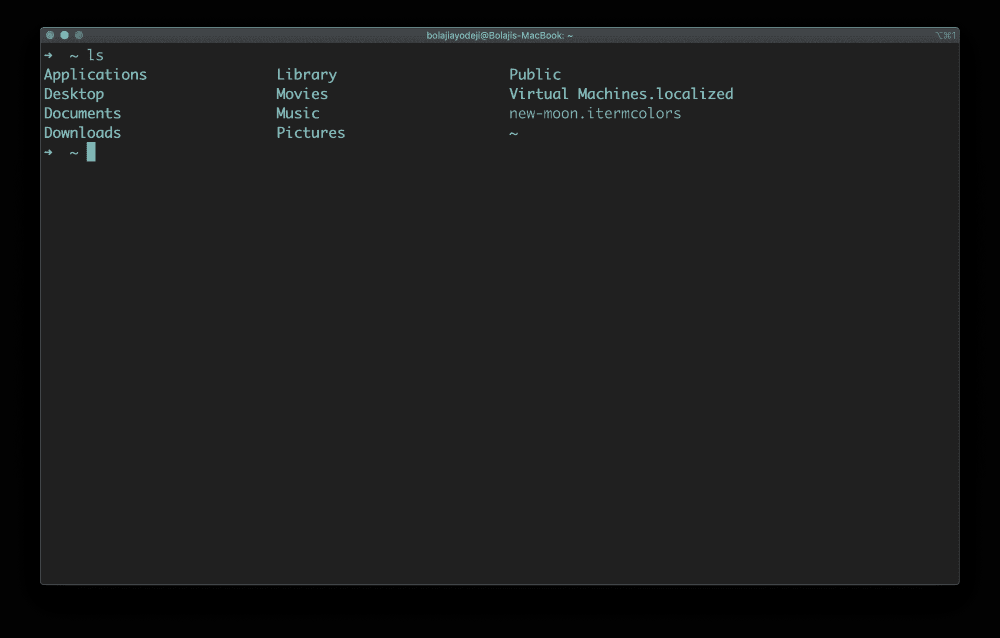

## 如何用选项列出目录中的文件

`ls`命令还接受一些标志(也称为选项),这些标志是改变文件或目录在终端中的排列方式的附加信息。

换句话说，标志改变了`ls`命令的工作方式:

```
 ls [flags] [directory]
```

> PS:整篇文章中使用的**内容**一词是指列出的**文件和目录**，而不是文件/目录的实际内容？

### 列出当前工作目录中的文件

键入`ls`命令，列出当前工作目录的内容:


### 列出另一个目录中的文件

键入`ls [directory path here]`命令列出另一个目录的内容:

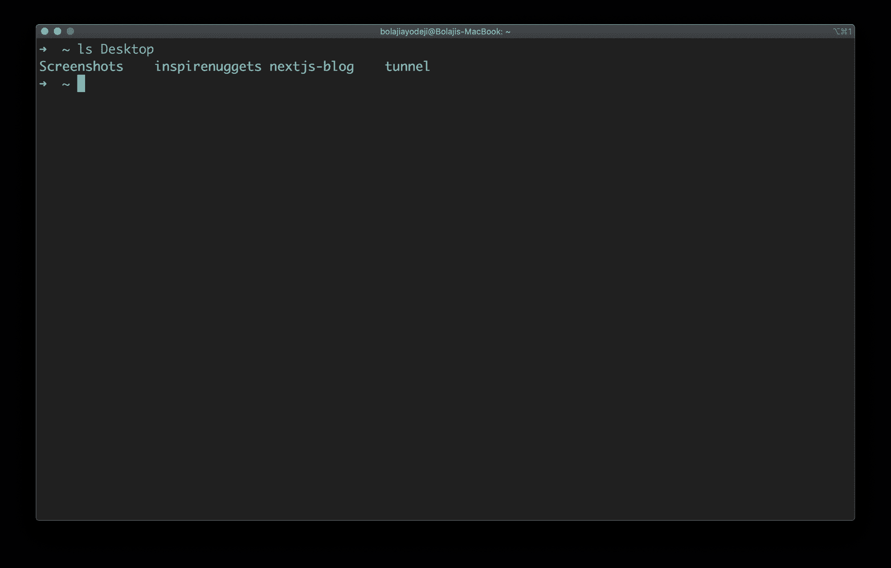

### 列出根目录中的文件

键入`ls /`命令列出根目录的内容:

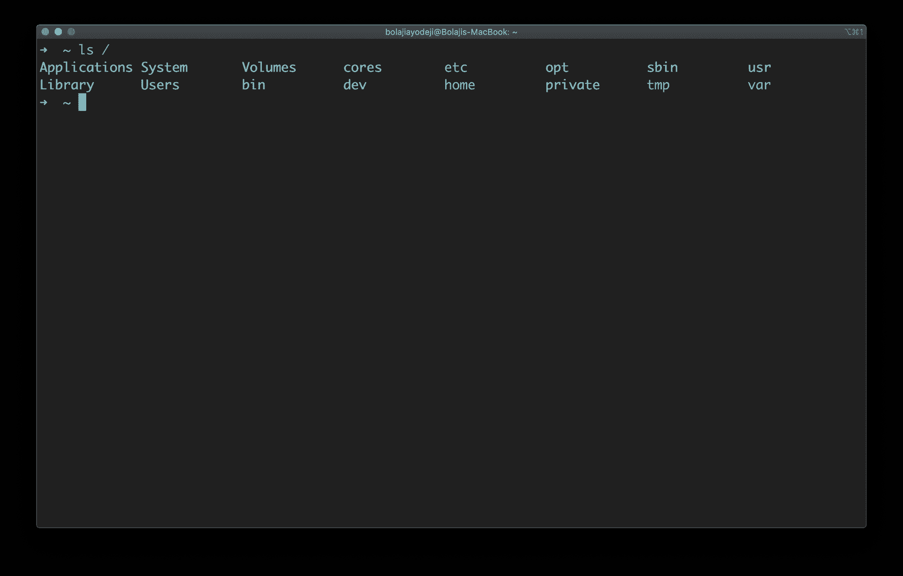

### 列出父目录中的文件

键入`ls ..`命令，列出上一级父目录的内容。两级以上的内容使用`ls ../..`:

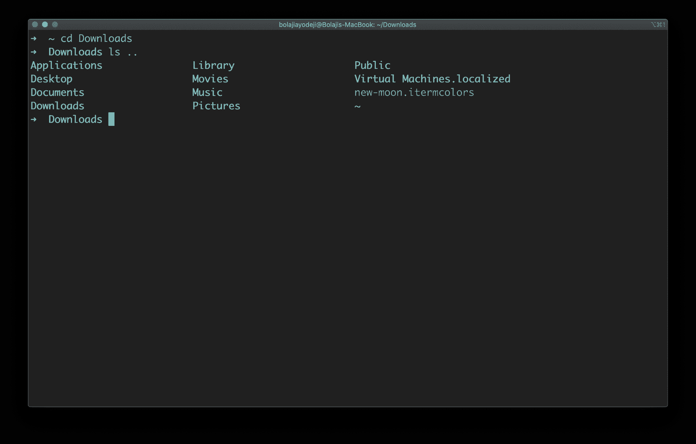

### 列出用户主目录(/home/user)中的文件

键入`ls ~`命令列出用户主目录中的内容:

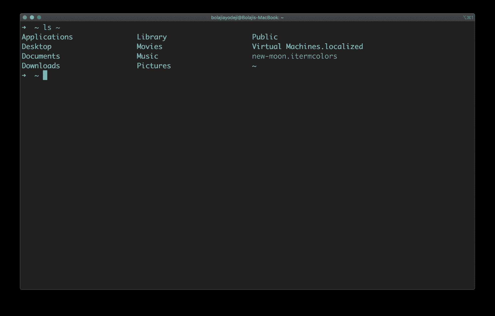

### 仅列出目录

键入`ls -d */`命令仅列出目录:

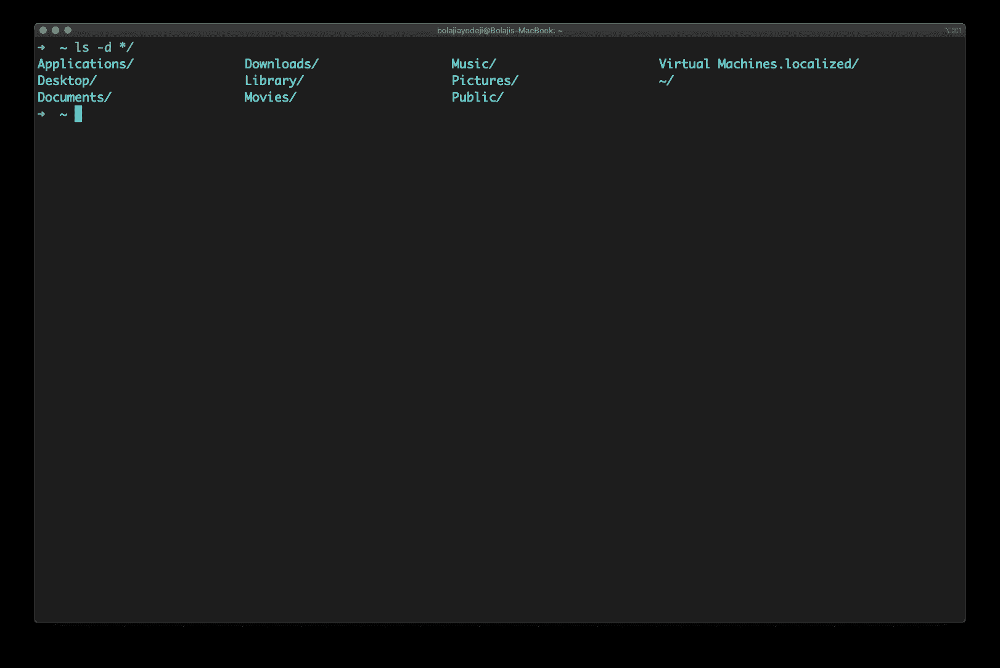

### 列出带有子目录的文件

键入`ls *`命令列出该目录及其子目录的内容:

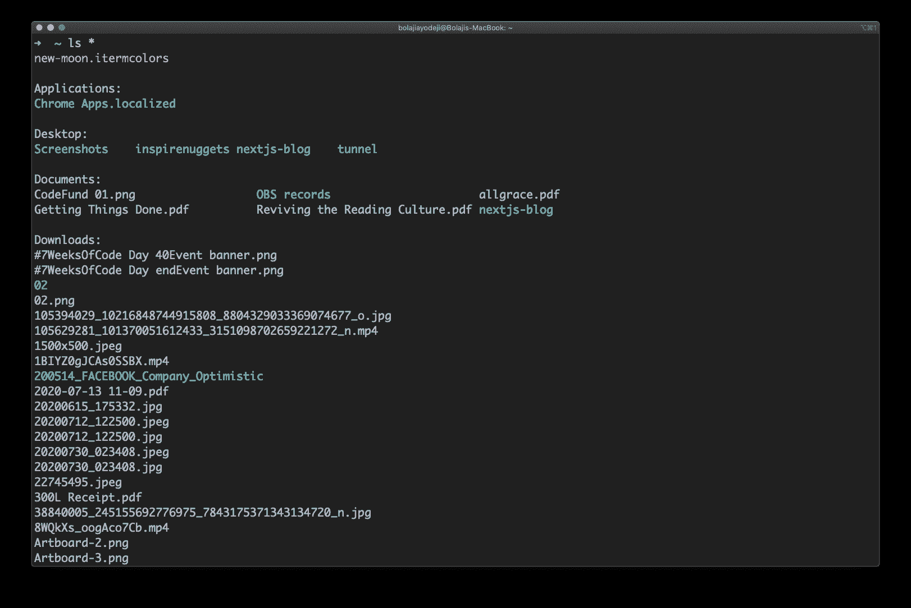

### 递归列出文件

键入`ls -R`命令列出所有文件和目录及其对应的子目录，直到最后一个文件:

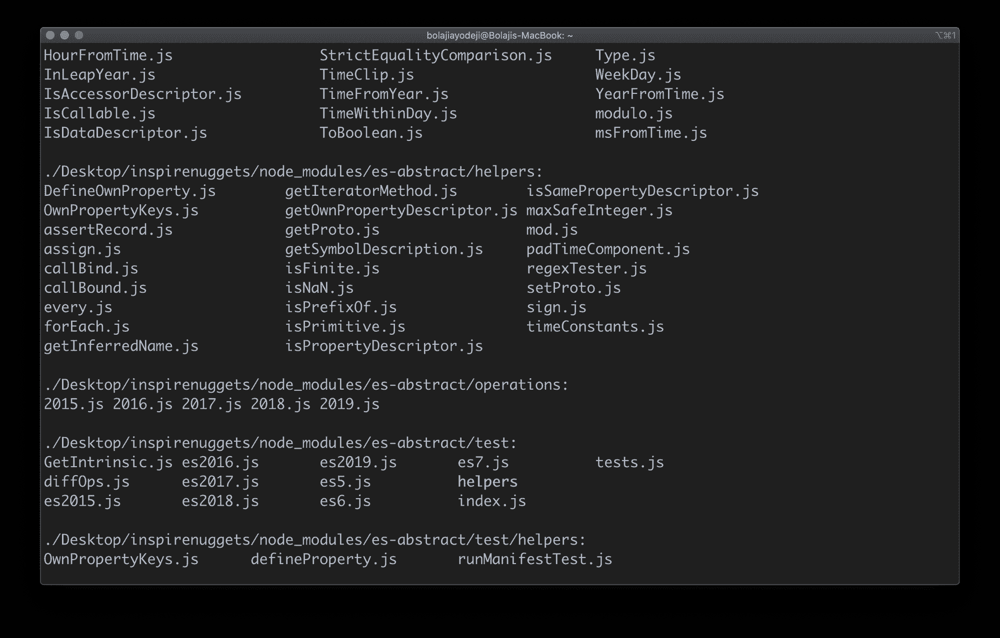

> 如果您有很多文件，这可能需要很长时间才能完成，因为每个目录中的每个文件都将被打印出来。您可以指定一个目录来运行这个命令，比如:`ls Downloads -R`

### 列出文件及其大小

键入`ls -s`命令( **s** 是小写的)列出文件或目录及其大小:

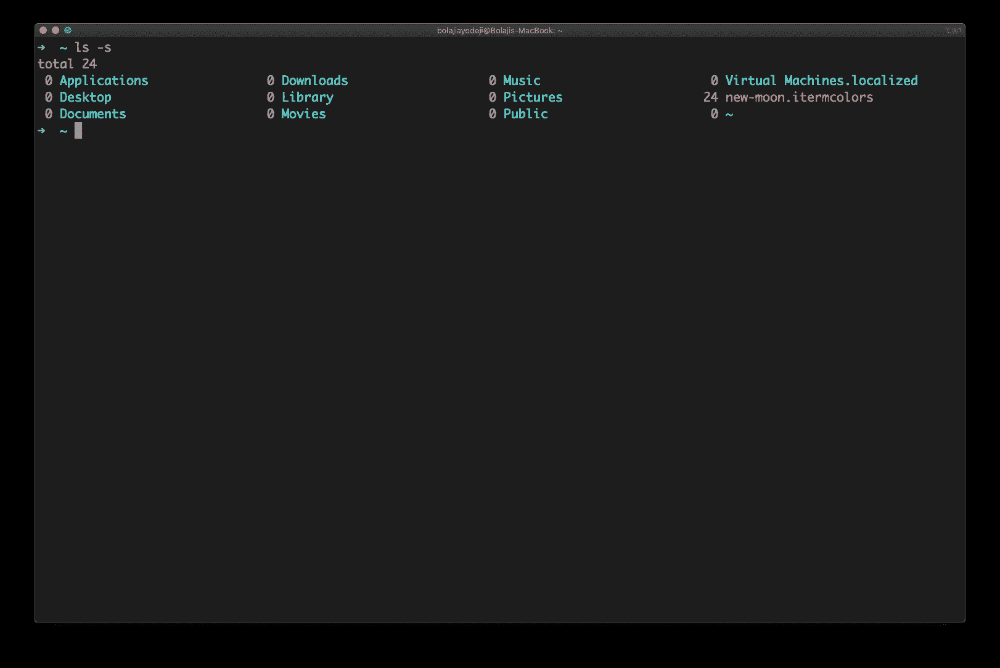

### 以长格式列出文件

键入`ls -l`命令，以表格格式列出目录的内容，包括:

*   内容权限
*   内容链接的数量
*   内容的所有者
*   内容的组所有者
*   内容的大小，以字节为单位
*   内容的上次修改日期/时间
*   文件或目录名

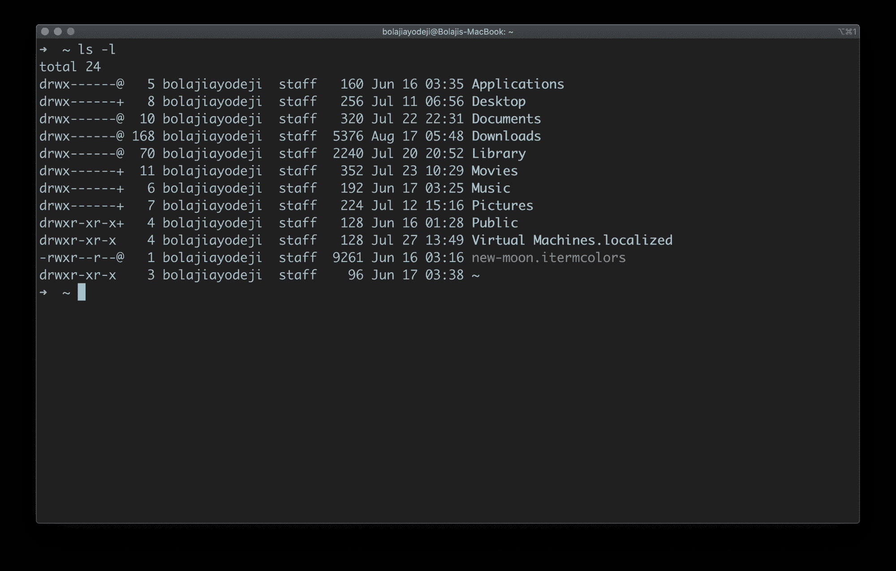

### 以长格式列出可读文件大小的文件

键入`ls -lh`命令，以上面相同的表格格式列出文件或目录，但另一列表示每个文件/目录的大小:

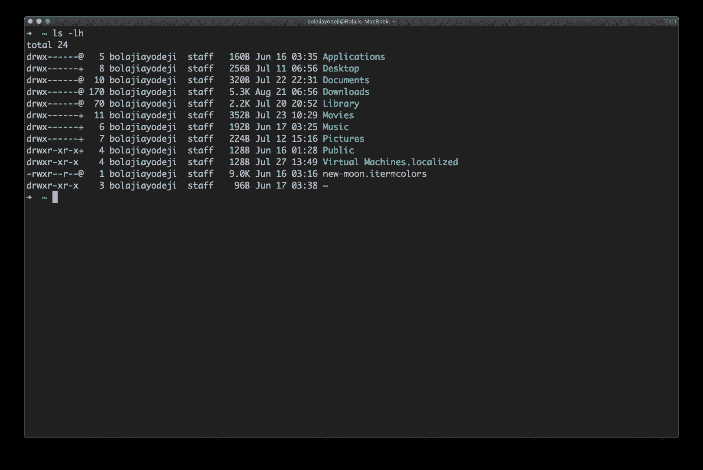

请注意，当文件或目录的大小大于 1024 字节时，大小以字节(B)、兆字节(MB)、千兆字节(GB)或太字节(TB)列出。

### 列出包括隐藏文件的文件

键入`ls -a`命令列出文件或目录，包括隐藏的文件或目录。在 Linux 中，任何以`.`开头的文件都被认为是隐藏文件:

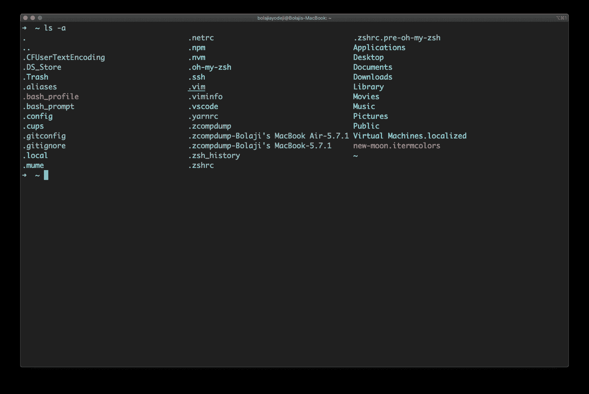

### 以长格式列出文件，包括隐藏文件

键入`ls -l -a`或`ls -a -l`或`ls -la`或`ls -al`命令，以表格格式列出文件或目录，包括隐藏文件或目录的额外信息:

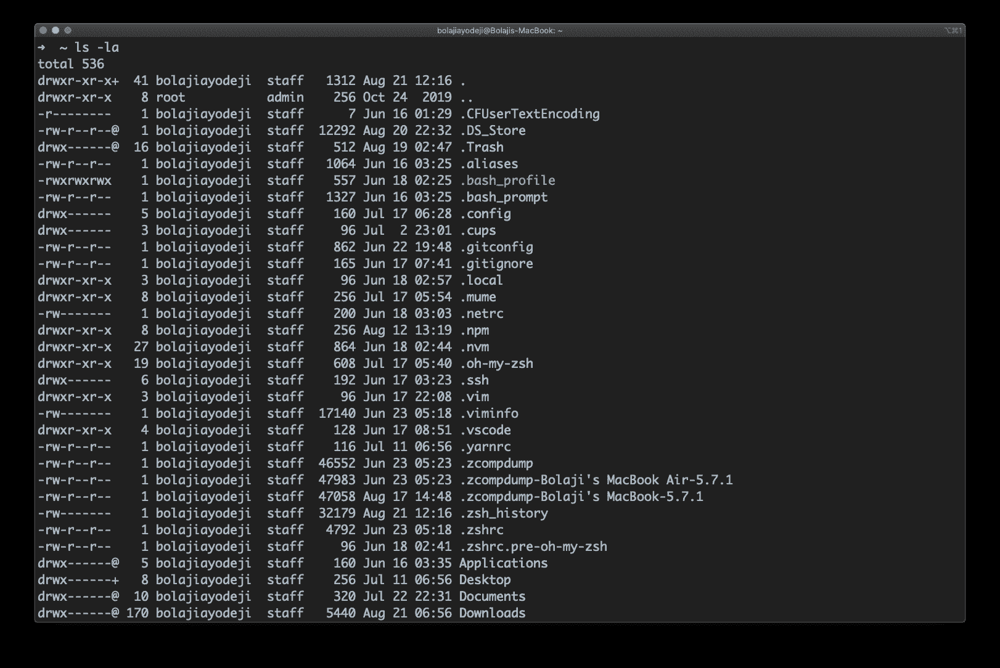

### 列出文件并按日期和时间排序

键入`ls -t`命令列出文件或目录，并按最后修改日期降序排列(从大到小)。

您还可以添加一个`-r`标志来反转排序顺序，如下所示:`ls -tr`:


### 列出文件并按文件大小排序

键入`ls -S`(**S**是大写的)命令列出文件或目录，并按大小降序排列(从最大到最小)。

您还可以添加一个`-r`标志来反转排序顺序，如下所示:`ls -Sr`:


### 列出文件并将结果输出到文件

键入`ls > output.txt`命令，将前面命令的输出打印到`output.txt`文件中。您可以使用前面讨论过的任何标志，比如`-la`——这里的关键点是结果将输出到一个文件中，而不是记录到命令行中。

然后，您可以按照您认为合适的方式使用该文件，或者用`cat output.txt`记录该文件的内容:

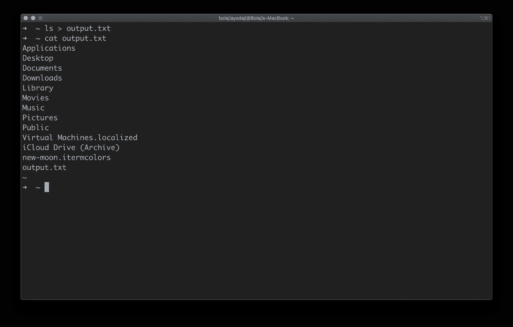

.

# 结论

有大量的其他命令和组合，您可以根据需要探索列出文件和目录。需要记住的一点是一次组合多个命令的能力。

假设您想要以长格式列出一个文件，包括隐藏文件，并按文件大小排序。该命令将是`ls -alS`，它是`ls -l`、`ls -a`和`ls -S`的组合。

如果您忘记了任何命令或不确定该做什么，您可以运行`ls --help`或`man ls`，这将显示一个包含`ls`命令所有可能选项的手册:

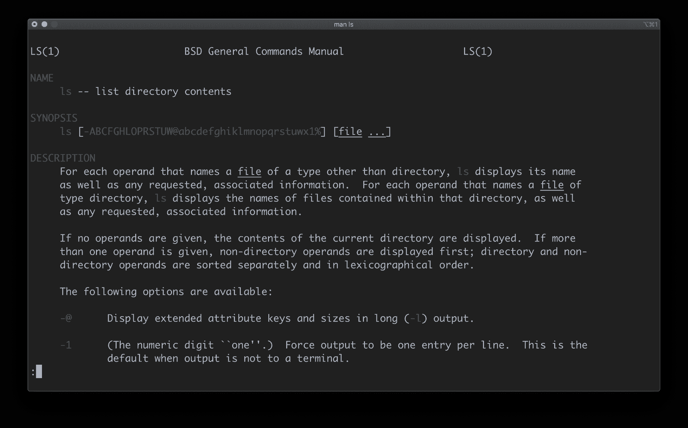

感谢阅读！