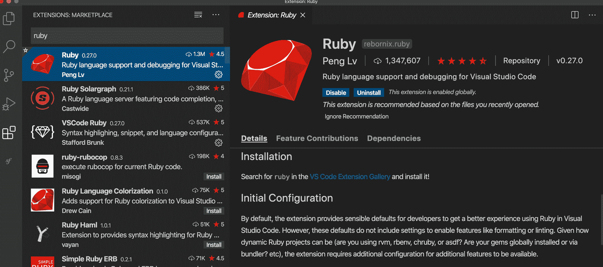
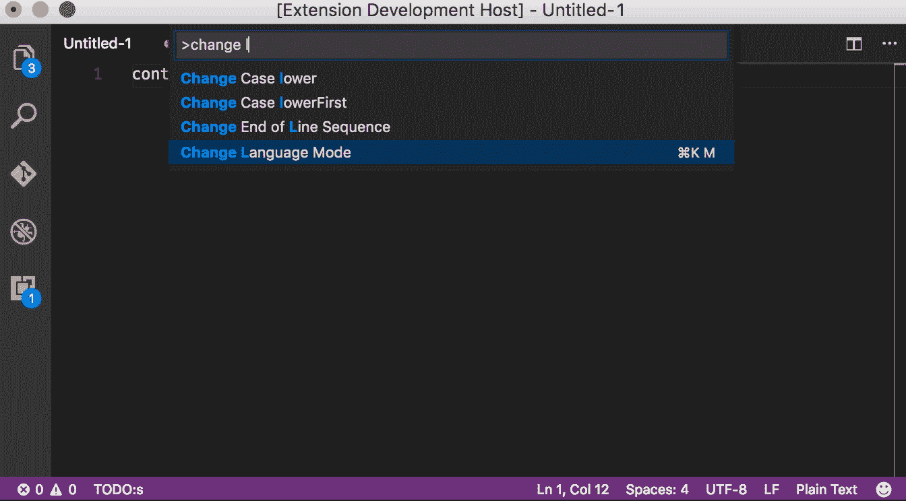
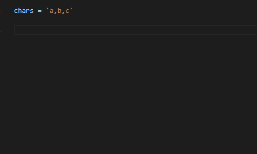
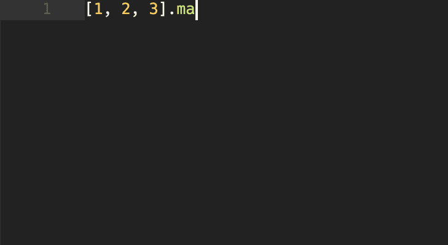
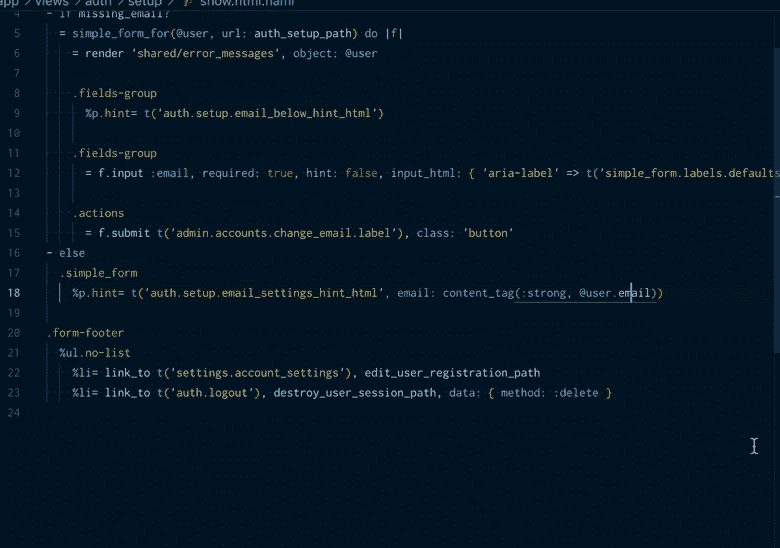
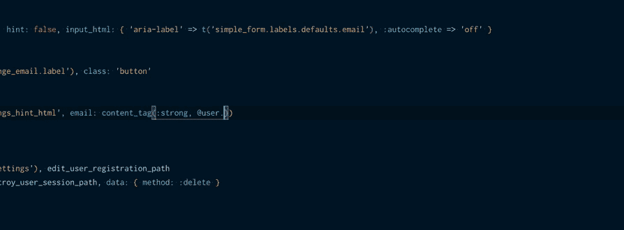

# 为 Ruby on Rails 开发人员提供的 5 个有用的 Visual Studio 插件

> 原文：<https://www.freecodecamp.org/news/visual-studio-plugins-for-ruby-on-rails-developers/>

在本文中，我将分享一些插件，我用它们来使 Ruby on Rails 的开发变得更容易、更有趣。

## 为什么要使用这些工具？

开发工具在开发人员的生活中扮演着重要的角色。如果您是初级开发人员，并且刚刚开始从事项目工作，那么了解合适的工具是必须的。

这些工具可以节省你很多时间，让你更有效地编码，从而提高你的生产力。

如果您是正在寻找免费开发工具的 Ruby on Rails 开发人员，我会推荐 Visual Studio。它有很多插件，就像下面提到的那些，它们帮助我提高了很多效率。

*注:所有 visual studio 插件均可在*[*Visual Studio market place*](https://marketplace.visualstudio.com/)*上免费获得。*

所以让我们开始吧。

## [红宝石](https://marketplace.visualstudio.com/items?itemName=rebornix.Ruby)

这是 Ruby 最受欢迎的插件之一，下载量约为 130 万。它提供了增强的 Ruby 语言和调试支持。

借助增强的调试支持，开发人员可以在调试模式下设置断点并检查局部和全局变量。这有助于快速轻松地调试任何问题。

这个插件还支持通过 ***rubocop*** 进行代码格式化，这在你和开发团队一起维护一致的代码格式时是非常需要的。

Ruby 插件有以下特性:

> -支持 rvm、rbenv、chruby 和 asdf
> 
> 的自动 Ruby 环境检测-通过 RuboCop、Standard 和 Reek
> 
> 的 Lint 支持-通过 RuboCop、Standard、Rufo 和 RubyFMT
> 
> 的格式支持-基本智能感知支持
> 
> - Ruby 调试支持
> 
> 来源: [Ruby](https://marketplace.visualstudio.com/items?itemName=rebornix.Ruby)

## [轨道](https://marketplace.visualstudio.com/items?itemName=bung87.rails)

这是另一个流行的 Rails 插件，提供了增强的 Rails 支持。

ERB HTML 模板作为视图在 Rails 生态系统中广泛使用，为网站呈现 HTML 页面。Rails 插件支持`.erb`语法，并为流行的 HTML 标签(如样式表、元标签、资产标签等)提供自动完成功能。

这个插件也有助于在 Rails 视图(`*.erb`文件)之间轻松切换。它还可以帮助您轻松地并排查看任何方法或命令的在线文档。

以下是该插件支持的一些功能:

> - Ruby on Rails“资产助手”和“标签助手”片段。
> 
> -。erb 语法重点。
> 
> -通过命令在相关文件间导航。
> 
> -去定义。
> 
> -查看路径建议、模型的静态方法建议、模型的字段建议。
> 
> -通过命令打开在线文档到侧面。
> 
> 来源:[轨道](https://marketplace.visualstudio.com/items?itemName=bung87.rails)

Image from [VSCode Rails](https://marketplace.visualstudio.com/items?itemName=bung87.rails)

## [红宝石太阳能图](https://marketplace.visualstudio.com/items?itemName=castwide.solargraph)

Ruby Solargraph 是这个列表中最有用的插件之一，它为 Ruby 提供了智能感知、代码完成和内联文档。

内联文档帮助您查看类/对象的所有允许的方法，还帮助您轻松理解每个方法及其参数的定义。

这是我个人多次使用的插件之一，用来查阅 Ruby 方法的文档、方法的参数等等。

Image from [VSCode Solargraph](https://marketplace.visualstudio.com/items?itemName=castwide.solargraph)

## [Vscode Endwise](https://github.com/kaiwood/vscode-endwise)

这是我最喜欢的扩展，可以节省你很多时间和头痛。这个扩展自动将`end`添加到您所有的 Ruby 代码块中。

Image from [VSCode Endwise](https://github.com/kaiwood/vscode-endwise)

## [Rails 数据库模式](https://marketplace.visualstudio.com/items?itemName=aki77.rails-db-schema)

这个插件可以帮助您定义一个数据库模式，并且支持 Rails 数据库模式的自动完成。

在为任何实体定义模式或创建表格时，该插件会启用并自动完成所有 DDL(数据库定义语言)的语法，如`create_table`、`create_index`、`delete_table`、`update_table`等。

Image from [VSCode DB Schema](https://marketplace.visualstudio.com/items?itemName=aki77.rails-db-schema)

它有助于自动完成任何数据库实体的所有属性。例如，如果`User`有`email`、`name`和`date_of_birth`属性，这个插件将自动检测实体的定义，并在您键入`User`时自动完成其属性。

Image from [VSCode DB Schema](https://marketplace.visualstudio.com/items?itemName=aki77.rails-db-schema)

## 为什么使用 Visual Studio？

对于 Ruby on Rails 开发者来说，还有很多其他的 IDE 选项，比如 RubyMine(企业版)、Sublime、Vim 等等。

但我个人最喜欢的是 Visual Studio，因为它对多种语言有广泛的插件支持，如 Golang、PHP、Node.js 等等。所以它是默认的 IDE，特别是对于多语言开发人员。

尽管与 RubyMine 相比，visual studio 缺少一些功能，比如获得对最新 Rails 版本更新的支持，但它涵盖了通过社区插件进行开发所需的大多数功能。

如果这篇文章是有用的，请与您的网络分享。另外，在 Twitter 上关注我，我会在什么时候发表我的下一篇文章。