# 一小时学会 Git 和版本控制

> 原文：<https://www.freecodecamp.org/news/learn-git-and-version-control-in-an-hour/>

版本控制是所有软件开发人员都应该知道的事情。它帮助您管理项目或项目群的变更。

本文将帮助您学习 Git 和版本控制的基础知识，以便有效地协作和管理您的软件项目。

## 内容

*   [什么是 git 和版本控制？](#what-are-git-and-version-control)
*   [设置你的 Gitbash](#setting-up-your-git-bash)
*   [初始化您的存储库](#initializing-your-repository)
*   [在 Git 中进行第一次提交](#making-your-first-commit-in-git)
*   [在 Git 中创建分支](#creating-branches-in-git)
*   [恢复到提交状态](#reverting-to-a-commit)
*   [创建远程存储库](#creating-a-remote-repository)
*   [将远程存储库同步到本地存储库](#syncing-your-remote-repository-to-your-local-repository)
*   [更新您的 git 存储库(本地和远程)](#updating-your-git-repository-remote-and-local-)
*   [“起源”是什么意思？](#what-does-origin-mean)

## 先决条件

我想你已经在 GitHub 上有一个帐户了。如果你没有，就去 [GitHub](https://github.com) 创建一个。

你还需要从[git-scm.com](https://git-scm.com/)或[gitforwindows.org](https://gitforwindows.org/)下载并安装 git bash(如果你运行的是 Windows PC)。

现在让我们继续学习版本控制。

## 什么是 Git 和版本控制？

Git 是一个版本控制系统，用于跟踪对文件或项目所做的更改。它是由 Linus Trovalds(Linux 操作系统的创造者)制作的。

另一方面，GitHub 是一个开源的基于云的协作平台，允许开发人员轻松共享软件并在不同的项目上进行协作。

从开源项目到私人团队和个人项目，每个人都可以使用 GitHub。您可以上传您的代码，并跟踪项目中所做的更改，以供将来使用。

**概述:版本控制**是一个系统，它记录一个文件或一组文件随时间的变化，以便您可以在以后调用特定的版本。

## 设置您的 Git Bash

出于本教程的目的，我们将创建一个新文件夹，我将其命名为`babysteps2git`。在本文中，我们将使用它作为我们的本地存储库。

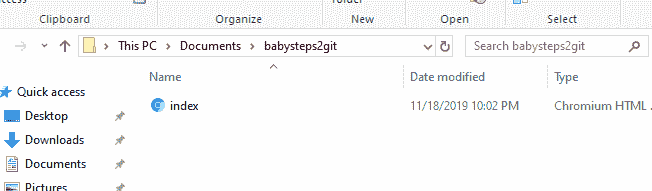

A new folder created just for this Git tutorial

在这个`babysteps2git`文件夹中，我们有一个文件`index.html`，我们将使用它作为实例。我用我最喜欢的命令行界面 Cmder 创建了它。

您可以通过在`babysteps2git`文件夹中键入`touch index.html`来创建您的文件夹(这应该从您的命令提示符中完成),或者您可以从您的文本编辑器中创建一个。

现在，让我们通过配置我们的用户名和电子邮件来全局设置我们的 Git(如果这是您第一次使用 Git)。

打开 git bash，然后使用命令**`git config --global [user.name](http://user.name/) "Your name`**来配置你的用户名，使用命令 **`git config --global [user.email](http://user.email/) "Your email"`** 来配置你的邮箱。

在下面的例子中，我的 GitHub 用户名是`emmanuellar`，而我的电子邮件地址是`emmanuellar805@gmail.com`。

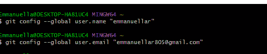

Configuring git on your device

要检查您的配置是否已添加，请键入 **`git config --global user.name`** 检查您的用户名，键入 **`git config --global user.email`** 检查您的电子邮件。

如果您的配置成功，一旦您键入这些命令并按下 *enter* 键，就会返回您的用户名和电子邮件地址。

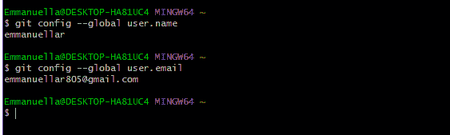

Checking your configuration

## 初始化您的存储库

现在你会想告诉 Git“看，这是我现在想让 Git 工作的文件夹/目录。”

要初始化一个存储库，请确保您位于正在工作的目录中。在我这里，它是`babysteps2git`文件夹。

然后输入 **`git init`** 并回车。


## 在 Git 中第一次提交

在 Git 中提交等同于在处理文档时保存。这是一种将您的更改保存到存储库中的方式，并使用唯一的 ID 和消息来存储它们。

ID 和消息可以用来追溯到您需要检查的项目版本。这就是`git commit`和`save as`的区别之一。

在你提交之前，你必须准备好你的工作。暂存是告诉系统的一种方式，“嘿，我已经对我的工作做了很多改变，但是这一个，那一个，和这另一个是我想要保存的。”

所以当你想添加修改时，这样做: **`git add name-of-files`** 。

如果你想添加你修改过的所有文件，请键入 **`git add .`** 。只要确保你是在项目文件夹内*。*

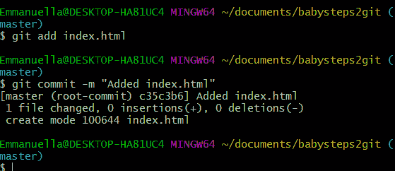

Staging and Committing files in Git

添加/暂存文件后，您现在可以提交它们了。

您应该使用如上所示的简短而详细的提交消息来提交您的更改。

要查看您的存储库的状态，并知道您在哪个分支上，修改了哪些文件，哪些代码是暂存的、未暂存的或准备提交的，只需使用代码: **`git status`** 。

## 在 Git 中创建分支

假设你正在做一个项目的不同版本，或者你正在和一些朋友或同事合作一个项目。有一个名为“master”的分支是很重要的，它是每个存储库的默认分支，存储来自不同贡献者的原始和修改的代码。

为了合作或处理一个项目的不同版本，我们必须从不同的分支工作。

通过分支开发，不仅可以并行处理多个版本的代码，还可以使主分支免受可疑代码的影响。

因此，对于我们的`babysteps2git`项目，我们可以决定有几个分支，每个分支包含不同版本的代码。

要在 git 中创建新的分支，使用命令 **`git branch nameOfBranch`。**

要检出(切换)到新的分支，使用 **`git checkout nameOfBranch`。**

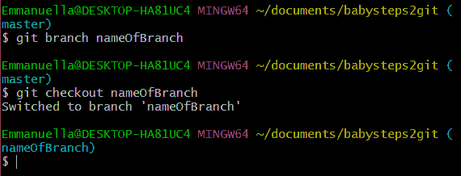

使用命令 **`git checkout -b nameOfBranch`可以同时完成以上 2 个命令。**

## 恢复提交

Git 还有一个非常有趣的地方:能够恢复您随时间推移所做的更改，这是 CTRL+Z 无法做到的。

在使用 Git 时，您可能希望回到代码的特定状态，或者甚至恢复到您工作的旧版本。您可以通过恢复到您想要返回的特定提交来做到这一点。

我们进行的每个提交都有一个唯一的 ID。要得到这个 ID，你可以输入 **`git log`** 。

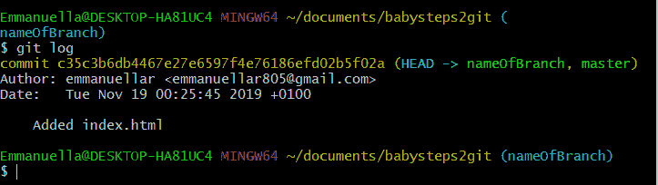

或者，可以使用 **`git log --oneline`** 将上述输出记录在一行中。

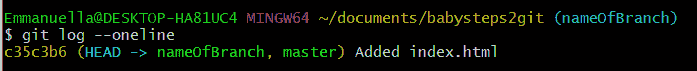

从上面可以看到每个提交的 ID 和提交消息。

要恢复，输入`**git revert commit-ID**`。

该命令恢复到该代码提交时的状态。‌

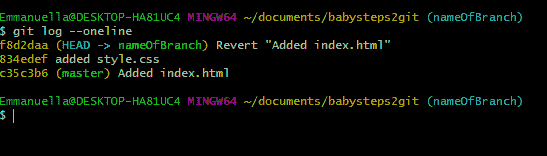

## 创建远程存储库

为了创建一个远程资源库，我们将打开我们的 GitHub 账户，点击 **New** 按钮(作为第一次使用 GitHub 的用户，你可能会看到一个绿色的 **Create Repository** 按钮)。

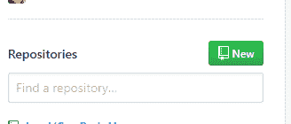

无论您使用哪种方式，它都会将您带到一个页面，在那里您可以输入您的存储库的名称和您的项目的描述。

它还为您提供了将存储库设为私有或公共的选项。‌‌你也可以通过勾选 read me 复选框，用一个`read me`初始化你的库。


### 

当您单击 create 时，将会创建一个具有唯一 URL 的新存储库。

## 将远程存储库同步到本地存储库

既然我们已经创建了我们的远程存储库，我们必须将它与我们的本地存储库同步，以便它们可以无缝地通信。

‌‌Open 打开你的 git bash，导航到你正在处理的文件夹，输入下面的代码: **`git remote add origin url`** 。

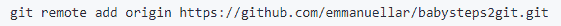

## 更新您的 git 存储库(远程和本地)

让我们继续向 HTML 文件添加一些代码:

```
<html lang="en"> 
    <head>     
    <meta charset="UTF-8">     
    <meta name="viewport" content="width=device-width, initial-scale=1.0">
    <meta http-equiv="X-UA-Compatible" content="ie=edge>
	<title>Document</title> </head> 
        <body>         
        	<label for="inputEmail" class="sr-only">Email Address</label>     
			<input type="email" class="form-control" id="inputEmail" placeholder="Password"> 
        </body> 
</html> 
```

‌Let's 重复筹备和提交我们的变更的过程:

`git add index.html` ‌‌ `git commit -m "added a form"`

‌‌As:是的，我们的本地存储库目前比远程存储库先提交。

为了更新远程存储库，我们必须使用代码:`git push origin master`将我们的工作从本地存储库推送到远程存储库。‌‌“master”是每个存储库的默认分支，大多数时候包含主要的项目代码。‌

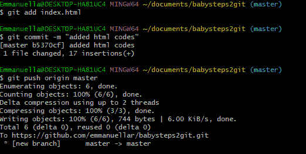

您也可以选择创建一个新的分支，例如，如果您创建了一个新的特性，但是您担心对主项目(主分支)进行更改。‌‌

只需键入`git branch branchName`创建一个新分支，并使用`git checkout branchName`切换到新分支。

‌‌You 总是可以使用`git branch`来确认这个存储库中的分支。旁边带有星号的分支名称表示您在给定时间所指向的分支。

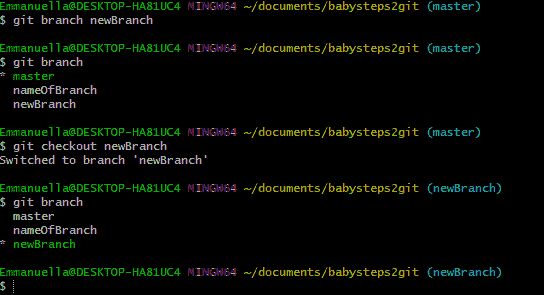

您还可以使用`git push origin branchName`将变更从新分支推送到您的远程存储库中。

当您推送到远程存储库时，GitHub 会自动在您的远程存储库上为您创建分支。这允许人们看到您所做的更改。

‌‌You 可能还想用远程新分支的内容更新主项目分支(主分支)。

您可以通过切换到主分支并运行`git pull origin newBranch`来做到这一点。‌‌这会用新分支上实现的所有更改更新主分支。

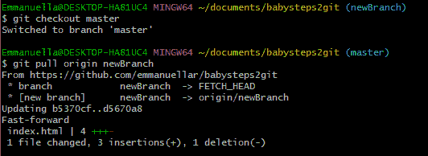

## “出身”是什么意思？

‌‌Origin 是最初克隆项目的远程存储库的简称。更准确地说，它被用来代替原始存储库的 URL，使引用它变得更容易。‌‌

因此，要将您的更改推送到远程存储库，您可以使用以下命令之一:`git push origin nameOfBranch`或`git push https://github.com/username/reponame.git nameOfBranch` ‌‌.

请注意，系统可能会提示您输入用户名和密码。您的密码不会在您输入时显示。只要正确输入并按回车键就行了。

## 结论

我们刚刚看了第一次使用 Git 的逐步指南。遇到卡壳的时候随时参考。

你不需要*将命令*记在记忆中——随着时间的推移，你将能够记住它们。:)

‌‌That's 现在一切都结束了！

我希望你喜欢这篇文章。你可以在推特上关注我。

‌‌