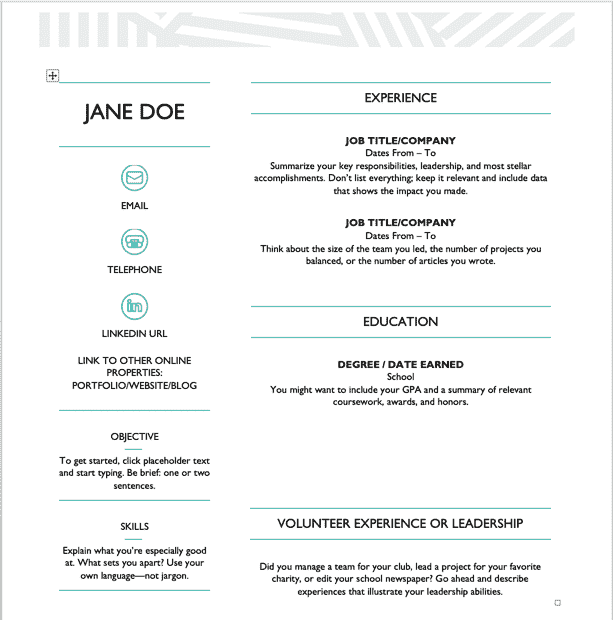
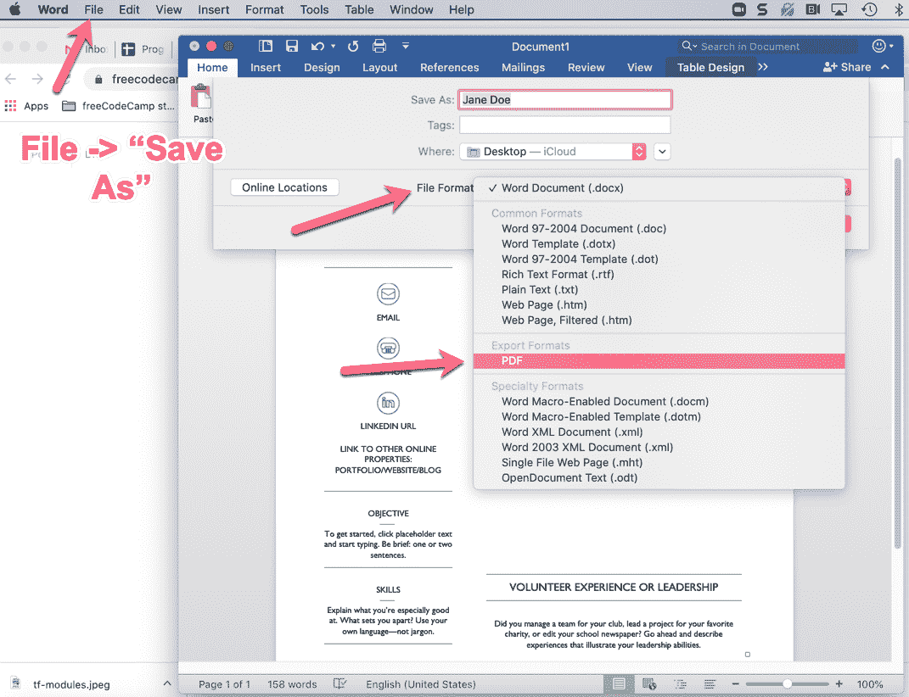
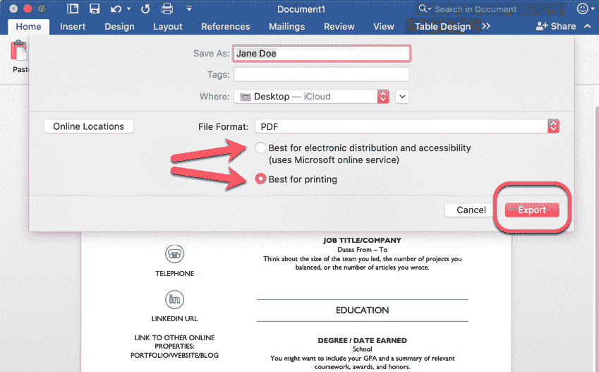
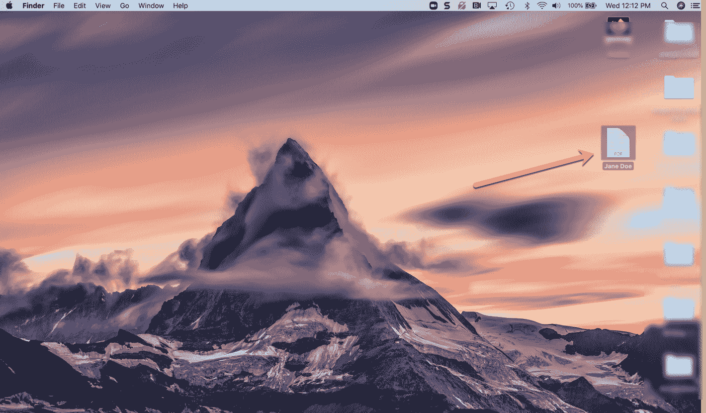
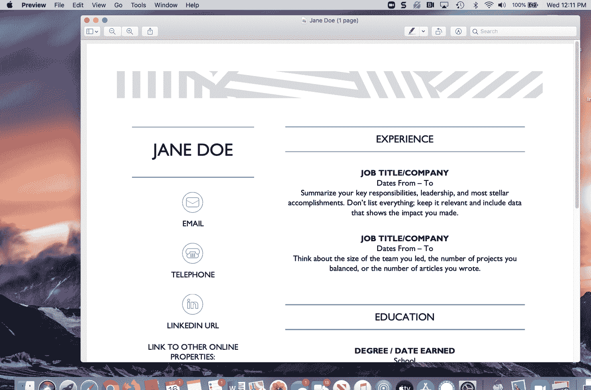
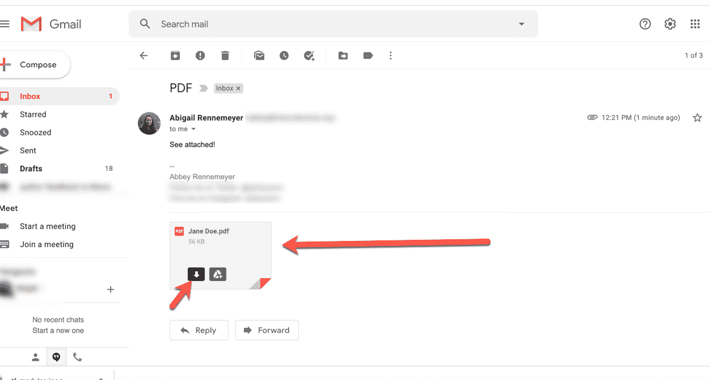
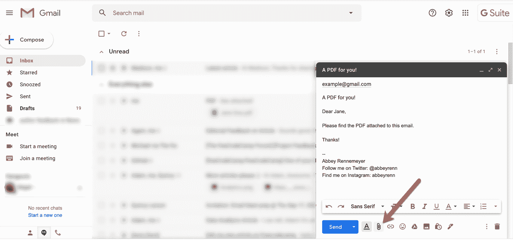
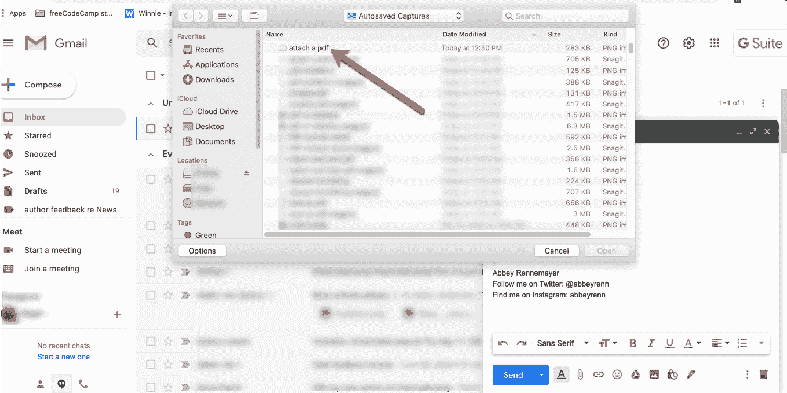

# 什么是 PDF 文件，如何打开它？[已解决]

> 原文：<https://www.freecodecamp.org/news/what-is-a-pdf-file-and-how-do-you-open-it-solved/>

你可能在网上的某个地方见过 PDF。也许你正在下载一张表格来打印和填写，或者你正在报税。

那么这种无处不在的文件格式是什么，什么时候有用，怎么打开别人发给你的 PDF？我们将在本指南中回答所有这些问题。

## 什么是 PDF 文件？

PDF 或可移植文档格式是一种无论使用何种应用程序查看都看起来相同的文档。不能直接在里面打字，也不能编辑。

这意味着任何人，在安装了任何程序的任何类型的计算机上，都能够打开和查看该文档。它会看起来是造物主的意图。

那么为什么会不灵活呢？现在每个人都想要响应式表单，对吗？嗯，不，不总是这样。

## 何时使用 PDF 文件

假设你正在创建一个非常酷的完美简历的例子，你想和你正在找工作的朋友分享。

Your lovely résumé - in Microsoft Word.

也许你是用微软 Word 软件写的。但是您想将它发送给计算机上没有安装 Word 的人。*喘息*。

那么，如何确保那个人可以看到格式、图像等等，就像你想要的那样呢？简单——你只需将简历保存为 PDF 格式。

## 如何将文档保存为 PDF

为此，请转到屏幕顶部 Word 菜单中的“文件”选项卡。点击它，向下滚动到“另存为…”。

将弹出以下窗口，您将看到该文档当前保存为“Word 文档(。docx)”–在“文件格式”旁边。

Click on "File", then "Save As" - Then click the dropdown menu next to "File Format".

向下滚动，直到你看到 PDF 选项(在上面的截图中间)，然后点击它。

然后你会看到下面的窗口，有几个选择。如果您想打印表格，只需选择“可打印”选项，如果您想将其发送给其他人，只需选择在线选项。

一旦你做了选择，你只需要决定你想要这个 PDF 文件保存在哪里。可以看到上图中选择了“桌面–I cloud”。但是你可以选择任何你喜欢的地方。

然后点击弹出框右下角高亮显示的“导出”按钮(我的按钮是粉色的——它通常会显示“保存”).

单击“导出”后，您的 PDF 将被保存到您在上面选择的位置。

## 如何打开 PDF 文件

假设你想打开你的新 PDF。或者有人给你发了一个 PDF，你需要打开查看。如果你有一个现代的操作系统和浏览器，这是一个非常简单的过程。

### 如何从桌面打开 PDF

好吧，如果你把文件保存到你的桌面上(就像我们上面做的那样)，只要进入你的桌面(也许关闭所有你打开的窗口)找到你的 PDF 文件。

Your little PDF hanging out, waiting to be opened.

然后只需双击图标，或右键单击图标并选择“打开”。您的 PDF 会像这样出现在您的屏幕上:

You can scroll to see your whole PDF. It's now ready to print, or attach to an email and send!

### 如何在电子邮件中打开 PDF

如果有人通过电子邮件给你发了一份 PDF，打开并查看它也很简单。

首先，转到电子邮件并找到附件 PDF:

You can either click to open or download it for later.

如果你只是想立即打开查看，你可以直接点击 PDF 的图片。

或者，您可以单击小下载箭头(当您将鼠标悬停在它上面时会出现),将它下载到您的机器上。

如果您以后下载它，那么当您准备好的时候，您可以在您的下载中找到它。

**简单说明一下**:如果你不能在浏览器中打开你的 PDF(如果它/你的操作系统是旧的或过时的)，你只需要安装一个 PDF 阅读器。

如果你想要一个免费的开源选项，[点击这里](https://www.sumatrapdfreader.org/free-pdf-reader.html)查看苏门答腊 PDF。

### 额外收获:如何发送 PDF 文件？

如果你想发送你刚刚制作的 PDF 文件——比如说，通过电子邮件——非常简单。

去你的邮箱，写一封新邮件。当您准备发送时，您会希望将 PDF 作为附件添加:

Find the little paper clip (Gmail) and click on it.

找到那个回形针(在 Gmail 中)并点击它。它会带你到你的文件列表，截图，等等。

如果你点击左侧边栏菜单中的“最近”，你应该会看到你的 PDF 文件。(也可以在右上方的搜索栏按名称搜索。)

Find your PDF/whatever you want to attach in your files. Click on it, then select "Open".

只需点击你想附加的文件，然后点击右下角的“打开”。这将附上您的 PDF(不是打开它-按钮是有点误导)。

瞧，你已经准备好通过电子邮件发送 PDF 了。