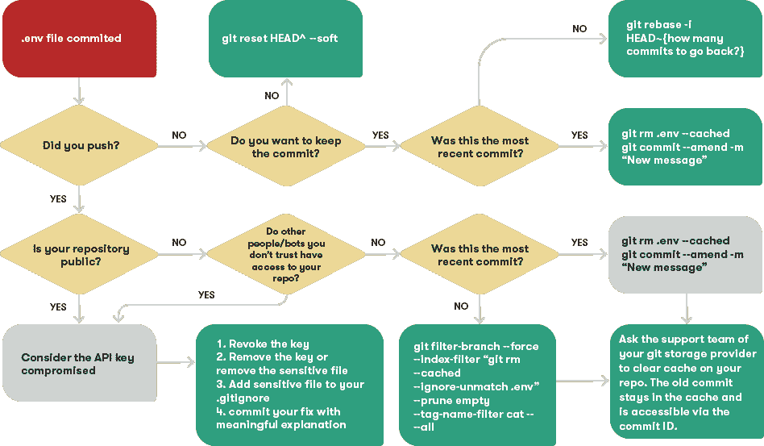
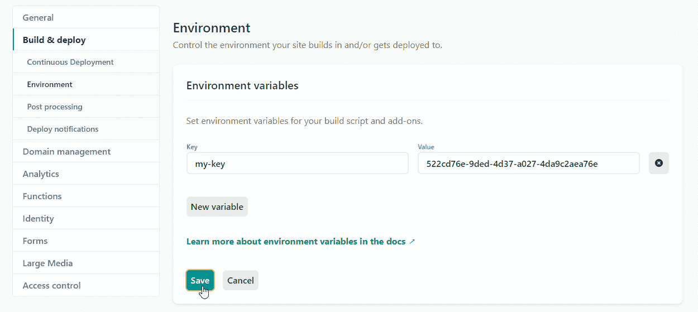

# 如何从 Git 中取消对敏感文件的注释

> 原文：<https://www.freecodecamp.org/news/how-to-uncommit-sensitive-files-from-git/>

转移文件，添加提交消息，推送。不，等等！不是那个文件。现在我们需要开始谷歌搜索。

每个开发人员过去都曾不小心提交过敏感文件。那么，我们如何解决这种情况，并确保它不会再次发生？

在本文中，我将解释当您意外提交一个敏感文件时应该怎么做，并包括必要的 Git 命令来调整历史。



How to uncommit sensitive files from git

## 减损措施

所以你不小心提交了一份敏感文件。让我们称之为*。env* 。有两个重要问题需要回答:

*   您是否将提交推送到远程存储库？
*   远程存储库是公共的吗？

### 尚未推出

如果你还没有用力，情况一点也不危急。您可以**返回到上一次提交**:

```
git reset HEAD^ --soft 
```

您的文件将保留在工作副本中，以便您可以修复敏感文件/信息。如果您想**保留提交并删除敏感文件**，请执行以下操作:

```
git rm .env --cached
git commit --amend 
```

您只能在最近一次提交时使用`--amend`。如果您设法在此基础上添加了一系列提交，请使用:

```
git rebase -i HEAD~{how many commits to go back?} 
```

这将允许您修复错误的提交，并在修复后重放所有剩余的提交，这样您就不会丢失它们。

### 已经推了

如果你真的推了，公共和私有库之间有一个重要的区别。

如果您的存储库是私有的，并且没有您不信任的机器人或人可以访问它，那么您可以使用上面的两个命令轻松地修改最后一次提交。

如果你在有问题的提交之上推了一堆提交，你仍然可以使用[过滤分支](https://git-scm.com/docs/git-filter-branch)或者 [BFG 回购清理器](https://rtyley.github.io/bfg-repo-cleaner/)从 git 历史中移除敏感文件:

```
git filter-branch --force --index-filter "git rm --cached --ignore-unmatch .env" --prune-empty --tag-name-filter cat -- --all 
```

但是请记住这些变化的两个重要方面:

*   **你实际上是在改变历史**
    如果有其他人，其他分支，其他分叉，或者依赖于存储库当前状态的 open pull 请求，你会破坏它们。在这些情况下，将存储库视为公共的，并避免更改历史。
*   **你需要清空缓存**
    你总是需要联系你的 Git 存储提供商的支持，让他们清空你的存储库的缓存。即使您修复了有问题的提交或重写了历史记录，包含敏感文件的旧提交仍会保留在缓存中。您需要知道它的 ID 才能访问它，但是在您清空缓存之前，它仍然是可访问的。

## 如果被推送到公共存储库，我需要重新生成密钥吗？

简而言之，是的。如果您的存储库是公开的，或者出于任何其他原因，您认为它不是一个安全的地方，那么您必须考虑敏感信息受到了威胁。

即使您从存储库中删除了数据，您也不能对 bot 和 repo 的其他分支做任何事情。那么下一步是什么？

*   **停用所有钥匙和/或密码**
    第一步这么做。一旦您停用了密钥，敏感信息就变得毫无用处。
*   **调整 gitignore**
    将所有敏感文件添加到。gitignore 确保 git 不会跟踪它们。
*   **删除敏感文件**
*   用一个有意义的解释来解决问题
    不要试图掩盖错误。一个月后，其他合作者和你将会感谢对所发生的事情和这个提交所修复的东西的解释。

## 在 Git 中存储敏感数据的最佳实践

为了避免将来出现这种情况，这里有一些关于存储敏感数据的提示:

### 保留敏感数据。env 文件(或其他平台上的类似文件)

将 API 密钥和其他敏感数据保存在单个。环境文件。这样，当。env 文件已经从 git 中排除。

另一个很大的好处是，您可以使用一个全局*进程*变量来访问所有的键。

### 如果可能，使用 API 密钥

API 密钥很容易生成和停用，如果受到威胁。如果可能，使用它们并避免使用凭证/密码。

### 将 API 密钥添加到您的构建工具中

在应用程序构建期间，通常需要 API 密钥。像 Netlify 这样的构建工具允许您将这些密钥添加到它们管理的安全区域中。这些密钥通过全局*流程*变量自动注入到您的应用程序中。



### 补充。要忽略的环境文件

确保 Git 不会跟踪包含敏感信息的文件。

### 提供. env.template 文件

模板文件指示其他协作者添加必要的 API 键，而不要求他们阅读长文档。

### 不要在遥控器上更改历史记录

将此作为经验法则。如果你遵循上述规则，你就不需要改变历史。

我希望这些信息能帮助你保持安全。你有过不同意的个人经历吗？或者从中学到了什么好的*教训？[在推特上跟我说话](https://twitter.com/ondrabus) :-)*