# 如何用 Python 创建和操作 SQL 数据库

> 原文：<https://www.freecodecamp.org/news/connect-python-with-sql/>

[Python](https://www.python.org/) 和 [SQL](https://en.wikipedia.org/wiki/SQL) 是数据分析师最重要的两种语言。

在本文中，我将带您了解连接 Python 和 SQL 所需的一切。

您将学习如何将关系数据库中的数据直接提取到您的机器学习管道中，将 Python 应用程序中的数据存储到您自己的数据库中，或者您可能想到的任何其他用例中。

我们将一起探讨:

*   为什么要学习如何一起使用 Python 和 SQL？
*   如何设置您的 Python 环境和 MySQL 服务器
*   用 Python 连接到 MySQL 服务器
*   创建新数据库
*   创建表和表关系
*   用数据填充表格
*   阅读日期
*   更新记录
*   删除记录
*   从 Python 列表创建记录
*   创造可重复使用的功能，在未来为我们做所有这些

这是很多非常有用和非常酷的东西。让我们开始吧！

在我们开始之前，有一个小提示:在 GitHub 库中有一个 Jupyter 笔记本，包含了本教程中使用的所有代码。强烈建议一起编码！

这里使用的数据库和 SQL 代码都来自我以前在[迈向数据科学](https://towardsdatascience.com/)上发布的 SQL 系列的[介绍(](https://towardsdatascience.com/tagged/sql-series)[如果你在查看文章时有任何问题，请联系我](https://www.craigdoesdata.de/contact.html)，我可以免费发给你一个链接)。

如果你不熟悉 SQL 和关系数据库背后的概念，我会向你推荐该系列的(当然，在 [freeCodeCamp](https://www.freecodecamp.org/news/search/?query=sql) 上有大量很棒的内容！)

## 为什么使用 Python 和 SQL？

对于数据分析师和数据科学家来说，Python 有很多优势。大量的开源库使它成为任何数据分析师的一个非常有用的工具。

我们有用于数据分析的 [pandas](https://pandas.pydata.org/) 、 [NumPy](https://numpy.org/) 和 [Vaex](https://vaex.readthedocs.io/en/latest/) 、用于可视化的 [Matplotlib](https://matplotlib.org/) 、s [eaborn](https://seaborn.pydata.org/) 和 [Bokeh](https://bokeh.org/) ，以及用于机器学习应用的 [TensorFlow](https://www.freecodecamp.org/news/p/5fe3a414-f0df-488b-9402-44d8edc12652/www.tensorflow.org) 、 [scikit-learn](https://scikit-learn.org/stable/) 和 [PyTorch](https://pytorch.org/) (还有很多很多很多)。

凭借其(相对)简单的学习曲线和多功能性，Python 成为发展最快的编程语言之一也就不足为奇了。

因此，如果我们使用 Python 进行数据分析，那么有必要问一问——所有这些数据来自哪里？

尽管数据集的来源多种多样，但在许多情况下——尤其是在企业业务中——数据将存储在关系数据库中。关系数据库是一种极其高效、强大和广泛使用的方式来[创建、读取、更新和删除各种类型的](https://en.wikipedia.org/wiki/Create,_read,_update_and_delete)数据。

最广泛使用的关系数据库管理系统(RDBMS)-[Oracle](https://www.oracle.com/database/)， [MySQL](https://www.mysql.com/) ，[微软 SQL Server](https://en.wikipedia.org/wiki/Microsoft_SQL_Server) ， [PostgreSQL](https://www.oracle.com/database/what-is-a-relational-database/) ， [IBM DB2](https://en.wikipedia.org/wiki/IBM_DB2) -都使用[结构化查询语言](https://en.wikipedia.org/wiki/SQL) (SQL)来访问和更改数据。

注意，每个 RDBMS 使用稍微不同的 SQL[风格](https://towardsdatascience.com/the-many-flavours-of-sql-7b7da5d56c1e),所以为一个 RDBMS 编写的 SQL 代码如果不做(通常相当小的)修改，通常无法在另一个 RDBMS 中运行。但是概念、结构和操作在很大程度上是相同的。

这意味着对于一个工作数据分析师来说，对 SQL 的深刻理解非常重要。知道如何结合使用 Python 和 SQL 会让你在处理数据时更有优势。

本文的其余部分将向您展示我们是如何做到这一点的。

## 入门指南

### 要求和安装

要按照本教程编写代码，您需要设置自己的 [Python 环境](https://www.python.org/downloads/)。

我使用 [Anaconda](https://www.anaconda.com/) ，但是有很多方法可以做到这一点。如果你需要进一步的帮助，只需谷歌“如何安装 Python”。你也可以使用[活页夹](https://mybinder.org/)和关联的 [Jupyter 笔记本](https://github.com/thecraigd/Python_SQL)一起编码。

我们将使用 [MySQL 社区服务器](https://dev.mysql.com/downloads/mysql/),因为它是免费的，并在行业中广泛使用。如果你使用的是 Windows，[本指南](https://www.youtube.com/watch?v=2HQC94la6go)将帮助你进行设置。这里也有给 [Mac](https://www.youtube.com/watch?v=5BQ5GvjiAR4) 和 [Linux](https://www.youtube.com/watch?v=0o0tSaVQfV4) 用户的指南(尽管它可能因 Linux 发行版而异)。

一旦你有了这些设置，我们将需要让他们互相沟通。

为此，我们需要安装 [MySQL 连接器](https://dev.mysql.com/doc/connector-python/en/) Python 库。为此，请按照[的说明](https://dev.mysql.com/doc/connector-python/en/connector-python-installation.html)，或者直接使用 pip:

```
pip install mysql-connector-python
```

我们还将使用[熊猫](https://pandas.pydata.org/pandas-docs/stable/getting_started/install.html)，所以确保你也安装了。

```
pip install pandas
```

### 导入库

对于 Python 中的每个项目，我们要做的第一件事就是导入我们的库。

最好的做法是在项目开始时导入我们将要使用的所有库，这样阅读或审查我们代码的人就大致知道接下来会发生什么，所以不会有意外。

对于本教程，我们将只使用两个库- [MySQL 连接器](https://dev.mysql.com/doc/connector-python/en/)和[熊猫](https://pandas.pydata.org/)。

```
import mysql.connector
from mysql.connector import Error
import pandas as pd
```

我们单独导入误差函数，这样我们就可以很容易地访问我们的函数。

## 连接到 MySQL 服务器

至此，我们应该已经在系统上安装了 [MySQL 社区服务器](https://dev.mysql.com/downloads/mysql/)。现在我们需要用 Python 写一些代码，让我们建立到那个服务器的连接。

```
def create_server_connection(host_name, user_name, user_password):
    connection = None
    try:
        connection = mysql.connector.connect(
            host=host_name,
            user=user_name,
            passwd=user_password
        )
        print("MySQL Database connection successful")
    except Error as err:
        print(f"Error: '{err}'")

    return connection
```

A function to connect to our MySQL Server

为这样的代码创建一个可重用的函数是最佳实践，这样我们可以用最少的努力反复使用它。一旦写好了，你就可以在将来的所有项目中重复使用它，所以将来你会很感激的！

让我们一行一行地看一下，以便了解这里发生了什么:

第一行是我们命名函数(create_server_connection)并命名该函数将采用的参数(host_name、user_name 和 user_password)。

下一行关闭所有现有的连接，这样服务器就不会与多个打开的连接混淆。

接下来，我们使用 Python [try-except 块](https://www.w3schools.com/python/python_try_except.asp)来处理任何潜在的错误。第一部分尝试使用用户在参数中指定的细节，使用 [mysql.connector.connect()方法](https://dev.mysql.com/doc/connector-python/en/connector-python-api-mysql-connector-connect.html)创建到服务器的连接。如果这有效，该函数将打印一个快乐的小成功消息。

在出现错误的不幸情况下，块的 except 部分打印 MySQL 服务器返回的错误。

最后，如果连接成功，该函数返回一个[连接对象](https://dev.mysql.com/doc/connector-python/en/connector-python-example-connecting.html)。

在实践中，我们通过将函数的输出赋给一个变量来使用它，这个变量随后成为我们的连接对象。然后我们可以对它应用其他方法(比如 [cursor](https://dev.mysql.com/doc/connector-python/en/connector-python-api-mysqlcursor.html) )并创建其他有用的对象。

```
connection = create_server_connection("localhost", "root", pw)
```

Here, pw is a variable containing the root password for our MySQL Server as a string.

这应该会产生一个成功消息:

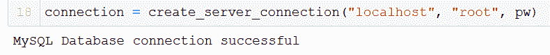

Hooray!

### 创建新数据库

现在我们已经建立了连接，下一步是在我们的服务器上创建一个新的数据库。

在本教程中，我们将只这样做一次，但我们将再次写为一个可重用的函数，所以我们有一个很好的有用的函数，我们可以在未来的项目中重用。

```
def create_database(connection, query):
    cursor = connection.cursor()
    try:
        cursor.execute(query)
        print("Database created successfully")
    except Error as err:
        print(f"Error: '{err}'")
```

这个函数有两个参数，connection(我们的连接对象)和 query(我们将在下一步编写的 SQL 查询)。它通过连接在服务器中执行查询。

我们在 connection 对象上使用 [cursor](https://dev.mysql.com/doc/connector-python/en/connector-python-api-mysqlcursor.html) 方法来创建一个 cursor 对象(MySQL Connector 使用了一个[面向对象编程范例](https://www.freecodecamp.org/news/object-oriented-programming-concepts-21bb035f7260/)，所以有很多对象从父对象继承属性)。

这个光标对象有一些方法，比如 [execute](https://dev.mysql.com/doc/connector-python/en/connector-python-api-mysqlcursor-execute.html) 、 [executemany](https://dev.mysql.com/doc/connector-python/en/connector-python-api-mysqlcursor-executemany.html) (我们将在本教程中使用)以及其他一些有用的方法。

如果有帮助的话，我们可以把 cursor 对象想象成让我们访问 MySQL 服务器终端窗口中闪烁的光标。


You know, this one.

接下来，我们定义一个查询来创建数据库并调用函数:

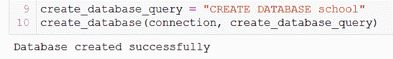

本教程中使用的所有 SQL 查询都在我的[SQL 教程系列介绍](https://towardsdatascience.com/tagged/sql-series)中进行了解释，完整的代码可以在[GitHub 库](https://github.com/thecraigd/Python_SQL)中的相关 Jupyter 笔记本中找到，所以我在本教程中不提供 SQL 代码的解释。

不过，这可能是最简单的 SQL 查询。如果你能看懂英语，你可能会知道它是做什么的！

使用上述参数运行 create_database 函数会在我们的服务器中创建一个名为“school”的数据库。

为什么我们的数据库叫‘学校’？也许现在是一个很好的时机来更详细地看看我们到底要在本教程中实现什么。

### 我们的数据库


The Entity Relationship Diagram for our database.

按照我的[前一系列](https://towardsdatascience.com/tagged/sql-series)中的例子，我们将为国际语言学校实现数据库——一个虚构的语言培训学校，为公司客户提供专业的语言课程。

这个[实体关系图](https://www.lucidchart.com/pages/er-diagrams) (ERD)展示了我们的实体(老师、客户、课程和参与者)并定义了它们之间的关系。

关于什么是 ERD 以及创建和设计数据库时需要考虑什么的所有信息都可以在本文中找到。

原始 SQL 代码、数据库需求和进入数据库的数据都包含在这个 GitHub 库中，但是当我们浏览本教程时，你也会看到这些。

### 连接到数据库

现在我们已经在 MySQL Server 中创建了一个数据库，我们可以修改 create_server_connection 函数来直接连接到这个数据库。

注意，在一个 MySQL 服务器上有多个数据库是可能的——事实上很常见——所以我们希望总是自动连接到我们感兴趣的数据库。

我们可以这样做:

```
def create_db_connection(host_name, user_name, user_password, db_name):
    connection = None
    try:
        connection = mysql.connector.connect(
            host=host_name,
            user=user_name,
            passwd=user_password,
            database=db_name
        )
        print("MySQL Database connection successful")
    except Error as err:
        print(f"Error: '{err}'")

    return connection
```

这是完全相同的函数，但是现在我们多了一个参数——数据库名称——并将其作为参数传递给 connect()方法。

### 创建查询执行函数

我们要创建的最后一个函数(目前)是一个极其重要的函数——一个查询执行函数。这将获取我们的 SQL 查询，以字符串形式存储在 Python 中，并将它们传递给 [cursor.execute()](https://dev.mysql.com/doc/connector-python/en/connector-python-api-mysqlcursor-execute.html) 方法，以便在服务器上执行它们。

```
def execute_query(connection, query):
    cursor = connection.cursor()
    try:
        cursor.execute(query)
        connection.commit()
        print("Query successful")
    except Error as err:
        print(f"Error: '{err}'")
```

这个函数与前面的 create_database 函数完全相同，只是它使用了 [connection.commit()](https://dev.mysql.com/doc/connector-python/en/connector-python-api-mysqlconnection-commit.html) 方法来确保 SQL 查询中详细描述的命令得以实现。

这将是我们的主要功能，我们将使用它(和 create_db_connection 一起)来创建表，建立这些表之间的关系，用数据填充表，以及更新和删除数据库中的记录。

如果您是 SQL 专家，这个函数将允许您直接从 Python 脚本执行任何和所有复杂的命令和查询。这是管理数据的一个非常强大的工具。

## 创建表格

现在，我们已经准备好开始在服务器中运行 SQL 命令，并开始构建我们的数据库。我们要做的第一件事是创建必要的表。

先说我们的教师表:

```
create_teacher_table = """
CREATE TABLE teacher (
  teacher_id INT PRIMARY KEY,
  first_name VARCHAR(40) NOT NULL,
  last_name VARCHAR(40) NOT NULL,
  language_1 VARCHAR(3) NOT NULL,
  language_2 VARCHAR(3),
  dob DATE,
  tax_id INT UNIQUE,
  phone_no VARCHAR(20)
  );
 """

connection = create_db_connection("localhost", "root", pw, db) # Connect to the Database
execute_query(connection, create_teacher_table) # Execute our defined query
```

首先，我们将我们的 SQL 命令(这里详细解释了[和](https://towardsdatascience.com/coding-and-implementing-a-relational-database-using-mysql-d9bc69be90f5))分配给一个具有适当名称的变量。

在这种情况下，我们使用 Python 的多行字符串的三重引号符号来存储我们的 SQL 查询，然后将它放入我们的 execute_query 函数来实现它。

请注意，这种多行格式纯粹是为了方便人们阅读我们的代码。SQL 和 Python 都不“关心”SQL 命令是否像这样展开。只要语法正确，两种语言都会接受。

然而，为了阅读你的代码的人的利益，(即使那只会是未来的你！)这样做是非常有用的，可以让代码更具可读性和可理解性。

SQL 中运算符的大写也是如此。这是一个广泛使用的约定，强烈建议使用，但是运行该代码的实际软件是不区分大小写的，并且会将“create table teacher”和“CREATE TABLE teacher”视为相同的命令。

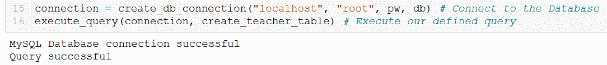

运行这段代码给了我们成功的信息。我们也可以在 MySQL 服务器命令行客户端中验证这一点:


太好了！现在让我们创建剩余的表。

```
create_client_table = """
CREATE TABLE client (
  client_id INT PRIMARY KEY,
  client_name VARCHAR(40) NOT NULL,
  address VARCHAR(60) NOT NULL,
  industry VARCHAR(20)
);
 """

create_participant_table = """
CREATE TABLE participant (
  participant_id INT PRIMARY KEY,
  first_name VARCHAR(40) NOT NULL,
  last_name VARCHAR(40) NOT NULL,
  phone_no VARCHAR(20),
  client INT
);
"""

create_course_table = """
CREATE TABLE course (
  course_id INT PRIMARY KEY,
  course_name VARCHAR(40) NOT NULL,
  language VARCHAR(3) NOT NULL,
  level VARCHAR(2),
  course_length_weeks INT,
  start_date DATE,
  in_school BOOLEAN,
  teacher INT,
  client INT
);
"""

connection = create_db_connection("localhost", "root", pw, db)
execute_query(connection, create_client_table)
execute_query(connection, create_participant_table)
execute_query(connection, create_course_table)
```

这为我们的四个实体创建了四个必要的表。

现在，我们想要定义它们之间的关系，并再创建一个表来处理参与者表和课程表之间的多对多关系(更多细节，请参见此处的)。

我们以完全相同的方式完成这项工作:

```
alter_participant = """
ALTER TABLE participant
ADD FOREIGN KEY(client)
REFERENCES client(client_id)
ON DELETE SET NULL;
"""

alter_course = """
ALTER TABLE course
ADD FOREIGN KEY(teacher)
REFERENCES teacher(teacher_id)
ON DELETE SET NULL;
"""

alter_course_again = """
ALTER TABLE course
ADD FOREIGN KEY(client)
REFERENCES client(client_id)
ON DELETE SET NULL;
"""

create_takescourse_table = """
CREATE TABLE takes_course (
  participant_id INT,
  course_id INT,
  PRIMARY KEY(participant_id, course_id),
  FOREIGN KEY(participant_id) REFERENCES participant(participant_id) ON DELETE CASCADE,
  FOREIGN KEY(course_id) REFERENCES course(course_id) ON DELETE CASCADE
);
"""

connection = create_db_connection("localhost", "root", pw, db)
execute_query(connection, alter_participant)
execute_query(connection, alter_course)
execute_query(connection, alter_course_again)
execute_query(connection, create_takescourse_table)
```

现在我们的表已经创建好了，还有适当的约束、主键和外键关系。

### 普及餐桌

下一步是向表中添加一些记录。我们再次使用 execute_query 将现有的 SQL 命令输入到服务器中。让我们再次从教师表开始。

```
pop_teacher = """
INSERT INTO teacher VALUES
(1,  'James', 'Smith', 'ENG', NULL, '1985-04-20', 12345, '+491774553676'),
(2, 'Stefanie',  'Martin',  'FRA', NULL,  '1970-02-17', 23456, '+491234567890'), 
(3, 'Steve', 'Wang',  'MAN', 'ENG', '1990-11-12', 34567, '+447840921333'),
(4, 'Friederike',  'Müller-Rossi', 'DEU', 'ITA', '1987-07-07',  45678, '+492345678901'),
(5, 'Isobel', 'Ivanova', 'RUS', 'ENG', '1963-05-30',  56789, '+491772635467'),
(6, 'Niamh', 'Murphy', 'ENG', 'IRI', '1995-09-08',  67890, '+491231231232');
"""

connection = create_db_connection("localhost", "root", pw, db)
execute_query(connection, pop_teacher)
```

这有用吗？我们可以在 MySQL 命令行客户端中再次检查:

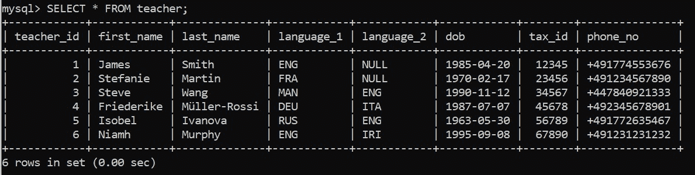

Looks good!

现在来填充剩余的表。

```
pop_client = """
INSERT INTO client VALUES
(101, 'Big Business Federation', '123 Falschungstraße, 10999 Berlin', 'NGO'),
(102, 'eCommerce GmbH', '27 Ersatz Allee, 10317 Berlin', 'Retail'),
(103, 'AutoMaker AG',  '20 Künstlichstraße, 10023 Berlin', 'Auto'),
(104, 'Banko Bank',  '12 Betrugstraße, 12345 Berlin', 'Banking'),
(105, 'WeMoveIt GmbH', '138 Arglistweg, 10065 Berlin', 'Logistics');
"""

pop_participant = """
INSERT INTO participant VALUES
(101, 'Marina', 'Berg','491635558182', 101),
(102, 'Andrea', 'Duerr', '49159555740', 101),
(103, 'Philipp', 'Probst',  '49155555692', 102),
(104, 'René',  'Brandt',  '4916355546',  102),
(105, 'Susanne', 'Shuster', '49155555779', 102),
(106, 'Christian', 'Schreiner', '49162555375', 101),
(107, 'Harry', 'Kim', '49177555633', 101),
(108, 'Jan', 'Nowak', '49151555824', 101),
(109, 'Pablo', 'Garcia',  '49162555176', 101),
(110, 'Melanie', 'Dreschler', '49151555527', 103),
(111, 'Dieter', 'Durr',  '49178555311', 103),
(112, 'Max', 'Mustermann', '49152555195', 104),
(113, 'Maxine', 'Mustermann', '49177555355', 104),
(114, 'Heiko', 'Fleischer', '49155555581', 105);
"""

pop_course = """
INSERT INTO course VALUES
(12, 'English for Logistics', 'ENG', 'A1', 10, '2020-02-01', TRUE,  1, 105),
(13, 'Beginner English', 'ENG', 'A2', 40, '2019-11-12',  FALSE, 6, 101),
(14, 'Intermediate English', 'ENG', 'B2', 40, '2019-11-12', FALSE, 6, 101),
(15, 'Advanced English', 'ENG', 'C1', 40, '2019-11-12', FALSE, 6, 101),
(16, 'Mandarin für Autoindustrie', 'MAN', 'B1', 15, '2020-01-15', TRUE, 3, 103),
(17, 'Français intermédiaire', 'FRA', 'B1',  18, '2020-04-03', FALSE, 2, 101),
(18, 'Deutsch für Anfänger', 'DEU', 'A2', 8, '2020-02-14', TRUE, 4, 102),
(19, 'Intermediate English', 'ENG', 'B2', 10, '2020-03-29', FALSE, 1, 104),
(20, 'Fortgeschrittenes Russisch', 'RUS', 'C1',  4, '2020-04-08',  FALSE, 5, 103);
"""

pop_takescourse = """
INSERT INTO takes_course VALUES
(101, 15),
(101, 17),
(102, 17),
(103, 18),
(104, 18),
(105, 18),
(106, 13),
(107, 13),
(108, 13),
(109, 14),
(109, 15),
(110, 16),
(110, 20),
(111, 16),
(114, 12),
(112, 19),
(113, 19);
"""

connection = create_db_connection("localhost", "root", pw, db)
execute_query(connection, pop_client)
execute_query(connection, pop_participant)
execute_query(connection, pop_course)
execute_query(connection, pop_takescourse)
```

太神奇了！现在我们已经用 MySQL 创建了一个包含关系、约束和记录的数据库，只使用 Python 命令。

我们一步一步地介绍了这一点，以使其易于理解。但是现在您可以看到，这可以非常容易地编写成一个 Python 脚本，并在终端中用一个命令执行。强大的东西。

## 阅读日期

现在我们有了一个可以使用的功能数据库。作为一名数据分析师，你可能会接触到你工作的组织中已有的数据库。了解如何从这些数据库中提取数据，然后将数据输入到 python 数据管道中，这将非常有用。这是我们接下来要做的。

为此，我们还需要一个函数，这次使用 [cursor.fetchall()](https://dev.mysql.com/doc/connector-python/en/connector-python-api-mysqlcursor-fetchall.html) 而不是 [cursor.commit()](https://dev.mysql.com/doc/connector-python/en/connector-python-api-mysqlconnection-commit.html) 。使用这个函数，我们将从数据库中读取数据，并且不会进行任何更改。

```
def read_query(connection, query):
    cursor = connection.cursor()
    result = None
    try:
        cursor.execute(query)
        result = cursor.fetchall()
        return result
    except Error as err:
        print(f"Error: '{err}'")
```

同样，我们将以与 execute_query 非常相似的方式来实现它。让我们用一个简单的查询来试验一下，看看它是如何工作的。

```
q1 = """
SELECT *
FROM teacher;
"""

connection = create_db_connection("localhost", "root", pw, db)
results = read_query(connection, q1)

for result in results:
  print(result)
```

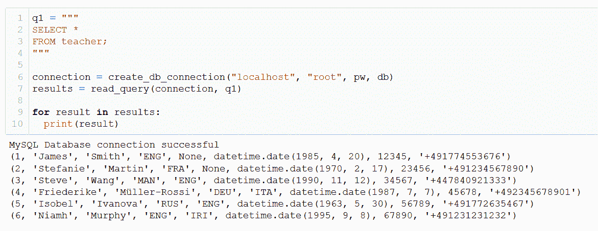

正是我们所期待的。该函数还可以处理更复杂的查询，比如这个查询涉及 course 和 client 表上的一个[连接](https://www.w3schools.com/sql/sql_join.asp)。

```
q5 = """
SELECT course.course_id, course.course_name, course.language, client.client_name, client.address
FROM course
JOIN client
ON course.client = client.client_id
WHERE course.in_school = FALSE;
"""

connection = create_db_connection("localhost", "root", pw, db)
results = read_query(connection, q5)

for result in results:
  print(result)
```

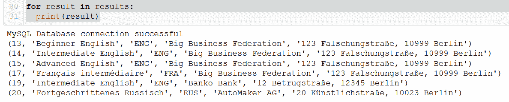

非常好。

对于 Python 中的数据管道和工作流，我们可能希望以不同的格式获得这些结果，以使它们更有用或便于我们操作。

让我们来看几个例子，看看我们如何做到这一点。

### 将输出格式化为列表

```
#Initialise empty list
from_db = []

# Loop over the results and append them into our list

# Returns a list of tuples
for result in results:
  result = result
  from_db.append(result)
```


### 将输出格式化为列表的列表

```
# Returns a list of lists
from_db = []

for result in results:
  result = list(result)
  from_db.append(result)
```

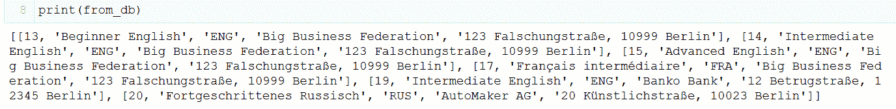

### 将输出格式化成一个[熊猫数据帧](https://pandas.pydata.org/pandas-docs/stable/reference/api/pandas.DataFrame.html)

对于使用 Python 的数据分析师来说，[熊猫](https://pandas.pydata.org/pandas-docs/stable/index.html)是我们美丽又值得信赖的老朋友。将我们数据库的输出转换成数据帧是非常简单的，并且从那里有无限的可能性！

```
# Returns a list of lists and then creates a pandas DataFrame
from_db = []

for result in results:
  result = list(result)
  from_db.append(result)

columns = ["course_id", "course_name", "language", "client_name", "address"]
df = pd.DataFrame(from_db, columns=columns)
```

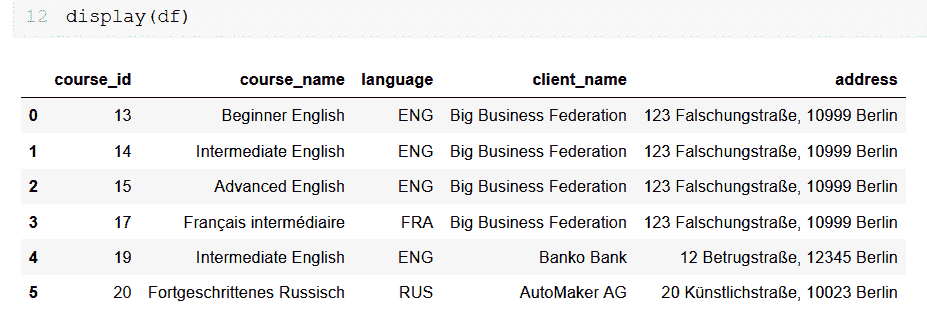

希望你能在这里看到展现在你面前的可能性。只需几行代码，我们就可以轻松地从它所在的关系数据库中提取出我们可以处理的所有数据，并将其纳入我们最先进的数据分析管道。这是非常有用的东西。

## 更新记录

当我们维护一个数据库时，我们有时需要修改现有的记录。在本节中，我们将看看如何做到这一点。

假设 ILS 得到通知，它的一个现有客户，大企业联盟，正在将办公室搬到 23 Fingiertweg，14534 Berlin。在这种情况下，数据库管理员(就是我们！)将需要做出一些改变。

幸运的是，我们可以通过 execute_query 函数和 SQL [UPDATE](https://dev.mysql.com/doc/refman/8.0/en/update.html) 语句来实现这一点。

```
update = """
UPDATE client 
SET address = '23 Fingiertweg, 14534 Berlin' 
WHERE client_id = 101;
"""

connection = create_db_connection("localhost", "root", pw, db)
execute_query(connection, update)
```

注意，WHERE 子句在这里非常重要。如果我们在没有 WHERE 子句的情况下运行这个查询，那么客户机表中所有记录的所有地址都将更新为 23 Fingiertweg。这完全不是我们想要做的。

还要注意，我们在更新查询中使用了“WHERE client_id = 101”。也可以使用“WHERE client _ name = ' Big Business Federation '”或“WHERE address = ' 123 falschungstrae，10999 Berlin '”或甚至“WHERE address LIKE '%Falschung% '”。

重要的是，WHERE 子句允许我们惟一地标识我们想要更新的记录。

## 删除记录

通过使用 [DELETE](https://dev.mysql.com/doc/refman/8.0/en/delete.html) ，也可以使用我们的 execute_query 函数来删除记录。

当在关系数据库中使用 SQL 时，我们需要小心使用删除操作符。这不是 Windows，没有“您确定要删除它吗？”弹出警告，并且没有回收站。一旦我们删除了一些东西，它就真的消失了。

也就是说，我们有时确实需要删除一些东西。让我们通过从课程表中删除一门课程来了解一下这一点。

首先，让我们提醒自己有哪些课程。

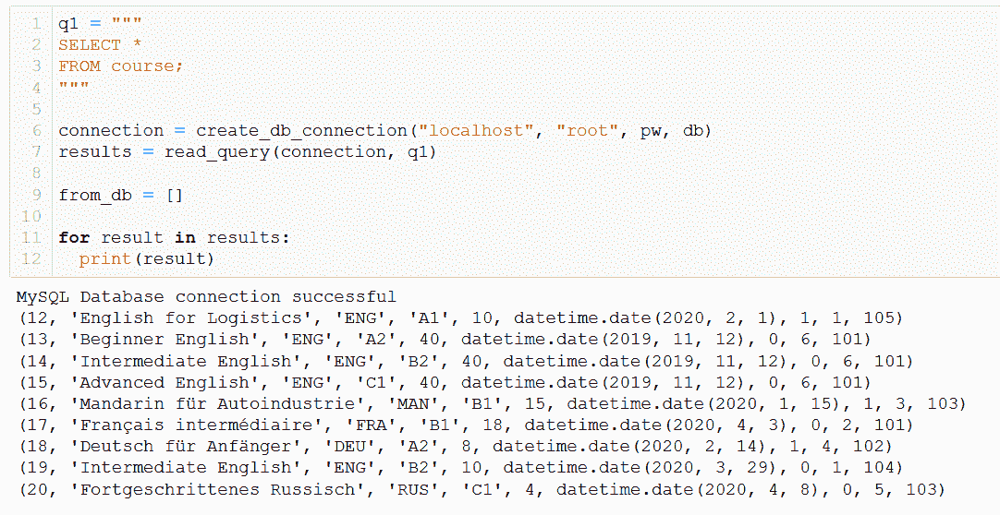

假设课程 20“Fortgeschrittenes russi sch”(对你我来说是“高级俄语”)即将结束，所以我们需要将其从数据库中删除。

到目前为止，对于我们是如何做到的，您一点也不会感到惊讶——将 SQL 命令保存为字符串，然后将其输入到我们的主要执行 _ 查询函数中。

```
delete_course = """
DELETE FROM course 
WHERE course_id = 20;
"""

connection = create_db_connection("localhost", "root", pw, db)
execute_query(connection, delete_course)
```

让我们检查一下，以确认是否达到了预期的效果:

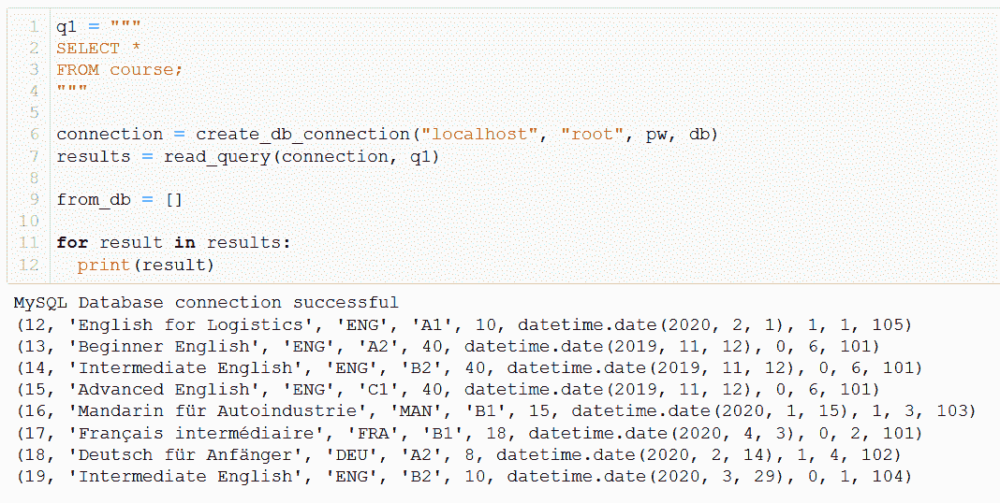

‘高级俄语’没了，正如我们所料。

这也适用于使用 [DROP COLUMN](https://www.w3schools.com/sql/sql_ref_drop_column.asp) 删除整个列，以及使用 [DROP TABLE](https://www.w3schools.com/sql/sql_ref_drop_table.asp) 命令删除整个表，但是我们不会在本教程中讨论这些。

但是，继续使用它们进行实验——如果您从一个虚构的学校的数据库中删除一列或一个表，这并不重要，在进入生产环境之前，最好熟悉这些命令。

### 哦 [CRUD](https://en.wikipedia.org/wiki/Create,_read,_update_and_delete)

至此，我们已经能够完成持久数据存储的四个主要操作。

我们已经学会了如何:

*   创建全新的数据库、表格和记录
*   从数据库中读取数据，并以多种格式存储数据
*   更新-对数据库中的现有记录进行更改
*   删除-删除不再需要的记录

这些都是非常有用的事情。

在我们结束这里的工作之前，我们还要学习一项非常有用的技能。

## 从列表创建记录

在填充表时，我们看到可以在 execute_query 函数中使用 SQL [INSERT](https://dev.mysql.com/doc/refman/8.0/en/insert.html) 命令将记录插入到数据库中。

假设我们使用 Python 来操作我们的 SQL 数据库，那么能够获取一个 Python 数据结构(比如一个 [list](https://www.w3schools.com/python/python_lists.asp) )并将其直接插入到我们的数据库中会很有用。

例如，当我们想要存储我们用 Python 编写的社交媒体应用程序上的用户活动日志，或者用户输入到我们构建的 Wiki 中时，这可能是有用的。你能想到的有很多可能的用途。

如果我们的数据库在任何时候对我们的用户开放，这种方法也更加安全，因为它有助于防止针对 [SQL 注入](https://en.wikipedia.org/wiki/SQL_injection)攻击，这种攻击可以[损坏甚至摧毁](https://www.lucidchart.com/pages/er-diagrams)我们的整个数据库。

为此，我们将使用 [executemany()](https://dev.mysql.com/doc/connector-python/en/connector-python-api-mysqlcursor-executemany.html) 方法编写一个函数，而不是我们目前使用的更简单的 [execute()](https://dev.mysql.com/doc/connector-python/en/connector-python-api-mysqlcursor-execute.html) 方法。

```
def execute_list_query(connection, sql, val):
    cursor = connection.cursor()
    try:
        cursor.executemany(sql, val)
        connection.commit()
        print("Query successful")
    except Error as err:
        print(f"Error: '{err}'")
```

现在我们有了函数，我们需要定义一个 sql 命令(' SQL ')和一个包含我们希望输入到数据库中的值的列表(' val ')。这些值必须存储为[元组](https://www.w3schools.com/python/python_tuples.asp)的[列表](https://www.w3schools.com/python/python_lists.asp)，这是 Python 中存储数据的一种相当常见的方式。

要向数据库中添加两名新教师，我们可以编写如下代码:

```
sql = '''
    INSERT INTO teacher (teacher_id, first_name, last_name, language_1, language_2, dob, tax_id, phone_no) 
    VALUES (%s, %s, %s, %s, %s, %s, %s, %s)
    '''

val = [
    (7, 'Hank', 'Dodson', 'ENG', None, '1991-12-23', 11111, '+491772345678'), 
    (8, 'Sue', 'Perkins', 'MAN', 'ENG', '1976-02-02', 22222, '+491443456432')
]
```

请注意，在“sql”代码中，我们使用“%s”作为值的占位符。与 python 中字符串的 ['%s '占位符](https://stackoverflow.com/questions/4288973/whats-the-difference-between-s-and-d-in-python-string-formatting/48660475)的相似之处只是巧合(坦率地说，非常令人困惑)，我们希望在 MySQL Python 连接器中对所有数据类型(字符串、整数、日期等)使用' %s'。

你可以在 [Stackoverflow](https://stackoverflow.com/questions/20818155/not-all-parameters-were-used-in-the-sql-statement-python-mysql/20818201) 上看到一些问题，有人感到困惑，试图使用 ['%d '占位符](https://stackoverflow.com/questions/4288973/whats-the-difference-between-s-and-d-in-python-string-formatting/48660475)来表示整数，因为他们习惯于在 Python 中这样做。这在这里是行不通的——我们需要为每个想要添加值的列使用一个“%s”。

然后，executemany 函数获取‘val’列表中的每个元组，插入该列的相关值来代替占位符，并对列表中包含的每个元组执行 SQL 命令。

只要数据的格式正确，就可以对多行数据执行此操作。在我们的示例中，为了便于说明，我们将只添加两个新教师，但是原则上我们可以添加任意多的教师。

让我们继续执行这个查询，并将教师添加到我们的数据库中。

```
connection = create_db_connection("localhost", "root", pw, db)
execute_list_query(connection, sql, val)
```

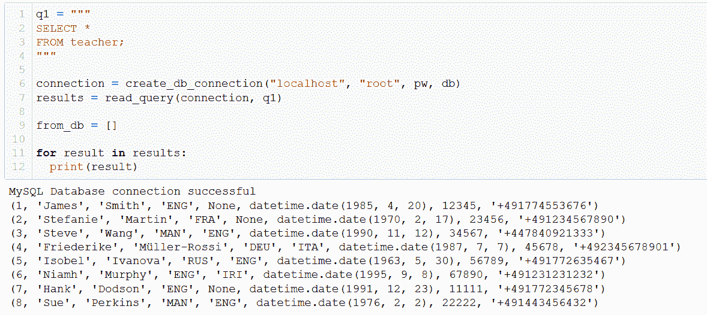

欢迎来到 ILS，汉克和苏！

这是另一个非常有用的功能，允许我们将 Python 脚本和应用程序中生成的数据直接输入到数据库中。

## 结论

在本教程中，我们已经讨论了很多内容。

我们已经学习了如何使用 Python 和 MySQL Connector 在 MySQL Server 中创建一个全新的数据库，在该数据库中创建表，定义这些表之间的关系，并用数据填充它们。

我们已经介绍了如何在数据库中创建、读取、更新和删除数据。

我们已经了解了如何从现有的数据库中提取数据，并将它们加载到 pandas DataFrames 中，以便利用 [PyData 堆栈](https://www.pluralsight.com/guides/a-lap-around-the-pydata-stack)提供的所有可能性进行分析和进一步的工作。

另一方面，我们还学习了如何获取 Python 脚本和应用程序生成的数据，并将这些数据写入数据库，并安全地存储在数据库中，以备以后检索和操作。

我希望本教程已经帮助您了解了我们如何一起使用 Python 和 SQL 来更有效地操作数据！

如果你想看更多我的项目和作品，请访问我的网站:craigdoedata . de。如果您对本教程有任何反馈，请[直接联系我](https://www.craigdoesdata.de/contact.html)-我们热烈欢迎所有反馈！

