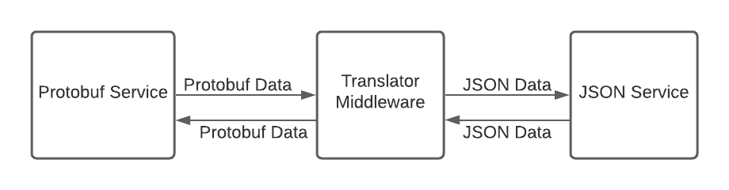
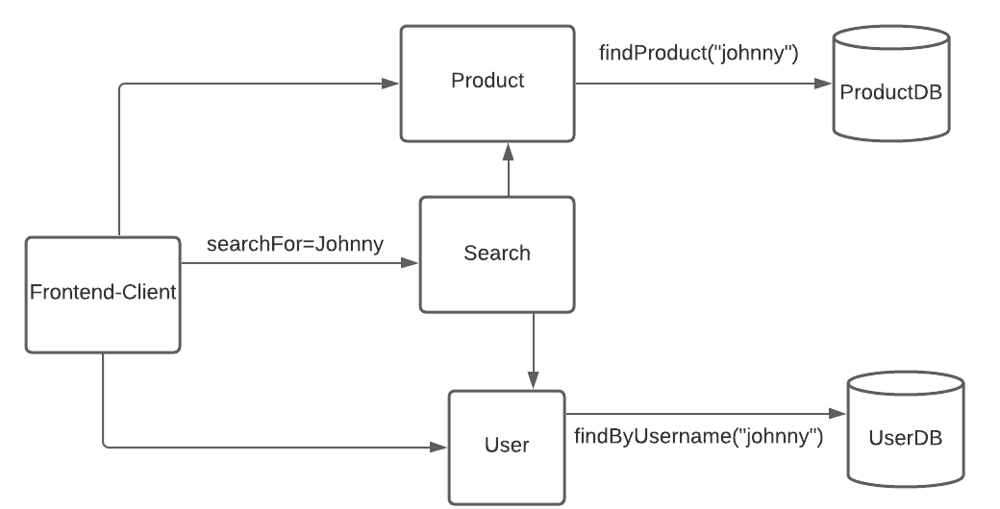
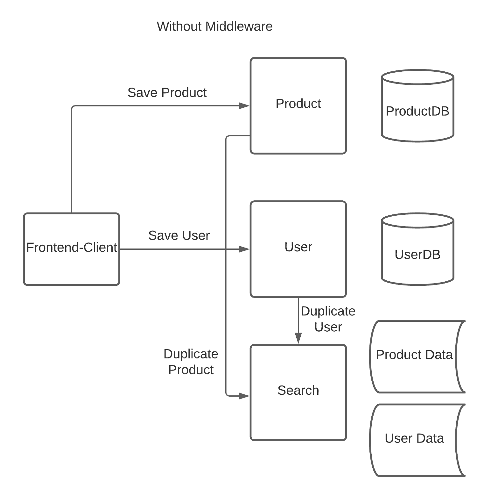
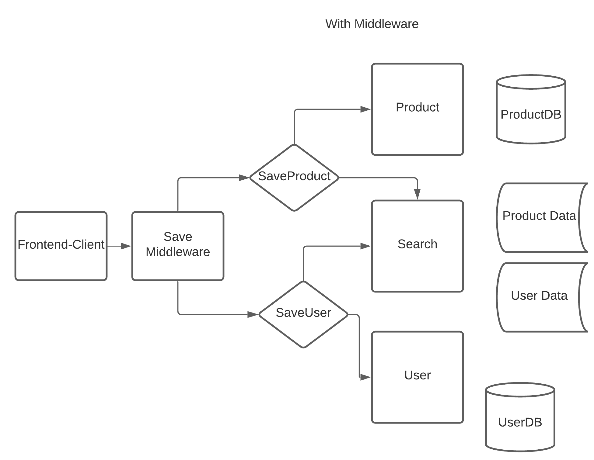

# 什么是中间件？定义和示例用例

> 原文：<https://www.freecodecamp.org/news/what-is-middleware-with-example-use-cases/>

中间件是 web 开发中常用的术语。根据上下文，它可能意味着许多事情，这使得该术语有点混乱。

在本文中，我们将从定义这个术语开始，然后继续讨论一些不同的用例。

阅读完本文后，您将能够更多地参与到与同行的技术和架构对话中。在设计安全可靠的 API 和数据流方面，您也将更有能力。

## 中间件的定义

中间件是一种软件，它充当两个应用程序或服务之间的中介，以促进它们之间的通信。

您可以将它视为一个代理，它可以充当数据收集器、转换器，或者只是一个转发请求的代理。

## 中间件的常见用例

### 1)翻译

有许多数据交换格式，比如 JSON、XML 和 Protobuf。即使我们现在大多使用 JSON，但它们都有自己的用例。

例如，众所周知，Protobuffers 比 JSON 性能更好，但是它们不可读。因此，当 API 消费者是浏览器时，您可能会对内部服务使用 Protobuffers，也可能会使用 JSON。

如果你有兴趣了解更多关于 Protobuffers 的信息，你也可以看看我的文章。

现在，假设我们需要这两个使用不同协议的服务相互通信。

我们可以创建一个中间件，利用数据转换库将请求转换成接收服务可以理解的格式。

### 2)积累-复制数据

微服务架构是一种流行的架构模式，通常应用于现代应用程序中。

如果你不熟悉微服务架构，它基本上意味着你的应用程序由许多彼此独立的小应用程序或服务组成，通过互联网通信共同操作。

例如，在一个电子商务项目中，你可能有一个用于存储和检索产品的微服务，另一个用于搜索的微服务，还有一个用于认证和存储用户的微服务。每个都有自己的数据库。

现在让我们说，我们希望以搜索用户和产品的方式来实现我们的搜索。

如果这是一个单一的应用程序，我们可以简单地编写一个查询来搜索每个表并连接结果。但是现在我们的数据库运行在不同的服务器上。

这个问题有多个解决方案，我们将研究其中的两个。

#### 积累数据

我们可以使用中间件向两个服务器发送请求，并要求它们在数据库中搜索与搜索到的单词相匹配的用户名和产品。

然后，我们可以从两个服务器累积结果，并将它们返回给客户机。注意，随着服务器数量的增加，请求的数量也呈线性增加(我们还需要合并这些数据)。

#### 复制数据

我们可以在我们的搜索服务器中存储重复的数据，这样它就可以直接搜索它们，而不是从产品和用户服务器请求。这在内存方面效率较低，但速度要快得多，而且速度对搜索服务至关重要。

如果我们需要的表是产品和用户，我们也可以在搜索服务器中创建这些表。然后，每当我们将新用户保存到我们的用户数据库时，我们也将在搜索服务器中保存一个副本。

我们有几个选择:首先，我们可以从用户和产品服务器的保存方法中调用搜索服务器的保存方法来复制数据。或者，我们可以创建一个用于保存的中间件，它将执行以下操作:

*   每当保存请求到达时，调用产品/用户服务器的保存和搜索服务器的保存。
*   如果第一次保存失败，不要调用另一次保存(这样可以保持数据库的一致性)。

让我们看一下没有和有中间件的设计图。首先，这是它看起来没有:

看起来很丑，对吧？事实上，这是丑陋的，它会使你的代码更加复杂和紧密耦合。

以下是使用中间件的相同解决方案:

在这种情况下，客户端只需调用中间件来保存产品或用户，其余的由它来处理。

无论是在产品、用户服务器还是客户端，都没有与复制数据相关的代码。中间件会处理这些事情。

### 3) API 安全性

对于任何前端客户端代码，我们都可以在浏览器的控制台或通过代理查看传出的请求。

我们讨论了负责登录和注册的用户服务器。如果我们的前端代码直接向该服务器发送请求，我们的身份验证服务器的地址就暴露了。在得知我们后端的 IP 地址后，攻击者可以使用工具来找到我们的端点并扫描我们的服务器以寻找漏洞。

我们可以使用中间件作为代理来隐藏我们的认证服务器的 URL。我们的前端与中间件通信，它将请求转发给认证服务器，并返回响应。

这种方法还允许我们阻止对认证服务器的所有请求，除了来自中间件 URL 的请求。这使得我们的认证服务器更加安全。

这在以前是不可能的，因为我们的前端正在与认证服务器通信。由于前端意味着客户端的计算机，我们不能应用 IP 过滤器。

### 4)公开公共 API

在前一部分中，我们了解到中间件可以用来限制对我们的 API 的访问。

现在让我们看看等式的另一面:如果我们想要对我们的 API 进行受限访问呢？也许我们是一家银行的软件工程师，银行正在计划一次黑客马拉松。我们需要提供对我们的 API 的访问，对吗？

但是既然我们是银行，当然不能提供对整个 API 的访问，允许每一个操作。这意味着我们需要找到一种方法来提供受限访问。

为此，我们可以实现一个中间件，它只公开一些端点，并将请求重定向到我们实际的 API。然后我们在黑客马拉松上向开发者提供这个 API。

## 结论

在这篇文章中，我们从定义什么是中间件开始，并试图对 web 开发中中间件的用例进行分类。

请记住，这不是一个完整的用例列表，但我仍然希望它对您有所帮助。

感谢您的阅读。如果你喜欢这篇文章，我邀请你来看看我的博客。您也可以订阅我的邮件列表，以便在我发布新帖子时得到通知:)