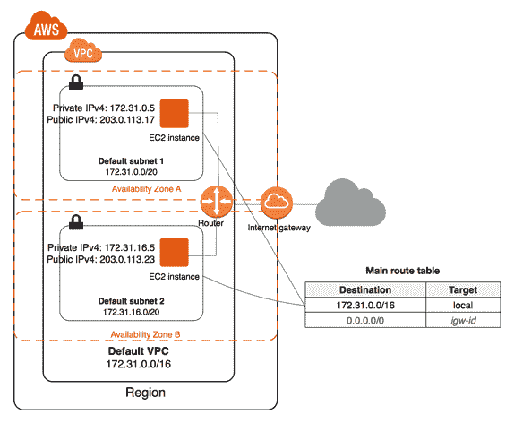

# 我在学习 AWS 认证云从业者考试时学到了什么

> 原文：<https://www.freecodecamp.org/news/what-i-learned-studying-for-the-aws-certified-cloud-practitioner/>

向云市场和劳动力市场表明你对云计算有广泛理解的一个方法是通过亚马逊网络服务云从业者考试。

根据你的技术和专业背景，这项考试的学习难度从简单到中等。

我最近花了五个工作日来学习和参加亚马逊网络服务云从业者考试。

在这一周里，我加深了对云计算、AWS 特定产品和云市场的了解。

我想把这些经验传承下去。如果你想参加这个考试——或者正在考虑——我的经历可能会对你有所帮助。

## 第一课:了解测试的内容和原因

理解考试测试什么以及它测试什么很重要。

首先，了解测试的机制。考试是怎么给的？考试什么时候开始？

其次，知道考试的构成。是怎么评分的？会问什么类型的问题？

新冠肺炎改变了考试的管理方式，我的考试是远程监考的。我用家里的个人电脑完成的。

为了通过考试，你需要 70%或更高的分数。这些问题大部分是选择题，但也有选择题提示。

考试的核心是测试你是否对云计算有足够深刻的理解，从而成为该领域的从业者。

这意味着您对核心概念的基本了解将使您能够与 AWS 客户、合作伙伴或其他相关的利益相关者进行交流。

它还验证考生解释 AWS 云的价值、理解 AWS 共同责任模型和理解 AWS 云安全最佳实践的能力。

云计算是使用互联网上的远程服务器网络来存储、管理和处理数据的实践，而不是本地服务器或个人计算机。

这个定义(以及如何部署和管理云技术)反复出现。

该考试还测试您在设计标准(即云技术的可靠性、可扩展性和持久性)和特定技术(虚拟私有云、子网、网络访问控制列表等)方面的工作知识。

## 第二课:不要害怕考试

许多参加考试的专业人士——说得委婉一点——在考试前都会有轻微的焦虑。那是因为考试确实会问一些技术问题。

但是不要害怕！

富兰克林·罗斯福总统在他的第一次就职演说中宣称“我们唯一需要害怕的就是害怕本身”。这些话当然适用于云从业者考试。

考试不会要求你编写软件或[部署或使用 Python](https://ardentgrowth.com/using-python-and-google-sheets-for-local-seo-keyword-research/) 来构建云配置。所以放轻松:)

通过花时间准备和学习 AWS 产品套件，它们如何工作，以及为什么公司受益于这些工具，你将在考试当天得到很好的服务。

## 第三课:准备

亚马逊首席执行官杰夫·贝索斯指出，“一个公司的品牌就像一个人的声誉。你通过努力把困难的事情做好来赢得声誉。”

如果你很长时间没有参加考试(更不用说专业认证)，你可能不知道如何开始准备。

使用云从业者考试作为一个平台，通过这个平台你可以努力学习新的东西。

参加考试时，我熟悉 AWS 的一些核心产品:亚马逊弹性计算云、简单存储服务和关系数据库服务等等。在 AWS 服务上建立我的金融科技初创公司 Pennybox 当然有所帮助。

但是有许多产品我还没有发现。我需要学习这些。

一些有希腊名字(Athena，Kinesis)，另一些由不熟悉的首字母缩写组成(QLDB，SQS，SNS 等等)。我保存了一个连续的文档，以便最好地记住每个产品。

学习新的概念和想法可能具有挑战性。

但是在做困难的事情的过程中，你可以树立一个足智多谋的学习者的名声，一个能够带来强大的思想领导力的人的名声。

当你通过考试时，你会为赢得了这个名声而自豪。

## 第四课:细节决定成败

参加 AWS 认证云从业者考试时，您需要了解亚马逊的核心云产品、它们的运作方式以及它们的合作方式。

我需要投入更多时间的一个领域是云安全。

我了解到，AWS 被认证为 PCI DSS 3.2 级服务提供商，这是支付卡行业数据安全标准的最高评估级别。

这一知识让我陷入了一个好奇的兔子洞。

我开始访问一些网站，比如 SaaS 会计公司的新书，看看他们是如何接受付款的，以及这些付款是如何安全交易的。

不用说，细节很重要。

我还需要温习虚拟专用网技术，以及更广泛地说，私有和公共网络之间的连接是如何工作的。

例如，我了解到 VPN 是通过使用专用电路或隧道协议建立虚拟点对点连接来创建的。

## 第五课:让核心概念引导你

考试测试计算概念。这些概念与安全性、定价、网络和基础设施方面的一般范例联系在一起。

我发现绘制 AWS 架构图非常有用。

我从网上最好的白板中挑选出来，用手写出解决方案。

我的白板帮助我带着更大的信心进入考试日，并能够直观地了解 AWS 产品的工作方式。

Amazon Virtual Private Cloud (Amazon VPC) lets you provision a logically isolated section of the AWS Cloud where you can launch AWS resources in a virtual network that you define. Learn how to draw a virtual networking environment, including subnets and route tables.

在不知道 AWS 构建的所有产品的名称的情况下，你仍然可以很容易地感觉到亚马逊希望用户和公司拥有灵活、安全、可靠和可扩展的云技术体验。

例如，看一下这个示例问题:

一家公司需要将其网站从内部迁移到 AWS。安全性是他们主要关心的问题，因此他们需要在不与其他 AWS 客户共享的硬件上托管他们的网站。以下哪个 EC2 实例选项符合此要求？

在没有看到潜在选择的情况下，什么听起来像是合理的答案？

这个问题的意思是，这家公司正在寻找一台只有他们能够访问的服务器。

在 AWS 术语中，这样的服务器被称为“专用实例”。

就这样，你赢得了一分。

看，这并不难，对吧？

## 第六课:练习

有三种方式来练习考试:[阅读亚马逊发布的白皮书](https://aws.amazon.com/whitepapers/?whitepapers-main.sort-by=item.additionalFields.sortDate&whitepapers-main.sort-order=desc)，进行模拟测试，或者使用实际的 AWS 产品来获得服务的第一手经验。

部署所有三种方法的组合可能会产生最好的结果。

aCloud Guru 和 Udemy 提供了一些负担得起的课程，帮助您学习和复习练习题。安德鲁·布朗[在免费代码营 YouTube 频道上提供免费的预备课程](https://www.freecodecamp.org/news/aws-certified-cloud-practitioner-training-2019-free-video-course/)。

另一种方法，也是我认为更适合深入学习的方法，是在 AWS 本身中建立并运行一个测试环境。为什么？因为这将让你直接接触到产品是如何操作和交互的。

通过创建 AWS 帐户，您将拥有 root 访问权限，并可以轻松配置用户和产品。这种经历可能会让你对核心概念有更深刻的理解。

## 第七课:享受考试日，记住你当初为什么要参加考试

考试时长 90 分钟，如果通过，考试结束时会通知您。你必须等几天才能得到实际的数值结果。

如果你刚刚开始这段旅程，试着享受它。

与我在商学院必须参加的 GMAT 不同，它教授的概念在我的日常生活中很少出现(尽管我记得 2 是最小的质数)，AWS 认证云从业者考试既实用又相关。

如果您从事云技术工作，该考试将通过展示基础知识来帮助您赢得客户的信任。

云计算市场正在快速增长。未来几年，云技术将继续塑造我们的数字经济。

根据棒棒糖公司进行的研究，进入这个科技时代不仅仅是生产新的商品和服务。通过使用简化业务流程的数字解决方案，公司可以提高效率、降低成本，并通过客户体验保持竞争力。

理解这些变化的技术基础是值得和令人兴奋的。

我把考试作为一个平台，加深了我对这个世界如何运转的理解。你也可以这样做。

AWS 在不断发展，并添加新的产品和服务。所以我自己的学习之路还在继续。

学习 AWS 和云技术的核心支柱将在考试当天为你提供很好的服务，最重要的是，在考试之后。