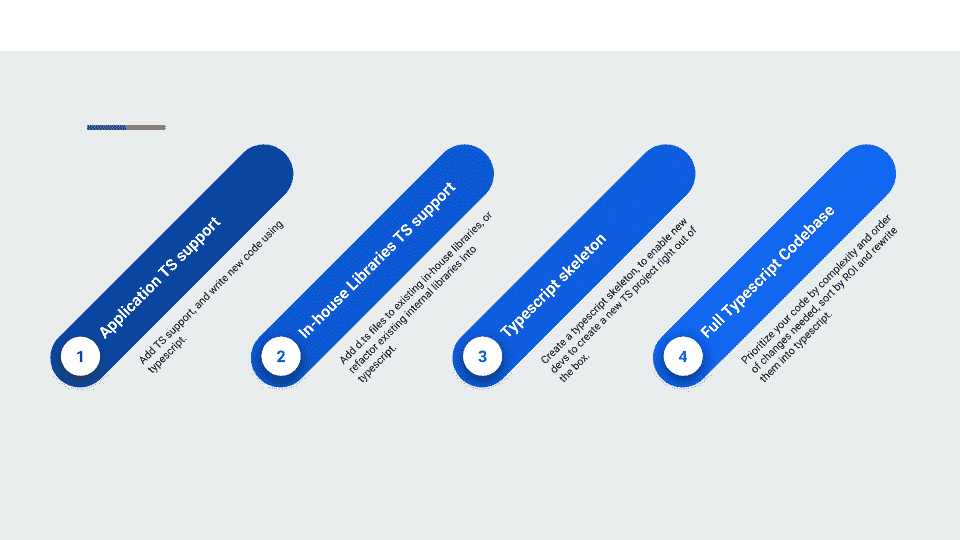
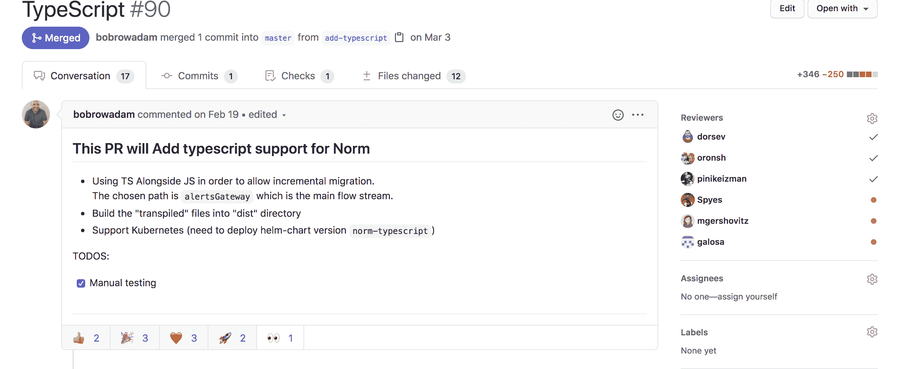
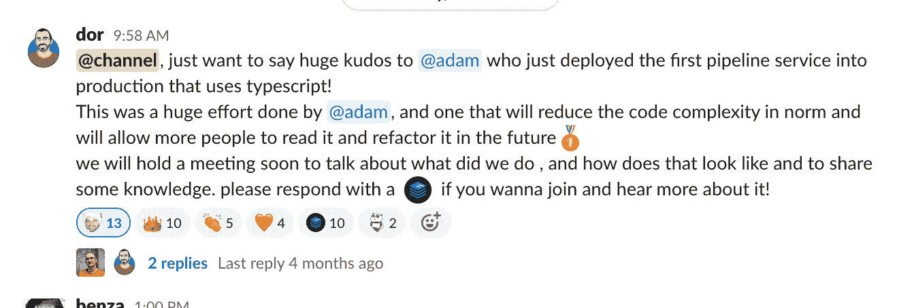

# 如何向 JavaScript 项目添加 TypeScript

> 原文：<https://www.freecodecamp.org/news/how-to-add-typescript-to-a-javascript-project/>

我喜欢写代码。我想成为真正的高手。但不知何故，写 JavaScript 从来不是我的强项。

无论我练习了多少，同样的错误还是不断出现在生产中:`cannot read property <> of undefined`异常，著名的`[Object object]`字符串，甚至是参数个数无效的函数调用。

此外，我工作的大多数代码库都是大型的 JavaScript 代码库。这是一个很好的图表，展示了我的感受:


We can do much better!

在这篇文章中，我将避免解释为什么 TypeScript 很棒(确实如此)，而将重点放在如果您想将普通的 JavaScript 项目迁移到混合的 TypeScript 项目时需要完成的任务上。

在这篇文章结束时，你会是一个更快乐的人，并且能够回答以下问题:

*   如何向我的 JavaScript 项目添加类型？
*   什么是 TypeScript？
*   如何在 JavaScript 项目中使用 TypeScript？
*   将一个 JavaScript 应用程序转换为支持 TypeScript 的步骤是什么？
*   我如何处理制造和包装？
*   我该如何照顾林挺？
*   如何向我的组织和开发人员“销售”TypeScript？

## 如何向我的 JavaScript 项目添加类型？

普通 JavaScript 目前不支持类型，所以我们需要在 JavaScript 之上进行某种抽象来实现。

一些常见的抽象是使用脸书的名为`[flow](https://github.com/facebook/flow)`的静态类型检查器和微软的名为`[typescript](https://github.com/microsoft/TypeScript)`的语言。

这篇博客文章将研究在您的 JavaScript 项目中使用和添加 TypeScript。

## 什么是 Typescript？

TypeScript 是 JavaScript 的类型化超集，它编译成普通 JavaScript。


If you know javascript, you are more than half way there.

TypeScript 由几个部分组成。首先是 TypeScript 语言——这是一种包含所有 JavaScript 特性的新语言。查看[规格](https://github.com/Microsoft/TypeScript/blob/master/doc/spec.md)了解更多信息。

第二个是 TypeScript 编译器，`tsc`(类型系统引擎)这是一个编译引擎，它构建 ts 文件并生成 js 文件。

## 打字稿中的 Hello world

例如，编写第一个 TypeScript 应用程序需要采取以下步骤:

1.  用`npm i typescript`安装 TypeScript
2.  创建一个名为`example`的文件夹，并将光盘放入其中(在您的终端中)
3.  创建一个名为`hello.world.ts`的文件
4.  在其中编写以下代码:

```
const firstWords:string = "hello world"
console.info(firstWords); 
```

Hello world In TypeScript – My first TypeScript program!

然后保存它。

5.运行`tsc`命令在当前文件夹上运行 TypeScript 编译器

6.请注意，您得到了一个现在可以运行的`hello.js`文件:)

7.运行`node ./hello.js`

## 如何在 JavaScript 项目中使用 TypeScript？

有几个策略可以实现这种“迁移”(公司层面和代码层面)。我在下面列出了它们的“成本”和它们提供的价值。

我建议从“应用程序 TS 支持”开始，在向您的开发团队证明其价值后再继续。



The typescript migration process, iterate through the process only if you prove value.

### “个人的一小步”方法-为现有应用程序添加 TS 支持


One small step for a developer. types are wonderful :) 

我的第一个建议是在一个项目中混合使用这两种语言，然后用 TypeScript 编写所有的“未来”代码。

在一个项目中结合两种语言乍听起来很糟糕，但是它工作得很好，因为 TS 是为逐渐使用而构建的。起初，它可以作为 JS 与。ts 文件和奇怪的导入行。

在这个策略中，我们将编译迁移的 TypeScript 文件，并将 JavaScript 文件复制到一个输出文件夹中。

这种方法的巨大好处是，它允许开发团队(以及您)逐渐学习语言及其特性。它还能让你亲身体验并洞察其利弊。

我强烈建议从这一步开始，然后在前进之前和你的团队一起迭代。快速“如何做”，向下滚动到`The steps to convert a javascript application to support typescript`部分。

### 面向业务的开放方法——为现有库添加 TS 支持。

在您对 TS 有了一些实践经验，并且您的开发团队也认为值得继续前进之后，我建议转换您的内部库和模块来支持 TS。

这可以通过两种方式实现:

**第一种方式**涉及使用[申报文件](https://www.typescriptlang.org/docs/handbook/declaration-files/templates/module-d-ts.html)。简单添加`d.ts`文件有助于 TS 编译器对现有 JavaScript 代码进行类型检查，并在 IDE 中为您提供自动完成支持。

这是“最便宜”的选择，因为它根本不需要对库进行任何代码更改。它还为您未来的代码提供了最大的能力和类型支持。

**第二种方法**是对 TypeScript 进行完全重写，这可能很耗时，而且容易出错。我建议不要这样做，除非它证明对你的团队来说是值得的。

### 骷髅——迈向未来的一步


Typescript skeleton is the way to ensure a bright future!

我假设大多数开发人员是“懒惰”的，通常从一个框架(通常包含日志记录、度量、配置等等)开始他们的应用程序。

这一步通过为你的公司创建一个“正式的”框架，帮助你导航到一个光明的未来。它将是 100% TS，如果存在旧的 JS 框架，它将被弃用。

这个 [typescript-node-starter](https://github.com/microsoft/TypeScript-Node-Starter#getting-started) 是一个非常好的第一个项目。

### **all in 方法——将完整的代码库从 JS 转换成 TS**


I'm all in! Let's make all things typed!

这个选项需要从 JavaScript 代码完全重写为 TypeScript。我建议将此作为 TS 迁移过程的最后一步，因为它需要整个应用程序的重新编写以及对 TypeScript 及其功能的深入了解。

您可以按照以下方式进行这样的重写(这是一个漫长的过程):

1.  为您的应用程序业务逻辑、API 和 HTTP 定义清晰的类型
2.  对您的`package.json`中的所有库使用`@types`包。大多数库都支持 TS，在这个过程中，我建议一个一个地迁移它们(只需在你的`package.json`文件中添加`@types/<package_name>`)。
3.  按照重要性的顺序转换应用程序的逻辑组件。商业逻辑越独特越好。
4.  转换应用程序、数据库层、队列等的 IO 部分。
5.  转换您的测试。


Types are a cause for a celebration :) 

请记住，有一些自动化工具旨在简化这一过程，例如 Airbnb 团队的 [ts-migrate](https://github.com/airbnb/ts-migrate) 。

它从不同的角度解决了这个问题，并将所有文件转换为 TypeScript。它还允许在整个代码库从第一天起就是打字稿的情况下逐步改进(就像上面提到的步骤)。

## 如何转换 JavaScript 应用程序以支持 TypeScript。

### 安装 typescript

通过运行:`npm install typescript`。

### Typescript 配置文件

添加一个 typescript 配置文件，该文件可以使用 CLI 中的`tsc --init`命令创建。

下面是我们初始配置的一个例子:

```
{
 "compilerOptions": {
   "target": "esnext",
   "module": "commonjs",
   "allowJs": true,
   "checkJs": false,
   "outDir": "dist",
   "rootDir": ".",
   "strict": false,
   "esModuleInterop": true /* Enables emit interoperability between CommonJS and ES Modules via creation of namespace objects for all imports. Implies 'allowSyntheticDefaultImports'. */,
   "forceConsistentCasingInFileNames": true, /* Disallow inconsistently-cased references to the same file. */
   "declaration": true, /* Generates corresponding '.d.ts' file. */
   "strictNullChecks": true,
   "resolveJsonModule": true,
   "sourceMap": true,
   "baseUrl": ".",
   "paths": {
    "*": [
      "*",
      "src/*",
      "src/setup/*",
      "src/logic/*",
      "src/models/*",
      "config/*"
    ]
  },
 },
  "exclude": ["node_modules", "dist"],
  "include": [
    "./src",
    "./test",
    "./*",
    "./config" 
  ]
}
```

以上几点需要注意:

*   我们读取`src`或`test`或`config`目录中的所有文件(使用`include`标志)。
*   我们接受 JavaScript 文件作为输入(使用`allowJs`标志)。
*   我们在`build`中发出所有的输出文件(使用`outDirflag`)。

### 创造你的第一个。项目中的 TS 文件

我建议从添加一个简单的 TypeScript 文件(或者将一个非常简单的 JS 文件改为 TS 文件)和部署开始。一步一步地进行迁移。

### 小心你的 package.json 文件

这是我们的`package.json`在之前和之后的样子:

```
{
  "scripts": {
    "start": "node ./application.js",
    "mocha": "mocha --recursive --reporter spec -r test/bootstrap.js",
    "test": "npm run mocha -- test/ -r test/integration/bootstrap.js", 
  }
}
```

Before

```
{
  "scripts": {
    "start": "node ./dist/application.js",
    "build-dist": "./node_modules/typescript/bin/tsc",
    "mocha": "mocha --recursive --reporter spec -r ./dist/test/bootstrap.js",
    "test": "npm run mocha -- ./dist/test/ -r ./dist/test/integration/bootstrap.js"
  }
}
```

After

正如您所看到的，大部分的变化都是关于给我们的大多数构建命令添加前缀`dist`。我们还添加了一个`build-dist`脚本来编译我们的代码库，并将所有文件移动到一个名为`dist`的专用文件夹中。

### 添加源-地图-支持

将 TypeScript 添加到您的项目中的一个大问题是，您在您编写的代码和在生产中实际运行的代码之间添加了一个间接层(因为在运行时`.ts`被传输到`.js`)。

例如，想象下面的 TypeScript 程序:

```
const errorMessage: string = "this is bad"

throw new Error(a)
```

当我们运行它时，它将抛出以下堆栈跟踪:

```
Error: this is bad
    at Object.<anonymous> (/Users/dorsev/work/git/example/hello.js:3:7)
```

Wait! but we only have 2 lines in our typescript code!

这是有问题的，因为我们的代码库只包含`.ts`文件。由于大多数产品代码包含数百行代码，正确翻译这些数字和文件将非常耗时。

幸运的是，有一个解决方案叫做 [source-map-support](https://www.npmjs.com/package/source-map-support) ！

这允许我们确保堆栈跟踪像我们习惯的那样有正确的`.ts`文件名和行号:)

这可以通过运行`npm install source-map-support`来完成，然后在应用程序的第一行中添加以下行:

`require('source-map-support').install();`

代码现在看起来像这样:

```
require('source-map-support').install();
const a:string = "this is bad"
throw new Error(a)
```

hello.world.ts

当我们编译它的时候，我们运行`tsc --sourcemap hello.ts`。现在我们得到了下面的堆栈跟踪，这太棒了:)

```
Error: this is bad
    at Object.<anonymous> (/Users/dorsev/work/git/example/hello.ts:3:7)
```

在`nodejs`的最新版本中，这是通过使用`--enable-source-maps` [标志](https://github.com/nodejs/node/pull/29564)来支持的。

## 如何照顾你的建设(特拉维斯)和包装

让我们检查一下构建配置文件的修改前后。

这是我们之前`.travis`文件的样子(简体版):

```
jobs:
  include:
  - &build-and-publish
    before_script:
    - npm install --no-optional --production
    - npm prune --production
    before_deploy:
     - XZ_OPT=-0 tar --exclude=.git --exclude=reports.xml --exclude=${ARTIFACTS_MAIN_DIR}
       --exclude=.travis.yml --exclude=test -cJf "${ARTIFACTS_PATH}/${REPO_NAME}".tar.xz * .??*

  - &test
    before_script:
     - npm install --no-optional
    script:
     - echo "Running tests"
     - npm run lint && npm test
```

Simplified .travis before typescript

这是它的样子:

```
jobs:
  include:
  - &build-and-publish
    before_script:
    - npm install --no-optional --production
    - npm run build-dist  # Build dist folder
    - npm prune --production
    before_deploy:
     - cp -rf config/env-templates ./dist/config/
     - cp -rf node_modules ./dist/
     - cd dist
     - XZ_OPT=-0 tar --exclude=.git --exclude=reports.xml --exclude=${ARTIFACTS_MAIN_DIR} --exclude=.travis.yml --exclude=test -cJf "${REPO_NAME}.tar.xz" *
     - mv ${REPO_NAME}.tar.xz "../${ARTIFACTS_PATH}"
     - cd ..

  - &test
    before_script:
     - npm install --no-optional
     - npm run build-dist
    script:
     - echo "Running tests"
     - npm run lint && npm test
```

Simplified .travis after typescript

请注意，大多数更改都与“打包”到`tar.xz`文件和在访问`dist`文件夹之前运行`build-dist`命令有关。

## 我该如何照顾林挺？

有几个林挺解决方案可供选择。

我们使用的第一个解决方案是[ts fmt](https://github.com/vvakame/typescript-formatter)——但后来我们决定不使用它，因为它要求您为您的项目维护两个独立的配置(一个使用`tsfmt`用于 TypeScript，另一个使用`eslint`用于 JavaScript)。该项目看起来也不赞成。

然后我们找到了 [TSLint](https://palantir.github.io/tslint/) ，它将我们重定向到了用于 TypeScript 的 [eslint 插件。然后，我们对其进行了如下配置:](https://github.com/typescript-eslint/typescript-eslint)

这是我们的`eslintrc.js`:

```
module.exports = {
    rules: {
        indent: [2, 2, {
            SwitchCase: 1
        }],
        'no-multi-spaces': 2,
        'no-trailing-spaces': 2,
        'space-before-blocks': 2,
    },
    overrides: [{
        files: ['**/*.ts'],
        parser: '@typescript-eslint/parser',
        plugins: ['@typescript-eslint'],
        extends: ['plugin:@typescript-eslint/eslint-recommended', 'plugin:@typescript-eslint/recommended']
    }]
}
```

我们在我们的`package.json`中配置了一个`lint-fix`命令来运行它，如下所示:

```
{
    "scripts": {
        "lint-fix": "node_modules/.bin/eslint . --fix"
    },
    "pre-commit": ["lint-fix"]
}
```

## 如何向您的开发团队“推销”typescript

我认为将 TypeScript 引入您的组织的最关键的方面之一是“推介”以及您如何向您的开发团队展示它。

这是我们内部围绕以下主题进行的[演示](https://github.com/dorsev/typescript-talk/blob/master/typescript_meetup.md  ):

1.  解释为什么我们认为 TypeScript 很棒
2.  什么是打字稿
3.  一些基本的代码示例。这一部分的要点不是“教授”100%的 TypeScript，因为人们会自己去做。而是给人一种会读会写 TypeScript 的感觉，学习曲线也没那么难。
4.  高级代码示例，如联合类型和代数数据类型，它们为 JS 开发人员提供了巨大的价值。这是一个真正的享受，在类型化语言和编译器之上，会吸引你的开发者。
5.  如何开始使用？鼓励人们下载`vs-code` IDE，并添加注释( [//@ts-check](https://code.visualstudio.com/docs/nodejs/working-with-javascript#_type-checking-javascript) )，这样他们就可以开始看到神奇之处了！在我们公司，我们预先准备了一些很酷的错误，这些错误会被`ts-check`发现，我们做了一个现场演示(2-3 分钟)来展示 TypeScript 编译器可以多快地帮助他们使用带有类型注释或`ts-check`的 JS 文档。
6.  深入了解一些功能。解释一下`ts.d`文件和`@types packages`,它们是你在 TypeScript 代码库中很早就会遇到的一些东西。
7.  你工作中的现场公关。我们展示了我们早期创建的 PR，并鼓励人们回顾它并亲自尝试。
8.  分享一些很酷的资源。网上内容很多，很难分清好坏。帮你的队友一个忙，深入挖掘，尝试找到关于你使用和需要的工具的高质量内容。向下滚动到“我的资源”的结论。
9.  创建公共拉取请求。我建议为它的通过争取尽可能多的支持。



Adding typescript to a project! hurray! 

10.在你的组织中创造积极的变革氛围！



我强烈建议根据你的团队、标准和时间限制来调整这个列表。

## 结论

**打字稿超级牛逼**！如果您正在编写生产级软件，并且业务需求和可用性很高，我强烈建议您尝试一下 typescript。

记住一步一步来。新的语言和框架很难，所以在推进这个过程之前，花时间学习并教育你自己和你的团队。

**创建一个简短的反馈回路和价值主张**。很难向你的团队和管理层“推销”一门新语言，因为这需要时间和资源。

因此，用简短的反馈循环来设计您的迁移过程，并尝试定义清晰的 KPI(生产中更少的错误，更容易的重构时间，等等)，并确保您的用例的价值主张不断得到证明，直到它成为事实上的标准。

**让学习资源随时可用**。我真的很喜欢[这篇关于 TypeScript 第一步的](https://youtu.be/vxvQPHFJDRo)演讲和[这篇关于逐步迁移到 TypeScript 的博文](https://dylanvann.com/incrementally-migrating-to-typescript/)。

还有，不要错过`[deno](https://github.com/denoland/deno)`项目和`[ts-node](https://github.com/TypeStrong/ts-node)`项目。我非常兴奋，期待着尽快使用它们。