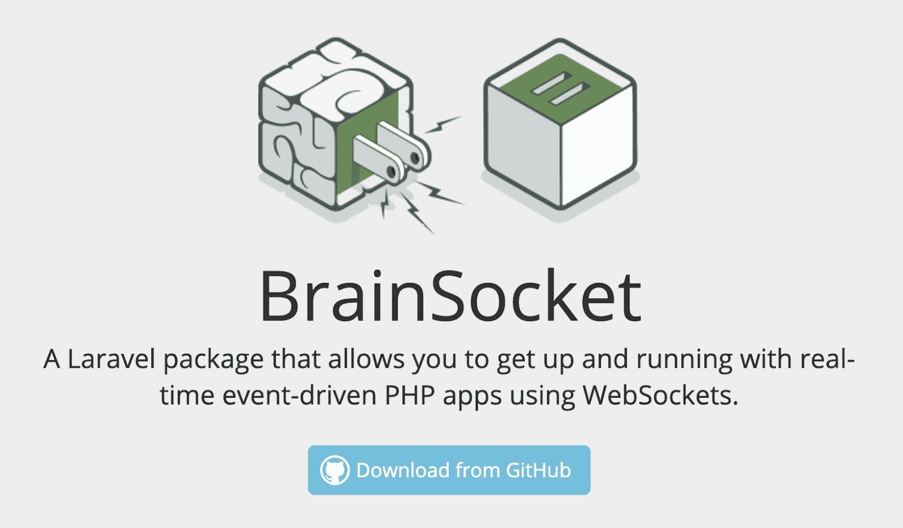
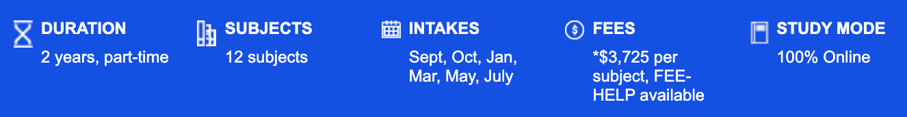
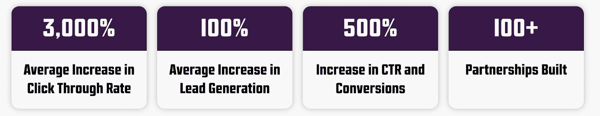
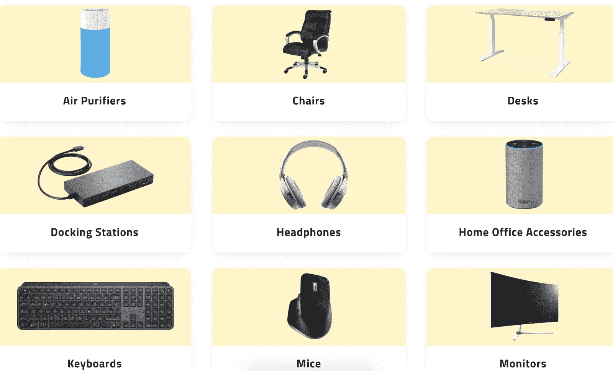

# 保持简单，笨蛋——如何在设计中运用接吻原则

> 原文：<https://www.freecodecamp.org/news/keep-it-simple-stupid-how-to-use-the-kiss-principle-in-design/>

KISS 原则(或者保持简单，愚蠢)指出，如果系统保持简单而不是过于复杂，大多数系统会工作得最好。

当构建一个产品，设计一个网站，创建一个应用程序，或者设计一段代码时，努力做到简单。

在制造和推出产品之后，我亲眼目睹了好的想法因为产品的复杂性和随之而来的产品债务而变得无关紧要。

我也看到了复杂的标准是如何被改进的，结果是设计变得更加简单和强大。

当简单性可以帮助您更快地设计、启动、扩展和学习时，就没有什么商业、智力或技术上的理由让事情变得复杂。

我想用我做建筑商和企业家时的例子来和你分享我的观点。

通过分享这些教训，我希望你能在工作中最好地利用接吻原则。

2014 年夏天，我开了一个名为“趣味社交运动”的 bootcamp 运动班。这个课程是如何产生的，以及我在将它发展成一个小型副业的过程中所扮演的角色，突显了我对辅导和建设的热爱。

它还表明，KISS 可以应用于我们生活中的许多领域——而不仅仅是构建技术产品。

## 练习接吻

首先，背景故事。

住在澳大利亚时，我参加了一个交叉训练课程来保持健康。随着时间的推移，健身计划的创始人请我协助他指导锻炼。

这门课虽然很受欢迎，但存在设计问题。

例如，同时指导 70 多人是不切实际的。我建议我们将课程扩展到额外的工作日晚上。

当我的想法被拒绝时，我面临着进退两难的境地。我应该继续以一种低效率和不太有效的方式指导，还是抓住机会，开始我自己的健身课程？

我决定抓住这个机会。

## 亲吻和顾客:逆向工作

KISS 的一个关键原则是，你必须专注于客户，做出有利于这些利益相关者的决策。

通过从客户需要的和想要的逆向工作，可以简化和删除与赢得客户信任不一致的策略、软件层、工作流程甚至图标。

我的新企业的前几堂课很少有人参加，我决定开办自己的训练营看起来像是一场失败的赌博。

但我坚持了下来，剥离了所有的“噪音”。多余的训练、与会者费力的签到系统和花哨的设备都不见了。上课(经常让新成员困惑)和客座讲师的循环地点也消失了。

我简化了我的营销行动号召(参加一个课程，今天免费)，并开始自己辅导课程。

我制定了一个发展和留住客户的策略:

1.  我利用 Meetup.com、脸书集团和 Reddit 子社区来锁定年轻的专业人士。
2.  我将谷歌地图整合到网站中，帮助人们定位课程并轻松找到它。
3.  为了给我的训练营打上“专业”的烙印，我最终雇佣了经过认证的教练。

这些修改导致了我的萌芽班的成长。

每次课后，我都会和一些参与者交谈，以更好地了解他们对未来课程的期望，以及我该如何改进。

除了最基本的东西都被拿走了。

我喜欢辅导集体健身班，因为这是一项脑力挑战、体力消耗和固有的社交活动。每个班级都需要一个清晰传达的有组织的行动计划。

在每堂课上，我都必须准备好激励每个参与者，在一个小时的紧张时间里保持每个人的注意力，最重要的是，激励其他人不断挑战自己。

教练被证明是一个很好的直接了解接吻的平台。有人可能认为人们参加健身班是为了减肥或结识朋友。

然而，如果你深入挖掘，你会发现另一个原因:在现实中，人们加入社交健身班是因为它给了他们一种目标感。

通过这种认识，我能够更好地定制课程，以确保正确的结果。通过剥离“漂亮但不必要”的属性，我可以更好地交付参与者所重视的东西，并减少抽象。

## 接吻和好的设计

在软件和技术领域，接吻是优秀设计不可或缺的一部分。

部分原因是公众并不总是很好地理解技术。对于任何给定的产品类型，用户可能有几十个类似的选项可供选择。

考虑一下这篇关于如何在互联网安全工具和产品上省钱的文章。事实上，它列出了 55 种实现这些目标的不同方式，这证明了一个拥挤的市场，有太多的选择，如果没有专家的帮助，用户无法理解所有的选择。

在这样的市场中，如果你能以直接的方式交付产品，你会更容易成功。

所以，在写一行代码之前，先了解你的技术北极星。构建 MVP(最小可行产品)的概念与 KISS 是一致的，因为你想做最少的工作来证实或否定你的假设。

接吻对设计原则如此重要，以至于亚马逊将其列为核心领导原则。具体来说，亚马逊指出，“领导者期望并要求他们团队的创新和发明，并总是找到简化的方法。”

虔诚的线框。部署普遍理解的概念。避免分心。

接吻的另一个好处是深刻理解某事发生的原因。如果你在设计中没有体现简单的原则，你可能会遭受产品融合的痛苦。

例如，当我创建 Pennybox 时，我想让父母用这个软件来教他们的孩子如何在家赚钱和存钱。

但是很少有父母把他们的孩子加入到这个应用中。为什么会发生这种情况？

事实证明，添加其他用户太难了。同样不清楚的是，将孩子添加到父母设置中是否是该应用程序期望的行动号召。

因为看似有多个根源，我不知道先解决哪一个。

那是一个糟糕的处境。

如果我部署了一个强烈关注 KISS 的测试产品，那么宝贵的时间和资源就可以节省下来。

相反，我制造了需要管理的技术债务，进一步增加了加速应用程序增长的负担。

## 设计中接吻原则的终结性思考

你可以从我的失误中吸取教训。

在设计中使用 KISS 原则的时候，想想你的用户，逆向工作。

建筑工人永远不会停止学习，他们总是寻求提高自己和他们的设计和产品。

对新的可能性保持好奇，并通过减少噪音来探索它们，这样你就可以专注于真正重要的事情:让用户确认你的解决方案增加了价值。

## 案例研究#1:

这里有几个我觉得很有说服力的吻的例子。

Brain Box Labs 有一个帮助软件开发人员的开源社区。他们的实验室部分非常容易使用，而且被普遍理解。行动号召是一个简单的下载按钮。

## 案例研究#2:

关于接吻的第二个例子可以在悉尼科技大学(UTS)的网站上找到。他们提供数字营销课程，参数非常容易理解。

许多教育网站缺乏清晰的 CTA 和价值主张。但 UTS 却不是这样，它让读者确切地看到课程是如何运作的，持续时间和费用。有什么更简单的设计？

## 案例研究#3:

KISS 的例子可以在 Guerrilla Agency 的数字营销材料中找到。他们使用非常简单的设计美学向潜在客户展示他们的价值主张。

如果你在网上销售服务，考虑用清晰、醒目和普遍理解的指标来重复你的行动号召。

## 案例研究#4:

当我推出我的网站来帮助人们更有效地在家工作时，我在设计中大量使用了 KISS。

下面是我如何直观地教育用户在家工作时可以使用的产品——从坞站到如何在远程工作几周或几个月时保持健康。

