# 如何用番茄工作法量化和可视化你的学习

> 原文：<https://www.freecodecamp.org/news/how-to-quantify-and-visualize-learning-with-the-pomodoro-technique/>

几个月前，全球疫情迫使我们许多人调整生活的方方面面。

我们的日常生活已经被颠覆，我们中的许多人继续花更多的时间在家里。

在家时间的增加为成长和学习提供了机会。当疫情开始的时候，我开始回顾我是如何在家度过我的额外时间的。我跟踪了这些数据，建立了一个学习程序，并最终将结果可视化。

这篇文章概述了我如何使用番茄工作法来跟踪我的学习。在这本书里，我们将分解如何量化你的学习进度，并可视化结果。

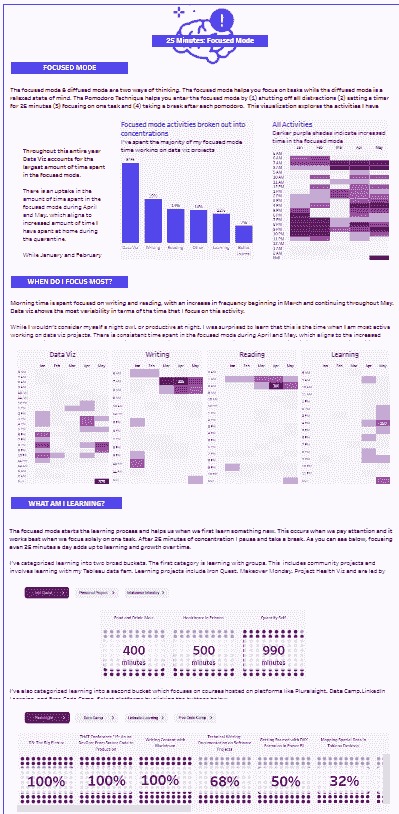

## **学习如何学习**

> 学习就是在你的大脑中创造一种模式。你练习得越多，就越强，将来对你越有用。”—芭芭拉·奥克利

当我们学习新的科目时，我们的大脑以几种方式处理信息。我们思考的方式主要有两种:聚焦模式和扩散模式。

当我们第一次开始学习新的东西时，我们必须集中精力。另一方面，扩散模式允许我们在想法之间建立富有想象力的联系。这包括我们放松和思想广泛传播的时间。

番茄工作法是一种帮助我们进入专注模式的工具。

There are two primary ways that we think: via the focused mode and the diffused mode. When we first begin to learn something new we have to focus and concentrate. 

## **什么是番茄工作法？**

番茄工作法通过以下方式帮助我们专注工作:

1.  排除一切干扰，找一个安静的地方工作。
2.  设置 25 分钟的定时器。我下载了一个名为“专注专业”的应用程序，它可以让我跟踪这些数据。
3.  专注于任务或学习活动。
4.  休息一下，25 分钟后重复这个过程。

我学会了用番茄工作法建立一个学习程序。25 分钟是切实可行的，对于专注于想要的学习活动来说足够短了。

学习是一种投资，它的价值会随着时间的推移而增加。每天 25 分钟可能看起来很短，但是乘以一周，一个月，一年，你就会看到结果。

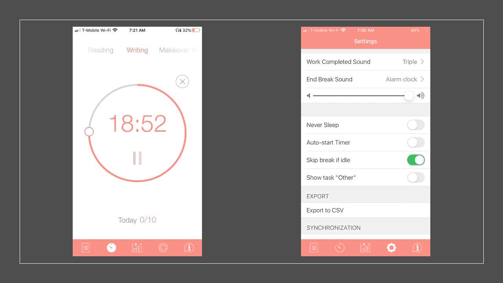

Be Focused Pro App. Start a Pomodoro. It has settings that allow you to export to csv.

## **你的学习目标**

想想你想学什么——你感兴趣的话题或语言是什么？

在你确立了你的主题之后，想想你需要获得的新技能。为了达到你的学习目标，将主题分解成几个部分是很重要的。

### 引进番茄工作法

番茄工作法帮助你一步一步地学习新技能。这就是方法。

想想你的学习目标，把它分成小块。这个练习将帮助你把你的学习分散到几天、几周或几个月。记住，我们学习的速度都不一样。

当你开始花时间学习和练习新技能时，你就建立了一个坚实的基础。这个练习也有助于开发可以量化的里程碑。番茄工作法可以帮助你量化学习进度并分析学习模式。

Think about your learning goal and break it apart into smaller chunks. 

## **跟踪数据的工具**

有几个应用程序可以帮助你使用番茄工作法。正如我提到的，我已经下载了“专注专业”应用程序。最大的好处是您可以为您的任务输入一个名称，创建标签和注释，并添加一个“截止日期”

这些数据有助于您了解完成一个项目或目标所花费的时间。您可以下载数据的 csv 文件，其中包括时间戳、活动名称、pomodoro 任务的持续时间和元数据。

每当你完成一个番茄，就会产生一个新的数据行。该应用程序具有分析功能，如一天、一周或自定义日期字段中完成的番茄数量。

下载 csv 的能力是一个很好的特性，因为您可以转换自己的数据。这允许您创建最适合您的目的的数据集。您可以了解您的学习模式，跟踪进度，并可视化各种组件。

完成一些番茄后，您可以将数据导出为 csv 格式。该文件将作为基础，包括:

*   开始日期:开始时的时间戳
*   持续时间:番茄的持续时间，默认为 25 分钟
*   分配的任务:活动的名称
*   任务状态:指示活动是已完成还是正在进行

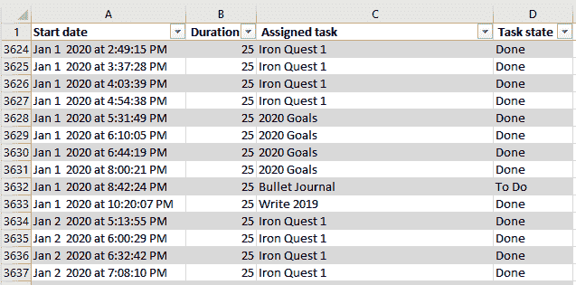

The data export from the app Be Focused Pro.

## **自省**

在你开始清理和转换这些数据之前，退一步问自己几个问题。

*   关于这些数据，我最想了解什么？
*   我想知道完成一个学习目标需要多长时间吗？
*   我对完成我的目标的各个阶段所需的时间长度感兴趣吗？
*   我是否更有兴趣看到我的各种目标的进展？
*   我想建立更多的动力吗？我应该关注我已经取得的成就和我正在努力实现的目标吗？
*   我想关注什么样的时间框架，需要多大的粒度？几分钟、几个月还是几天？
*   我想看看一天中我做番茄运动最多的时间吗？这些知识能帮助我组织我的时间表吗，这样我就能在工作时间集中精力？

Before you begin to clean up and transform this data, take a step back and ask questions.

对您问题的回答将指导数据转换和清理。这些问题有助于确定您当前数据结构中的差距。我想探索以下内容:

*   疫情对我的学习有什么影响？
*   哪一天或哪几个小时我的工作效率最高？
*   哪些一般性的活动消耗了我大部分的学习时间？
*   我如何在 Pluralsight、Data Camp 和其他学习平台上跟踪我的各种课程的进度？

## **数据转换**

### **数据清理**

完成练习后，我花时间清理 csv 中的数据。我专注于时间戳，并创建了新的数据列，包括:

*   月
*   一天
*   年
*   分钟

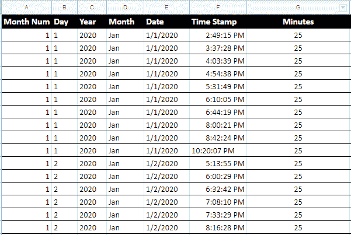

Date Cleanup

### **新创建的数据**

我创建了新的数据列，作为我学习活动的类别。我想收集诸如“类型”之类的信息，以区分各种“分配的任务”

我还创建了一个“学习平台”专栏来区分课程网站。我想要这些课程的粒度。“学习技能”列的创建指定了技能。“课程名称”指的是课程的名称或项目的名称。

新的类别包括:

*   类型
*   学习平台
*   学习技能
*   课程名称

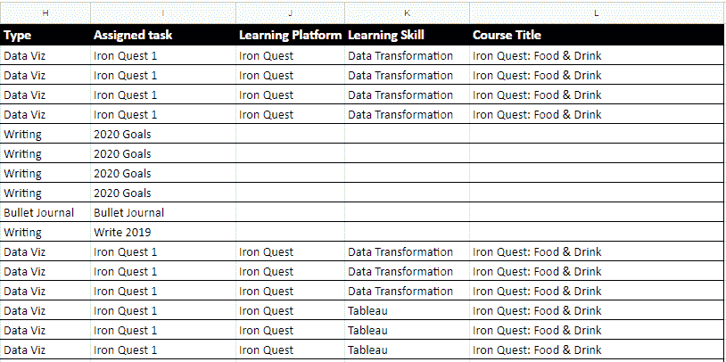

New columns created included: type, assigned task, learning platform, learning skill, and course title

### **用于华夫格图可视化的数据**

最后一个数据是可选的，我用它在 Tableau 中创建了我想要的可视化组件。

Tableau 社区分享技巧和工具，我从 Andy Kriebel 的网站下载了华夫饼图表电子表格。我确实在 Andy 的工作表中添加了一列，这样我的数据集就可以适当地转换。

“分钟”栏有助于可视化进度百分比。最后一部分是一个电子表格，它有几个数据字段，包括:

*   排
*   圆柱
*   进步
*   分钟

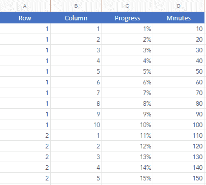

"Waffle Chart" spreadsheet that creates the visualization in Tableau

### **数据导入**

一旦各个部分被转换，您就可以导入数据了。我创建了两个谷歌电子表格，这样我就可以随着时间的推移继续添加数据，并在 Tableau 上轻松刷新。

谷歌电子表格包括:

*   2020 Pomodoro:来自初始 csv 以及创建的列的数据:

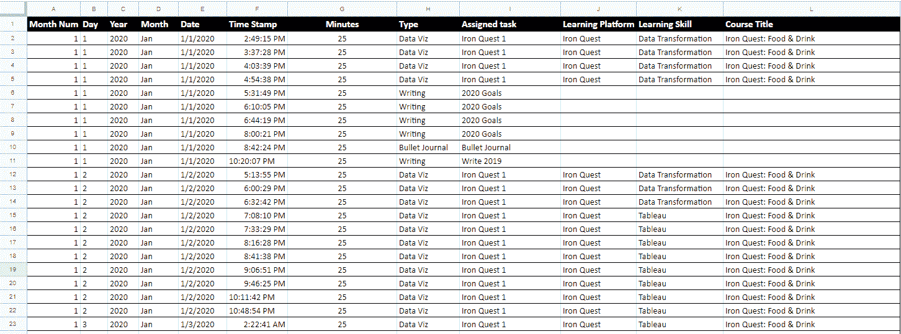

2020 Pomodoro - Google Spreadsheet

*   2020 聚焦模式华夫饼图表:在 Tableau 中创建华夫饼图表的特定数据:

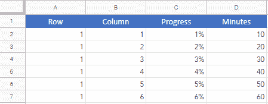

2020 Focused Mode Waffle Chart - Google Spreadsheet

## **可视化**

后退一步，重新审视你在自省练习中提出的问题。对您问题的回答有助于数据转换和清理。

这些问题也将有助于指导您的数据探索。我的问题的主题包括:

1.  随着时间的推移，我的学习有什么变化？
2.  我在什么时候效率最高，学习最多？
3.  我的课程和项目进展如何？

当我开始探索数据可视化时，我关注这三个主题:

*   跨月模式

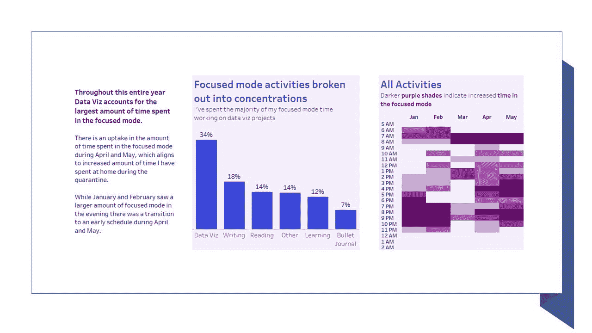

Visualization breaking down the pattern across months

*   跨天/小时的模式

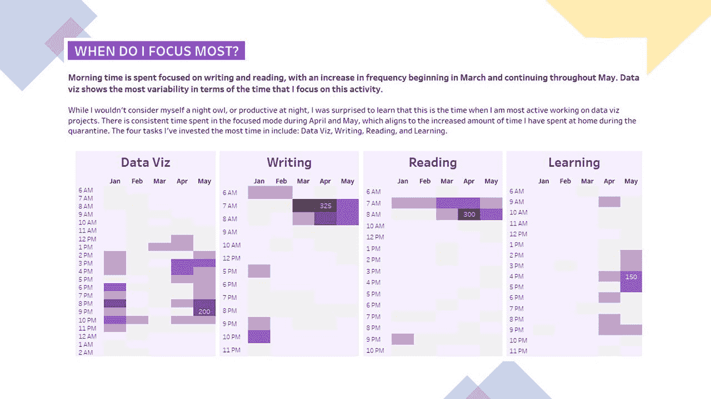

*   学习进度

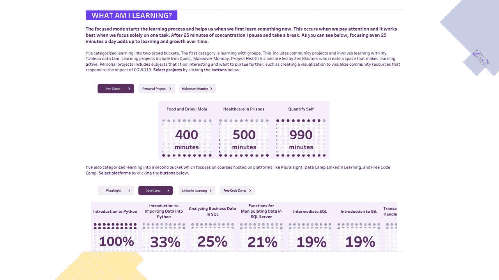

尝试几种图表和图形类型，直到找到最适合您目的的形式。最后一步是将所有的部分整合成一个有凝聚力的结构。

我在 Tableau 中创建了一个仪表板。首先，我大致了解了番茄的活动类型。接下来，我查看了它是如何随着时间的推移而变化的，并检查了这些天/小时的模式。

底部着重于进度。我需要一种简单的方法来浏览我正在学习的各种课程/项目的状态。[你可以在这里](https://public.tableau.com/profile/ingrid.arreola#!/vizhome/QuantifySelfFocusedMode/FocusedMode)探索 Tableau Public 上的仪表盘。

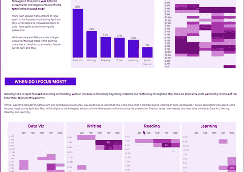

## 只要完成它

每天 25 分钟的学习时间会带来积极的变化和成长。番茄工作法的有效性有助于积累知识、经验和新技能。

每次你集中注意力做番茄运动时，你都在学习并开始建立强大的习惯。

接下来，监控你的成长并了解其模式，这样你会成为一个更好的学习者。你将关注什么，学习将把你引向何方？你会学到什么？你会建造什么？

最后，分享你的工作，以及任何经验教训。

> *“养成习惯。找出你在什么时候和什么地方进行有意识的练习最舒服。一旦你做出了选择，就要每天在那里进行有意识的练习。为什么？因为在做困难的事情时，常规是天赐之物。大量的研究表明，如果你养成了每天在同一时间同一地点练习的习惯，你几乎不用考虑如何开始。你就是这样。”——安吉拉·杜克沃斯*

如果您有兴趣开始，这些资源可以帮助您:

*   Ingrid 的 2020 Pomodoro Google 工作表:这是我在这个项目中使用的电子表格的框架。
*   Be Focused Pro App: [这是我日常使用的应用的链接](https://apps.apple.com/us/app/be-focused-pro-focus-timer/id953426154)。本文中的说明适用于这个特定的应用程序。还有很多应用程序。
*   巴拉布拉·奥克利、阿利斯泰尔·麦康维尔和特伦斯·塞诺夫斯基的《学会学习》 是一本教你学习背后的科学的好书。 [Coursera 课程【学会如何学习】](https://www.coursera.org/learn/learning-how-to-learn/)免费提供。