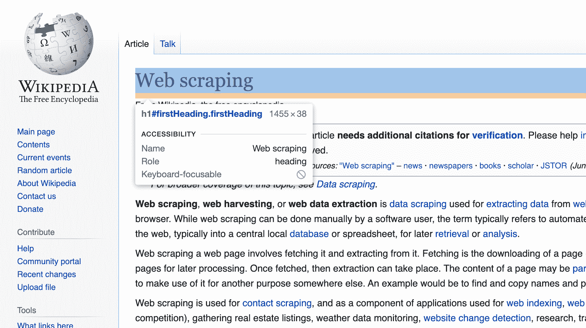

# 如何用 Python 刮维基百科文章

> 原文：<https://www.freecodecamp.org/news/scraping-wikipedia-articles-with-python/>

在这篇文章中，我将用 Python 创建一个 web scraper 来抓取维基百科页面。

抓取器将转到维基百科页面，抓取标题，然后随机链接到下一个维基百科页面。

我想看看这个垃圾会随机访问哪些维基百科页面会很有趣！

## 设置刮刀

首先，我将创建一个名为`scraper.py`的新 python 文件:

```
touch scraper.py
```

为了发出 HTTP 请求，我将使用`requests`库。您可以使用以下命令安装它:

```
pip install requests
```

让我们以网络搜集 wiki 页面为起点:

```
import requests

response = requests.get(
	url="https://en.wikipedia.org/wiki/Web_scraping",
)
print(response.status_code) 
```

运行刮刀时，应显示 200 状态代码:

```
python3 scraper.py
200
```

好的，目前为止一切顺利！？

## 从页面中提取数据

让我们从 HTML 页面中提取标题。为了让我的生活更轻松，我将使用 BeautifulSoup 包来实现这一点。

```
pip install beautifulsoup4
```

当检查维基百科页面时，我看到 title 标签有`#firstHeading` ID。



美汤让你通过 ID 标签找到一个元素。

```
title = soup.find(id="firstHeading")
```

将所有这些放在一起，程序现在看起来像这样:

```
import requests
from bs4 import BeautifulSoup

response = requests.get(
	url="https://en.wikipedia.org/wiki/Web_scraping",
)
soup = BeautifulSoup(response.content, 'html.parser')

title = soup.find(id="firstHeading")
print(title.string) 
```

运行时，它显示维基文章的标题:？

```
python3 scraper.py
Web scraping
```

## 抓取其他链接

现在我要深入维基百科。我将随机抓取另一篇维基百科文章的标签，并抓取该页面。

为此，我将使用 beautiful soup 来查找维基文章中的所有标签。然后我打乱列表使其随机。

```
import requests
from bs4 import BeautifulSoup
import random

response = requests.get(
	url="https://en.wikipedia.org/wiki/Web_scraping",
)
soup = BeautifulSoup(response.content, 'html.parser')

title = soup.find(id="firstHeading")
print(title.content)

# Get all the links
allLinks = soup.find(id="bodyContent").find_all("a")
random.shuffle(allLinks)
linkToScrape = 0

for link in allLinks:
	# We are only interested in other wiki articles
	if link['href'].find("/wiki/") == -1: 
		continue

	# Use this link to scrape
	linkToScrape = link
	break

print(linkToScrape)
```

如您所见，我使用`soup.find(id="bodyContent").find_all("a")`来查找主文章中的所有`<a>`标签。

因为我只对指向其他维基百科文章的链接感兴趣，所以我确保该链接包含`/wiki`前缀。

现在运行这个程序时，它显示了另一篇维基百科文章的链接，很好！

```
python3 scraper.py
<a href="/wiki/Link_farm" title="Link farm">Link farm</a>
```

## 创造一个循环的刮刀

好的，让刮刀刮新的链接。

为了做到这一点，我将把所有东西都移到一个`scrapeWikiArticle`函数中。

```
import requests
from bs4 import BeautifulSoup
import random

def scrapeWikiArticle(url):
	response = requests.get(
		url=url,
	)

	soup = BeautifulSoup(response.content, 'html.parser')

	title = soup.find(id="firstHeading")
	print(title.text)

	allLinks = soup.find(id="bodyContent").find_all("a")
	random.shuffle(allLinks)
	linkToScrape = 0

	for link in allLinks:
		# We are only interested in other wiki articles
		if link['href'].find("/wiki/") == -1: 
			continue

		# Use this link to scrape
		linkToScrape = link
		break

	scrapeWikiArticle("https://en.wikipedia.org" + linkToScrape['href'])

scrapeWikiArticle("https://en.wikipedia.org/wiki/Web_scraping")
```

`scrapeWikiArticle`函数将获取 wiki 文章，提取标题，并找到一个随机链接。

然后，它将使用这个新链接再次调用`scrapeWikiArticle`。因此，它创造了一个无休止的循环，一个在维基百科上跳来跳去的刮刀。

让我们运行这个程序，看看我们得到了什么:

```
pythron3 scraper.py
Web scraping
Digital object identifier
ISO 8178
STEP-NC
ISO/IEC 2022
EBCDIC 277
Code page 867
Code page 1021
EBCDIC 423
Code page 950
G
R
Mole (unit)
Gram
Remmius Palaemon
Encyclopædia Britannica Eleventh Edition
Geography
Gender studies
Feminism in Brazil
```

太棒了，在大约 10 个步骤中，我们从“网络搜集”变成了“巴西的女权主义”。太神奇了！

## 结论

我们用 Python 构建了一个抓取任意维基百科页面的网络抓取器。它通过随机链接在维基百科上无休止地跳来跳去。

这是一个有趣的噱头，维基百科在网络抓取方面相当宽容。

也有更难刮的网站，如亚马逊或谷歌。如果你想刮这样的网站，你要设置一个系统，用[无头 Chrome 浏览器](https://github.com/puppeteer/puppeteer)和代理服务器。或者你可以使用一个服务来为你处理所有的事情[，就像这个](https://scraperbox.com)。

但是注意不要滥用网站，只刮你被允许刮的数据。

编码快乐！