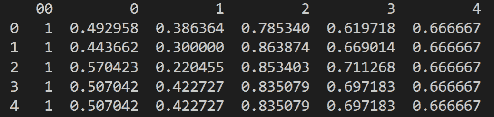

# 面向开发者的机器学习基础

> 原文：<https://www.freecodecamp.org/news/machine-learning-basics-for-developers/>

在当前的技术环境下，开发人员需要具备多种不同的技能。他们中的许多人确实如此。

也有很多不同的职业道路可供开发人员使用，他们可以稍微改变一下现有的技能。

数据库管理员、开发者拥护者和机器学习工程师与所有开发者都有一个共同点:他们都知道如何编码。使用哪种语言并不重要，他们都理解编写好代码背后的核心概念。

这是许多软件开发人员考虑成为机器学习工程师的原因之一。有了所有可用的工具和软件包，您不需要有很深的数学背景就能得到准确的结果。

如果你愿意学习如何使用一些库，并对底层数学有高层次的理解，你就可以成为一名机器学习工程师。

在本文中，我将带您了解机器学习中的一些主要概念，作为一名软件开发人员，您需要理解这些概念。

我们将以一个完整的机器学习项目的例子来结束，从获取数据到用模型预测值。到最后，你应该有足够的知识从零开始完成一个属于自己的小型机器学习项目。

## 什么是机器学习？

有很多不同的定义。但是机器学习基本上涉及使用数学在大量数据中寻找模式，以根据新数据进行预测。

一旦它找到了这些模式，你就可以说你有了一个机器学习模型。

在此基础上，您可以使用该模型对该模型从未见过的新数据进行预测。

目标是让计算机使用提供给它们的算法，根据经验自动改进。

算法只是一个数学方程或一组方程，它根据您的输入数据给出一个结果。机器学习使用算法来找到我们正在寻找的那些模式。

随着算法接触到越来越多的数据，它们开始做出更准确的预测。最终，由算法建立的模型将能够计算出正确的结果，而无需显式编程来这样做。

这意味着计算机应该能够在没有任何人类帮助的情况下接收数据并做出决定(预测)。

## 机器学习 vs .数据科学 vs .人工智能

许多人交替使用机器学习、数据科学和人工智能这三个术语。但它们不是一回事。

**机器学习**是数据科学中的*用于预测和发现数据中的模式。*

**数据科学**更侧重于统计和算法以及对结果的解释。机器学习更侧重于软件和事物的自动化。

**人工智能**指的是计算机理解数据并从中学习的能力，同时根据人类几乎不可能理解的隐藏模式做出决策。

机器学习就像人工智能的一个分支。我们将使用机器学习来*实现*人工智能。

人工智能是一个广泛的话题，它涵盖了计算机视觉、人机交互和自主性等内容，机器学习将在这些应用中使用。

## 不同类型的机器学习

你会听到和读到三种类型的机器学习:监督学习、半监督学习和非监督学习。

### 监督学习

大多数机器学习问题都属于这一类。当你有输入和输出变量时，你试图在它们之间建立映射。

它被称为监督学习，因为我们可以使用数据来教会模型正确的答案。

该算法将根据数据进行预测，并慢慢进行修正，直到这些预测与预期的输出相匹配。

监督学习涵盖的大多数问题都可以通过分类或回归来解决。只要你已经标记了数据，你就在使用有监督的机器学习。

### 半监督学习

由于我们的数据集，大多数现实世界的问题都属于这个领域。

在许多情况下，你会有一个大的数据集，其中一些数据是有标签的，但大部分都没有。有时，让专家检查并标记所有这些数据的成本太高，所以您使用监督和非监督学习的混合。

一种策略是使用已标记的数据来猜测未标记的数据，然后使用这些预测作为它们的标签。然后你可以在某种监督学习模型中使用所有的数据。

因为在这些数据集上进行无监督学习也是可能的，考虑一下这是否是一种更有效的方法。

### 无监督学习

当你只有输入数据而没有相关的输出数据，并且你希望一个模型做出你正在寻找的模式时，这就是你进入无监督学习的时候。

你的算法会根据你给它的参数，做出对它有意义的东西。

当你有很多看似随机的数据，并且想看看其中是否有什么有趣的模式时，这是很有用的。这些问题对于聚类算法来说通常很棒，会给你一些意想不到的结果。

## 开发人员对机器学习的实际使用

### 分类

当你想为某个输入数据预测一个标签时，这是一个分类问题。

机器学习通过建立一个模型来处理分类，该模型采用已经被标记的数据，并使用它来对新数据进行预测。基本上你给它一个新的输入，它给你一个它认为正确的标签。

预测客户流失、面部分类和医疗诊断测试都使用不同种类的分类。

虽然所有这些都属于不同的分类领域，但它们都根据模型用于训练的数据来赋值。所有的预测值都是精确的。因此，您将预测像名称或布尔值这样的值。

### 回归

回归很有趣，因为它跨越了机器学习和统计学。它类似于分类，因为它用于预测值，只不过它预测的是连续值而不是离散值。

因此，如果你想根据多年的经验和已知的语言来预测工资范围，或者你想根据位置和面积来预测房价，你就要处理回归问题。

有不同的回归技术来处理各种数据集，甚至是非线性数据。

还有[支持向量回归](https://www.freecodecamp.org/news/svm-machine-learning-tutorial-what-is-the-support-vector-machine-algorithm-explained-with-code-examples/)，简单线性回归，多项式回归等等。有足够多的回归技术适合你的任何数据集。

### 使聚集

这变成了一种不同类型的机器学习。聚类处理无监督的学习任务。就像分类一样，但是没有一个数据是有标签的。找到并标记数据点取决于算法。

当你有一个巨大的数据集，而你不知道它们之间的任何模式，或者你正在寻找不寻常的联系时，这是非常好的。

当您希望在数据中找到异常和异常值，而不需要花费数百个小时手动标记数据点时，聚类很有帮助。

在这种情况下，通常没有最佳的算法，找到适合您的数据的最佳方法是通过测试不同的算法。

一些聚类算法包括:K-Means、DBSCAN、凝聚聚类和相似性传播。一些试错会帮助你快速找到什么算法对你最有效。

### 深度学习

这是一个机器学习领域，使用受大脑工作方式启发的算法。它涉及使用大型未分类数据集的神经网络。

通常，性能会随着输入深度学习算法的数据量的增加而提高。这些类型的问题处理未标记的数据，这些数据覆盖了大部分可用的数据。

有很多算法可以和这种技术一起使用，比如卷积神经网络，长短期记忆网络，或者深度 Q 网络。

其中每一种都被用于计算机视觉、自动驾驶汽车或分析脑电图信号等项目。

## 您可能使用的工具

有很多工具可以用来解决你遇到的任何机器学习问题。

这里有一个简短的列表，列出了许多机器学习应用程序中常见的一些包。

[**熊猫**](https://pandas.pydata.org/) :这是 Python 中一个通用的数据分析工具。当您需要处理原始数据时，它会有所帮助。它处理文本数据、表格数据、时间序列数据等等。

在许多情况下，该包用于在训练机器学习模型之前格式化数据。

[**Tensorflow**](https://www.tensorflow.org/) :你可以用这个库构建任意数量的机器学习应用。你可以在 GPU 上运行它，用它来解决物联网问题，它对于深度学习来说非常棒。

这是一个可以处理任何事情的库，但是需要一些时间来适应它。

[**SciKit**](https://scikit-learn.org/stable/) :这类似于 TensorFlow 在机器学习应用领域的用途。一个很大的不同是这个软件包的简单性。

如果你熟悉 [NumPy](https://numpy.org/) 、 [matplotlib](https://matplotlib.org/) 和 [SciPy](https://www.scipy.org/) ，你就可以轻松上手。您可以创建模型来处理车辆传感器数据、物流数据、银行数据和其他上下文。

[**Keras**](https://keras.io/) :当你想从事一个深度学习项目，比如一个复杂的机器人项目时，这是一个可以提供帮助的特定库。

它建立在 TensorFlow 的基础上，使人们可以轻松地创建深度学习模型并将其交付给生产。Y

你会看到这在自然语言处理应用和计算机视觉应用中被大量使用。

自然语言处理是机器学习的一个巨大的领域，这个软件包专注于此。

这是你可以用来简化你的 NLP 项目的软件包之一。它仍在积极开发中，周围有一个很好的社区。

[**BERT**](https://github.com/google-research/bert) : BERT 是谷歌于 2018 年创建的开源库。这是 NLP 的一项新技术，它采用了与其他技术完全不同的方法来训练模型。B

ERT 是变压器双向编码器表示的首字母缩写。这意味着与大多数从左到右或从右到左分析句子的技术不同，BERT 使用 Transformer 编码器进行双向分析。它的目标是生成一个语言模型。

[**Brain.js**](https://brain.js.org/) :这是比较好的 JavaScript 机器学习库之一。您可以将您的模型转换为 JSON，或者直接在浏览器中作为一个函数使用，并且您仍然可以灵活地处理大多数常见的机器学习项目。

它入门非常快，并且有一些很棒的文档和教程。

## 全机器学习示例

为了让你对机器学习项目有个概念，这里有一个完整过程的例子。

### 获取数据

可以说，机器学习项目最难的部分是获取数据。有很多在线资源可以用来获取机器学习的数据集，这里列出了其中的一些。

*   [重症监护数据集](https://mimic.physionet.org/)
*   [人体身高和体重](http://wiki.stat.ucla.edu/socr/index.php/SOCR_Data_Dinov_020108_HeightsWeights)
*   [信用卡诈骗](https://www.kaggle.com/mlg-ulb/creditcardfraud)
*   [IMDB 评论](https://www.kaggle.com/lakshmi25npathi/imdb-dataset-of-50k-movie-reviews)
*   [推特航空情绪](https://www.kaggle.com/crowdflower/twitter-airline-sentiment)
*   [歌曲数据集](https://www.kaggle.com/c/msdchallenge#description)
*   [葡萄酒质量数据集](https://archive.ics.uci.edu/ml/datasets/wine+quality)
*   [波士顿住房数据集](https://www.cs.toronto.edu/~delve/data/boston/bostonDetail.html)
*   [MNIST 手写的数字](http://yann.lecun.com/exdb/mnist/)
*   [笑话评分](http://eigentaste.berkeley.edu/dataset/)
*   [亚马逊评论](https://snap.stanford.edu/data/web-Amazon.html)
*   [垃圾短信收集](http://www.dt.fee.unicamp.br/~tiago/smsspamcollection/)
*   [安然电子邮件](https://www.cs.cmu.edu/~enron/)
*   [推荐系统数据集](https://cseweb.ucsd.edu/~jmcauley/datasets.html)
*   [COVID 数据集](https://www.semanticscholar.org/cord19)

在这个例子中，我们将使用[白葡萄酒质量数据集](https://archive.ics.uci.edu/ml/machine-learning-databases/wine-quality/)，并尝试预测葡萄酒密度。

大多数情况下，数据在到达你的时候不会这么干净，你必须处理它，使它成为你想要的格式。

但是即使有这样的数据，我们仍然需要做一些清理工作。

### 选择功能

我们将挑选一些特征来预测葡萄酒的密度。我们将使用的特性有:*质量*、 *pH* 、*酒精*、*固定酸度*和*总二氧化硫*。

这可能是可用特性的任意组合，我是随意选择的。请随意使用任何其他功能来代替这些功能，或者随意使用所有功能！

### 选择算法

现在你已经知道了你要解决的问题和你要处理的数据，你可以开始研究算法了。

由于我们试图根据几个特征预测一个连续值，这很可能是一个回归问题。如果我们试图预测一个离散值，比如酒的类型，那么这可能是一个分类问题。

这就是为什么在你进入机器学习工具之前，你必须知道你的数据。

它可以帮助你缩小你可以为你的问题选择的算法的数量。多元回归算法是我们的起点。当您处理将影响最终结果的多个参数时，通常会使用这种方法。

多元回归算法类似于常规回归算法，只是可以有多个输入。背后的方程式是:

`y = theta_0 + sum(theta_n * X_n)`

我们将`theta_0`(偏置项)和`theta_n`项初始化为某个值，通常为 1 或 0，除非您有一些其他信息作为这些值的基础。

初始值设定后，我们试图优化它们以适应问题。我们通过求解梯度下降方程来实现:

```
theta_0 = theta_0 - alpha * (1 / m) * sum(y_n - y_i)

theta_n = theta_n - alpha * (1 / m) * sum(y_n - y_i) * X_n
```

其中`y_n`是基于算法计算的预测值，而`y_i`是我们从数据中得到的值或期望值。

我们希望预测值和真实值之间的误差尽可能小。这就是我们试图优化θ值的原因。这样我们就可以最小化预测输出值的成本函数。

下面是成本函数等式:

`J(theta_n) = (1 / 2m) * sum(y_n - y_i)^2`

这就是我们构建和训练模型所需的所有数学知识，所以让我们开始吧。

### 预处理数据

你要做的第一件事是检查并看看我们的数据是什么样的。我对葡萄酒质量数据集做了一些修改，以便它能与我们的算法一起工作。

可以在这里下载:[https://github . com/flipped coder/probable-waddle/blob/master/wine-quality-data . CSV](https://github.com/flippedcoder/probable-waddle/blob/master/wine-quality-data.csv)。

我所做的就是拿走原始文件，去掉不需要的特征，把密度移到最后，清理格式。

现在我们可以进入真正的预处理部分了！做一个名为 *multivariate-wine.py* 的新文件。该文件应与数据集位于同一文件夹中。

在这个文件中，我们要做的第一件事是导入一些包，看看数据集是什么样子的。

```
import pandas as pd
import numpy as np
import matplotlib.pyplot as plt

df = pd.read_csv('./wine-quality-data.csv', header=None)

print(df.head())
```

您应该在终端中看到类似这样的内容。


数据看起来很适合多元回归算法，因此我们可以开始构建模型。我鼓励你尝试从原始白葡萄酒数据集开始，看看你是否能找到一种方法将它转换成正确的格式。

### 构建模型

我们需要给数据添加一个偏差项，因为正如你在算法解释中看到的，我们需要它是因为它是`theta_0`项。

`df = pd.concat([pd.Series(1, index=df.index, name='00'), df], axis=1)`

既然数据已经准备好了，我们可以为算法定义自变量和因变量。

```
X = df.drop(columns=5)
y = df.iloc[:, 6]
```

现在让我们通过将每一列除以该列中的最大值来标准化数据。

您不必真的执行这一步，但这将有助于加快算法的训练时间。这也有助于防止一个功能比其他功能更重要。

```
for i in range(1, len(X.columns)):
	X[i-1] = X[i-1]/np.max(X[i-1])
```

我们来看看常态化以来的数据。

`print(X.head())`

您应该会在终端中看到类似这样的内容。



数据现在准备好了，我们可以初始化θ参数了。这就意味着我们要做一个数组，它的列数和输入变量一样， *X* 。

`theta = np.array([1]*len(X.columns))`

如果你在你的终端中打印它，它应该看起来像这样，尽管如果你不想打印它，你不需要打印它。

`[1 1 1 1 1 1]`

然后，我们将设置从数据中获取的训练点数。我们将保留 500 个数据点，这样我们可以在以后的测试中使用它们。这将是我们之前学过的梯度下降方程中的值。

`m = len(df) - 500`

现在我们开始编写在模型建立后训练模型所需的函数。我们将从假设函数开始，它只是输入变量乘以`theta_n`参数。

```
def hypothesis(theta, X):
	return theta * X
```

接下来，我们将定义成本模型，它将给出真实值和预测值之间的误差。

```
def calculateCost(X, y, theta):
    y1 = hypothesis(theta, X)
    y1 = np.sum(y1, axis=1)

    return (1 / 2 * m) * sum(np.sqrt((y1 - y) ** 2))
```

在我们的模型准备运行之前，我们需要的最后一个函数是计算梯度下降值的函数。

```
def gradientDescent(X, y, theta, alpha, i):
    J = [] # cost function for each iteration
    k = 0
    while k < i:
        y1 = hypothesis(theta, X)
        y1 = np.sum(y1, axis=1)
        for c in range(1, len(X.columns)):
            theta[c] = theta[c] - alpha * (1 / m) * (sum((y1 - y) * X.iloc[:, c]))
        j = calculateCost(X, y, theta)
        J.append(j)
        k += 1
    return J, j, theta
```

有了这三个函数和干净的数据，我们终于可以开始训练模型了。

### 训练模型

训练部分是有趣的部分，也是最容易的。如果你已经正确地设置了你的算法，那么你所要做的就是获取它给你的优化参数并进行预测。

我们将返回每次迭代的成本列表、最终成本以及梯度下降函数的优化θ值。因此，我们将获得优化的θ值，并使用它们进行测试。

`J, j, theta = gradientDescent(X, y, theta, 0.1, 10000)`

在正确设置函数和数据的所有工作之后，这一行代码训练了模型，并为我们提供了开始预测值和测试模型准确性所需的θ值。

### 测试模型

现在，我们可以通过使用数据进行预测来测试模型。

```
y_hat = hypothesis(theta, X)
y_hat = np.sum(y_hat, axis=1)
```

在你检查了一些值之后，你将知道你的模型是否足够精确，或者你是否需要在θ值上做更多的调整。

如果您对您的测试结果感到满意，您可以继续并开始在您的项目中使用这个模型。

### 使用模型

优化的θ值实际上是您开始使用该模型所需的全部内容。即使在生产中，您也将继续使用相同的方程，但是使用最佳的θ值来给出最准确的预测。

你甚至可以继续训练模型，尝试找到更好的θ值。

## 最后的想法

机器学习有很多层次，但没有一个是太复杂的。他们只是开始堆积，这使它看起来比实际更困难。

如果你愿意花一些时间阅读机器学习库和工具，这真的很容易上手。你不需要知道任何高等数学和统计学来学习概念，甚至解决现实世界的问题。

这些工具比以前更先进，所以你可以成为一名机器学习工程师，而无需理解它背后的大部分数学知识。

你需要了解的主要事情是如何处理你的数据。那是没人喜欢谈论的部分。这些算法有趣且令人兴奋，但有时您甚至需要在开始处理之前编写 SQL 过程来获取所需的原始数据。

机器学习有很多应用，从视频游戏到医学，再到制造自动化。

如果你对机器学习感兴趣，就花些时间做一个小模型。当你开始变得更舒服时，加入这个模型并继续学习更多。