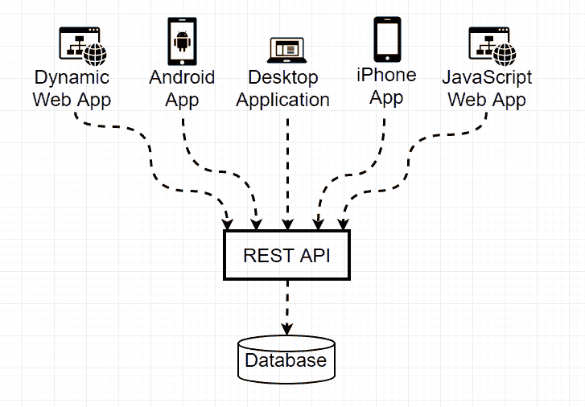
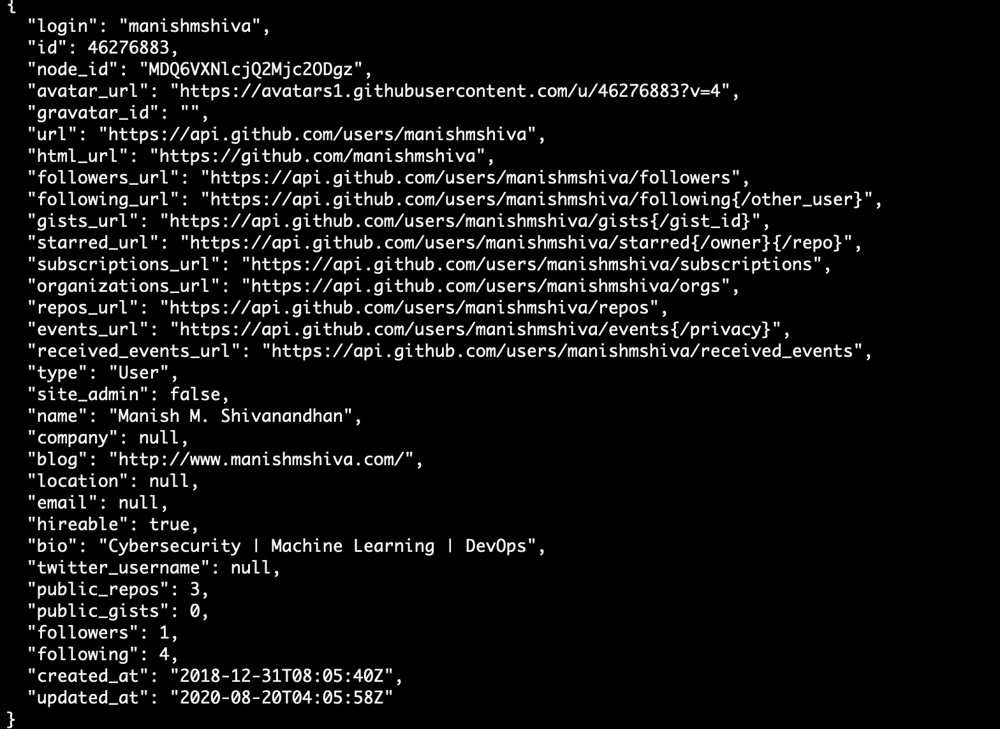
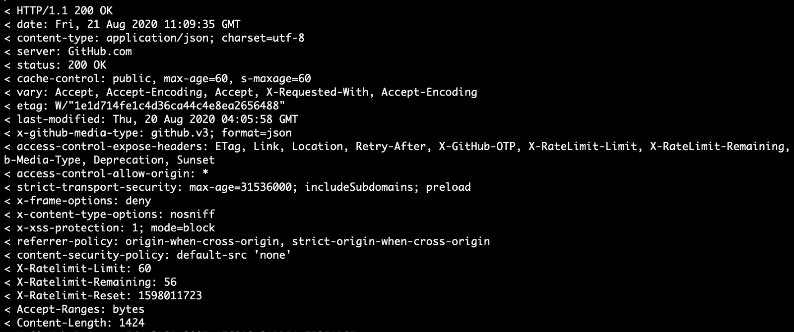
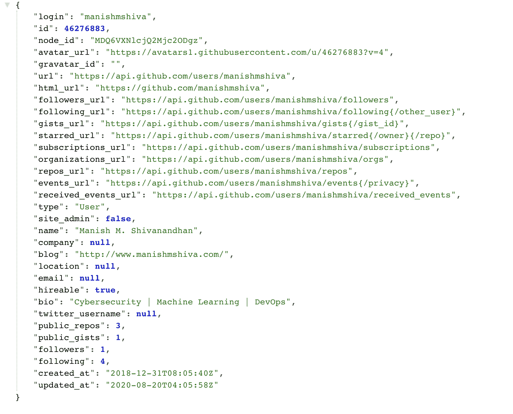
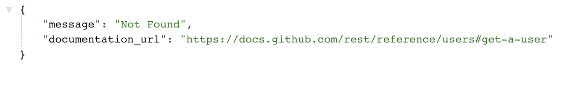
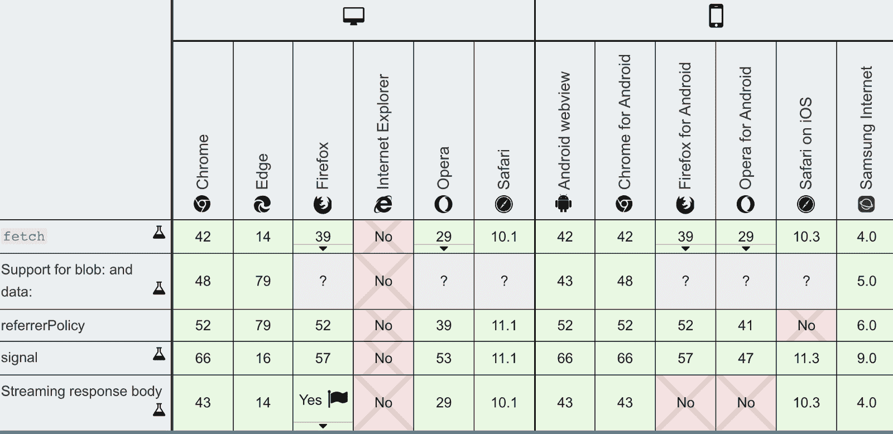

# 带有 JS Fetch Post 和 Header 示例的 JavaScript Fetch API 教程

> 原文：<https://www.freecodecamp.org/news/javascript-fetch-api-tutorial-with-js-fetch-post-and-header-examples/>

如果您正在编写一个 web 应用程序，那么您很可能必须使用外部数据。这可以是您自己的数据库、第三方 API 等等。

当 AJAX 在 1999 年首次出现时，它向我们展示了构建 web 应用程序的更好方法。AJAX 是 web 开发中的一个里程碑，也是 React 等许多现代技术背后的核心概念。

在 AJAX 出现之前，即使是微小的更新，也必须重新呈现整个网页。但是 AJAX 给了我们一种从后端获取内容并更新所选用户界面元素的方法。这有助于开发人员改善用户体验，构建更大、更复杂的网络平台。

## REST APIs 速成班



我们现在处于 RESTful APIs 的时代。简单地说，REST API 允许您从数据存储中推送和提取数据。这可能是你的数据库，也可能是像 [Twitter API](https://developer.twitter.com/en/docs/twitter-api) 这样的第三方服务器。

有几种不同类型的 REST APIs。让我们看看你在大多数情况下会用到的。

*   **获取** —从 API 获取数据。例如，根据用户名获取一个 twitter 用户。
*   **POST** —将数据推送到 API。例如，创建一个包含姓名、年龄和电子邮件地址的新用户记录。
*   **PUT** —用新数据更新现有记录。例如，更新用户的电子邮件地址。
*   **删除** —删除一条记录。例如，从数据库中删除一个用户。

每个 REST API 中都有三个元素。请求、响应和标头。

**Request** —这是您发送给 API 的数据，类似于获取订单细节的订单 id。


Sample Request

**响应** —请求成功/失败后从服务器获取的任何数据。



Sample Response

**Headers** —传递给 API 的附加元数据，帮助服务器理解它正在处理的请求类型，例如“内容类型”。



Sample Headers

使用 REST API 的真正优势在于，您可以为多个应用程序构建一个单独的 API 层。

如果您有一个想要使用 web、移动和桌面应用程序来管理的数据库，那么您所需要的只是一个 REST API 层。

既然您已经知道了 REST APIs 是如何工作的，那么让我们看看如何使用它们。

## XMLHttpRequest

在 JSON 接管世界之前，数据交换的主要格式是 XML。XMLHttpRequest()是一个 JavaScript 函数，它使得从返回 XML 数据的 API 获取数据成为可能。

XMLHttpRequest 为我们提供了从后端获取 XML 数据的选项，无需重新加载整个页面。

这个函数从最初只是 XML 的时候就开始发展了。现在它支持其他数据格式，比如 JSON 和明文。

让我们编写一个简单的 XMLHttpRequest 调用 GitHub API 来获取我的配置文件。

```
// function to handle success
function success() {
    var data = JSON.parse(this.responseText); //parse the string to JSON
    console.log(data);
}

// function to handle error
function error(err) {
    console.log('Request Failed', err); //error details will be in the "err" object
}

var xhr = new XMLHttpRequest(); //invoke a new instance of the XMLHttpRequest
xhr.onload = success; // call success function if request is successful
xhr.onerror = error;  // call error function if request failed
xhr.open('GET', 'https://api.github.com/users/manishmshiva'); // open a GET request
xhr.send(); // send the request to the server.
```

上面的代码将向[https://api.github.com/users/manishmshiva](https://api.github.com/users/manishmshiva)发送一个 GET 请求，以获取我在 JSON 中的 GitHub 信息。如果响应成功，它会将以下 JSON 打印到控制台:



如果请求失败，它会将此错误消息打印到控制台:



## 获取 API

Fetch API 是 XMLHttpRequest 的一个更简单、易于使用的版本，用于异步使用资源。Fetch 允许您使用 REST APIs，并提供额外的选项，如缓存数据、读取流响应等等。

主要区别在于 Fetch 处理承诺，而不是回调。在引入承诺之后，JavaScript 开发人员已经远离了回调。

对于一个复杂的应用程序，你可能很容易养成写回调导致[回调地狱](http://callbackhell.com/)的习惯。

有了承诺，编写和处理异步请求就容易了。如果你是承诺的新手，[你可以在这里学习它们是如何运作的](https://javascript.info/promise-basics)。

如果使用 fetch()而不是 XMLHttpRequest，我们之前编写的函数看起来会是这样:

```
// GET Request.
fetch('https://api.github.com/users/manishmshiva')
    // Handle success
    .then(response => response.json())  // convert to json
    .then(json => console.log(json))    //print data to console
    .catch(err => console.log('Request Failed', err)); // Catch errors
```

Fetch 函数的第一个参数应该总是 URL。然后 Fetch 接受第二个 JSON 对象，带有方法、头、请求体等选项。

XMLHttpRequest 和 Fetch 中的响应对象有一个重要的区别。

XMLHttpRequest 将数据作为响应返回，而 Fetch 中的响应对象包含关于响应对象本身的信息。这包括标题、状态代码等。我们调用“res.json()”函数从响应对象中获取我们需要的数据。

另一个重要的区别是，如果请求返回 400 或 500 状态代码，Fetch API 不会抛出错误。它仍将被标记为成功响应，并被传递给“then”函数。

只有当请求本身被中断时，Fetch 才会抛出错误。要处理 400 和 500 个响应，可以使用“response.status”编写自定义逻辑。“status”属性将为您提供返回响应的状态代码。

太好了。既然您已经理解了 Fetch API 是如何工作的，那么让我们再看几个例子，比如传递数据和使用头。

## 使用标题

您可以使用“headers”属性传递标头。您还可以使用 [headers 构造函数](https://developer.mozilla.org/en-US/docs/Web/API/Headers)来更好地构建您的代码。但是在大多数情况下，将 JSON 对象传递给“headers”属性应该是可行的。

```
fetch('https://api.github.com/users/manishmshiva', {
  method: "GET",
  headers: {"Content-type": "application/json;charset=UTF-8"}
})
.then(response => response.json()) 
.then(json => console.log(json)); 
.catch(err => console.log(err));
```

## 将数据传递给 POST 请求

对于 POST 请求，可以使用“body”属性传递一个 JSON 字符串作为输入。请注意，请求体应该是 JSON 字符串，而头应该是 JSON 对象。

```
// data to be sent to the POST request
let _data = {
  title: "foo",
  body: "bar", 
  userId:1
}

fetch('https://jsonplaceholder.typicode.com/posts', {
  method: "POST",
  body: JSON.stringify(_data),
  headers: {"Content-type": "application/json; charset=UTF-8"}
})
.then(response => response.json()) 
.then(json => console.log(json));
.catch(err => console.log(err));
```

Fetch API 仍在积极开发中。在不久的将来，我们可以期待更好的特性。

然而，大多数浏览器都支持在应用程序中使用 Fetch。下面的图表应该可以帮助你弄清楚哪些浏览器在网络和移动应用上支持它。



我希望这篇文章能帮助您理解如何使用 Fetch API。请务必为您的下一个 web 应用程序尝试 Fetch。

* * *

我经常写关于机器学习、网络安全和 DevOps 的文章。你可以在这里注册我的 [*周报*](https://www.manishmshiva.com/) *。*