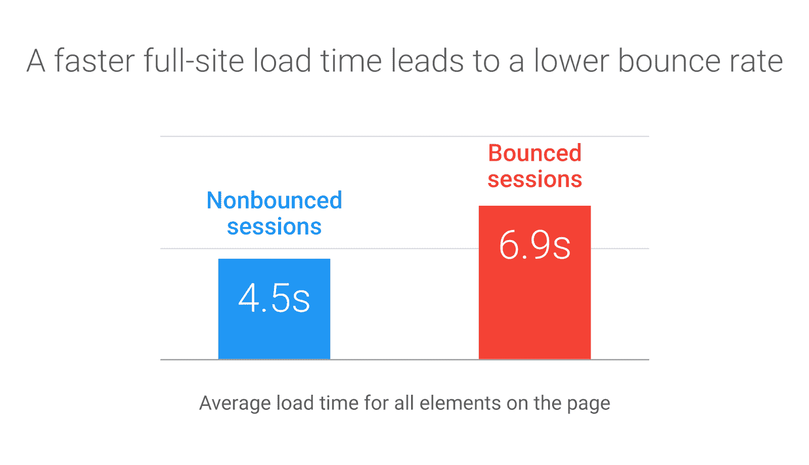
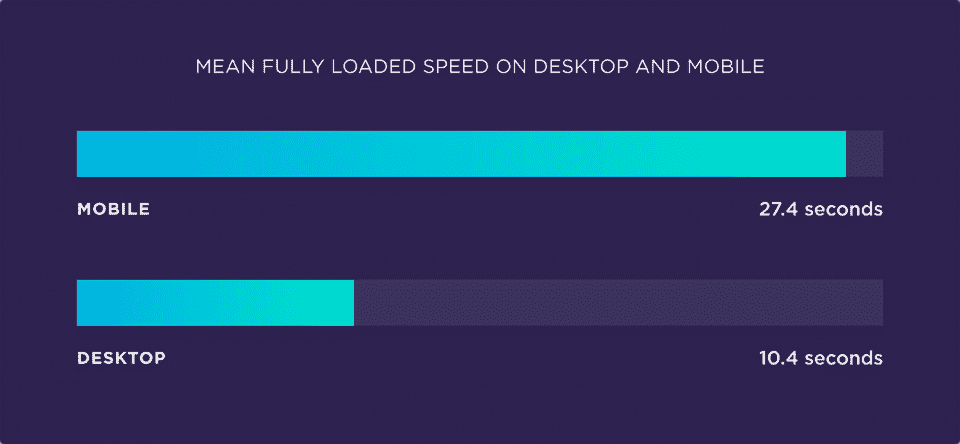
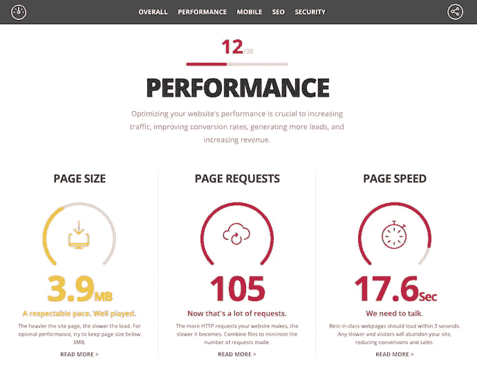
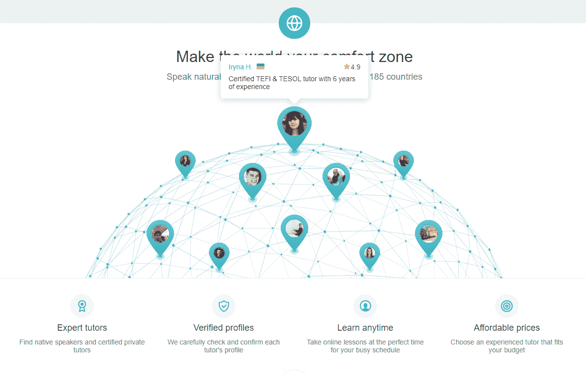

# 为什么网站速度对搜索引擎优化至关重要-以及如何加快你的网站

> 原文：<https://www.freecodecamp.org/news/why-site-speed-is-critical-for-seo-and-how-to-speed-up-your-site/>

没有人喜欢等待网站加载。我不知道。你不知道。而搜索引擎真的没有。

虽然 UX、关键词密度和网站结构(以及其他因素)主导着 SEO 和排名相关的对话，但网站速度应该扮演更重要的角色。

我一直在努力建立自己的网站，并在这个过程中学习了关于网站速度的宝贵经验。

我想把这些经验传授给你。

## 谷歌做了一个网站速度特定的算法更新

大家都知道站点速度在 SEO talk 中有一席之地。

但是，你知道吗，2018 年谷歌发布了一个针对网站速度的算法变化？这项名为“速度更新”的改变使得移动网站的速度在搜索和广告中扮演了更重要的角色。

更新也是必要的。在其发布时，谷歌的研究表明，如果网站加载时间从 1 秒增加到 3 秒，反弹的几率会增加 32%。

跳出率的机会也增加到 90%,如果上升到 5 秒，10 秒或以上 123%。

这一变化无疑对在线用户体验产生了积极的影响。在更新发布后的几个月内，以用户为中心的性能指标提高了 15%到 20%，购物车放弃率下降了 20%。

那么，这一切意味着什么呢？

本质上:那些优化良好的页面在搜索引擎中的排名会更高。

进行关键词差距分析，Loganix 将这一过程定义为“识别有价值的关键词，这些关键词你的竞争对手排名很好，但你没有。”

当你发现你的竞争对手没有排名的有价值的关键词时，集中精力优化这些页面的速度，以进一步扩大差距。

## 网站速度影响购买意愿

网站速度的重要性不仅仅在于排名。谷歌对移动网站速度对消费者消费意愿的影响进行了彻底的评估。

他们名为**毫秒造就百万**的报告显示，即使加载时间发生 0.1 秒的变化，也会对购买者产生巨大的连锁反应。

例如，零售网站的加载时间减少 0.1%会导致在线消费增加 9.2%。

对于奢侈品牌来说，类似的性能提升导致网站浏览量和购物车中的商品增加了 40%。

类似的研究也发现了消费者活动和网站加载时间之间的相同关系。谷歌曾表示，对于一个电子商务网站来说，两秒钟是最理想的网站加载时间。

## 更好的网站速度是一个(隐藏的)竞争优势

因此，我们已经确定谷歌喜欢快速加载的网站，用户也是如此。然而，大多数网站管理员并没有真正关注。

你应该。

一项对 520 万个移动和桌面网站页面的调查发现，大多数网站的加载时间严重不足。

[Image Source](https://backlinko.com/page-speed-stats)

例如，在这项研究中，桌面网页的平均加载时间为 10.3 秒，而移动网页的平均加载时间为 27.3 秒。

在手机上加载网页的平均时间也比桌面长 87.4%。

对于正在阅读这篇文章的人来说，这是一个巨大的机会。你可以简单地通过提高你的网站速度来轻松超越你的竞争对手。

这样做不仅会增加你的 SERP 的存在，但它可以降低你的跳出率，同时增加流量。

减少你的站点加载时间也不是很难。这里有三种方法可以做到这一点。

## 优化您网站的文件大小

网站由各种 HTML、JavaScript 和 CSS 文件组成，这些文件决定了网站的外观和功能。这些文件还会占用大量空间，尤其是在编码效率低下的情况下。

[Image Source](https://blog.hubspot.com/marketing/reduce-http-requests)

第一步是减少你的网站文件引起的请求数量。

每个页面上的元素都会生成一个 HTTP 请求。你的网站拥有的元素越多，产生的请求就越多。唉，这导致网站加载速度变慢。

你可以使用谷歌浏览器的**网络面板**来查找一个页面产生的 HTTP 请求的数量。记下不必要的要求，并把它们拿出来。

一种更简单的方法是简单地组合相似的 HTML、JavaScript 和 CSS 文件。因此，不要有多个 HTML 文件，而是将所有代码复制到一个文件中。

对 JavaScript 和 CSS 重复以上步骤。较少的文件将产生较少的 HTTP 请求，从而减少您的网站加载时间。

缩小你的网站代码也会有很大的帮助。在你的网站文件中寻找可删除的代码、换行符和空白。虽然可以手动缩小，但也有工具可用:

*   Terser 是一个非常流行的 JavaScript 压缩工具。
*   HTMLMinifier 是处理 HTML 文件的理想工具。
*   CSSNano 可以用来压缩 CSS 文件。

如果你的网站有交互元素，这些通常会减慢速度。

什么叫做互动？这里有一个来自 Preply 的很好的例子:

每次你点击世界地图，它就会获取更多的信息。

如果没有正确地优化和缓存，这可能会大大降低加载速度。

与开发人员合作，确保您的代码最小化且高效。

## 优化你的网站图片

虽然图像对于良好的在线体验是必不可少的，但它们会很快消耗你的网站加载时间。对于使用大量图片的电子商务网站来说尤其如此，比如图中的睡眠迷。

[Image Source](https://www.sleepjunkie.org/sleep-health/)

尽管如今大多数网页都高达 2 MB，但谷歌建议保持在 500 KB 以下。当然，这是一个挑战，因为图像通常是页面上最重要的部分。

压缩图像也是一个很好的平衡行为，因为它会降低图像质量。最好的起点是选择合适的图像格式。

*   PNG 图像质量较高，但往往较重，因此非常适合简单的绘图和文本图像。
*   JPEG 使用有损压缩并允许更好的质量大小比，因此可用于常规照片和复杂图形。
*   最后，gif 是简单的、低分辨率的重复图像。

有几种方法可以使用高质量的图像，而不会增加网站的加载时间。像 AWS Cloudfront 这样的内容交付网络可以用来卸载您的图像，这些图像可以按需提供。

其次，你也可以设置你的 CMS 来缩放网站范围内的图片。这样，您可以为缩略图创建一个模板，以及它们的完整版本是如何显示的。

如果你使用 WordPress，考虑使用 Imsanity 插件来设置图像压缩。

或者，你也可以使用免费的基于网络的图像压缩器，如 Jpeg-Optimizer、Optimizilla 和北海巨妖，来手动压缩你的网站图像。

## 优化您网站的视频

视频通常是你的网站可以拥有的最大的文件。

所以，即使你减少了视频的数量，即使是一个文件也会大大降低加载速度。然而，像图像一样，您有几种选择来将视频文件压缩到可管理的限度。

也最好是转移到 HTML5 视频格式，如 MP4 或 WebM。大多数浏览器都支持这两种方法，并且允许可接受的压缩比。

你可以使用像手刹这样的视频压缩工具来减少视频文件的大小，而不会牺牲太多的质量。此外，考虑从静音的视频中删除音频。

CDN 可以再次用于提供视频点播服务。虽然最好避免自动播放视频，但应该设置为在网页完全加载后播放。

或者，你可以使用 YouTube 或 Wistia 等视频流媒体服务简单地嵌入你的视频。

这使得你的网站可以向用户发送小块内容，从而加快加载速度。

## 结论

随着时间的推移，站点加载时间只会变得越来越重要。

将这些知识融入到您今天的技术学习中。改变你的设计和建造方式。

最好将这些知识作为您数字战略的一个组成部分。

或者，你可以有一个搜索引擎优化机构照顾你。由于图像优化是 SEO 的一部分，有针对性的活动可以帮助你从一开始就创建一个格式正确的网站。

选择权在你，你的用户——就像搜索引擎一样——会回报你对细节的关注。