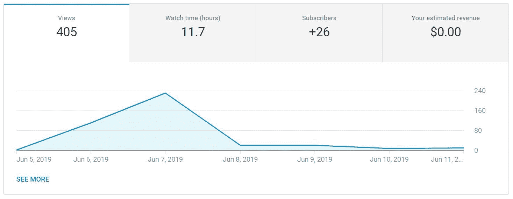
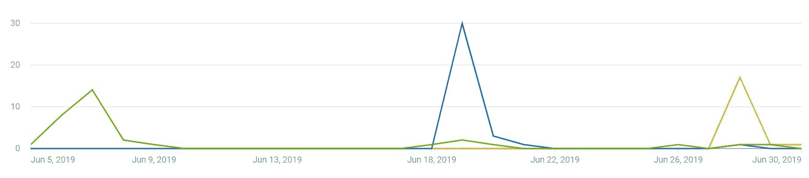
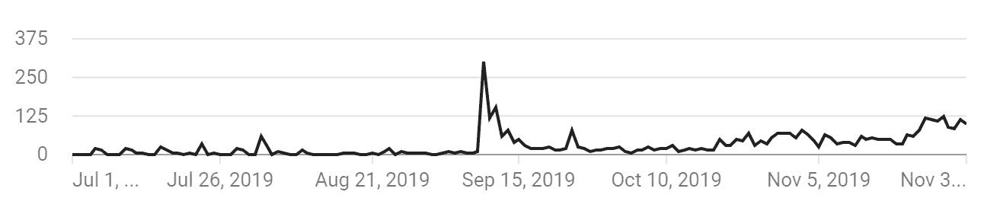
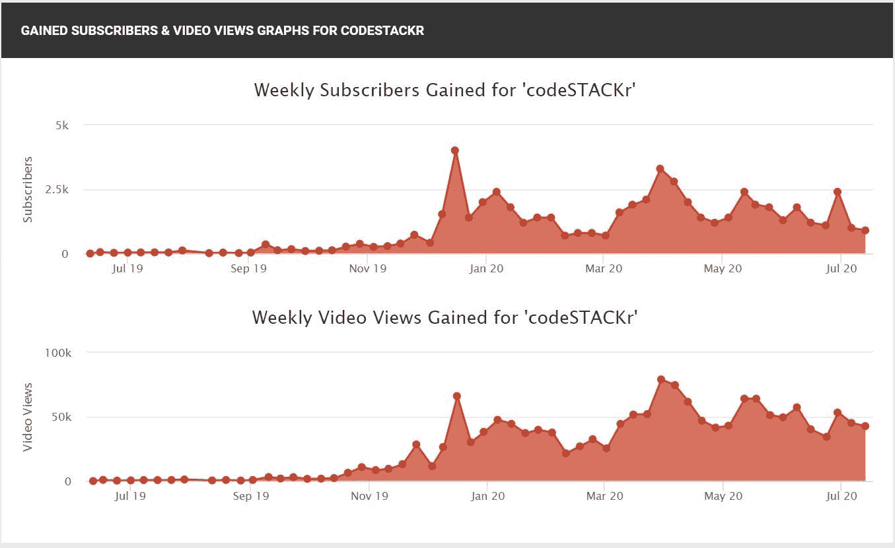
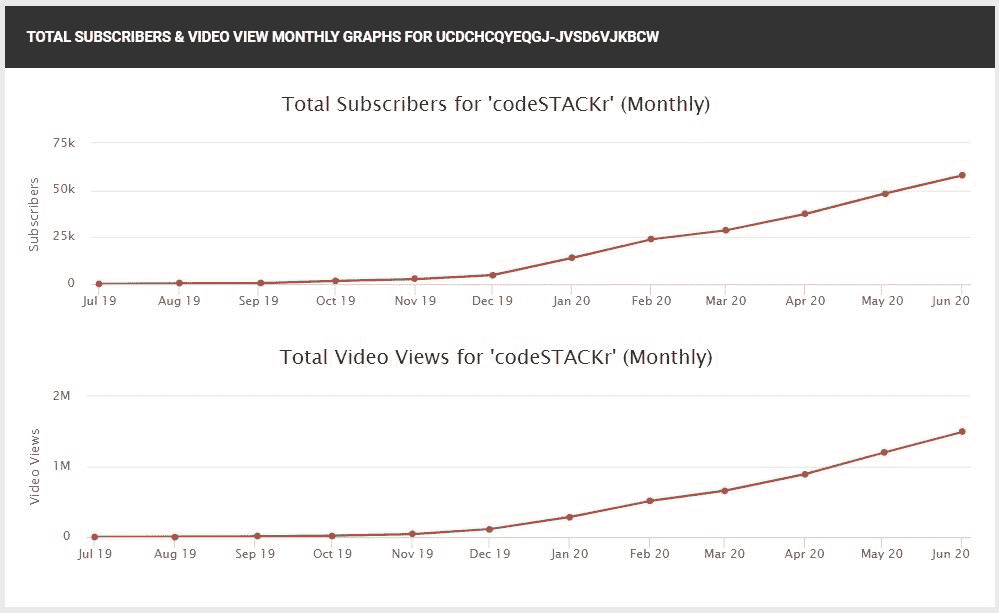
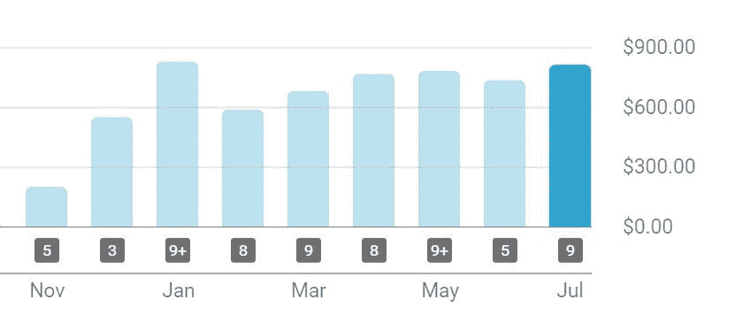
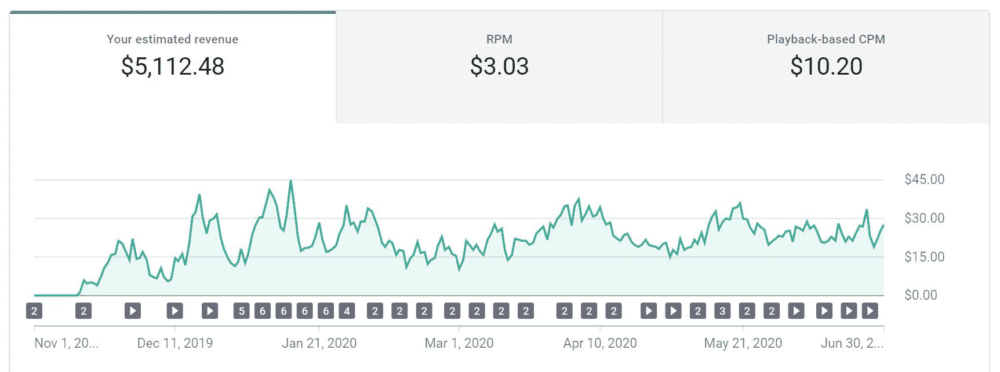

# 我是如何在一年内从 0 到 7 万 YouTube 用户的——以及我赚了多少钱

> 原文：<https://www.freecodecamp.org/news/how-to-grow-your-youtube-channel/>

很难相信，我开通 YouTube 频道已经一年了。

在这篇文章中，我想公开透明地讲述让我走到今天这一步的所有事情，无论是好的还是坏的决定。我希望你能把这些信息应用到你的环境中。

我相信，无论你属于哪一类或哪一个领域，这些信息都能帮助你拓展你的渠道。

这个帖子不是为了吹牛。相反，这是为了让我了解我是如何快速发展我的 YouTube 频道的。

我希望这篇文章能在某种程度上帮助你，但是对我有效的不一定对你也有效。所以调整我的方法来满足你的需求。

所有这些策略和技巧也适用于博客和任何其他社交媒体平台。

让我先给你介绍一下我自己的背景，以及我为什么要开一个 YouTube 频道。

## 这一切是如何开始的

人们开设 YouTube 频道有很多原因。它可能是为了名声和名声，为了赚钱，为了帮助别人，或者只是作为一种爱好。嗯，我开始我的渠道来证明一个观点。

你看，我有两个青少年，他们是典型的青少年。我想挑战他们想出一个商业点子。你知道，不是整天玩电子游戏，看网飞，或者和朋友聊天。

如你所料，并没有多少想法流传开来。所以我想，也许他们可以开办 YouTube 频道，制作他们喜欢做的事情的内容。我儿子可以开一个游戏频道，我女儿可以开一个发型频道。

他们似乎认为这是个好主意。我儿子下载了一个屏幕录制器，打算制作一些视频。我帮女儿架好了三脚架和相机，这样她就可以录下一些别致的发辫。

这就是他们所能达到的极限。没有视频被上传。

就在那时，我萌生了开办自己频道的想法。我想证明一点:**如果你付出努力**，你就能取得成功。

我决定不告诉任何人，甚至我的妻子，我创办了这个频道，直到我有证据证明它是成功的。我想，“如果我有 300 个订户，我会告诉他们”。

在我看来，为你的频道选择一个主题是最重要的决定。你要选择不太宽，但也不太窄的东西。你想吸引特定的目标观众。

我的频道的主题是显而易见的。我从 12 岁就开始编程，这是一个我充满热情的话题。所以谈论 web 开发是有意义的。

几年来，我一直在看其他频道，如布拉德·特拉弗斯(Brad Traversy)的《T1》(T1)、《T2 学院》(America Academind)的《T3》(T3)和《网络忍者》(Net Ninja)的《T4》()。所以我从 VS 代码教程开始。

稍后，我们将进一步了解我的频道和视频。现在，我们来谈谈开办一个频道的动机和期望。

## 动机和期望

当你开始一个 YouTube 频道、一个博客或任何社交媒体账户时，你需要明白你的动机是什么，你期望从中获得什么。

对我来说，我想向我的孩子证明些什么。你想出名吗？你想赚钱吗？你想以某种方式帮助别人吗？

不管你的答案是什么，你需要明白你不会在一夜之间看到结果。可能需要几个月，甚至几年才能看到任何结果。

这就是期望发挥作用的地方。如果你能管理好自己的期望，那么你就能承受肯定会到来的起起落落。

当选择你的频道的主题时，确保它是你有热情的事情。否则，你将会失败。厌倦和放弃只是时间问题。

## 入门指南

我做的第一件事是选择一个频道名称。老实说，我不记得我为什么或如何登陆 codeSTACKr。

我去了 namecheap.com 寻找域名。我在寻找“代码”、“完整”、“开发人员”、“堆栈”等的组合。我记得 codestack 是取的，所以我在末尾加了个“r”？。

下一步是录制视频。我决定一开始就不在这个频道上花一分钱。如果我从中赚了钱，我会把钱再投资到渠道中。

因为我要分享我的屏幕，所以我不需要相机。我可以用屏幕录像机。为此我使用了 OBS，现在仍然如此。

如果你要启动一个需要摄像头的频道，从笔记本电脑或手机上的摄像头开始。大多数手机都有很棒的摄像头。

如果你打算花钱，我推荐的第一个领域是音频。音频对任何视频来说都是最重要的资产。在我看来，这将决定你频道的成败。

当我观看一个视频时，音频质量不佳，我很可能会转向另一个视频。

对于我的前几个视频，我只使用了耳机麦克风。比如你用来玩游戏的耳机，甚至是你手机上的耳塞。

一旦我把所有东西都录下来了，我就需要编辑视频。对此有几种选择。如果你有苹果电脑，那么 iMovie 是一个很好的选择。我有一台 Windows 电脑，所以我使用[达芬奇解决](https://www.blackmagicdesign.com/products/davinciresolve/)。它是免费的，而且非常健壮。它也可以在 Mac 和 Linux 上使用。

现在该贴视频了。这是一些人被吊起来的地方。

我知道上传第一个视频很伤脑筋，你希望它完美。但不要纠结于此。无论你花多少时间，它都不会完美。上传就好！

这正是我所做的，但并不完美。我在我的视频中有一个响亮的拼写错误，直到今天我仍然得到评论。？

## 第一个视频的结果

在我发布我的视频之前，我做了一些研究。我想找地方推广视频。我在任何其他社交平台上都没有粉丝。所以，我开始查看 Reddit，找到了一个 subreddit，我可以在那里发布我的视频链接。

我知道在 Reddit 上自我推销是不被认可的。所以在那里要非常小心。我找到了一个允许这种类型的帖子的 subreddit，并确保我没有违反任何规则。

我还研究了视频的搜索引擎优化。我确保标题、描述和标签对视频来说是最佳的。这本身就是一整篇文章。

现在是张贴的时候了。我紧张地点击了按钮。然后疯狂点击刷新几分钟，看看是否会有任何意见。不，没有风景。所以我在 subreddit 上发布了视频链接。成功了！我开始得到一些看法。

在我上传视频的第二天，我们去度假了。我们不在的时候，我抓住一切机会不引人注意地查看我的 YouTube 分析。很难不被数字所困扰，但尽量不要。我们稍后会详细讨论这一点。

The first week's analytics of my first video.

第一天，我就获得了 111 次浏览和 8 个订阅者。第二天有 231 次浏览和 14 个订阅者。然后浏览量下降到 23 和 2 订户。这些大多来自 Reddit 帖子。在 Reddit 的第一篇帖子上，我获得了 88 张赞成票。这对 Reddit 来说相当不错。

你会发现这是大多数视频的典型图表。你会在初始视图中看到一个峰值，然后就稳定下来了。在某种程度上，你希望 YouTube 算法会发现它。我们稍后会谈到这一点。

那么我是如何从每天只有几个浏览量变成每天几千的呢？接下来就是这个了。

## 一致性

帮助你拓展渠道的第一件事，我相信你以前也听说过，就是坚持发帖。

想出一个适合你的计划。如果能做到一周一贴，两周一贴，或者一个月一贴，那就坚持下去！如果你不一致，你将得不到订户。

对我来说，我有一份全职工作。所以在我们度假回来后，我决定每周找时间发一次帖子。所以我坚持了下来。我坚持发帖，至少每周一次。每篇帖子都提升了我的平均浏览量。

June 2019 Subscribers Gained.

从这个图可以看到，2019 年 6 月，我发了三个视频。你也可以看到我度假的地方的差距。每一篇帖子都让我的浏览量和订阅量大增，不仅是发布的视频，还有之前的视频。

你会发现有些视频比其他的获得更多的浏览量。你会有做得很好的视频和失败的视频。用这些见解来琢磨你的观众想看什么。如果一个视频做得很好，那么就制作另一个相同或相似主题的视频。

在大约 10 个视频和 2 个月后，一致性让我达到了 300 个订户的目标。

## 泄露我的秘密？

所以我让家人坐下来告诉他们这个好消息。想象一下，一位 39 岁的父亲和丈夫让他的妻子和两个十几岁的孩子坐下来，告诉他们他创建了一个 YouTube 频道，有 300 名订户。？

笑声结束后，我开始告诉他们我继续扩大渠道的计划，看看它能去哪里。

## 避免倦怠

理解一致性是一场马拉松而不是短跑非常重要。2020 年 1 月，我决定每天发布一个短视频。我想制作解释 JavaScript 小部分的短视频。我把它叫做[# JavaScript 一月](https://www.youtube.com/playlist?list=PLkwxH9e_vrALlH7D0XLDn2td-uoHqHFxq)。

这是大约 90 秒的视频。你可能认为短视频会更容易制作。从理论上讲，他们应该如此。

但是我倾向于做过头的事情。我确保这些视频充满了信息。他们有动画，非常吸引人。平均来说，他们每个人花了 3 个小时来制作。？

那是个糟糕的决定。不要误解我，我为自己创作的视频感到骄傲。我得到了很多对他们的赞美，也感谢喜欢他们并想要更多的观众。

但是很难跟上进度。我确实设法每天都拿出一盘录像带，但我再也不会那样做了。

我从错误中学到了什么？即使我每天发布一个视频，我也没有看到浏览量或订阅量的显著增加。事实上，我失去了一些订户，因为他们不喜欢我每天用新视频充斥他们的主页。

当你第一次开始你的频道时，你会非常兴奋地开始，并且想要一直工作下去。要非常小心，调整好自己的节奏，不要给自己报名超过你能应付的，或者超过你的观众能应付的。

## 积极参与社区活动

为了吸引我的观众，我回复了每个视频的每条评论。你的观众想知道他们被听到了。

这是我成功的关键之一。通过与观众互动，我已经能够调整我的内容策略，以包括他们感兴趣的话题。

你可能认为你知道你的观众想要什么，但你真的不知道，直到你问他们想要什么。

市场和社区研究对发展你的品牌至关重要。你需要了解谁是大玩家，并尽可能多地尝试与他们互动。

现在，如果你刚刚开始，你不会想去打扰一个大的频道询问事情。你想参与社区并带来价值。

我第一次真正的约会是和 freeCodeCamp.org。我为他们制作了一个两小时的关于 [Sass](https://youtu.be/_a5j7KoflTs) 的教程，发布在他们的 YouTube [频道](https://www.youtube.com/channel/UC8butISFwT-Wl7EV0hUK0BQ)上。当时，他们的频道大约有 100 万用户！

My subscriber bump from the freeCodeCamp video.

在这张图中，你可以看到我在 freeCodeCamp.org 的 YouTube 频道 T3 上发布我的视频后，用户数量激增。

到这个时候，我已经获得了大约 500 名订户。然后我一天就拿了 300 多！我感到震惊和惊讶。当然，它最终稳定下来了。但是请注意，每一次颠簸，平均值都会增加。每一个都带你进入下一个阶段。

另一件对我有帮助的事情是了解我的社区中的其他人。你可能会认为其他 YouTubers 发布相同主题的视频会是竞争。但事实并非如此。

我能够与社区中的许多人合作并分享我的见解，他们和我发表了相同的观点。即使我们可能发布相同的主题，我们都有不同的教学方法和不同的观点。所以没什么大不了的。

一句话:你需要建立关系网，了解和你处于同一领域的其他人。

## 难以捉摸的算法

YouTube 算法是一个谜。不要试图去理解它。只要知道它找到你，你就会知道！

Social Blade graph of my weekly views and subscribers gained over the past year.

请注意图表中 2019 年 12 月左右的大峰值。就在那时，强大的算法决定将我的一个视频推送给成千上万的观众。

那时我平均每天有 1000 次浏览。然后，突然之间，一天之内我就有了 12000 的浏览量。这让我更上一层楼。我没有做任何不同的事情。我坚持每周发布一个视频。

你可以在下图中看到 2019 年 12 月左右的轨迹变化。

Social Blade graph of my monthly views and subscribers gained over the past year.

从那以后，该算法已经采集了我的几个视频。通过保持一致，倾听我的观众，并与我的社区互动，我能够在一年内获得 70，000 名订户和近 200 万次观看。疯狂！

## 不要拘泥于数字

我最初设定的目标是获得 300 名订户。当时，对我来说，这个数字意味着我成功了，我的策略奏效了。

那是另一个错误。尽最大努力不去关注数字。你的订阅者或追随者数量并不能决定你的成功。 **你的内容的质量和价值决定了你的成功。**如果你有质量，有价值的内容，他们就会来。

和...不要拿自己和别人比较。每段旅程都不一样。关注你的环境，保持一致，制作高质量的内容。

## 高点和低点

回头看一些图表，你会看到波峰和波谷。这是完全正常的。当你的观点开始下降时，不要害怕。这是 YouTube 的自然循环。只要你保持一致，他们就会重新振作起来。

## 货币铸造

在 YouTube 上，你需要有 1000 名订户和 4000 个观看小时才能货币化。那就是 24 万分钟的观看时间！

3 个月后，也就是 2019 年 9 月，我的订户达到了 1000 人。但我直到 2019 年 11 月才达到 4000 个观看小时。那是在我的频道开播 5 个月后。

Monthly ad revenue

11 月，我赚了 197 美元。？我简直不敢相信我上传视频到 YouTube 上赚钱了！12 月，我赚了 545 美元。然后在一月份，就在算法获得我的一个视频之后，我赚了 830 美元！

之后，收入下降，但趋于平稳，最近开始增加。经过 8 个月的货币化，我赚了 5000 多美元。

这还不足以让我辞掉我的日常工作，但我仍然很惊讶我能如此迅速地创造副业收入。

Weekly ad revenue graph with CPM

在这张图表中，您将看到每周广告收入的明细。另外两个数据是收入的一部分。

CPM 是“每千分之一成本”，或者简单地说，是广告客户为每 1000 次视频观看支付的价格。我在这里的平均每分钟花费是 10.20 美元。因此，广告商为我视频的每 1000 次货币化观看支付 10.20 美元。

每分钟转数是“每千分之一的收入”，或者简单地说是你每观看 1000 次视频所获得的收入。

由于 YouTube 促成了这些观点，他们从中提成，对此我没意见。他们拥有这个平台，他们维护它，他们把观众送到我的频道，他们做大部分的重活。此外，它们为内容创作者提供了许多很棒的工具，并在不断地添加和改进这些工具。所以，每 1000 次货币化视频观看，我赚了 3.03 美元。

现在，不是所有的观点都算数。请注意，我说的是“货币化”视图。也就是说广告被看过了。如果浏览者使用广告拦截器或跳过广告，它将不会被视为货币化视图。

## 其他收入来源

除了广告收入，去年我还从赞助商那里赚了大约 8000 美元。这不是马上就能实现的。你必须建立自己的品牌，并在社区中为人所知。

我还没有通过寻求赞助商而得到一个赞助。我所有的赞助商都先联系了我。所以，这又是一场马拉松。不要期望事情会在一夜之间发生。保持激光聚焦，好事就会到来。

在任何行业，你都希望收入多元化。YouTube 广告收入永远不应该成为你的主要收入来源。如果 YouTube 不小心删除了你的账户，或者由于某种原因停止了货币化，该怎么办？你要多样化！

除了 YouTube 广告收入和赞助商，我的目标是创造自己的数字产品。

这是我犯的另一个错误的例子。错误不在于决定制造自己的产品，而在于我推迟了制造产品的时间。其实时至今日，我依然没有发布任何产品。

我计划在 2020 年推出 3 门高级课程。今年已经过半，我还没有发布 1。

我陷入了其他的项目中，没有专注于我自己的项目。这些副业项目为我带来了订户和资金，但它们不应该是我的主要关注点。

你的主要收入来源应该是你的个人产品。这是你所能控制的。其他一切都有可能在某一天消失。保持专注！

## 成功秘诀

我能给你的最大成功秘诀就是专注。人们很容易被所有你“能”做的事情分散注意力，从而扩大你的影响范围。

专注于制作优质视频。试着保持有条理。创建要创建的内容列表。每当你想到一个新的想法，就把它加入到列表中。

但是，一次只关注一个话题。为该视频创建内容，然后继续下一个主题。

早些时候我说过，当我开始我的频道时，我没有在任何其他社交平台上出现过。

如果你在别的地方已经有了追随者，那么你应该利用这一点把观众带到你的频道。但如果你在其他地方没有追随者，就不要试图同时发展多个平台。专注于任何适合你的平台。

大约 6 个月之后，我在 YouTube 上做了日常工作，然后开始在 Instagram、脸书、LinkedIn 和 Twitter 上注册账户。我也在这些平台上慢慢成长，有些比其他平台更好。(我不知道脸书是如何工作的？。)

在这些平台上呆了几个月后，它们对我的 YouTube 增长的影响微乎其微。我认为，对我来说，Twitter 和 Instagram 是最有效的。推特尤其适合社交。但是这些对我的频道的影响并不显著。

根据你的定位，你可能会发现你的观众可能更容易接受特定的平台。一旦你的渠道有了一点吸引力，就用这些来建立品牌。

如果你想通过视频重温本文中的概念，你可以看看我在这里制作的视频版本。

[https://www.youtube.com/embed/oNGZ7h5LR-o?feature=oembed](https://www.youtube.com/embed/oNGZ7h5LR-o?feature=oembed)

## 结论

总之，我只想说，任何人都可以做任何事。如果你有(1)适当的动机，(2)现实的期望，(3)不过度劳累，你就能成功。

我是来自德克萨斯州的杰西。查看我的其他内容，让我知道如何帮助你成为一名 web 开发人员。

*   [订阅我的 YouTube](https://youtube.com/codeSTACKr)
*   打个招呼！ [Instagram](https://instagram.com/codeSTACKr) | [推特](https://twitter.com/codeSTACKr)
*   [注册我的简讯](https://codestackr.com/)