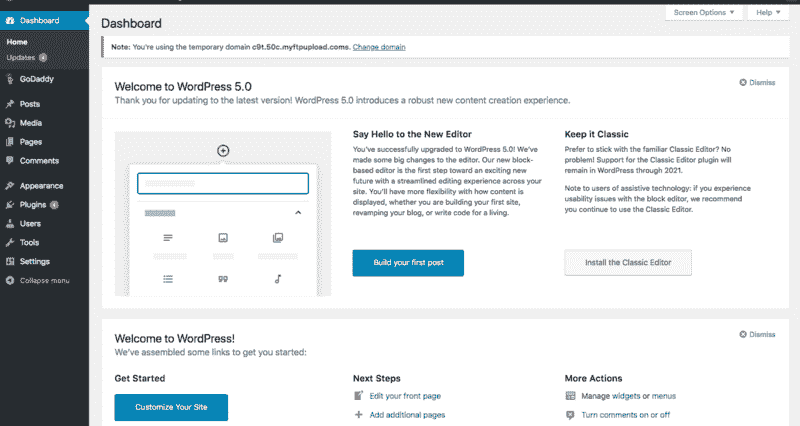
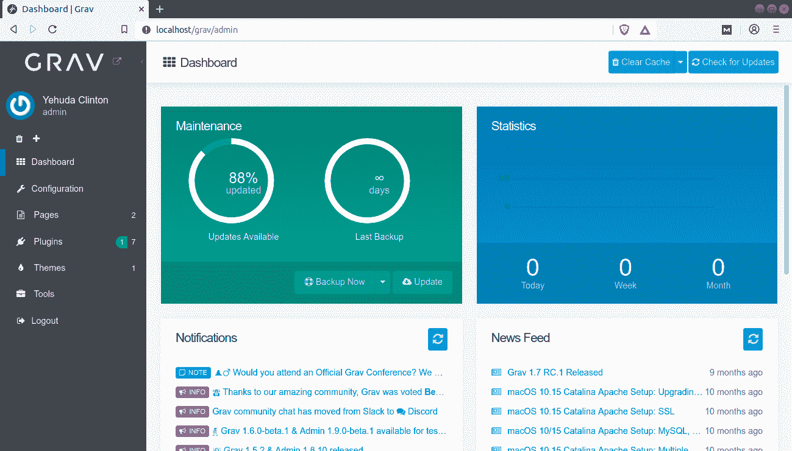
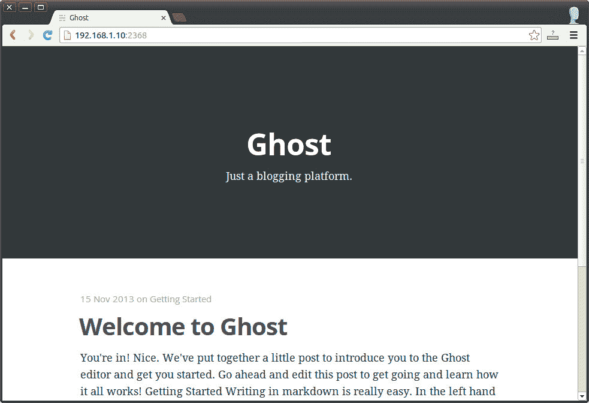
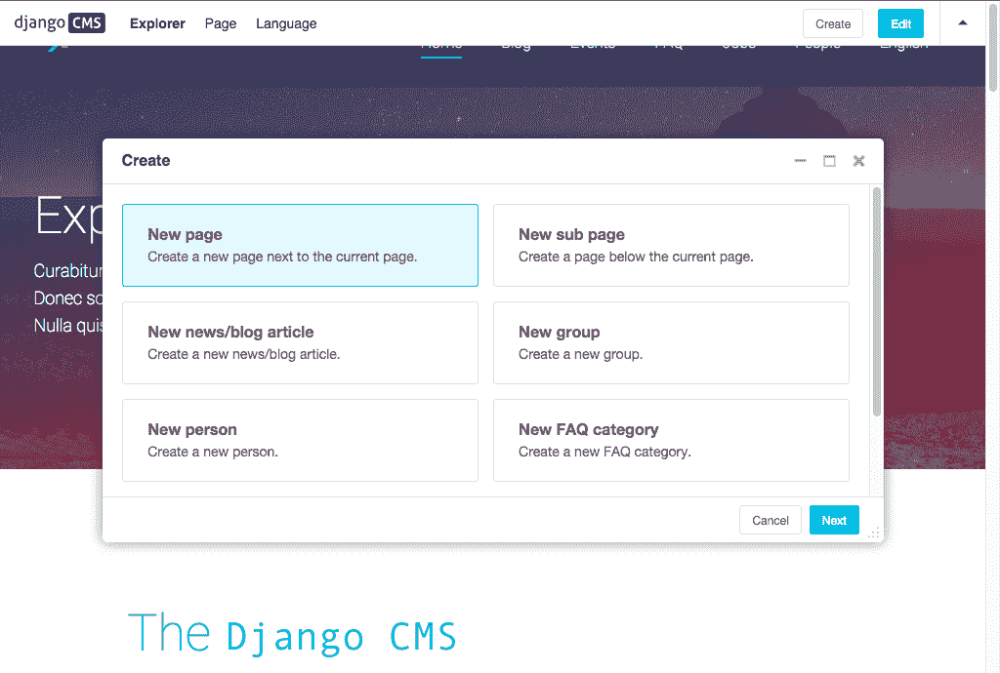

# 2020 年的 WordPress 替代品——如何为你的网站选择合适的内容管理系统

> 原文：<https://www.freecodecamp.org/news/wordpress-alternatives-2020/>

WordPress 功能强大，用途广泛，它比任何其他引擎为更多的互联网网页提供动力。

但它并不完全适合所有人。也许你在寻找不同的东西。所以，让我来帮助你了解现代网络内容管理的混乱世界。

为了做到这一点，我们将比较由三个主流编程语言家族构建的顶级内容管理系统(CMS ): PHP、Node 和 Python。

我将探索的所有选项都是开源的。这很合适，因为在很多方面，WordPress 是开源平台的先驱。

然而，我们中的一些人正在寻找一个更现代、更快、更安全的 CMS。而且我们还是不喜欢 Squarespace 和 Wix 这些闭源的。

似乎正在发生的是，人们正在从基于单引擎、 [MVC](https://www.freecodecamp.org/news/simplified-explanation-to-mvc-5d307796df30/) 范式的 CMS 平台转移到一个更加解耦的系统。

比如你网站的博客真的需要一个完整的数据库吗？你的电子商务或支付系统可以使用更简单的无头模式吗？

所以让我们看看有什么可用的，按语言排列。

## 服务器端编程语言（Professional Hypertext Preprocessor 的缩写）

PHP 是一种简单、可靠且维护良好的语言。所以它成为整个网络最受欢迎的后端也就不足为奇了。

它的多功能性使得开发者很容易为他们的 CMS 提供大量的功能和插件。简而言之，PHP 最初基本上是为 CMS 发明的[。](https://www.elated.com/cms-in-an-afternoon-php-mysql/)

WordPress 受欢迎的一个缺点是它的插件市场很难导航，或者在某些情况下，可能太贵了。

然而，在这个意义上，WordPress 可能不是唯一的。以下是一些其他的 PHP CMS 框架:

*   **Drupal**
*   **Joomla**
*   **Magento**
*   **Grav CMS**

前三个都有和 WordPress 一样的问题:臃肿的界面或者拥挤的插件市场。

但是 Grav 感觉像是呼吸了一口新鲜空气。这有点像一个简化的 WordPress，没有所有复杂的膨胀软件。甚至没有数据库，只有文件夹和页面。

它试图给你最好的两个世界。Grav 有一个管理仪表板插件，非技术人员可以像使用 WordPress 一样管理一切。

同时，Grav 还提供了解耦系统的稳定性和定制化。如果你不想要，你甚至不需要一个管理 GUI。

## 结节

Node.js 是冲击后端市场的最新语言，具有创新性和非传统性。由于 Node 已经是一种流行的前端 web 开发语言，它似乎正在为世界各地最流行的编程语言而努力。

节点部署通常依赖于技术栈，如 MongoDB、NGINX web 服务器和 Markdown 等 NoSQL 数据库。Node.js 支持的 CMS 的一个优势是它倾向于与 web 应用程序很好地集成。

这里有几个基于 Node.js 的 CMS:

*   **KeystoneJs** :复杂。与其说是 CMS，不如说是框架。
*   **鬼**:简单。除了 Medium 之外没做什么，如果你想自己管理你的 Medium 博客，Medium 是最好的选择。你可以添加像 Shopify 这样的非耦合电子商务。
*   NetlifyCMS :不是一个独立的 CMS——相反，你可以把它添加到一个网站/webapp 中，作为一个基于 git 的自定义静态内容管理器，供你的作者使用。

从市场份额的角度来看，Ghost 似乎是唯一一个定位于从 WordPress 垄断地位上分一杯羹的新 CMS。

## 计算机编程语言

虽然 Python 被认为是一种强大的脚本语言，但近年来，它已经成熟为一种全面的服务器端语言。然而，它仍然有一个不太发达的 CMSs 插件和主题市场。

以下是一些流行的基于 Python 的 CMS 平台:

*   Django CMS : 比 WordPress 需要更多的代码知识
*   夹层:也建在 Django 上。许多特性，但是您仍然需要了解 Python 的高级功能。
*   Storyblok :友好的编辑器界面和应用程序的无头 api，但插件有限

Python 在某些情况下具有速度优势。因此 Python 框架可能会比 JavaScript 更有效地扩展。这也是为什么他们通常会在便宜的硬件上运行得更好，比如 Raspberry Pi。

这些基于 Python 的 CMS 也可以在与 Python 主导的领域集成时找到自己的位置。我们在这里谈论的是什么领域？看看这篇文章，了解一下用的是什么 Python。

尽管如此，我怀疑 Python 是否会成为 CMS 市场的主要竞争者。主要是因为它很晚才出现在网络上。版本之间缺乏向后兼容性也是一个问题。

## 结论

如果你准备好拥抱 CMS 的未来，这里是做出明智决定的关键。

考虑最有可能为您提供所需的安全性、可靠性和定制性的所有因素。