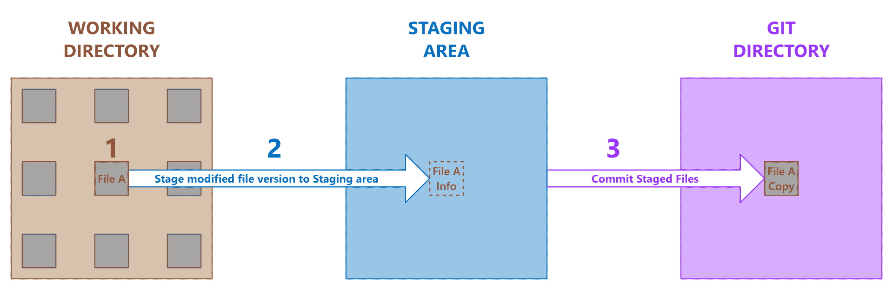
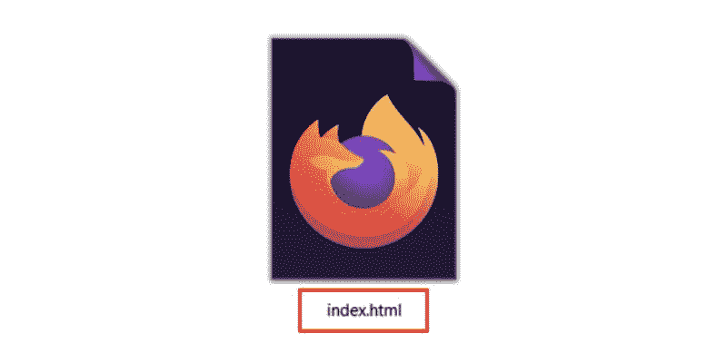
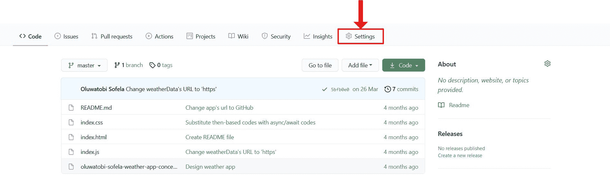
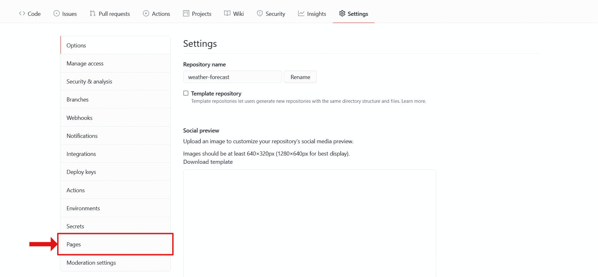
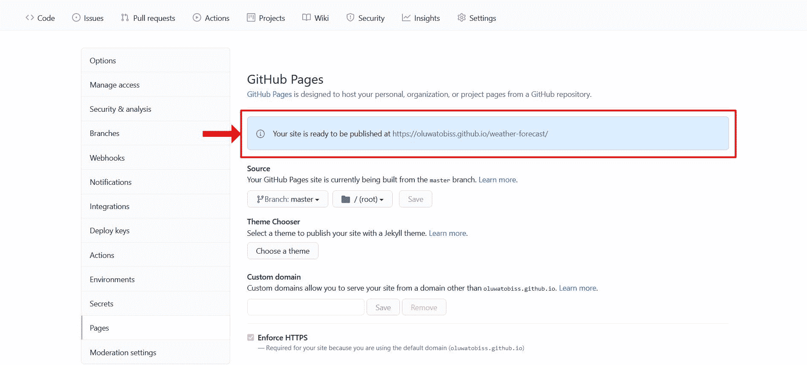

# git vs GitHub——什么是版本控制，它是如何工作的？

> 原文：<https://www.freecodecamp.org/news/git-and-github-overview/>

你有没有被 Git 和 GitHub 的工作原理搞糊涂过？不要烦恼，你并不孤单。Git 和 GitHub 有时会很棘手，但是在这篇文章结束时，你会很好地掌握这两者。

起初，人们很容易相信 Git 和 GitHub 是一回事。但事实上并非如此。的确，不用 GitHub 也可以用 Git！最终，这两者存在的目的是不同的。

这篇文章将从仔细了解 Git 和 GitHub 的用途开始。之后，我们将了解这两种重要技术之间的主要区别。

事不宜迟，让我们从 Git 开始吧。

## Git 是什么？

Git 是一个分布式版本控制系统(DVCS ),用于保存一个文件(或一组文件)的不同版本，以便可以随意检索任何版本。

Git 还使得记录和比较不同的文件版本变得容易。这意味着可以随时查看关于更改了什么、谁更改了什么或谁发起了问题的详细信息。

但是如果 Git 是一个分布式版本控制系统，这些术语到底是什么意思？

### “分布式”是什么意思？

术语“分布式”意味着每当你指示 Git 共享一个项目的目录时，Git 不仅仅共享最新的文件版本。取而代之的是，它发布它为这个项目录制的每一个版本。

这种“分布式”系统与其他版本控制系统形成鲜明对比。它们只共享用户从中央/本地数据库中明确检出的任何单一版本。

好的，所以“分发”意味着分发 Git 记录的项目文件的所有版本，而不仅仅是选定的几个版本。但是到底什么是版本控制系统呢？

### 什么是版本控制系统？

版本控制系统(VCS)指的是*保存文件版本以备将来参考的方法*。

直觉上，许多人已经通过不同的方式重命名相同文件的不同版本来控制他们的项目，比如`blogScript.js`、`blogScript_v2.js`、`blogScript_v3.js`、`blogScript_final.js`、`blogScript_definite_final.js`等等。但是这种方法容易出错，并且对于团队项目来说是无效的。

此外，使用这种传统的方法，跟踪更改了什么，谁更改了它，以及为什么更改是一项繁琐的工作。这说明了像 Git 这样可靠和协作的版本控制系统的重要性。

然而，要充分利用 Git，理解 Git 如何处理文件是很重要的。

## Git 中的文件状态

在 Git 中，文件可以处于三种主要状态(条件):**修改状态**、**暂存状态**或**提交状态**。

### 修改状态

处于“已修改”状态的文件是已修改但未提交(未记录)的文件。

换句话说，处于修改状态的文件是您已经修改但没有明确指示 Git 监视的文件。

### 阶段状态

处于暂存状态的文件是已选择的已修改文件，处于其当前状态(版本)，并准备在下一次提交快照期间保存(提交)到`.git`存储库中。

一旦文件被登台，就意味着您已经明确授权 Git 监控该文件的版本。

### 承诺状态

处于提交状态的文件是成功存储到`.git`存储库中的文件。

因此，提交的文件是您已经将其暂存版本记录到 Git 目录(文件夹)中的文件。

**注意:**文件的状态决定了 Git 放置它的位置。

## 文件位置

使用 Git 进行版本控制时，文件的版本可能会驻留在三个关键位置:工作目录**、**暂存区**或 **Git 目录**。**

### **工作目录**

**工作目录是项目文件的本地文件夹。这意味着在系统的任何地方创建的任何文件夹都是工作目录。**

****注:****

*   **处于修改状态的文件位于工作目录中。**
*   **工作目录不同于`.git`目录。也就是说，您创建一个工作目录，而 Git 创建一个`.git`目录。**
*   **查看[这篇比较文章](https://www.codesweetly.com/git-vs-working-directory/)，了解两个存储库之间的更多差异。**

### **部队从一个战场转往另一个战场的集结地**

**staging area——在 Git 术语中称为“索引”——是一个文件，通常位于`.git`目录中，它存储着下一个要提交到`.git`目录中的文件的信息。**

****注:****

*   **处于暂存状态的文件驻留在暂存区域中。**

### **Git 目录**

**`.git`目录是 Git 在您指示它跟踪的工作目录中创建的文件夹(也称为“存储库”)。**

**另外，`.git`文件夹是 Git 存储对象数据库和您指示它监视的文件的元数据的地方。**

****注:****

*   **`.git`目录是 Git 的生命——当您从另一台计算机(或从 GitHub 这样的在线平台)克隆一个存储库时，它是被复制的项目。**
*   **处于提交状态的文件位于 Git 目录中。**

## **基本的 Git 工作流程**

**使用 Git 版本控制系统看起来像这样:**

****

1.  **修改工作目录中的文件。
    请注意，您更改的任何文件都会变成处于*修改状态*的文件。**
2.  **选择性地将您想要提交的文件存放到`.git`目录中。
    请注意，您暂存(添加)到暂存区的任何文件都将成为处于*暂存状态*的文件。
    另外，请注意暂存文件还不在`.git`数据库中。
    暂存意味着关于暂存文件的信息包含在`.git`存储库中的一个文件(称为“索引”)中。**
3.  **提交您已暂存到中的文件。git 目录。也就是说，将暂存文件的快照永久存储到中。git 数据库。请注意，您提交给。git 目录成为处于提交状态的文件。**

### **迄今为止的要点**

**到目前为止，所有讨论的要点是 Git 是一个优秀的版本控制系统，可以胜任文件的版本控制、管理和分发。查看这个简单的指南来学习如何有效地使用 Git。**

**但是，等一下，如果 Git 有助于有效地管理和分发项目文件的不同版本，那么 GitHub 的目的是什么？**

## **GitHub 去神秘化**

**GitHub 是一个基于 web 的平台，用户可以在这里托管 Git 存储库。它有助于您随时与任何人轻松共享和协作项目。**

**GitHub 还通过提供一种安全的方式来编辑其他用户存储库中的文件，鼓励更广泛地参与开源项目。**

**要在 GitHub 上托管(或共享)Git 存储库，请遵循以下步骤:**

### **第一步:注册 GitHub 账户**

**在 GitHub 上开始托管的第一步是创建一个个人帐户。访问[官方报名页面](https://github.com/join)报名。**

### **步骤 2:在 GitHub 中创建一个远程存储库**

**注册帐户后，[在 GitHub](https://docs.github.com/en/github/getting-started-with-github/create-a-repo) 中为您想要共享的 Git 存储库创建一个 home(一个存储库)。**

### **步骤 3:将项目的 Git 目录连接到远程存储库**

**一旦您为您的项目创建了一个远程存储库，将项目的`.git`目录——位于您系统的本地——与 GitHub 上的远程存储库链接起来。**

**要连接到远程存储库，**进入您想要通过本地终端共享的项目的根目录**，并运行:**

```
`git remote add origin https://github.com/yourusername/yourreponame.git`
```

****注:****

*   **用您的 GitHub 用户名替换上面代码中的`yourusername`。
    同样，用您想要连接的远程存储库的名称替换`yourreponame`。**
*   **上面的命令暗示 *git* 应该*将指定的 *URL* 添加到本地项目中，作为本地`.git`目录可以与之交互的远程引用。***
*   **上面命令中的`origin`选项是 Git 给托管远程存储库的服务器的默认名称(简称)。
    也就是说，Git 使用简称`origin`，而不是服务器的 URL。**
*   **使用服务器的默认名称并不是强制性的。如果你喜欢另一个名字而不是`origin`，只需用你喜欢的名字替换上面`git remote add`命令中的`origin`名字。**
*   **永远记住服务器的短名称(例如，`origin`)没什么特别的！它只存在于本地，以帮助您轻松引用服务器的 URL。所以觉得要改成一个你容易引用的短名字。**
*   **要重命名任何现有的远程 URL，请像这样使用`git remote rename`命令:**

```
`git remote rename theCurrentURLName yourNewURLName`
```

*   **无论何时克隆(下载)任何远程 repo，Git 都会自动命名该 repo 的 URL `origin`。但是，您可以用`git clone -o yourPreferredName`命令指定一个不同的名称。**
*   **要查看为昵称`origin`存储的确切 URL，请运行`git remote -v`命令。**

### **步骤 4:确认连接**

**将 Git 目录连接到远程存储库之后，通过在命令行上运行`git remote -v`来检查连接是否成功。**

**之后，检查输出以确认*显示的 URL* 与您想要连接的*远程 URL* 相同。**

****注:****

*   **如果您希望使用 SSH URL 而不是 HTTPS URL 进行连接，请参阅“[使用 SSH 连接](https://help.github.com/en/github/authenticating-to-github/connecting-to-github-with-ssh)”一文。**
*   **但是，如果您不确定要使用的远程 URL，请查看“[我应该使用哪个远程 URL？](https://help.github.com/en/github/using-git/which-remote-url-should-i-use)”篇。**
*   **您希望更改您的远程 URL 吗？改变遥控器的网址是一个很好的指导。**

### **步骤 5:将本地 Git repo 推送到远程 repo**

**在成功地将您的本地目录连接到远程存储库之后，您就可以开始向上游推送(上传)您的本地项目了。**

**每当您准备在其他地方共享您的项目时，在任何远程 repo 上，只需指示 Git 将您本地`.git`目录中的所有提交、分支和文件推送到远程存储库。**

**用于将本地 Git 目录上传(推送)到远程存储库的代码语法是`git push -u remoteName branchName`。**

**也就是说，要推送您的本地`.git`目录，并假设远程 URL 的简称是“origin ”,运行:**

```
`git push -u origin master`
```

****注:****

*   **上面的命令暗示 *git* 应该*将*您的本地*主*分支推送到位于 URL 名为 *origin* 的远程*主*分支。**
*   **从技术上讲，您可以用远程存储库的 URL 替换`origin`选项。记住，`origin`选项只是你在本地`.git`目录中注册的网址的昵称。**
*   **`-u`标志(上游/跟踪参考标志)自动链接`.git`目录的本地分支和远程分支。这允许你使用`git pull`而没有任何参数。**

### **步骤 6:确认上传**

**最后，返回 GitHub 存储库页面，确认 Git 已经成功地将本地 Git 目录推送到远程存储库。**

****注:****

*   **您可能需要刷新远程存储库的页面以反映更改。**
*   **GitHub 还有一个免费的可选工具，可以将您的远程存储库转换成一个功能网站。让我们看看下面的“如何”。**

## **用 GitHub 页面发布您的网站**

**将项目推送到远程存储库后，您可以通过以下步骤轻松地将其发布到 web 上:**

### **步骤 1: HTML 文件名**

**确保项目的主 HTML 文件的名称是`index.html`。**

****

### **步骤 2:转到设置选项卡**

**在 GitHub 的网站平台上，进入你要发布的项目的资源库，点击资源库的**设置标签**。**

****

### **步骤 3:转到页面选项卡**

**向下滚动到 **GitHub 页面**部分。**

****

### **第四步:改变来源**

**在那里，将**源**分支从**无**变更为**主**。**

****

### **第五步:现场观看你的网站！**

**之后，会显示一个通知，“您的站点发布于*https://your-username.github.io/your-github-repo-name/*”。**

****

**现在，您可以在指定的 URL 查看并公布您的项目。**

**本节仅仅触及了用 GitHub 发布项目的皮毛。要了解更多关于 GitHub pages 的信息，请查看“[使用 GitHub Pages](https://docs.github.com/en/github/working-with-github-pages) ”文档。**

### **总之**

**GitHub 是一个托管(或共享)Git 库的在线平台。它有助于您创建一个渠道，随时随地与任何人轻松协作完成项目。**

## **还在怀疑？**

**你还在困惑 Git 和 GitHub 之间的细微差别吗？别担心，我会掩护你的。以下是 Git 和 GitHub 的五个关键区别。**

### **区别 1: Git 与 GitHub——主要功能**

****Git** 是一个分布式版本控制系统，记录一个文件(或一组文件)的不同版本。它允许用户在任何时候访问、比较、更新和分发任何记录的版本。**

**然而， **GitHub** 主要是一个托管平台，用于在线托管 Git 仓库。它让用户保持他们的[远程存储库](https://www.codesweetly.com/git-basic-introduction/#what-is-a-remote-repository)的私密性或对合作努力开放。**

### **区别 2: Git 与 GitHub——操作平台**

**用户在本地机器上安装和操作 Git。这意味着 Git 的大部分操作都是不需要互联网就可以实现的。**

**然而，GitHub 是一项基于网络的服务，只在网上运营。这意味着你需要互联网才能在 GitHub 上做任何事情。**

### **区别 3: Git 与 GitHub——发明者**

**Linus Torvalds 于 2005 年 4 月开始开发 Git。**

**克里斯·万斯特拉斯、P. J .海特、汤姆·普莱斯顿-沃纳和斯科特·沙孔于 2008 年 2 月创立了 GitHub.com。**

### **区别 4: Git 与 GitHub——维护者**

**2005 年 7 月，Linus Torvalds 将 Git 的维护工作移交给了 Junio c . Hamano——从那以后，他一直是主要的维护人员。**

**而微软在 2018 年 10 月收购了 GitHub。**

### **差异 5: Git 与 GitHub——竞争对手**

**Git 的流行替代品有 Mercurial、Team Foundation 版本控制(TFVC)、Perforce Helix Core、Apache Subversion 和 IBM Rational ClearCase。**

**GitHub 最接近的竞争对手有 GitLab、Bitbucket、SourceForge、云源码库、AWS CodeCommit。**

## **总而言之**

**Git 和 GitHub 是两个不同的实体，帮助你管理和托管文件。换句话说，Git 用于控制文件版本，而 GitHub 是一个托管 Git 库的平台。**

## **有用的资源**

*   **[如何使用 Git——这是一个非常棒的指南，提供了非常棒的提示](https://www.codesweetly.com/how-to-use-git/)**