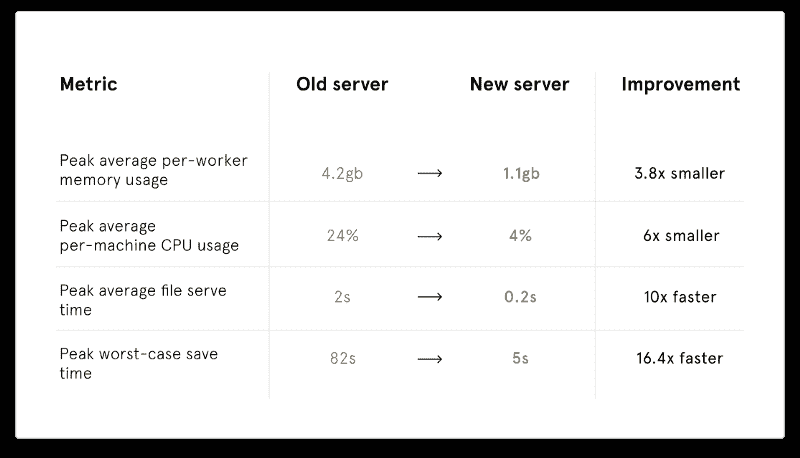
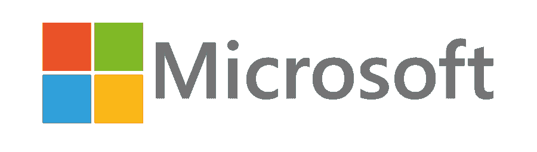
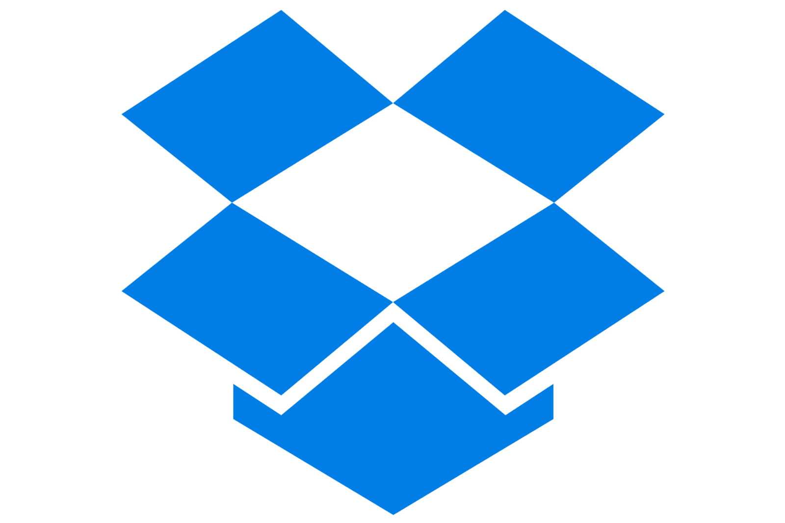
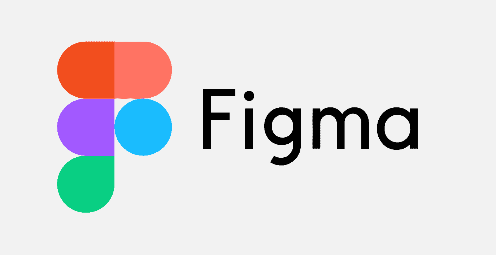

# Rust for 初学者——开始使用最受欢迎的编程语言

> 原文：<https://www.freecodecamp.org/news/rust-getting-started-with-the-most-loved-programming-language/>

Rust 连续五年被评为 Stack Overflow 最受欢迎的编程语言。这篇文章会告诉你为什么 Rust 很牛逼。

Rust 是一种系统编程语言，你可以用它来编写高性能的应用程序。像 Dropbox 和 Cloudflare 这样的一些顶级科技公司使用 Rust 来为他们的客户提供速度和并发性。

在过去的五年里，Rust 连续被评为最受欢迎的编程语言。

但是很有可能，你没有和铁锈一起工作过。或者更糟，你可能以前没听说过。所以我们来多了解一下。


StackOverflow 2020 Survey

## 为什么生锈？

让我们看看为什么一个开发者会选择 Rust。

像 Python 和 C++这样的典型编程语言从开发人员那里抽象出了很多细节。

如果您是从事简单 web 应用程序的初级开发人员，这可能不是问题。你只是想找到解决问题的方法。

对于数百万用户日常使用的大规模应用程序来说,“解决问题”的方法是行不通的。更多的用户消耗更多的系统资源。更多的资源意味着贵公司更大的账单。

这是铁锈发光的地方。Rust 结合了编程的简易性和对核心系统配置的访问。Rust 从一开始就是用内存安全、并发性和安全性构建的。

> Rust 是一种“专注于速度、内存安全和并行性的系统编程语言”。

Rust 也被认为是 C++的一个很好的替代品。Rust 提供了高性能，除了帮助你[消除像 C++这样的语言引起的常见错误。](https://polyfloyd.net/post/how-rust-helps-you-prevent-bugs/)

现在你知道了铁锈能为你做什么，让我们来详细看看铁锈。

## 起源

Rust 是一种开源编程语言。2010 年，Graydon Hoare 在 Mozilla 工作时首次向世界介绍了它。不久之后，Mozilla 开始赞助这个项目，并且仍然是 Rust 的核心贡献者。

多年来，Rust 开始流行起来。甚至微软也使用 Rust 来构建安全和安全关键的软件组件。

## 核心功能

让我们看看让 Rust 从其他编程语言中脱颖而出的一些核心特性。

### 表演

Rust 从一开始就是为了高性能而设计的。Rust 提供了对内存管理的细粒度控制，并有一个最小的标准库。



Source: Figma

如果你看看 Figma 分享的一些[指标，他们一旦改用 Rust，性能就有了惊人的提高。](https://www.figma.com/blog/rust-in-production-at-figma/)

Rust 的低内存占用也使其成为嵌入式系统编程的理想选择。你可以使用 Rust 为物联网设备编写软件，比如家庭自动化中心、智能安全系统等等。

### 安全性

微软决定支持 Rust 的主要原因之一是它的安全性。

微软软件中的大多数漏洞是由于 C & C++中糟糕的内存管理造成的。这导致了简单而强大的漏洞利用，如已经使 Windows 瘫痪多年的[缓冲区溢出漏洞利用](https://www.imperva.com/learn/application-security/buffer-overflow)。

所以微软决定寻找 C++的最佳替代品。他们发现了铁锈。

使用 Rust 消除了软件应用程序中的一整类安全漏洞。这有助于公司构建性能更好、安全性更高的应用程序。

### 并发

并发是指两个或多个任务在重叠的时间内开始、运行和完成。数据库操作是解释并发性的一个很好的例子。

当成千上万的用户同时使用您的应用程序来执行不同的操作时，您的数据库会同时处理它们。当涉及到扩展应用程序时，并发是一个关键的概念。

Rust 还内置了并发性和并行性。Rust 通过使用所有权的概念解决了编译时的大多数并发问题。[在这里了解 Rust 如何处理并发性](https://doc.rust-lang.org/book/ch16-00-concurrency.html)。

## 处理铁锈

现在你已经了解了 Rust 的核心特性，让我们写几行代码。如果你想在你的电脑上试用 Rust，你可以在这里找到安装说明。

让我们从一句简单的“你好，世界！”功能。

```
// Main function
fn main() {
	println!("Hello World!");
}
```

没错。差不多就是这样。让我们试着把两个数相加。

```
// Main function
fn main() {
	let a = 100;
    let b = 200;
    println!("Result is {}",a+b);
}
```

同样，非常标准。现在让我们来看一个数组操作。

```
// Main function
fn main(){
	let arr:[i32;4] = [1,2,3,4];
    println!("array size is {}",arr.len());
}
```

如果你看第 3 行，我们用“:[i32；4]".在这里，我们告诉 Rust，我们用 32 位整数声明了一个长度为 4 的数组。

详细声明数据类型是提高程序性能的关键因素。通过显式声明将要分配给变量的数据类型，可以帮助编译器节省时间。

让编译器判断数据类型是在扩展应用程序时遇到性能问题的主要原因之一。

另外， [Rust 是一种静态类型语言](https://stackoverflow.com/questions/1517582/what-is-the-difference-between-statically-typed-and-dynamically-typed-languages)，这意味着它必须知道编译时所有变量的类型。

尽管 Rust 在语法上类似于 C 和 C++，但不要让它的简单性欺骗了你。Rust 确实有一个陡峭的学习曲线。但是一旦你很好地掌握了基础知识，这是完全值得的。

## 谁会用铁锈？

现在你已经很好的掌握了什么是铁锈，接下来让我们看看谁在使用铁锈。

### 微软



微软曾经是开源的死对头，现在却是许多开源项目的热心贡献者。他们的。net core project 是当今开发人员最常用的开源框架之一。

微软选择 Rust 用于安全性和性能关键型应用。Rust 在 Azure 中也被广泛使用，尤其是在其[物联网边缘平台](https://azure.microsoft.com/en-in/services/iot-edge/)中，用于在物联网设备上运行人工智能应用。

### Dropbox



Dropbox 使用 Rust 来提高其数据中心的效率。Rust 现在为 Dropbox 的核心服务提供支持，为超过 5 亿用户提供服务。

Dropbox [最近写了一篇关于他们如何重写核心引擎的详细文章](https://dropbox.tech/infrastructure/rewriting-the-heart-of-our-sync-engine)。

用 Dropbox 自己的话说，

> Rust 是我们团队的力量倍增器，押注 Rust 是我们做出的最佳决定之一。

Rust 也是帮助 Dropbox 将其基础设施从 AWS 转移到自己的数据中心的一个因素。

### 菲格玛



* * *

Figma 是一个基于云的设计和原型工具，你可以在你的浏览器中使用。它是一个优秀的工具，用于设计、原型制作和将您的设计导出为代码。[点击](https://www.figma.com/)了解更多关于 Figma 的信息。

对于一个协作工具来说，并发性是至关重要的，因为在这种工具中，许多用户会一次处理一个设计。Figma 使用 Rust 编写了一个高性能服务器，帮助他们扩展产品并实现他们所寻求的性能。

这里是 Figma 写的一篇文章,讲述了他们关于铁锈的经历。

## TL；速度三角形定位法(dead reckoning)

Rust 是一种系统编程语言，连续四年被选为 StackOverflow 最受欢迎的编程语言。

Rust 让您可以控制底层细节，并显著提高速度和稳定性。

它已经帮助 Dropbox、Figma 和微软等公司为他们的客户构建了更好的应用程序。

这种语言越来越多地被那些希望以更高的性能和并发性来扩展其应用程序的公司所采用。听起来很有趣？[从这里开始学锈](https://doc.rust-lang.org/stable/rust-by-example/)。

* * *

我经常写关于机器学习、网络安全和 DevOps 的文章。你可以在这里注册我的 [*周报*](https://www.manishmshiva.com/) *。*