# 保持冷静，黑掉盒子-蓝色

> 原文：<https://www.freecodecamp.org/news/keep-calm-and-hack-the-box-blue/>

黑客盒子(HTB)是一个在线平台，让你测试你的渗透测试技能。

它包含几个不断更新的挑战。有些是模拟真实世界的场景，有些更倾向于 CTF 风格的挑战。

****注** :** **只允许补写退役的 HTB 机器。**

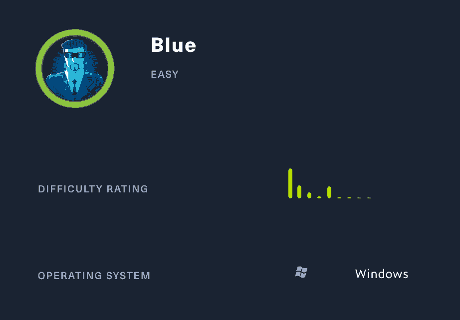

Blue 是黑盒子上最简单的机器之一。但它展示了永恒蓝色漏洞的影响，这种漏洞已被用于通过大规模勒索软件和加密挖掘攻击来危害公司。

我们将使用以下工具将机器典当到一个 [Kali Linux 机器](https://www.kali.org/)上:

*   nmap
*   searchsploit
*   metasploit
*   水表读数器

让我们开始吧。

首先，我在/etc/hosts 文件中添加了蓝色的。

```
nano /etc/hosts
```

随着

```
10.10.10.40     blue.htb
```

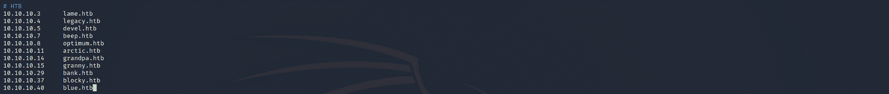

## **第一步-侦察**

开发一台机器的第一步是做一些扫描和侦察。

这是最重要的部分之一，因为它将决定你以后可以尝试利用什么。在这个阶段花更多的时间来获取尽可能多的信息总是更好的。

### 端口扫描

我会用 ****Nmap**** (网络映射器)。Nmap 是一个用于网络发现和安全审计的免费开源工具。

它使用原始 IP 数据包来确定网络上有哪些主机可用、这些主机提供什么服务、它们运行什么操作系统、使用什么类型的包过滤/防火墙以及许多其他特征。

这个工具有许多命令可以用来扫描网络。如果你想了解更多，你可以看一下文档[这里](https://tools.kali.org/information-gathering/nmap)。

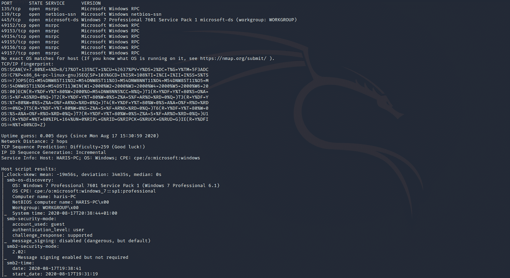

我使用以下命令来执行密集扫描:

```
nmap -A -v blue.htb
```

****-答:**** 启用操作系统检测、版本检测、脚本扫描和跟踪路由

****-v:**** 增加详细等级

**蓝色**。htb:**** 主机名为蓝色方框

如果你觉得这个结果有点令人难以置信，你可以试试这个:

```
nmap blue.htb
```

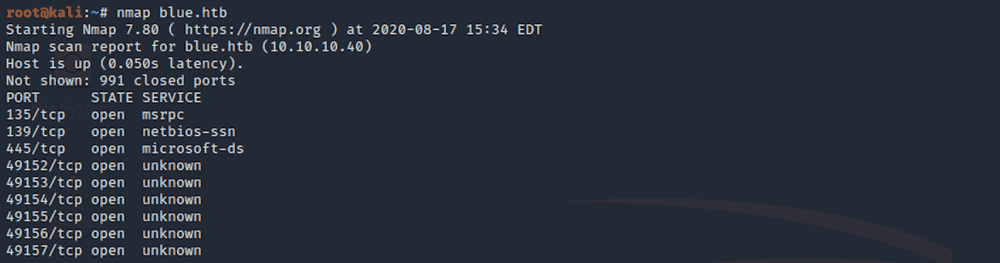

我们可以看到有相当多的开放端口，包括:

********端口****** 445** ，微软-DS(目录服务)SMB 文件共享

从 nmap 扫描中，我们获得了一些关于计算机名称(haris-PC)和 SMB 版本(2.02)的信息。

[服务器消息块(SMB)](https://en.wikipedia.org/wiki/Server_Message_Block) 是一种网络协议，使用户能够与远程计算机和服务器通信，以便使用它们的资源或共享、打开和编辑文件。

从这个盒子的名字以及它是一台打开了 445 端口的 Windows 机器来看，我们可以假设这台机器很容易受到 EternalBlue 的攻击。我使用 nmap 脚本来验证以下信息:

```
nmap --script vuln -p 445 blue.htb
```

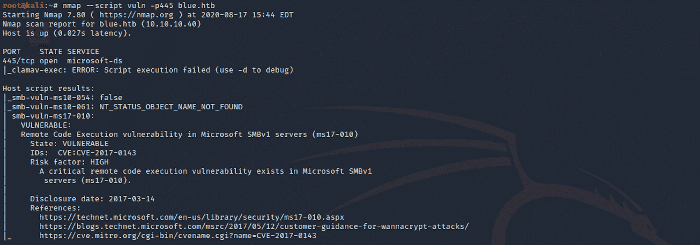

我们可以看到，该机器易受 Microsoft SMBv1 服务器(ms17-010)中的远程代码执行漏洞的攻击。

## **步骤 2 -了解 ms17-010**

ms17-010 是什么？

> **EternalBlue** 是美国国家安全局(NSA)开发的网络攻击漏洞。它是由影子经纪人黑客组织于 2017 年 4 月 14 日泄露的，在微软发布漏洞补丁-维基百科的一个月后

你可以在这里阅读更多 [。此漏洞已得到修补，并在微软的安全公告中列为 MS17-010。](https://docs.microsoft.com/en-us/security-updates/securitybulletins/2017/ms17-010)

EternalBlue 允许黑客远程执行任意代码来访问网络。它利用了 Windows 操作系统 SMB 协议中的漏洞。该漏洞可能危及整个网络和与之相连的设备。

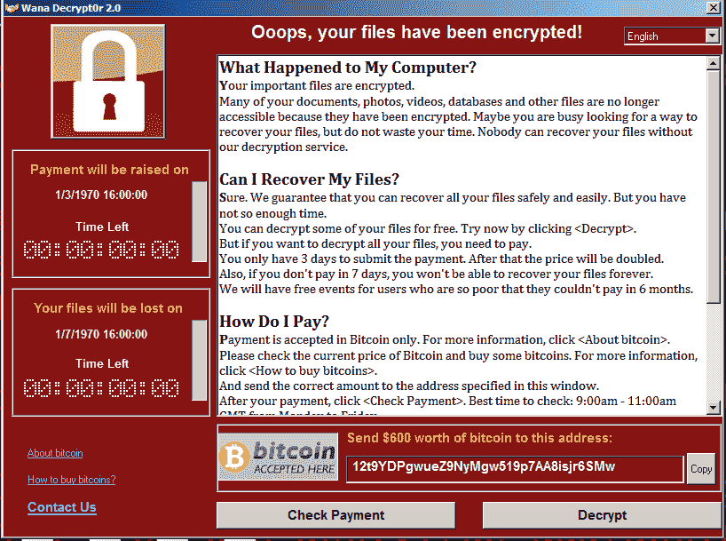

利用 EternalBlue 的恶意软件可以跨网络传播。2017 年，[wanna cry](https://en.wikipedia.org/wiki/WannaCry_ransomware_attack)-一种加密勒索软件-使用了永恒蓝色漏洞，它在网络上传播，感染了所有连接的设备。

## **第三步——开发永恒之蓝**

我使用 ****Searchsploit**** 来检查是否有任何已知的漏洞。Searchsploit 是一款针对[漏洞数据库](https://www.exploit-db.com/)的命令行搜索工具。

我使用以下命令:

```
searchsploit eternalblue
```

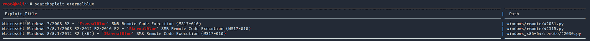

我可以通过以下方式获得漏洞利用的更多详细信息:

```
searchsploit -x 41738.py
```

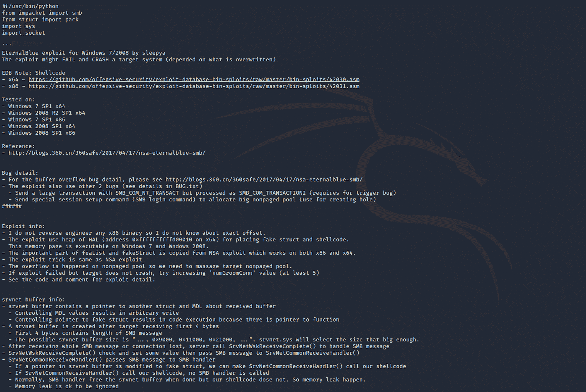

也可以查看 ****漏洞数据库**** 来查找漏洞。

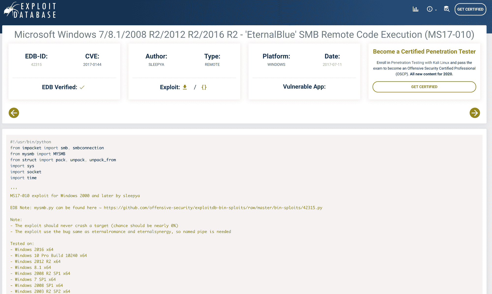

[https://www.exploit-db.com/exploits/42315](https://www.exploit-db.com/exploits/42315)

有一个可用的 Metasploit 模块。

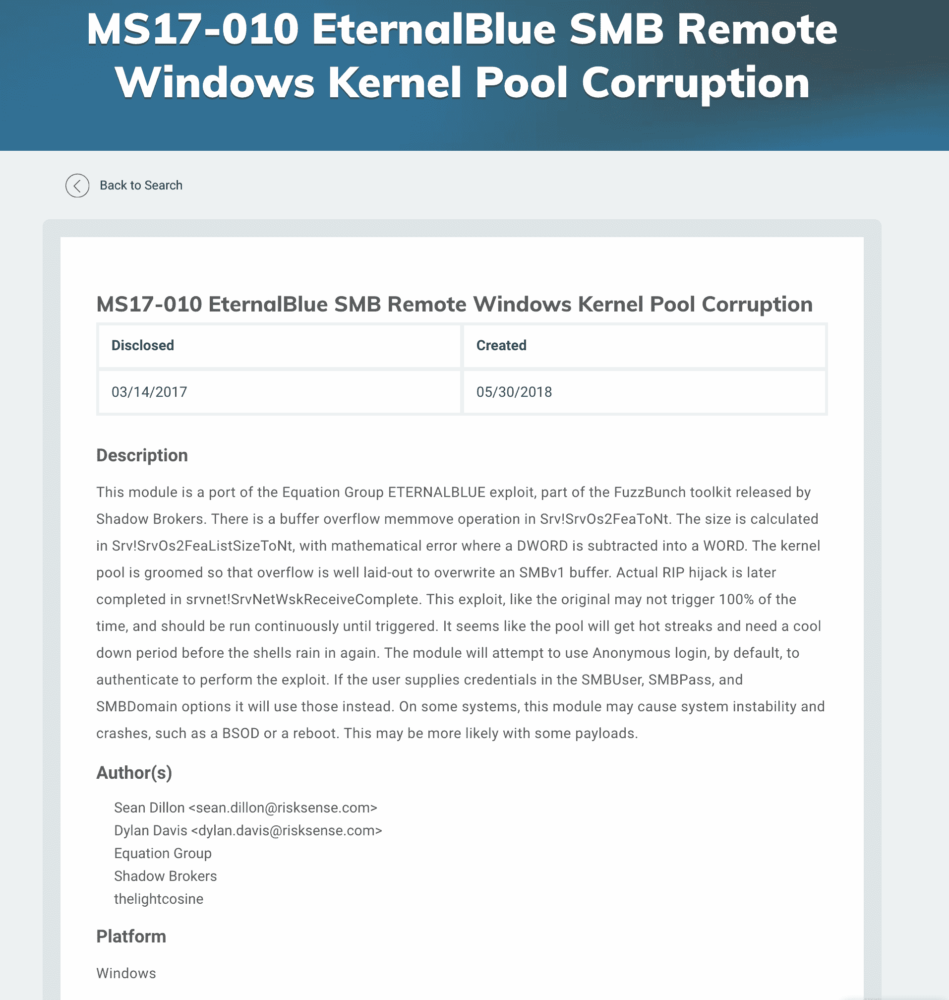

[https://www.rapid7.com/db/modules/exploit/windows/smb/ms17_010_eternalblue](https://www.rapid7.com/db/modules/exploit/windows/smb/ms17_010_eternalblue)

我们将使用 ****Metasploit**** ，这是一个渗透测试框架，使黑客攻击变得简单。这是许多攻击者和防御者的必备工具。


[https://www.metasploit.com/](https://www.metasploit.com/)

我在 Kali 上启动了 ****Metasploit 框架**** ，并寻找我应该用于攻击的命令。

使用以下命令启动 Metasploit 时，不要忘记更新它:

```
msfupdate
```

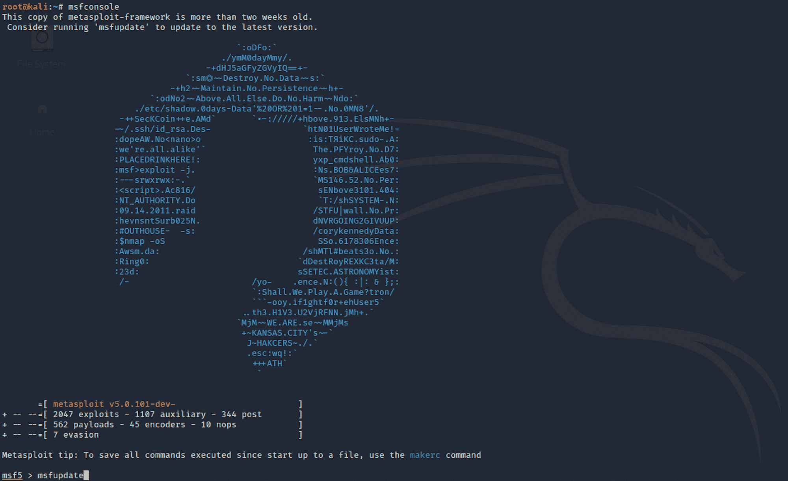

您还可以使用辅助工具检查目标是否容易受到 Metasploit 上的 EternalBlue 的攻击。用这个命令开始:

```
search eternalblue
```

那么在这种情况下

```
use 1
```

选择

```
auxiliary/scanner/smb/smb_ms17_010
```

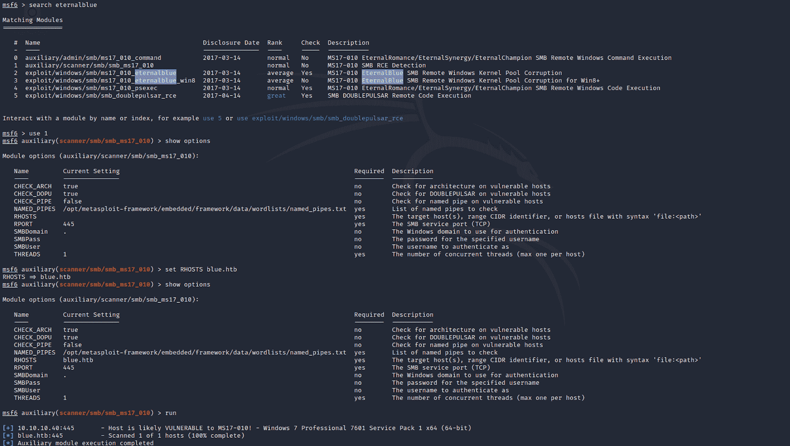

您可以使用检查选项

```
show options
```

并设置 RHOSTS 与

```
set RHOSTS blue.htb
```

然后使用以下命令运行辅助程序

```
run
```

可以看到主机很可能容易受到 MS17-010 的攻击！

现在让我们用以下命令来检查漏洞

```
use 2
```

或者命令

```
exploit/windows/smb/ms17_010_eternalblue
```

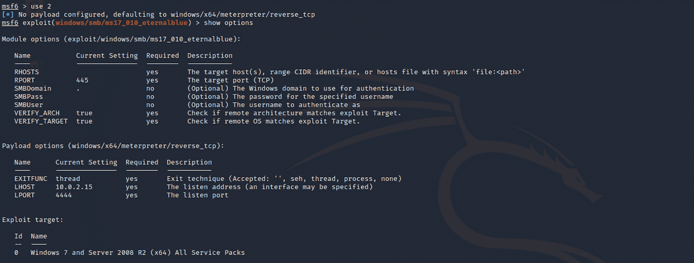

我们需要为 RHOSTS 设置选项


我的成绩是 10.10.14.24。你需要用你自己的主机来设置它。你可以在这里查看你的[。](https://www.hackthebox.eu/home/htb/access)

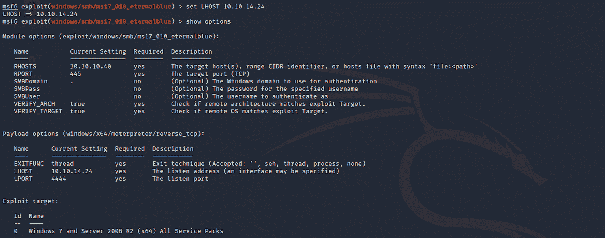

在运行漏洞利用之前，您可以在这里检查机器是否易受攻击——这将运行我们之前使用的辅助命令

```
check
```

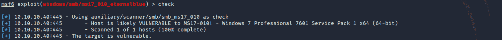

然后，我使用

```
run
```

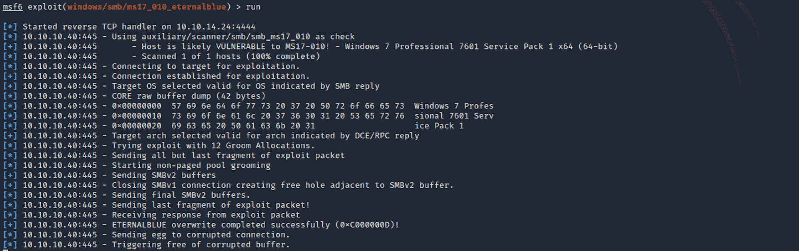

在我得到一个 **Meterpreter** 会话之前，这个漏洞必须运行几次。

下面是来自[攻击性安全](https://www.offensive-security.com/metasploit-unleashed/meterpreter-basics/)的 Meterpreter 的定义:

> Meterpreter 是一个高级的、可动态扩展的有效负载，它使用 **内存中的** DLL 注入阶段，并在运行时通过网络进行扩展。它通过 stager 套接字进行通信，并提供全面的客户端 Ruby API。它具有命令历史，标签完成，渠道，等等。

你可以在这里阅读更多关于 Meterpreter [的内容。](https://www.offensive-security.com/metasploit-unleashed/about-meterpreter/)

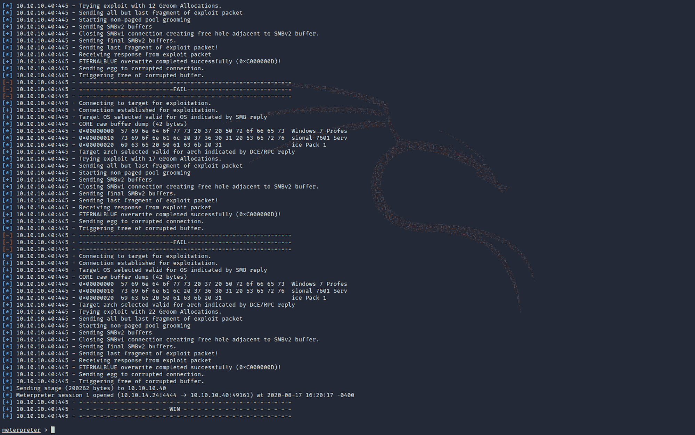

让我们从收集一些信息开始。

****getuid**** 返回调用进程的真实用户 id。

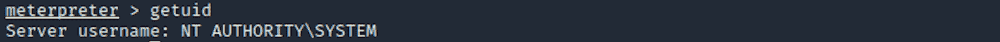

**NT Authority**\**SYSTEM**或 LocalSystem 账号是内置的 Windows 账号。它是 Windows 本地实例上最强大的帐户。我们有那台机器的管理员权限。

## ******第四步****-****寻找 user.txt 标志**

我从 ****文档和**** 设置导航到**哈里斯**文件夹。

我可以使用以下命令列出所有文件/文件夹:

```
ls -la
```

然后我用移动到 ****桌面****

```
cd Desktop
```

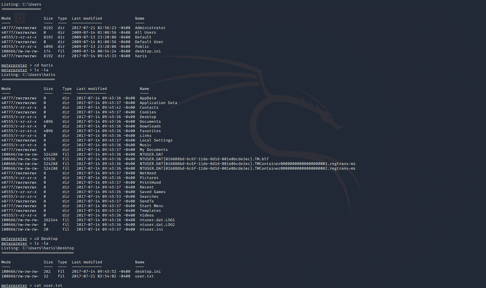

我找到了用户标志！我可以检查文件的内容

```
cat user.txt
```

## ******第五步-**** 寻找 root.txt 标志**

现在让我们找到根旗。我导航到 ****用户**** 并签入到 ****管理员**** / ****桌面**** 文件夹。我找到旗子了！

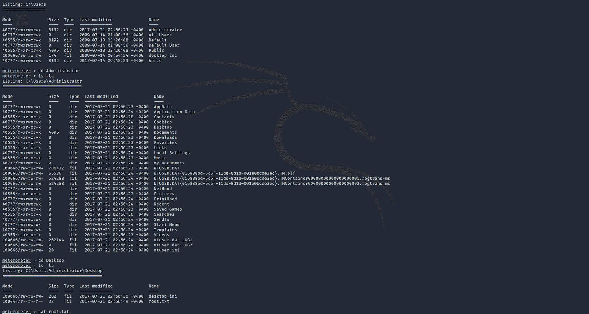

我使用下面的命令来查看文件的内容:

```
cat root.txt
```

恭喜你。你找到了两面旗。

## 补救措施

*   使用 Microsoft Windows SMB v1 安全更新修补您的设备。你可以查看微软安全公告来了解哪些操作系统受到了影响
*   禁用 SMB v1，使用 SMB v2 或 v3
*   将最低特权原则应用于您的所有系统和服务

请随时评论、提问或与朋友分享:)

你可以在这里看到更多**保持冷静黑盒子** [系列文章。](https://www.freecodecamp.org/news/search/?query=keep%20calm%20and%20hack%20the%20box)

你可以在 Twitter 上关注我，也可以在 T2 的 LinkedIn 上关注我。

还有别忘了# ****GetSecure**** ，#****be secure****&#****stay secure****！

