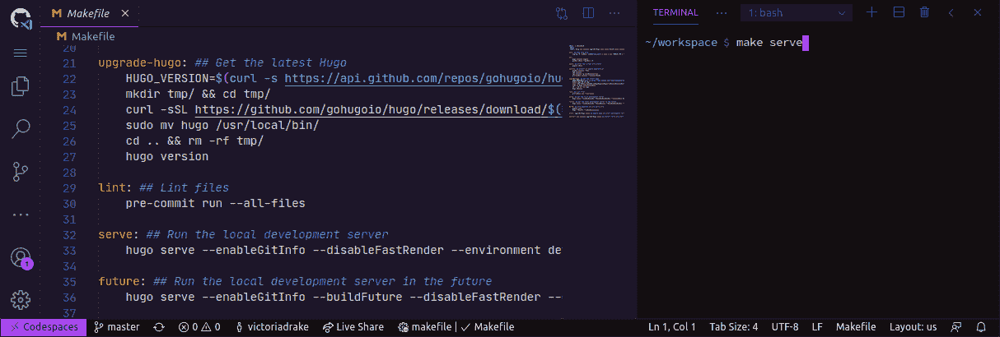

# GitHub 代码空间如何提高生产率和降低壁垒

> 原文：<https://www.freecodecamp.org/news/how-github-codespaces-increase-productivity-and-lower-barriers/>

在本文中，我们将看看 GitHub Codespaces 如何帮助新队友和贡献者消除障碍。

Visual Studio 代码和 GitHub 之间最近的集成确实有助于使开发变得容易和受欢迎。

现在处于测试阶段， [GitHub Codespaces](https://docs.github.com/en/github/developing-online-with-codespaces/about-codespaces) 提供了一个在线的浏览器内 ide，由 Visual Studio 代码提供支持。

这使您可以在任何机器上使用这个全功能的 IDE，包括扩展、终端、Git 命令和您熟悉的所有设置。现在，您可以使用平板电脑或其他基于浏览器的设备将开发工作流程带到任何地方。

代码空间对于开源贡献者来说也是一个好消息。将代码空间配置添加到您的项目中是邀请新成员轻松开始贡献的好方法。

一个新的开源贡献者或者你组织中的新雇员可以快速启动一个代码空间，并且在一个`good first issue`上进行黑客攻击，而不需要设置本地环境或者进行必要的安装。

我们已经在 [OWASP Web 安全测试指南(WSTG)](https://github.com/OWASP/wstg) 中添加了代码空间配置设置。想去兜一圈吗？参见我们的[未决问题](https://github.com/OWASP/wstg/issues)。

## 配置代码空间

您也可以使用 Visual Studio 代码的`.devcontainer`文件夹来为您的存储库配置一个开发容器。

许多[预构建的容器是可用的](https://github.com/microsoft/vscode-dev-containers/tree/master/containers)——只需将您需要的`.devcontainer`复制到您的存储库根目录。如果您的存储库没有，将使用一个默认的基本 Linux 映像。

以下是从您的`.gitignore`文件中删除`.vscode`的原因。在您的库中创建的任何新代码空间现在都将尊重在`.vscode/settings.json`找到的设置。这意味着您的在线 IDE 可以拥有与您在本地机器上相同的工作区配置。那不是很有用吗！

## 使代码空间个性化

对于下一级的[点文件个性化](https://docs.github.com/en/github/developing-online-with-codespaces/personalizing-codespaces-for-your-account)，考虑在`yourusername/dotfiles`提交本地`dotfiles`文件夹中的相关文件作为公共 GitHub 库。

当您创建一个新的代码空间时，这会通过在您的代码空间`$HOME`中创建指向点文件的符号链接来引入您的配置，比如 shell 别名和首选项。这将个性化您在帐户中创建的所有代码空间。

需要一些灵感吗？在 GitHub 上浏览[我的点文件库。](https://github.com/victoriadrake/dotfiles)

## 在代码空间中开发

在代码空间中开发对于 Visual Studio 代码用户来说是一种熟悉的体验，甚至可以在本地运行应用程序。

多亏了[端口转发](https://docs.github.com/en/github/developing-online-with-codespaces/developing-in-a-codespace)，当我在代码空间终端运行应用程序时，点击产生的`localhost` URL 会把我带到适当的端口，作为我的代码空间的输出。

例如，当我在我的代码空间中处理[我的博客](https://victoria.dev/)时，我运行`hugo serve`，然后点击提供的`localhost:1313`链接，在另一个浏览器标签中预览我的更改。

想要在设备之间保持同步？有一个扩展。你可以[从本地机器上的 Visual Studio 代码](https://docs.github.com/en/github/developing-online-with-codespaces/connecting-to-your-codespace-from-visual-studio-code)连接到你的代码空间，这样你总是可以从你离开的地方重新开始。

## 随处发展

Codespaces 是我的 GitHub 工作流程中一个非常令人兴奋的补充。它让我几乎可以在任何地方使用我的 iPad 之类的设备访问我的整个开发过程。

它还将使新的开源贡献者或组织中的新雇员更容易使用设置好的 IDE 投入工作。

如果你有机会获得有限的测试版，我邀请你创建一个代码空间，试着为 WSTG 或者 T2 贡献我的一个开源项目。

我期待着普遍的可用性，并看到开源社区下一步会为 GitHub 代码空间梦想什么！

是的——代码空间支持您最喜欢的 Visual Studio 代码主题。？

Screenshot of a codespace with the [Kabukichō](https://marketplace.visualstudio.com/items?itemName=VictoriaDrake.kabukicho) theme for Visual Studio Code