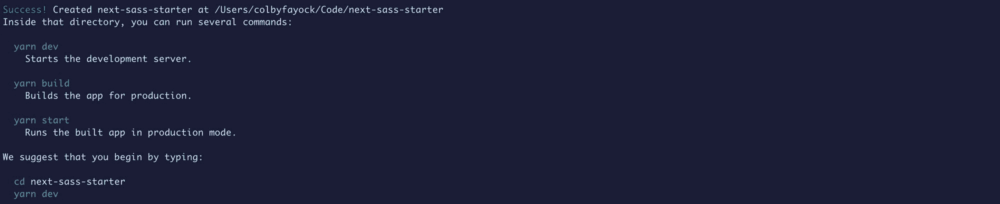
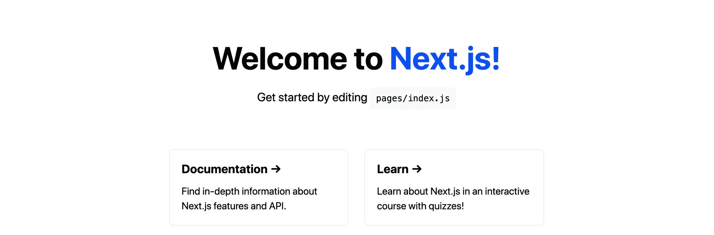
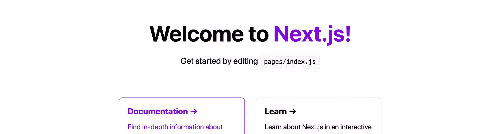
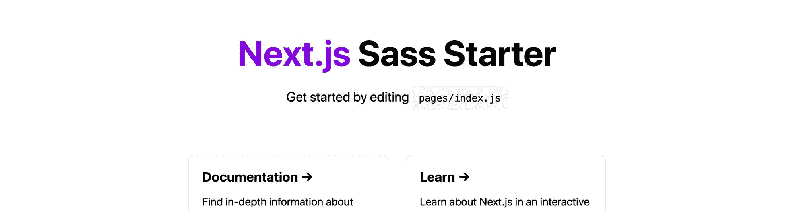

# 如何创建一个 Next.js Starter 来轻松引导一个新的 React 应用程序

> 原文：<https://www.freecodecamp.org/news/how-to-create-a-nextjs-starter-to-easily-bootstrap-a-new-react-app/>

使用像 Next.js 这样的框架，开始使用一个新的 React 应用程序比以往任何时候都更容易。但这些框架并不总是包括所有你想使用的工具。

当用我们最喜欢的工具开始一个新项目时，我们如何使用启动器变得超级高效？

*   [next . js 是什么？](#what-is-next-js)
*   什么是开胃菜？
*   我们要建造什么？
*   [向 Next.js 启动器添加 Sass](#adding-sass-to-a-next-js-starter)
*   [设置 Next.js 入门文档以便于设置](#setting-up-next-js-starter-documentation-for-easy-setup)
*   [其他一些需要考虑的事情](#some-other-things-to-consider)

[https://www.youtube.com/embed/oFGs_x7kxZg?feature=oembed](https://www.youtube.com/embed/oFGs_x7kxZg?feature=oembed)

## Next.js 是什么？

Next.js 是来自 [Vercel](https://vercel.com/) 的一个应用框架，它允许你非常快速地引导一个新的 [React](http://reactjs.org/) 应用。

一些基本功能包括创建[页面](https://nextjs.org/docs/basic-features/pages)和[数据获取](https://nextjs.org/docs/basic-features/data-fetching)，它们允许你生成一个静态站点或使用服务器端渲染来动态加载你的应用。

最重要的是，你可以利用它的高级特性，比如[路由](https://nextjs.org/docs/routing/introduction)或者在你的 UI 旁边创建一个 [API](https://nextjs.org/docs/api-routes/introduction) 。

## 什么是开胃菜？

Starters 基本上是一个模板形式的 git 存储库，允许您轻松地创建预配置的应用程序。

首发没有什么特别的。它的核心是一个 Next.js 应用程序，已经以特定的方式进行了设置，并且通常是通用的，以便任何人都可以使用它。

例如，如果你倾向于每次都以同样的方式构建大量的应用程序，你可能不得不在每次创建一个新的应用程序时重复相同的配置步骤。

相反，你可以创建一个启动程序，从那里开始你的项目——这样就不需要每次都重复第一步。

## 我们要建造什么？

我们将构建一个基本的 Next.js Starter，它将让您或其他任何人以该 Starter 为起点快速、轻松地创建一个新项目。

虽然我们不会过多地讨论特性，因为这里的目标是了解初学者，我们将通过向 Next.js 添加 [Sass](https://sass-lang.com/) 来测试这一点，这样人们就可以很容易地开始使用 CSS 超级功能。

你可以在 GitHub 上查看[首发](https://github.com/colbyfayock/next-sass-starter):【github.com/colbyfayock/next-sass-starter】T2。

## 创建新的 Next.js 启动器

要开始创建启动器，我们需要从 Next.js 应用程序开始。

我们可以通过在您想要创建它的任何目录中运行以下命令来实现这一点:

```
yarn create next-app
# or
npx create-next-app 
```

运行之后，Next.js 会要求您输入项目名称。虽然您可以使用您喜欢的任何名称，但是 Next.js 启动器通常有一个名称模式`next-[name]-starter`。

因此，因为我们正在创建一个 Sass Starter，我可能会把它叫做`next-sass-starter`。



New Next.js app in the terminal

一旦 Next.js 安装了我们所有的依赖项，您就可以导航到该文件夹并运行命令来启动您的开发服务器。

```
yarn dev
# or
npm run dev 
```

一旦开发服务器启动，我们就应该准备好了！



New Next.js app in the browser

在这一点上，我们有了一个基本的开端。如前所述，Next.js Starter 实际上并没有什么特别之处。因此，如果我们把它推送到 Github，我们可以立即开始“按原样”使用它。

您可以通过运行以下命令对此进行测试:

```
yarn create next-app [project-name] -e [GitHub URL]
# or
npx create-next-app [project-name] -e [GitHub URL] 
```

运行之后，您应该设置了一个新目录，其中有一个从 Starter 创建的项目，并安装了所有的依赖项。

但是我们想做的不止这些。我们的目标是添加一些功能，帮助一个应用程序以比默认更多的方式启动，所以让我们添加 Sass。

[跟随提交！](https://github.com/colbyfayock/next-colbyfayock-starter/commit/ed87ce9d6585b2b642adf7e6878d0fc01bba05ef)

## 将 Sass 添加到 Next.js Starter

注意:在我们的例子中，我们将创建一个 Sass 启动器，正如上面的名字所暗示的那样。在这一点上，您可以随意添加您想要的任何特性，无论它是否包含 Sass。

记住——这里的目标是提供一些我们在用这个 Starter 创建新项目时能够使用的东西。

接下来，我们希望将 Sass 添加到我们的项目中。首先，我们希望将 sass 作为一个依赖项进行安装:

```
yarn add sass
# or
npm install sass 
```

接下来，因为 Next.js 已经寻找了`.scss`作为文件扩展名，我们可以简单地将`styles`目录下的两个 CSS 文件更新为`.scss`。

因此，请更改以下文件:

```
styles/globals.css => styles/globals.scss
styles/Home.module.css => styles/Home.module.scss 
```

接下来，我们需要设置导入语句来识别新的文件扩展名。

在`pages/_app.js`中，将顶部的样式导入更新为:

```
import '../styles/globals.scss' 
```

在`pages/index.js`中，将样式导入更新为:

```
import styles from '../styles/Home.module.scss' 
```

此时，您可以启动您的开发服务器，我们仍然应该看到默认的 Next.js 页面。


Next.js app should look the same

为了查看我们的 Sass 的运行情况，我们可以更新一些类来使用嵌套样式而不是单独的选择器。

将`styles/Home.module.scss`内的所有`.footer`选择器更新如下:

```
.footer {

  width: 100%;
  height: 100px;
  border-top: 1px solid #eaeaea;
  display: flex;
  justify-content: center;
  align-items: center;

  img {
    margin-left: 0.5rem;
  }

  a {
    display: flex;
    justify-content: center;
    align-items: center;
  }

} 
```

您可以使用相同的嵌套结构来更新`.title`和`.card`。

我们还可以将以下内容添加到我们的`styles/Home.module.css`文件的顶部:

```
$color-primary: #0070f3; 
```

并从`#0070f3`到`$color-primary`更新该文件中颜色的所有实例:

```
.title {
  ...
  a {
    color: $color-primary; 
```

如果你重新加载页面，什么都不会改变。但是将该变量更新为您喜欢的颜色，例如:

```
$color-primary: blueviolet; 
```

现在所有的颜色都变了。



Updated colors in the Next.js app

最后，既然我们现在有了一个 Sass 启动器，让我们更新页面的标题。替换“欢迎来到 Next.js！”在`pages/index.js`到:

```
<h1 className={styles.title}>
  <a href="https://nextjs.org">Next.js</a> Sass Starter
</h1> 
```

现在我们有了一个 Sass 的起点！



Updated title in the Next.js app

与之前类似，一旦所有的更改都在 GitHub 上，您可以通过用您的启动器创建一个新项目来测试这一点。

```
yarn create next-app [project-name] -e [GitHub URL]
# or
npx create-next-app [project-name] -e [GitHub URL] 
```

[跟随提交！](https://github.com/colbyfayock/next-sass-starter/commit/56c5b67e8a383d8dc89c72d88cbe86adbac3edb8)

## 设置 Next.js Starter 文档以便于设置

可以说，对于初学者来说，最重要的事情之一就是文档。

如果你只是自己使用它，它可能就不那么重要了。但是，如果你想让其他人使用它，你希望他们知道如何使用它，否则他们会卡住，变得沮丧。

最重要的部分是启动设置。在 GitHub repo 中设置启动器是很好的第一步。但是如果有人想使用这个启动器，他们必须克隆或下载这个回购，然后删除 git 历史。

相反，您可以将我们上面使用的命令添加到您的`README.me`文件中，给人们提供如何快速开始的指导，例如:

```
## Getting Started

Run the following command to create a new project with this Starter:

```
yarn create next-app [project-name] -e https://github.com...
# or
npx create-next-app [project-name] -e https://github.com...
``` 
```

这将防止那些可能不知道如何手动完成这些事情的人陷入困境。

添加您已经添加的配置选项的任何文档也很重要。

如果你添加了一些变量，允许你改变一些站点范围的特性，确保添加关于这些的注释。

你最终想让人们明白如何使用你添加的功能来让他们的生活更轻松。如果他们不理解，他们可能会直接把代码撕下来，手动完成。

最终，创建和发布一个初学者是为了让人们的生活更容易。无论是你几个月后回到你的初始阶段，还是一群希望变得更有效率的新人，你都可以通过添加好的文档给他们更好的开发体验。

## 一些其他需要考虑的事情

### 为 Next.js 初学者概括特性和添加配置

添加特性是让初学者更容易被使用的一个好方法。如果我用一个启动器来创建一个新的博客，我会喜欢这个启动器包含我作为作者的名字，甚至是一个关于我的页面。

但是我不想要的是在整个代码中替换别人的名字 100 次来更新我自己的项目。更不用说，在首页上看到这个名字可能会让我觉得这更像是他们的博客，而不是我可以用于我的项目的模板。

考虑在整个项目中使用通用名称。不要在整个 Starter 中使用 Colby Fayock 的博客，让它成为我的博客，这将使使用 Starter 的人对创建者来说感觉不那么私人。

还要添加一些配置选项。能够更新一个变量，使我的项目包含 Colby Fayock 而不是我的博客，这比手动搜索所有文件进行更改要容易得多。

### 仔细选择坚持己见的地方

当使用像 Sass 这样的工具时，使用该工具的方式不止一种。如果你建立了一个非常具体和固执己见的项目结构，你就会疏远使用你的启动器的人。

这要么迫使他们重做整个项目，要么让他们想要删除一堆代码，这可能会让他们不想在未来使用它。

你可以创造固执己见的创业者，但要明智地选择在哪里注入这些观点。这将使你的工作能被更多想要提高效率的人所利用。

如果你想创造一些非常固执己见的东西，考虑给它起一个不同的名字，并使用这个工具作为名字的一部分。例如，我可以创建一个固执己见的 Sass Starter，名为 Colby 的 Sassy Next.js Starter。

## 你创造了一个新的首发吗？

在 Twitter 上与我分享！

[](https://twitter.com/colbyfayock)

*   [？在 Twitter 上关注我](https://twitter.com/colbyfayock)
*   [？订阅我的 Youtube](https://youtube.com/colbyfayock)
*   [✉️注册我的简讯](https://www.colbyfayock.com/newsletter/)
*   [？赞助我](https://github.com/sponsors/colbyfayock)