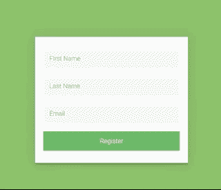

# 初学者 React 项目——如何使用 React 挂钩构建基本表单

> 原文：<https://www.freecodecamp.org/news/beginner-react-project-build-basic-forms-using-react-hooks/>

## 我们正在建造的东西

在这个初学者 React 项目中，我们将学习如何使用 React 钩子构建基本表单。我们将学习如何管理表单状态、处理验证以及使用提交处理程序。

看看这个:



## 你自己试试

如果你想自己先试一试，这里有一些场景(你也可以从下面获取 CSS/starter 代码):

*   用户应该能够在表单中输入值
*   当用户单击 submit 时，如果有任何字段为空，那么就会出现红色的错误消息
*   如果表单已提交并且有效，应该会出现一条成功消息

## 视频漫游

点击这里查看 YouTube 上的视频演示。

## 起始代码

在 GitHub 这里下载。

## 我们走吧！添加状态

我们将从添加一个状态对象来保存表单开始。我们将在 **App.js** 中的`App function`顶部添加新的一行，并添加以下内容:

```
const [values, setValues] = useState({
	firstName: '',
	lastName: '',
	email: '',
}); 
```

表单上有三个字段，我们需要知道它们的状态。

现在，初始状态是一个物体。这个对象有三个值，每个字段一个值。所以我们用和表格中相似的名字来称呼它们。

`firstName`将被初始设置为空白，`lastName`和`email`也是如此。

现在，您会注意到一个错误，说“useState 未定义”，所以您需要在这里从 React 导入它。作为导入的一部分，在文件的顶部执行此操作:

```
import React, { useState } from "react"; 
```

好的，现在它告诉我们这些变量还没有被使用。这很好，因为我们还没有将这些值应用于表单。但是到目前为止，我们所做的只是创建了一个状态对象，这个状态对象拉动`firstName`、`lastName`和`email`。

既然我们在 state 中有了一些值，将它们应用到我们输入字段中是有意义的。向每个输入字段添加一个`value`属性，如下所示:

```
 <input
    id="first-name"
    class="form-field"
    type="text"
    placeholder="First Name"
    name="firstName"
    value={values.firstName}
/>

<input
    id="last-name"
    class="form-field"
    type="text"
    placeholder="Last Name"
    name="lastName"
    value={values.lastName}
/>

<input
    id="email"
    class="form-field"
    type="text"
    placeholder="Email"
    name="email"
    value={values.email}
/> 
```

我们在这里所做的就是说，“好的，对于这个输入，值将是状态中的任何值。”让我们保存它，看看我们的表单中发生了什么，以确保事情仍然在工作。

他们没有。哦，不！

如果您选择一个输入并开始在键盘上用力打字，屏幕上不会出现任何内容。这是怎么回事？

## 更新输入状态

我们已经说过，这个输入的值将会是它的状态。

例如，`firstName`当前被设置为空白，因为这是我们设置的，但是我们还没有告诉输入，“好的。每当我打字或输入改变时，我希望你用新值更新状态。”

每当我们这样做时，它有效地控制了反应。所以我们必须告诉 React 也更新这些值。

这意味着我们必须随时在这些字段中输入状态值。

好吧。最简单的方法是为每个输入字段创建一个**处理程序**,它会在发生 on change 事件时更新状态。

继续在状态对象下添加以下内容:

```
const handleFirstNameInputChange = (event) => {
	event.persist();
	setValues((values) => ({
		...values,
		firstName: event.target.value,
	}));
}; 
```

这是我们从`onChange`得到的事件。我们基本上是更新这个对象，然后将它保存回状态。

我们将通过三个点来复制旧值，这也称为扩展操作符。然后，我们只需键入值并添加一个逗号。

接下来，我们说**名字将等于事件.目标.值**。我们希望将此添加到我们的输入中。因此，在我们的 JSX 中，在为名字输入的**中，我们将在某处(任何地方，这并不重要)另起一行，并像这样添加`onChange`属性:**

```
<input 
    id='first-name' 
    class='form-field' 
    type='text' 
    placeholder='First Name' 
    name='firstName' 
    value={values.firstName} 
    onChange={handleFirstNameInputChange} /> 
```

现在，如果我们进入我们的浏览器并开始输入，你可以看到事情的工作。其余的都不起作用，因为我们还没有为它们添加处理程序。我们一会儿就来看看。

简单回顾一下正在发生的事情:每当我们在这个框中输入内容，每次击键都会发生 **onChange 事件**。每次都会被调用。

事件由 React 传入，我们希望更新状态对象。为此，我们调用`setValues`函数并传递一个带有更新值的新对象。

现在，我们只想对`lastName`和`email`做同样的事情。为每个添加另一个处理程序:

```
const handleLastNameInputChange = (event) => {
	event.persist();
	setValues((values) => ({
		...values,
		lastName: event.target.value,
	}));
};

const handleEmailInputChange = (event) => {
	event.persist();
	setValues((values) => ({
		...values,
		email: event.target.value,
	}));
}; 
```

不要忘记将`onChange`属性添加到每个的输入字段中:

```
 <input
    id="last-name"
    class="form-field"
    type="text"
    placeholder="Last Name"
    name="lastName"
    value={values.lastName}
    onChange={handleLastNameInputChange}
/>
<input
    id="email"
    class="form-field"
    type="text"
    placeholder="Email"
    name="email"
    value={values.email}
    onChange={handleEmailInputChange}
/> 
```

好吧。现在是关键时刻了。一切都正常吗，或者我们在这个过程中有没有打破什么？让我们试试看。填写一些数据，输入字段现在应该可以工作了。万岁！

即使我们的输入字段工作正常，我们仍然有一个有趣的问题，如果我们在表单中键入内容并尝试提交，它不会做任何事情。它只会刷新页面，所有的表单数据都会丢失。

让我们做点什么。

## 显示成功消息

单击注册后，如果表单有效，应该会显示一条成功消息。我们要做的是转到我们的 JSX，并在表单下添加一个新的 div。同样，我已经为您添加了成功消息的类:

```
<div class='success-message'>Success! Thank you for registering</div> 
```

当然，这不会有任何进展。它只是假装我们调用了某个服务器或某个端点。它会返回一条成功消息，因此我们将向用户显示这条消息。

但目前它一直在出现。我们想要的只是在用户成功提交表单时显示出来。

因此，我们将添加另一个状态对象，如下所示:

```
const [submitted, setSubmitted] = useState(false); 
```

我们将把它与值分开，因为它是表单的不同部分。我们不想把这里的所有东西都混在一起，导致整个重新渲染。这将告诉我们表单是否已经提交。

它最初将被设置为`false`,因为用户第一次登陆该页面时，它不会被提交。

现在，我们只想在 JSX 做一些聪明的事情来说，“如果提交是真的，那么我们想显示成功的消息。”

用以下内容更新我们刚刚添加的行:

```
{showSuccess && <div class='success-message'>Success! Thank you for registering</div>} 
```

我们将把我们的**成功消息**包装在一个三元运算符中。这基本上是一个简化的 if 语句，让我们可以在页面上动态地呈现内容。

现在，只有当`showSuccess`为真时，才会出现成功消息。正如你现在在浏览器中看到的，这已经消失了。

如果我们跳回到`submitted`的状态对象，并将其更改为`true`，它应该会再次出现。确实如此。

我们会把它改回 false。然后我们将刷新我们的 Chrome，看看现在会发生什么。

我们还没有告诉注册按钮或表单在 summit 上发生了什么，所以它仍然会刷新页面。现在，我们只需要一个新的处理程序来处理注册按钮点击。

如果我们跳转到我们的事件处理程序并添加以下内容:

```
const handleSubmit = (e) => {
	e.preventDefault();
	setSubmitted(true);
}; 
```

将阻止我们一直看到的刷新发生。

一会儿我们会在这里添加一些关于验证和其他东西的逻辑。但是现在，我们只是说“setSubmitted”是真的。

接下来，我们需要告诉表单在提交时调用这个函数。更新 JSX，在表单标签中包含一个`onSubmit`属性，如下所示:

```
<form class='register-form' onSubmit={handleSubmit}>
	//... other code
</form> 
```

现在，如果我们在浏览器中运行代码，单击 register 按钮，就会出现消息。万岁！

## 添加验证并显示错误消息

到目前为止，我们的表单看起来不错，但是我们缺少任何表单的一个关键组件，那就是验证。如果我们看一下我们的工作示例，如果我提交的时候有任何空字段，就会出现一个错误，说“请输入您的详细信息。”

在每个输入下面，我们将添加一个`<span>`来保存错误消息。您的 JSX 看起来应该如下所示:

```
 <input
    id="first-name"
    class="form-field"
    type="text"
    disabled={showSuccess}
    placeholder="First Name"
    name="firstName"
    value={values.firstName}
    onChange={handleInputChange}
/>
<span id="first-name-error">Please enter a first name</span>

<input
    id="last-name"
    class="form-field"
    type="text"
    placeholder="Last Name"
    name="lastName"
    value={values.lastName}
    onChange={handleInputChange}
/>
<span id="last-name-error">Please enter a last name</span>

<input
    id="email"
    class="form-field"
    type="text"
    placeholder="Email"
    name="email"
    value={values.email}
    onChange={handleInputChange}
/>
<span id="email-error">Please enter an email address</span> 
```

你可以看到这些错误总是出现，因为我们没有任何条件逻辑说“不要出现”

现在，我们只希望这些错误消息显示注册按钮是否被单击。

我们将跳回代码。我们希望在错误消息中添加一些条件逻辑，以便它们仅在按钮被单击且字段为空时出现:

```
{submitted && !values.firstName && <span id='first-name-error'>Please enter a first name</span>} 
```

我们在这里做的是检查表单是否被提交，以及`firstName`状态对象是否为空。如果是这样，我们希望显示错误消息。同样，我们只是使用一个三元运算符，没有什么特别的！

对其他错误执行相同的操作:

```
{submitted && !values.lastName && <span id='last-name-error'>Please enter a last name</span>}

//...other code

{submitted && !values.email && <span id='email-error'>Please enter an email address</span>} 
```

如果我们将表单留空并单击 register，则会出现错误。如果我们开始输入东西，我们可以看到错误消失了。如果我们删除我们输入的内容，错误会再次出现。

让我们试着提交一些材料。好吧，这看起来有用。

我们要做的最后一件事就是确保只有当表单有效时，这个成功消息才会出现。继续添加新的状态值:

```
const [valid, setValid] = useState(false); 
```

这用来告诉我们我们的表单是否有效——记住，使用状态对象是保存应用程序不同部分的“状态”的好方法(谁会想到呢？).

只有当“已提交”为真且“已跟踪”也为真时，才会出现成功消息。因为我们最初已经将 valid 设置为 false，所以它不会显示出来。

在我们的`handleSubmit`函数中，我们想说如果一个表单是有效的，那么 value 就是 true。我们可以通过检查表单字段的每个状态值来做到这一点，确保它们是真值。

添加以下内容:

```
 const handleSubmit = (event) => {
event.preventDefault();
if(values.firstName && values.lastName && values.email) {
    setValid(true);
}
setSubmitted(true);
} 
```

如果这些字段中的任何一个为假，那么`valid`将保持为假。这意味着不会显示成功消息 div。让我们看看它的工作。如果我们在没有这些字段的情况下单击注册，我们的错误消息就会出现。让我们输入一些有效的内容，点击注册，消息就出现了！

## 想要更多项目创意？

为什么不尝试构建一些 React 项目来进一步促进您的学习呢？我每隔几周就发一次电子邮件，内容包括项目想法、启动代码和技巧。[订阅，让它直接进入你的收件箱！](https://subscribe.jschris.com)