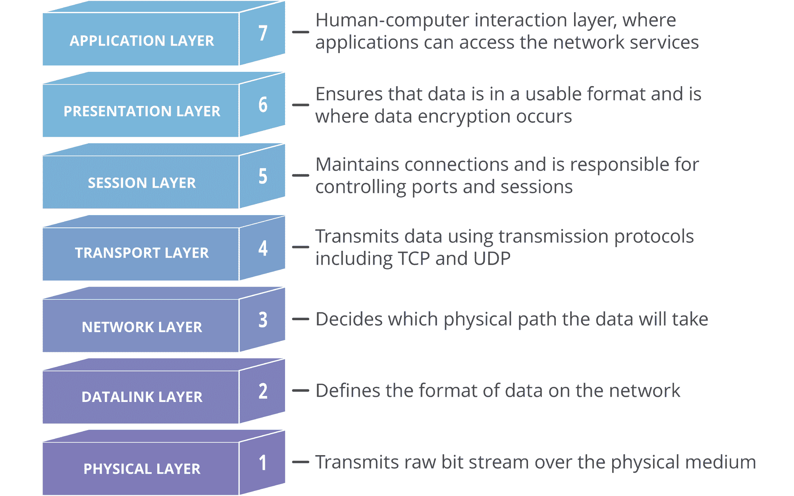
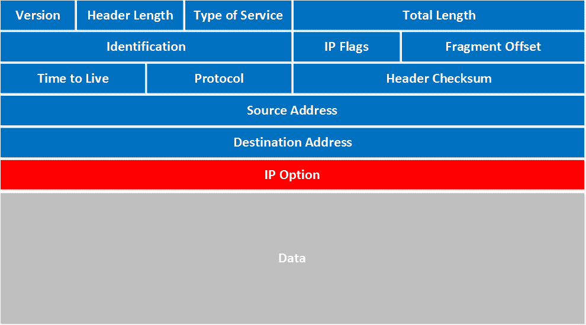
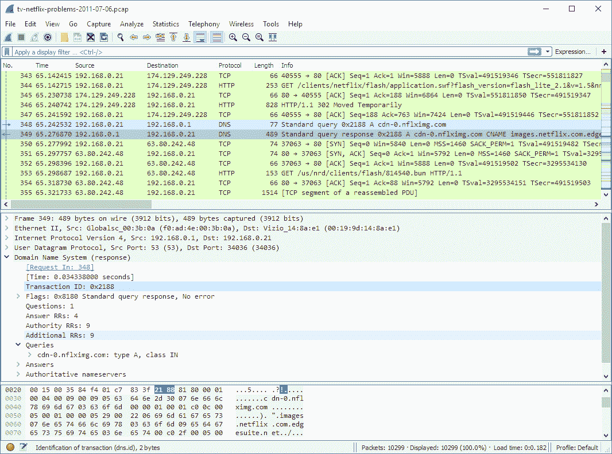
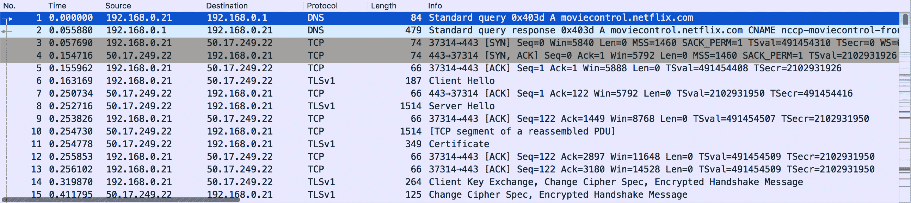
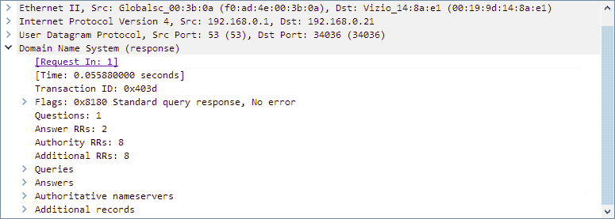

# 如何使用 Wireshark，最好的数据包分析器

> 原文：<https://www.freecodecamp.org/news/how-to-use-wireshark-packet-analyzer/>

Wireshark 是最好的网络流量分析器和数据包嗅探器。在本文中，我们将详细研究它。

Wireshark 是一款网络分析器，可以让您看到网络上发生了什么。它让您在微观层次上剖析您的网络数据包，为您提供关于单个数据包的深入信息。

Wireshark 于 1998 年首次发布(当时被称为 Ethereal)。它可以在所有主流操作系统上运行。大多数企业和政府机构现在更喜欢使用 Wireshark 作为他们的标准网络分析仪。

Wireshark 也是完全开源的，这要感谢世界各地的网络工程师社区。虽然大多数安全工具都是基于 CLI 的，但 Wireshark 提供了出色的用户界面。

## OSI 模型

我假设您是网络新手，所以我们将介绍 OSI 模型的一些基础知识。这对理解 Wireshark 的核心功能很重要。

开放系统互连(OSI)模型标准化了两个或多个设备相互连接的方式。OSI 模型将网络体系结构分为 7 层:应用层、表示层、会话层、传输层、网络层、数据链路层和物理层。

下面是每一层的作用:

*   物理层—负责设备之间的实际物理连接。数据以**位**的形式传输。
*   数据链路层-确保数据没有错误。数据在**帧**中传输。
*   网络层—负责寻找发送数据的最佳(最快)方式。发送方和接收方的 IP 地址被添加到该层的报头中。
*   传输层—充当网络层和会话层之间的桥梁。使用 TCP 和 UDP 等协议发送和接收数据。这一层的数据称为**段**。
*   会话层—建立并维护设备之间的会话。
*   表示层—在这里，来自细分市场的数据被转换为更加人性化的格式。负责加密和解密。
*   应用层—与用户交互的层。如果你用的是浏览器，它在应用层。

下图应该有助于您理解这些组件是如何协同工作的。



OSI Model

如果你有兴趣了解更多关于 OSI 模型的知识，[这里有一篇详细的文章给你](https://www.geeksforgeeks.org/layers-of-osi-model/)。

## 小包裹

既然您已经牢固地掌握了 OSI 模型，让我们来看看网络数据包。当数据从一台计算机传输到另一台计算机时，数据流由称为数据包的较小单元组成。

当您从 internet 下载文件时，数据是以数据包的形式从服务器发送的。这些数据包由您的计算机重新组装，为您提供原始文件。



IPV4 Packet

数据包可以包含以下数据:

*   源和目标 IP 地址
*   草案
*   源端口和目的端口
*   数据
*   长度、标志、TTL 等等

每个数据包都包含数据包传输中涉及的设备的重要信息。每次数据传输都涉及源设备和目的设备之间发送的数千甚至数百万个数据包。

现在你可以理解 Wireshark 的重要性了。Wireshark 允许您捕获每个数据包，并检查其中的数据。

对于网络工程师来说，Wireshark 类似于生物学家的显微镜。Wireshark 允许您“监听”实时网络(在您建立连接后)，并即时捕获和检查数据包。

作为网络工程师或职业黑客，您可以使用 Wireshark 来调试和保护您的网络。作为一个恶意黑客(我不推荐)，你可以“嗅”网络中的数据包，捕捉类似信用卡交易的信息。

这就是为什么连接到像星巴克这样的公共网络并执行金融交易或访问私人数据是不明智的。即使带有 HTTPS 的站点可以加密您的数据包，它在网络上仍然是可见的。如果有人真的想破解，他们可以。

## Wireshark 基础知识

现在让我们看看如何使用 Wireshark。[从这里下载并安装 Wireshark】。](https://www.wireshark.org/#download)

Wireshark 有一个很棒的 GUI，不像大多数渗透测试工具。这是 Wireshark 加载后的样子。


Wireshark Startup

Wireshark 列出了您所连接的网络，您可以选择其中一个并开始监听该网络。



Wireshark UI

Wireshark 中有三个窗格。

### 数据包列表窗格

此窗格显示捕获的数据包。每一行代表一个单独的数据包，您可以单击它并使用其他两个窗格进行详细分析。



Packet List Pane

### 数据包详细信息窗格

您可以选择一个数据包，然后使用 Packet Details(数据包详细信息)窗格查看更详细的数据包信息。它显示 IP 地址、端口等信息，以及数据包中包含的其它信息。



Packet Details Pane

### 数据包字节窗格

此窗格以字节为单位给出所选数据包的原始数据。数据显示为十六进制转储，即以十六进制显示二进制数据。


Packet Bytes Pane

## 过滤

Wireshark 具有过滤器，可帮助您缩小要查找的数据类型。有两种主要类型的过滤器:捕获过滤器和显示过滤器。

### 捕获过滤器

您可以在开始分析网络之前设置捕获过滤器。当您设置捕获过滤器时，它只捕获与捕获过滤器匹配的数据包。

例如，如果您只需要监听从一个 IP 地址发送和接收的数据包，您可以按如下方式设置捕获过滤器:

```
host 192.168.0.1
```

一旦设置了捕获过滤器，在当前捕获会话完成之前，您将无法对其进行更改。

### 显示过滤器

显示过滤器用于捕获数据包。例如，如果您想只显示来自特定 ip 的请求，您可以按如下方式应用显示过滤器:

```
ip.src==192.168.0.1
```

由于显示过滤器应用于捕获的数据，因此可以随时更改。

简而言之，捕获过滤器使您能够过滤流量，而显示过滤器将这些过滤器应用于捕获的数据包。由于 Wireshark 可以在繁忙的网络上捕获数百个数据包，因此在调试时非常有用。

## Wireshark 的核心功能

现在您已经很好地掌握了 Wireshark 的基础知识，让我们来看看一些核心特性。使用 Wireshark，您可以:

*   识别网络上的安全威胁和恶意活动
*   观察网络流量以调试复杂网络
*   根据协议、端口和其他参数过滤流量
*   捕获数据包并将其保存到 Pcap 文件中，以供离线分析
*   对数据包列表应用着色规则，以便进行更好的分析
*   将捕获的数据导出到 XML、CSV 或纯文本文件。

## 结论

Wireshark 每年都被评为十大网络安全工具之一。凭借其简单而强大的用户界面，Wireshark 易于学习和使用。它是每个渗透测试人员工具箱中的宝贵资产。

希望这篇文章能帮助您更好地理解 Wireshark。我最近写了一篇关于作为网络安全工程师应该知道的十大工具的文章。如果你对网络安全感兴趣，一定要去看看。

我经常写关于机器学习、网络安全和 DevOps 的文章。你可以在这里注册我的 [*周报*](https://www.manishmshiva.com/) *。*