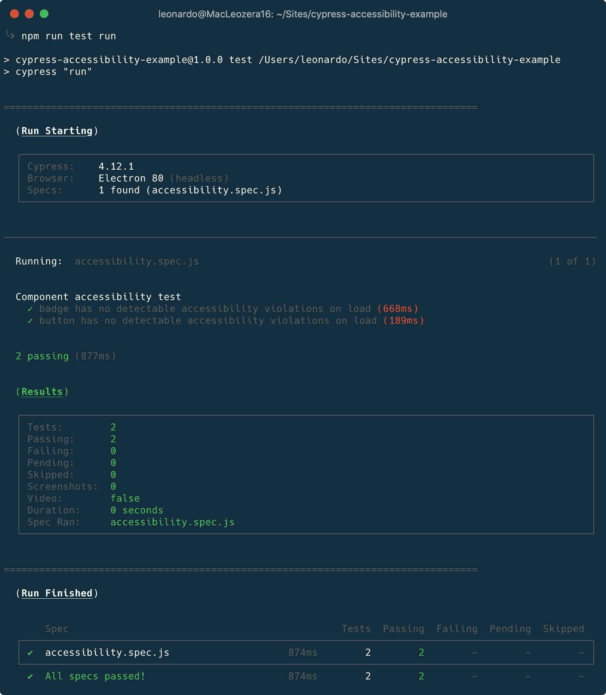
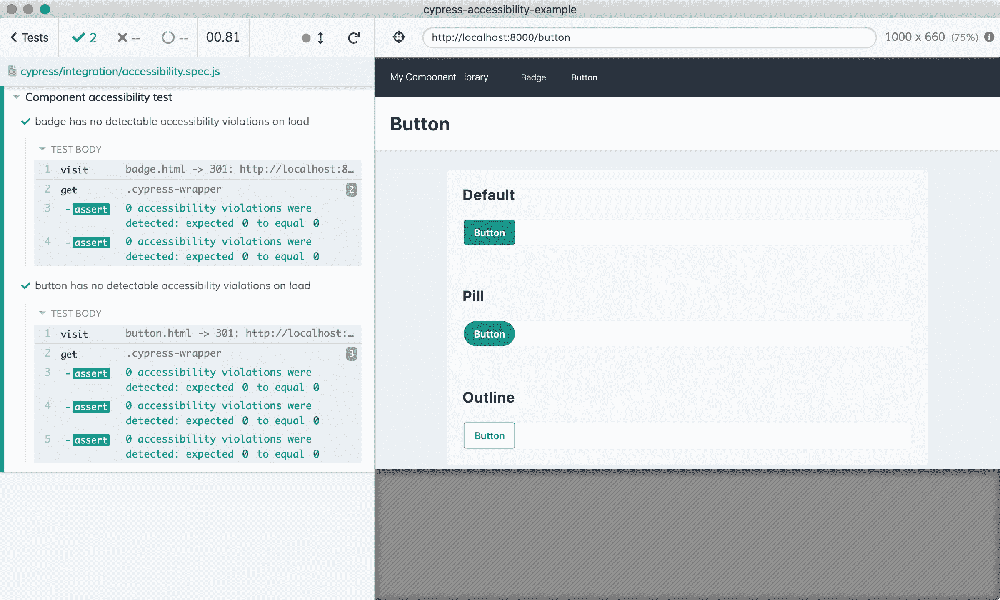
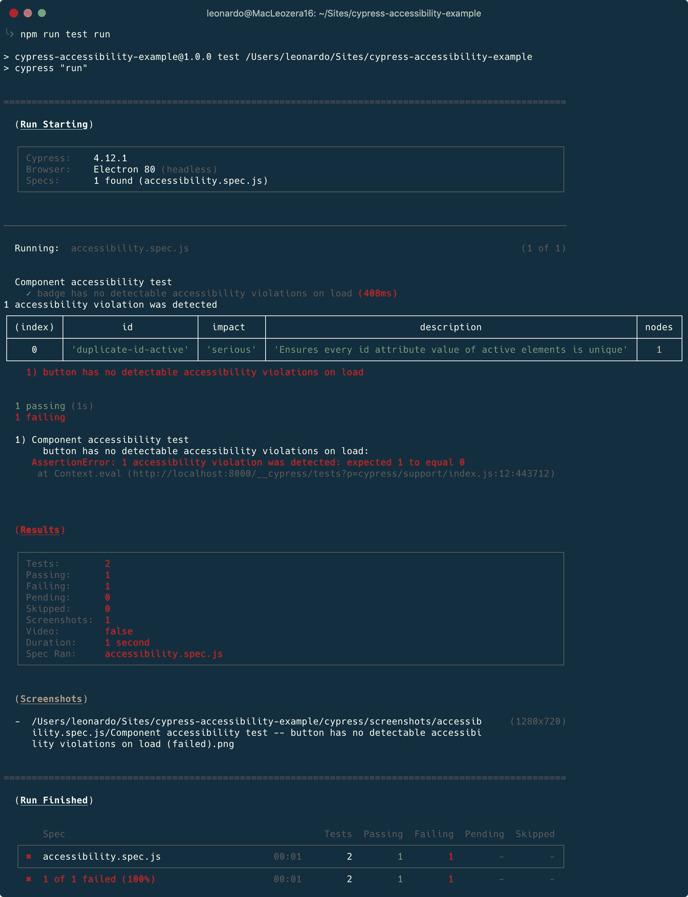

# 如何用 Cypress 自动化可访问性测试

> 原文：<https://www.freecodecamp.org/news/automating-accessibility-tests-with-cypress/>

在我的[上一篇文章](https://www.freecodecamp.org/news/how-to-add-screenshot-testing-with-cypress-to-your-project/)中，我介绍了如何在 Cypress 中添加截图测试，以确保组件不会随着时间的推移而发生意外变化。

现在，我将分享如何用 Cypress 自动化可访问性测试。

## 我们为什么要关心可访问性？

简答:因为这是应该做的事情。

详细回答:无障碍网络可以帮助残疾人改善他们的生活。

有不同种类的残疾，包括听觉、认知、神经、身体、语言和视觉残疾。作为产品创造者、工程师和设计师，我们的目标是创造包含所有人的体验。

值得一提的是，网络无障碍也有利于无残疾的人。

例如，可访问的网站可以帮助因年龄增长而改变能力的人、互联网连接速度慢的人或使用小屏幕设备的人。

残疾也可能是暂时的。例如，一个手臂骨折的人不能同时打字和使用鼠标。

如果你想了解这个话题，我可以推荐[W3C Web Accessibility Initiative(W3C WAI)](https://www.w3.org/WAI/)和[A11Y 项目](https://www.a11yproject.com/)。

## 易访问性测试技术

有不同的方法来测试您的网站/应用程序是否可访问。W3C WAI 有一个包含 140 多种工具的列表,可以帮助你确定你的网站/应用是否符合可访问性指南。

您还可以在您的策略中添加:

*   真实用户测试:像[寓言](https://www.makeitfable.com/)这样的公司将您和残疾人联系起来，以便您的研究和用户测试可以帮助您实现合规性目标。
*   浏览器扩展: [axe](https://www.deque.com/axe/browser-extensions/) 是 Chrome、Firefox 和 Edge 的推荐扩展，有助于识别和解决常见的可访问性问题。

axe 的[可访问性引擎是开源的](https://github.com/dequelabs/axe-core),它可以以不同的方式使用，如本文所示。

## 开始之前

我创建了一个[样本网站](https://cypress-accessibility-example.vercel.app/)来模仿组件库。这是一个用 Tailwind CSS 创建的非常简单的网站，托管在 Vercel 中，它记录了 2 个组件:[徽章](https://cypress-accessibility-example.vercel.app/badge.html)和[按钮](https://cypress-accessibility-example.vercel.app/button.html)。

你可以在 GitHub 上查看[的源代码](https://github.com/leonardofaria/cypress-accessibility-example)。网站是静态的，它位于`public`文件夹中。运行`npm run serve`，在浏览器[中查看 http://localhost:8000](http://localhost:8000) ，就可以在本地看到网站。


## 添加柏树和柏斧

从克隆[范例库](https://github.com/leonardofaria/cypress-example)开始。接下来，创建一个新的分支并安装 [cypress-axe](https://www.npmjs.com/package/cypress-axe) ，这个包负责将 axe 引擎绑定到 cypress。

```
git checkout -b add-cypress
npm install -D cypress cypress-axe 
```

接下来，创建一个包含以下内容的`cypress/support/index.js`文件:

```
import 'cypress-axe' 
```

这个导入将注入我们测试所需的所有功能。

## 创建可访问性测试

是时候创建可访问性测试了。计划是这样的:

1.  赛普拉斯将访问该项目的每一页(徽章和按钮)。
2.  Cypress 将测试页面中的每个例子。[徽章页面](https://cypress-example.vercel.app/badge.html)有 2 个示例(默认和药丸)，而[按钮页面](https://cypress-example.vercel.app/badge.html)有 3 个示例(默认、药丸和大纲)。

所有这些例子都在带有`cypress-wrapper`的`<div>`元素中。添加这个类的唯一目的是识别需要测试的内容。

第一步是创建 Cypress 配置文件(`cypress.json`):

```
{
  "baseUrl": "http://localhost:8000/",
  "video": false
} 
```

`baseUrl`是本地运行的网站。正如我之前提到的，`npm run serve`将提供`public`文件夹的内容。第二个选项，`video`禁用 Cypress 视频记录，它不会在项目中使用。

是时候创建测试了。在`cypress/integration/accessibility.spec.js`中，添加:

```
const routes = ['badge.html', 'button.html'];

describe('Component accessibility test', () => {
  routes.forEach((route) => {
    const componentName = route.replace('.html', '');
    const testName = `${componentName} has no detectable accessibility violations on load`;

    it(testName, () => {
      cy.visit(route);
      cy.injectAxe();

      cy.get('.cypress-wrapper').each((element, index) => {
        cy.checkA11y(
          '.cypress-wrapper',
          {
            runOnly: {
              type: 'tag',
              values: ['wcag2a'],
            },
          }
        );
      });
    });
  });
}); 
```

在上面的代码中，我创建了基于`routes`数组的动态测试。该测试将对照 WCAG 2.0 A 级规则检查每个`.cypress-wrapper`元素。

有不同的标准/目的，如下表所示:

| 标签名称 | 无障碍标准/目的 |
| --- | --- |
| `wcag2a` | WCAG 2.0 A 级 |
| `wcag2aa` | WCAG 2.0 AA 级 |
| `wcag21a` | WCAG 2.1 A 级 |
| `wcag21aa` | WCAG 2.1 AA 级 |
| `best-practice` | 常见的可访问性最佳实践 |
| `wcag***` | WCAG 成功标准，例如 wcag111 对应于章节 1.1.1 |
| `ACT` | W3C 批准的可访问性一致性测试规则 |
| `section508` | 旧的第 508 条规则 |
| `section508.*.*` | 旧条款 508 中的要求 |

你可以在 [axe-core 文档](https://github.com/dequelabs/axe-core/blob/develop/doc/API.md#axe-core-tags)中找到关于它的更多信息。

最后，让我们在`package.json`命令中创建一个来触发测试:

```
{
  "test": "cypress"
} 
```

从这里，有两个选择:用`npm run cypress run`以无头模式运行 Cypress 或者用`npm run cypress open`使用 Cypress 测试运行程序。

### 无头选项

使用`npm run test run`，输出应该类似于下图:



测试将通过，因为组件没有可访问性问题。

### 测试转轮选项

使用`npm run test open`，Cypress 测试运行器将被打开，您可以一步一步地进行测试。



我们的第一个里程碑完成了。让我们把这个分支合并到 master。如果您想查看到目前为止完成的工作，请进入我的[拉动请求](https://github.com/leonardofaria/cypress-accessility-example/pull/1/files)。

## 现实生活中的测试

假设我们正在更新网站，我们想用 id 来标识按钮。在文档中,`id`属性必须是唯一的，因为我们不能有两个相同的元素。但是我们忘记了这一点，3 个按钮有相同的 id。

Cypress 将失败，输出如下所示:


让我们通过显示一个发现问题的表格来改进测试的输出。首先，让我们创建一个新的分支:

```
git checkout -b improve-cypress-tests 
```

接下来，创建包含以下内容的`cypress/plugins/index.js`文件:

```
module.exports = (on, config) => {
  on('task', {
    log(message) {
      console.log(message)

      return null
    },
    table(message) {
      console.table(message)

      return null
    }
  })
} 
```

这将通过 Cypress 的`task`插件事件在 Node 中执行代码。接下来，让我们回到`accessibility.spec.js`文件，并在文件顶部添加以下函数:

```
const terminalLog = (violations) => {
  cy.task(
    'log',
    `${violations.length} accessibility violation${
      violations.length === 1 ? '' : 's'
    } ${violations.length === 1 ? 'was' : 'were'} detected`
  )
  // pluck specific keys to keep the table readable
  const violationData = violations.map(
    ({ id, impact, description, nodes }) => ({
      id,
      impact,
      description,
      nodes: nodes.length
    })
  )

  cy.task('table', violationData)
} 
```

`violations`数组包含关于失败元素的所有信息。您可以调整这些代码，例如，在测试输出中包含元素源代码。

最后，让我们调用测试中的函数。将`checkA11y`功能修改为:

```
cy.checkA11y(
  '.cypress-wrapper',
  {
    runOnly: {
      type: 'tag',
      values: ['wcag2a'],
    },
  },
  terminalLog,
); 
```

当您再次运行测试时，您将得到一个包含 axe 报告的问题的表格:



如有疑问，请查看 Github 中的[拉取请求](https://github.com/leonardofaria/cypress-accessibility-example/pull/2/files)。

## 后续步骤

从这里开始，你可以继续你的旅程，让产品更容易接近。作为一些后续步骤，我建议:

*   将这些测试添加到您的 CI 解决方案中——我写过关于将 Cypress 集成到信号量中的文章
*   寻找定制测试输出的最佳方式，以改进故障排除问题
*   了解更多关于 axe 的工作原理。

我希望您已经了解了可访问性测试并不困难，开始时也不需要太多。由 axe 支持的自动化肯定可以帮助我们为所有人创造更好的用户体验。

-

有问题吗？评论？这个帖子也在[我的博客](https://leonardofaria.net/2020/08/13/automating-accessibility-tests-with-cypress/)里。如果你喜欢这些内容，请在 [Twitter](https://twitter.com/leozera) 和 [GitHub](https://github.com/leonardofaria) 上关注我。