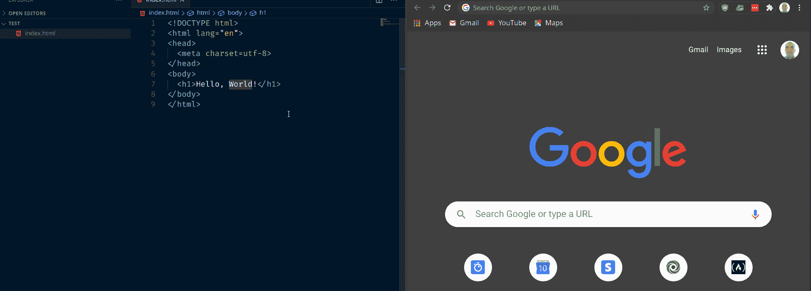
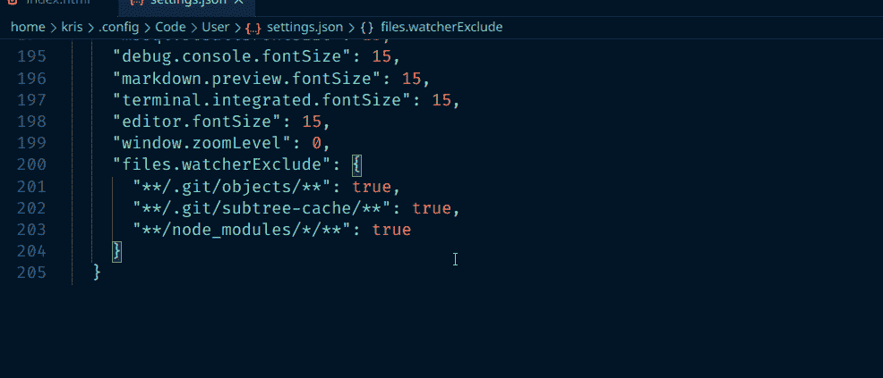
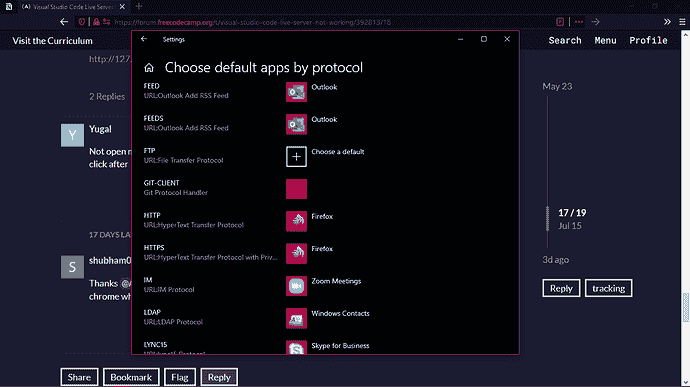

# Visual Studio Code Live 服务器不工作

> 原文：<https://www.freecodecamp.org/news/visual-studio-code-live-server-not-working/>

VSCode 有很多很棒的扩展， [Live Server](https://marketplace.visualstudio.com/items?itemName=ritwickdey.LiveServer) 就是其中最好的一个。

只需几次点击，Live Server 就能让您在实际的浏览器中实时查看您的页面。更好的是，它的特点是实时重载，所以如果你更新了你的代码，这些变化也会反映在浏览器中。

你所要做的就是右键点击你想查看的 HTML 文件，右键点击，然后选择“用 Live Server 打开”:

Live Server in action

但是如果 Live Server 没有像你期望的那样打开你的浏览器并显示你的页面呢？如果这种情况发生在你身上，这里有一些你可以尝试的方法。

## 重启 VSCode

有时，您能做的最好的事情就是从头开始运行 VSCode。

首先，保存你所有的工作。然后关闭 VSCode，这也将停止您已经安装的所有扩展。

然后，重新打开 VSCode 并重试–转到您想要查看的 HTML 文件，右键单击，然后选择“用 Live Server 打开”。

## 为 Live Server 设置浏览器

有可能该扩展正在工作，但是您的系统没有默认的浏览器。

即使你为你的系统设置了默认浏览器，让 Live Server 知道你想明确使用哪个浏览器也不会有什么坏处。

首先，用 F1 打开命令 Pallete，然后输入`Preferences: Open Settings (JSON)`并选择该选项。

这将打开您的 VSCode `settings.json`文件。

一直滚动到文件的底部，在最后一次设置后添加一个逗号，然后粘贴到`"liveServer.settings.CustomBrowser": "chrome"`:

请注意，您也可以使用`"firefox"`、`"safari"`或任何其他浏览器作为`"liveServer.settings.CustomBrowser"`设置的值。

最后，保存`settings.json`文件并尝试再次运行 Live Server。

## 为您的操作系统设置默认浏览器

即使在告诉 Live Server 您想要使用哪个浏览器后，它仍有可能无法在该浏览器中正确打开您的页面。

接下来要做的是为你的操作系统设置默认浏览器。

具体的操作方法会因操作系统的不同而有所不同，所以如果您不确定，最好搜索一下如何操作。

以下是 Windows 中设置页面的外观:

Credit: [Advitya-sharma](https://forum.freecodecamp.org/u/Advitya-sharma)

## 自己去直播页面

如果由于某种原因，Live Server 仍然不能在您的浏览器中自动打开页面，请不要担心。您可以随时打开您选择的浏览器并直接查看页面。

只需打开您喜欢的浏览器，进入`http://127.0.0.1:5500/<your_file_name>`。

比如你的文件叫`index.html`，直接去`http://127.0.0.1:5500/index.html`就可以了。

只要 Live Server 在运行，您就应该可以看到您的页面。

## 最后

如果 Live Server 没有按您预期的方式工作，您可以尝试一些常见的修复方法。

保持安全，快乐(现场)编码。