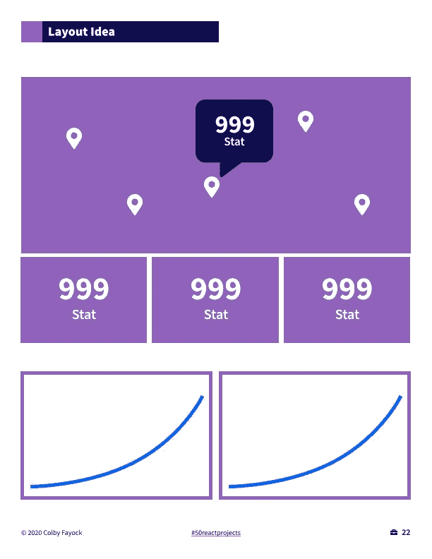
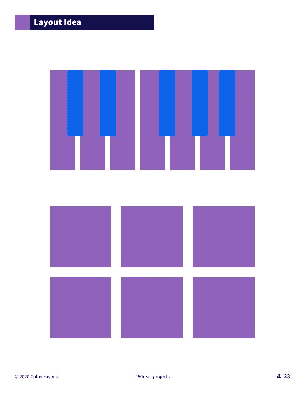
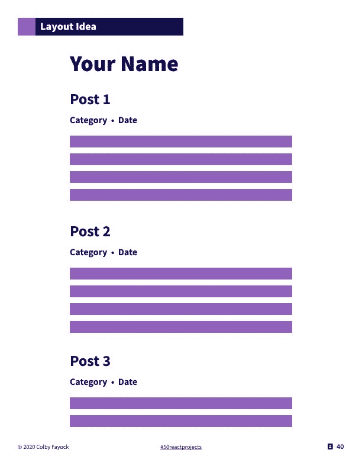
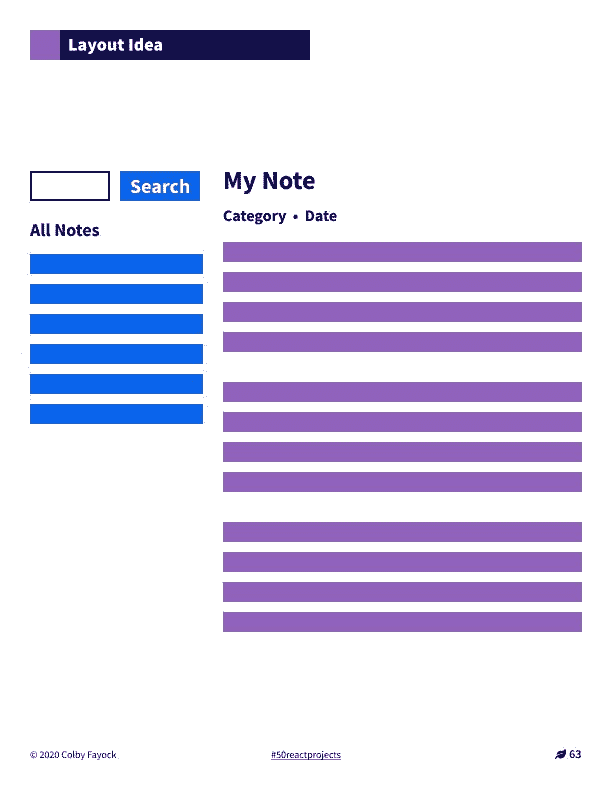
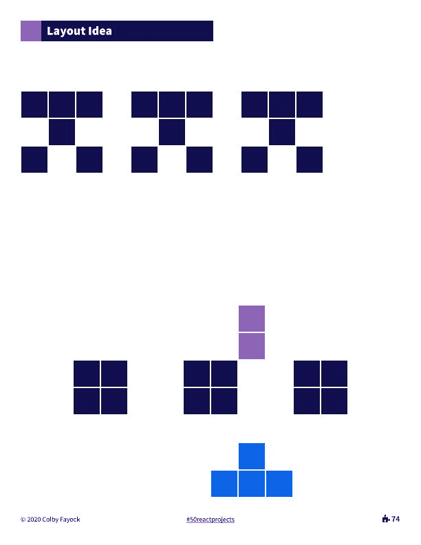
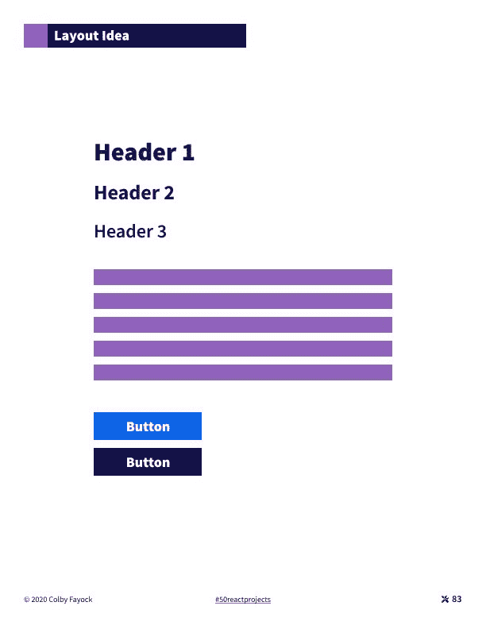
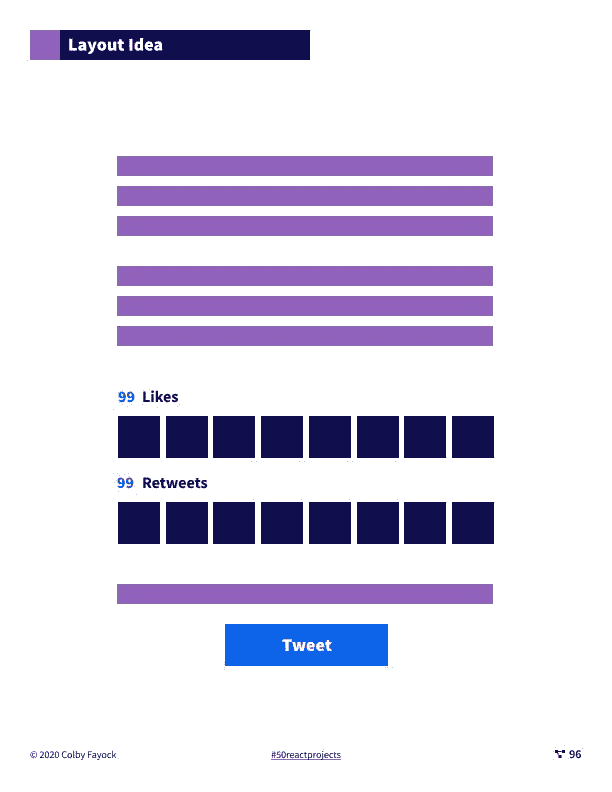
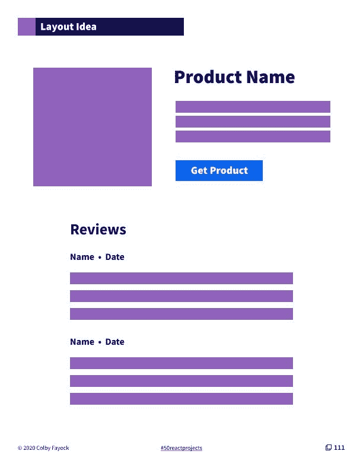
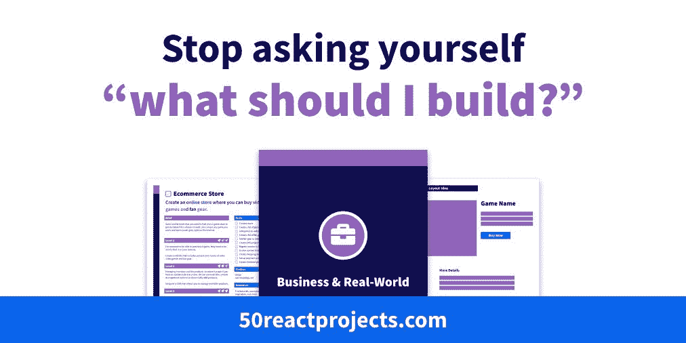

# 8 React.js 项目思路帮助你开始边做边学

> 原文：<https://www.freecodecamp.org/news/8-reactjs-project-ideas-to-start-learning-by-doing/>

学习的最好方法之一是实践。但是开发人员经常为“我应该构建什么？”这个大问题而苦恼

这里有 8 个项目想法，包括项目简介和布局想法，让你开始边做边学。

*   [商业&现实世界:地图统计仪表盘](#map-statistics-dashboard)
*   [趣味&有趣:乐器](#musical-instrument)
*   [个人&作品集:博客](#blog)
*   [生产力:笔记本](#notebook)
*   [谜题&游戏:太空入侵者](#space-invaders)
*   [工具&库:框架主题](#framework-theme)
*   [项目附加组件:网络提及](#webmentions)
*   [克隆:产品搜寻](#product-hunt)

这是 React &静态网络的免费电子书 [50 个项目的预览。你可以在 50reactprojects.com](https://50reactprojects.com/)找到全部 50 个项目创意，包括这 8 个。

## 地图统计仪表板

**类别:商业&现实世界**

创建显示新冠肺炎统计数据和地理信息的地图面板。

### 简短的

应对全球性的疫情意味着冠状病毒等病毒会根据地理位置对世界产生不同的影响。

拥有一张包含每个国家统计数据的地图是一种有用的方法，可以确定哪些国家受到的影响最大。

### 一级

查看国与国之间的统计数据的最简单方法是准备一张地图，您可以浏览每个国家旁边的统计数据。

创建一个地图应用程序，使用 disease.sh 冠状病毒 API 为每个国家的地图添加标记以及新冠肺炎病例数。

### 第二级

虽然拥有每个国家的统计数据是有帮助的，但能够将这些统计数据与全世界的病例数进行比较可能是有用的。

添加一个统计仪表板，显示世界各地新冠肺炎病例的数量，以及来自 API 的任何其他有用的统计数据。

### 第三级

获取当前的统计数据是了解世界现状的好方法，但这与历史相比如何呢？

使用历史数据 API 在仪表板上显示图表，提供病毒增长和传播的背景。

### 去做

*   创建新的地图应用程序
*   获取 API 国家数据
*   向地图添加标记
*   向标记添加统计数据
*   获取 API 全局数据
*   创建统计仪表板
*   添加全局统计
*   获取 API 历史数据
*   向地图添加图表

### 工具箱

*   [打开疾病数据 API](https://disease.sh/) (disease.sh)
*   [反应传单](https://react-leaflet.js.org/)(react-leaflet.js.org)
*   [盖茨比传单启事](https://github.com/colbyfayock/gatsby-starter-leaflet)(github.com)

### 教程

*   [如何在《与盖茨比反应》和《传单》](https://www.freecodecamp.org/news/how-to-create-a-coronavirus-covid-19-dashboard-map-app-in-react-with-gatsby-and-leaflet/)(freecodecamp.org)中创建冠状病毒(新冠肺炎)仪表盘&地图应用
*   [如何使用 Gatsby](https://www.freecodecamp.org/news/how-to-add-coronavirus-covid-19-case-statistics-to-your-map-dashboard-in-gatsby-and-react-leaflet/)(freecodecamp.org)将冠状病毒(新冠肺炎)病例统计数据添加到您的 React map 仪表盘中
*   [使用反应传单](https://egghead.io/playlists/mapping-with-react-leaflet-e0e0?af=atzgap)进行映射(egghead.io)

### 灵感

*   [新冠肺炎仪表板由约翰·霍普金斯大学(JHU)系统科学与工程中心(CSSE)制作](https://coronavirus.jhu.edu/map.html) (coronavirus.jhu.ed)
*   [冠状病毒(新冠肺炎)仪表盘演示](https://coronavirus-map-dashboard.netlify.app/)(冠状病毒-地图-仪表盘. netlify.app)

### 布局思路

Map Statistics Dashboard Layout Idea

## 乐器

**类别:好玩&有趣**

创建一架交互式钢琴，您可以用它来通过键盘演奏音乐。

### 简短的

不是每个人都拥有一件乐器，但也许这些人有一台笔记本电脑、手机或平板电脑。拥有一架钢琴是一种强有力的方式，让人们即使以前没有机会也能演奏音乐。

### 一级

使用浏览器和网络音频 API，我们可以创建声音，当放在一起时，实际上听起来像音乐。

创建一组按钮，点击时播放一个音阶的音符。

### 第二级

虽然不是每个人以前都玩过乐器，但像钢琴这样的乐器的概念和界面通常比一堆按钮更直观。

使用按钮创建钢琴布局，通过点按按钮或使用物理键盘来工作。

### 第三级

我们在浏览器中的空间可能有限，但有大量的音符、音阶和声音，电子键盘可以通过一些额外的效果来制作。

创建效果开关，打开时改变音符的声音。

### 去做

*   创建按钮
*   点击时播放声音
*   在音阶中排列音符
*   创建钢琴布局
*   设置键盘事件
*   创建效果布局
*   切换音频效果

### 工具箱

*   [反应热键](https://github.com/greena13/react-hotkeys)(github.com)

### 教程

*   [用 React 挂钩建造钢琴](https://dev.to/ganeshmani/building-a-piano-with-react-hooks-3mih)(开发到)
*   如何使用普通的 JavaScript 构建钢琴键盘(freecodecamp.org)
*   [用 tone.js 造钢琴！](https://dev.to/shimphillip/building-a-piano-with-tone-js-5c2f)(开发到)
*   [我如何只用 1kb 的 JavaScript 做出一架钢琴](https://frankforce.com/?p=7617#pianostory)(frankforce.com)

### 灵感

*   [反应吉他](https://react-guitar.com/)(react-guitar.com)

### 布局理念

Musical Instrument Layout Idea

## 博客

**类别:个人&投资组合**

创建一个博客，你可以用它来分享你的职业经历和项目。

### 简短的

对于任何职业来说，拥有一个分享你的经历的博客是一个很好的方式，让人们知道你在做什么，并帮助其他人从你的经历中学习。

这也是巩固你所学知识的一种方式，这样你就可以在将来参考它。

### 一级

为了能够分享你的经验，你需要一个网站结构，允许你创建新的内容和管理现有的内容。

一种方法是创建你的网站用来创建新页面和显示文章的降价文件。使用 markdown 文件作为内容源创建博客。

### 第二级

将内容保存在 markdown 文件中是管理静态内容的好方法，但是您可能不希望每次编写或编辑帖子时都必须编辑代码。

集成一个内容管理系统，允许您添加新的内容或编辑现有的漂亮用户界面。

### 第三级

如果你在博客上分享代码，HTML 本身支持 code 和 pre 标签，帮助你以可读的方式格式化代码。但这不包括有助于提高可读性的语法突出显示。

集成了一个语法高亮器，使得代码块可读性更好。

### 去做

*   创建博客
*   添加第一个静态内容
*   源静态内容
*   集成 CMS
*   向内容添加代码
*   添加语法突出显示

### 工具箱

*   [Netlify CMS](https://www.netlifycms.org/) (netlifycms.org)
*   prism . js(prismjs.com)

### 教程

*   用 Netlify CMS 制作盖茨比博客(gatsbyjs.org)
*   [如何使用 Gatsby 和 MDX 从零开始构建你的编码博客](https://www.freecodecamp.org/news/build-a-developer-blog-from-scratch-with-gatsby-and-mdx/)(freecodecamp.org)

### 灵感

*   [盖茨比 Netlify CMS 首发](https://gatsby-netlify-cms.netlify.app/)(Gatsby-Netlify-CMS . Netlify . app)

### 布局理念

Blog Layout Idea

## 笔记本

**类别:生产力**

创建一个笔记本应用程序来添加、管理和组织一组笔记。

### 简短的

做笔记是一种很好的方式，可以确保我们跟踪自己的想法或记住会议中的重要内容。能够方便地管理和组织它们对于以后找到它们是很重要的！

### 一级

笔记本的第一个要求是能够记笔记。这可以很容易开始，你真的需要某种输入来收集你写的东西，并把它存储在某个地方以备后用。

创建一个表单来添加新的注释并在列表中查看它们。

### 第二级

为了以后能找到你的笔记，你需要一些组织这些笔记的方法和查找它们的方法。这包括添加类别或标签系统以及进行搜索的用户界面。

添加标记或分类笔记的功能，以及搜索笔记的输入。

### 第三级

不管我们是否意识到，我们可以在我们的思想和更重要的笔记之间找到联系，我们可以利用这个思想网络来记笔记。

添加 Roam Research-imprised 链接笔记，创建思想网络。

### 去做

*   创建表单
*   存储新笔记
*   列出笔记
*   添加标签或类别
*   添加笔记搜索
*   添加笔记网络

### 工具箱

*   [盖茨比大脑主题](https://github.com/aengusmcmillin/gatsby-theme-brain)(github.com)
*   [Fuse.js](https://fusejs.io/) (fusejs.io)

### 教程

*   [如何使用 Fuse.js 向 React 应用添加搜索](https://www.freecodecamp.org/news/how-to-add-search-to-a-react-app-with-fuse-js/)(freecodecamp.org)

### 灵感

*   [泡沫](https://foambubble.github.io/foam/) (foambubble.github.io)
*   [漫游研究](https://roamresearch.com/)(roamresearch.com)
*   [盖茨比花园主题](https://github.com/mathieudutour/gatsby-digital-garden)(github.com)

### 布局理念

Notebook Layout Idea

## 太空入侵者

**类别:拼图&游戏**

创建一个太空入侵者飞船射击游戏来射击多波敌舰。

### 简短的

《太空入侵者》是一部经典的街机游戏，让你置身于宇宙飞船中，对抗外星人的入侵。当你试图击落它们时，它们会还击，在你被击中之前，你只有有限的保护。

### 一级

游戏的核心部分是你在一艘飞船周围移动，试图用你的武器击中一群外星人。你们只有一个人，但他们有很多人。

制造一个可以四处移动的飞船，拍摄不动的外星人。

### 第二级

让游戏变得棘手的是，外星人一直在移动。每当它们碰到游戏区的边缘，它们就会下降并加速，越来越靠近你的船。

给游戏区上左右摇摆的外星人添加动作。每当外星人到达一边，他们应该下降一级。他们也应该每隔一段时间就加速。

### 第三级

你只能靠自己了，但幸运的是你可以得到一些保护。你有盾牌，你可以躲在后面，在它们持续的时候帮助保护你。在玩家飞船前制造几个可以承受有限伤害的护盾。

### 去做

*   创建新游戏
*   创造静态的外星人
*   创建一个玩家飞船
*   添加航天器控制
*   添加飞船武器
*   配置外来伤害
*   让外星人开枪还击
*   让外星人动起来
*   添加外来间隔
*   添加护盾

### 教程

*   通过构建 7 个游戏学习 JavaScript(freecodecamp.org)

### 灵感

*   [太空入侵者](https://codepen.io/adelciotto/pen/BHuGL) (codepen.io)

### 布局理念

Space Invaders Layout Idea

## 框架主题

**类别:工具&库**

创建一个 Gatsby 主题，用 Tailwind CSS 框架建立一个项目。

### 简短的

作为开发人员，每当我们创建一个新项目时，我们通常都要做一系列类似的步骤。但是像主题这样的工具让我们抽象出这些步骤，并以一种易于使用的方式打包，这种方式可以用于任何新的项目。

### 一级

Gatsby 主题是一个类似插件的系统，我们可以利用 Gatsby 管道在 npm 上将功能作为一个包共享。

这为我们在 Gatsby 站点上做任何事情打开了方便之门，但是使它可以在任何 Gatsby 站点上重用。创建一个新的 Gatsby 主题，当使用它时，会在它所添加到的任何项目上创建一个新的 a 风格指南页面。

### 第二级

主题的目标不仅仅是创建页面，而是增加让我们更有效率的功能。这包括框架和项目配置。向 Gatsby 主题添加一个 CSS 框架，让添加的项目使用这个框架。

### 第三级

有时候主题只是作为工具会更好，有时候坚持己见会有帮助。向 CSS 框架添加有用功能的一种方式是创建股票组件。使用 CSS 框架创建可重用的 React 组件，这些组件可以在主题添加到的项目中使用。

### 去做

*   创建新主题
*   添加到示例项目
*   创建新样式页面
*   添加 CSS 框架
*   在示例中使用 CSS
*   创建组件
*   使用组件

### 工具箱

*   [盖茨比主题](https://www.gatsbyjs.org/docs/themes/)(gatsbyjs.org)
*   顺风(tailwindcss.com)

### 教程

*   [建立主题](https://www.gatsbyjs.org/tutorial/building-a-theme/)(gatsbyjs.org)
*   [什么是 Tailwind CSS，如何将其添加到我的网站或 React 应用程序中？](https://www.freecodecamp.org/news/what-is-tailwind-css-and-how-can-i-add-it-to-my-website-or-react-app/)(freecodecamp.org)

### 灵感

*   [盖茨比顺风主题](https://github.com/talensjr/gatsby-theme-tailwindcss)(github.com)

### 布局理念

Framework Theme Layout Idea

## 网络提及

**类别:项目附件**

向网站添加 webmentions 集成，显示 Twitter 与网站的交互。

### 简短的

社交互动是一种有效的方式，可以为我们所写的主题带来更多的观众和对话。

在网站上展示一些东西表明，互动有助于激发人们想要参与其中，或者让人们觉得他们可以成为其中的一部分。

### 一级

为了利用网络提及，网站需要配置元标签来提供信息。向网站添加适当的元标签，并通过 web reference . io 验证其用途。

### 第二级

Webmentions API 是一种通过网站的 URL 以编程方式查看社交互动中的联系的方式。它可以让你了解互动的类型，甚至是这个人的头像。

将网站连接到 Webmentions，并将社交互动列表添加到博客文章页面。

### 第三级

既然网站显示了所有的互动，应该有一个简单的方法来加入对话。

添加一个社交链接，点击后会创建一条带有页面链接的推文。

### 去做

*   向网站添加元标签
*   验证元标签
*   连接到网站提及
*   将社交与 Bridgy 联系起来
*   列出互动
*   添加推文按钮

### 工具箱

*   [网页提及. io](https://webmention.io/) (网页提及. io)
*   [Bridgy](https://brid.gy/) (brid.gy)
*   [盖茨比插件网页提及](https://github.com/ChristopherBiscardi/gatsby-plugin-webmention)(github.com)

### 教程

*   [Indieweb pt2:使用十一月份的网络提及](https://mxb.dev/blog/using-webmentions-on-static-sites/) (mxb.dev)
*   [客户端网页提及](https://www.swyx.io/writing/clientside-webmentions/) (swyx.io)
*   [盖茨比](https://www.knutmelvaer.no/blog/2019/06/getting-started-with-webmentions-in-gatsby/)中的网络提及入门(knutmelvaer.no)
*   [构建盖茨比插件网页提及](https://www.christopherbiscardi.com/post/building-gatsby-plugin-webmentions)(christopherbiscardi.com)

### 灵感

*   [Knut Melvær](https://www.knutmelvaer.no/blog/) (knutmelvaer.no)
*   [Swyx](https://swyx.io/) (swyx.io)

### 布局理念

Webmentions Layout Idea

## 产品搜索

**类别:克隆体**

创建一个产品搜索克隆，让人们发布带有评级的新产品。

### 简短的

我们都为产品而活，无论是我们的手机还是我们在笔记本电脑上使用的应用程序。

虽然世界上有成吨的产品，但很难找到好的和坏的。像 Product Hunt 这样的工具提供了一个平台来学习新工具，并从其他人那里获得反馈和评论。

### 一级

了解新产品最重要的部分是产品本身。我们想知道这个产品是什么，它看起来像什么，它是如何工作的。

创建一个页面，让你用标题、图片和描述向网站添加新产品。

### 第二级

在了解产品时，评论是我们在购买之前信任产品的一种方式。它帮助我们对将要花钱或花时间去做的事情有信心。

添加人们添加关于每个产品的评论的能力。

### 第三级

人们喜欢产品，所以世界上有成千上万的产品。有太多的方式试图通过手动排序，所以我们需要一种机制来搜索和浏览。

增加产品搜索和分类浏览功能。

### 去做

*   创建产品网站
*   创建数据库
*   添加产品表单
*   将产品添加到数据库
*   为页面请求产品
*   添加评审表
*   将评论添加到数据库
*   向产品添加评论
*   添加产品搜索
*   添加产品类别

### 工具箱

*   [哈苏拉](https://hasura.io/)(哈苏拉. io)

### 教程

*   [使用 Hasura 和 Next.js 构建产品搜索克隆应用](https://blog.logrocket.com/building-a-product-hunt-clone-app-using-hasura-and-next-js/)(logrocket.com)
*   [如何使用 React](https://www.freecodecamp.org/news/how-to-build-a-basic-version-of-product-hunt-using-react-f87d016fedae/)(freecodecamp.org)构建产品搜索的基本版本

### 布局理念

Product Hunt Layout Idea

## 更多项目

如果你想要更多的项目创意，请查看 React &静态网站的 [50 个项目！](https://50reactprojects.com/)

免费下载

*   [？在 Twitter 上关注我](https://twitter.com/colbyfayock)
*   [？️订阅我的 Youtube](https://youtube.com/colbyfayock)
*   [✉️注册我的简讯](https://www.colbyfayock.com/newsletter/)