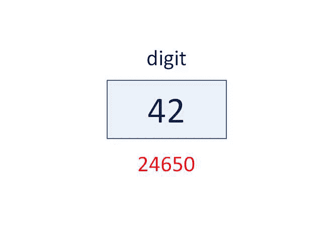
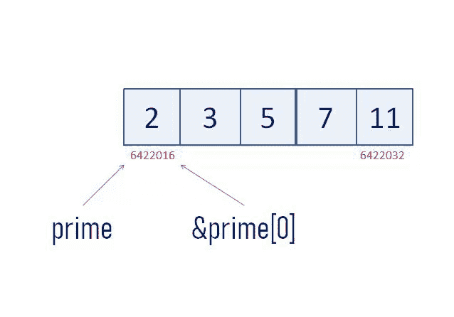
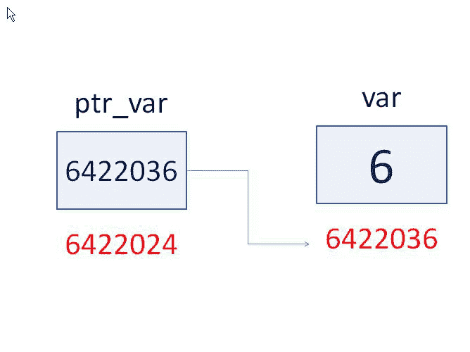

# C 语言中的指针解释了——它们没有你想象的那么难

> 原文：<https://www.freecodecamp.org/news/pointers-in-c-are-not-as-difficult-as-you-think/>

指针可以说是 C 语言中最难理解的特性。但是，它们是使 C 语言成为优秀语言的特征之一。

在这篇文章中，我们将从指针的基础开始，讨论它们在数组、函数和结构中的用法。

所以放松一下，喝杯咖啡，准备学习所有关于指针的知识。

## 主题

##### A.基本原则

1.  [指针到底是什么？](#1-what-exactly-are-pointers)
2.  [定义和符号](#2-definition-and-notation)
3.  [一些特殊的指针](#3-some-special-pointers)
4.  [指针算法](#4-pointer-arithmetic)

##### B.数组和字符串

1.  [为什么是指针和数组？](#1-why-pointers-and-arrays)
2.  [一维数组](#2-1-d-arrays)
3.  [二维数组](#3-2-d-arrays)
4.  [琴弦](#4-strings)
5.  [指针数组](#5-array-of-pointers)
6.  指向数组的指针

##### C.功能

1.  [按值调用 v/s 按引用调用](#1-call-by-value-v-s-call-by-reference)
2.  [作为函数参数的指针](#2-pointers-as-function-arguments)
3.  [指针作为函数返回](#3-pointers-as-function-return)
4.  [指向函数](#4-pointer-to-function)的指针
5.  [指向函数的指针数组](#5-array-of-pointers-to-functions)
6.  [用作参数的指针](#6-pointer-to-function-as-an-argument)

##### D.结构

1.  [结构指针](#1-pointer-to-structure)
2.  [结构数组](#2-array-of-structure)
3.  [指向作为参数的结构的指针](#3-pointer-to-structure-as-an-argument)

##### E.指针对指针

##### F.结论

## A.定义、符号、类型和算术

### 1.指针到底是什么？

在我们开始定义指针之前，让我们理解当我们编写下面的代码时会发生什么:

```
int digit = 42; 
```


编译器会保留一块内存来保存一个`int`值。该块的名称为`digit`，存储在该块中的值为`42`。

现在，为了记住这个块，它被分配了一个**地址**或者一个位置号(比如 24650)。

位置号的值对我们来说并不重要，因为它是一个随机值。但是，我们可以使用运算符的`&`(与号)或**地址来访问这个地址。**

```
printf("The address of digit = %d.",&digit);
 /* prints "The address of digit = 24650\. */ 
```

我们可以使用另一个操作符`*`(星号)从变量`digit`的地址获取变量的值，这个操作符被称为**间接操作符**或**在地址**操作符处解引用或**值。**

```
printf("The value of digit = %d.", *(&digit);
 /* prints "The value of digit = 42\. */ 
```

### 2.定义和符号

变量的地址可以存储在另一个称为指针变量的变量中。将变量地址存储到指针的语法是:

```
dataType *pointerVariableName = &variableName; 
```

对于我们的`digit`变量，可以这样写:

```
int *addressOfDigit = &digit; 
```

或者像这样:

```
int *addressOfDigit;
addressOfDigit= &digit; 
```



这可以理解为- *指向`int`(整数)`addressOfDigit`的指针存储了`address of(&)` `digit`变量。*

#### 需要理解的几点:

我们需要告诉计算机变量的数据类型是什么，我们要存储它的地址。这里，`int`是`digit`的数据类型。

它**不**意味着`addressOfDigit`将存储类型`int`的值。一个整型指针(像`addressOfDigit`)只能**存储整型变量的地址。**

```
int variable1;
int variable2;
char variable3;
int *addressOfVariables; 
```

`*`–指针变量是一个*特殊的*变量，因为它用于存储另一个变量的地址。为了区别于其他不存储地址的变量，我们在声明中使用`*`作为符号。

这里，我们可以将`variable1`和`variable2`的地址分配给整数指针`addressOfVariables`，但不能分配给`variable3`，因为它属于`char`类型。我们需要一个字符指针变量来存储它的地址。

我们可以使用我们的`addressOfDigit`指针变量来打印地址和`digit`的值，如下所示:

```
printf("The address of digit = %d.", addressOfDigit);
 /* prints "The address of digit = 24650." */
printf("The value of digit = %d.", *addressOfDigit);
 /*prints "The value of digit = 42\. */ 
```

这里，`*addressOfDigit`可以读作`addressOfDigit`中存储的地址处的值的*。*

注意我们使用`%d`作为`addressOfDigit`的**格式标识符**。嗯，这并不完全正确。正确的标识符应该是`%p`。

使用`%p`，地址显示为十六进制值。但是内存地址可以用整数和八进制值显示。尽管如此，因为这不是一个完全正确的 T2 方式，所以显示了一个警告。

```
int num = 5;
int *p = &num;
printf("Address using %%p = %p",p);
printf("Address using %%d = %d",p);
printf("Address using %%o = %o",p); 
```

根据我使用的编译器，输出如下:

```
Address using %p = 000000000061FE00
Address using %d = 6422016
Address using %o = 30377000 
```

> 这是在使用%d 时显示的警告-"警告:格式“%d”需要类型为“int”的参数，但参数 2 的类型为“int *”。

### 3.一些特殊的指针

#### 野生指针

```
char *alphabetAddress; /* uninitialised or wild pointer */
char alphabet = "a";
alphabetAddress = &alphabet; /* now, not a wild pointer */ 
```

当我们定义我们的字符指针`alphabetAddress`时，我们没有初始化它。

这种指针被称为**野生指针**。它们存储了一个我们不知道保留与否的字节的垃圾值(也就是内存地址)(还记得`int digit = 42;`，我们声明的时候保留了一个内存地址)。

假设我们取消对一个通配符指针的引用，并给它所指向的内存地址赋值。这将导致意外的行为，因为我们将在空闲或保留的内存块中写入数据。

#### 空指针

为了确保我们没有野生指针，我们可以用一个`NULL`值初始化一个指针，使它成为一个**空指针**。

```
char *alphabetAddress = NULL /* Null pointer */ 
```

空指针不指向任何东西，或者指向用户不能访问的内存地址。

#### 空指针

一个**空指针**可以用来指向任何数据类型的变量。它可以被重用来指向我们想要的任何数据类型。它是这样声明的:

```
void *pointerVariableName = NULL; 
```

因为它们在本质上是非常一般的，所以也被称为**通用指针**。

由于它们的灵活性，空指针也带来了一些限制。空指针**不能像任何其他指针一样被取消引用。合适的*铅字*是必要的。**

```
void *pointer = NULL;
int number = 54;
char alphabet = "z";
pointer = &number;
printf("The value of number = ", *pointer); /* Compilation Error */
/* Correct Method */
printf("The value of number = ", *(int *)pointer); /* prints "The value at number = 54" */
pointer = &alphabet;
printf("The value of alphabet = ", *pointer); /* Compilation Error */
printf("The value of alphabet = ", *(char *)pointer); /* prints "The value at alphabet = z */ 
```

类似地，为了执行算术运算，需要对空指针进行类型转换。

Void 指针在 c 中用处很大，动态分配内存的库函数`malloc()`和`calloc()`返回 void 指针。`qsort()`，C 中内置的排序函数，有一个函数作为它的参数，这个函数本身以空指针作为它的参数。

#### 悬空指针

一个悬空指针指向**用来**保存变量的内存地址。由于它所指向的地址不再保留，使用它将导致意想不到的结果。

```
main(){
  int *ptr;
  ptr = (int *)malloc(sizeof(int));
  *ptr = 1;
  printf("%d",*ptr); /* prints 1 */
  free(ptr); /* deallocation */
  *ptr = 5;
  printf("%d",*ptr); /* may or may not print 5 */
} 
```

虽然内存已经被`free(ptr)`释放，但是指向整数`ptr`的指针仍然指向那个未预留的内存地址。

### 4.指针算法

我们现在知道，指针不同于任何其他变量。它们不存储任何值，只存储内存块的地址。

所以很明显，并不是所有的算术运算对它们都有效。将两个指针相乘或相除(*有地址*)有意义吗？

#### 指针有很少但非常有用的**有效**操作:

1.  只有当一个指针和另一个指针的类型相同时，才可以将它们的值赋给另一个指针(除非它们是类型转换的或者其中一个是`void *`)。

```
int ManU = 1;
int *addressOfManU = &ManU;
int *anotherAddressOfManU = NULL;
anotherAddressOfManU = addressOfManU; /* Valid */
double *wrongAddressOfManU = addressOfManU; /* Invalid */ 
```

2.你只能给指针加上或减去整数。

```
int myArray = {3,6,9,12,15};
int *pointerToMyArray = &myArray[0];
pointerToMyArray += 3; /* Valid */
pointerToMyArray *= 3; /* Invalid */ 
```

当你给一个指针加(或减)一个整数(比如 n)时，你是**而不是**实际上给指针值加(或减)n 个字节。你实际上是加(或减)n- *乘以被指向变量的数据类型的大小*字节。

```
int number = 5;
 /* Suppose the address of number is 100 */
int *ptr = &number;
int newAddress = ptr + 3;
 /* Same as ptr + 3 * sizeof(int) */ 
```

存储在`newAddress`中的值将**而不是**为 103，而是`112`。

3.**指针**的减法和比较只有在两者都是同一个数组的成员时才有效。指针的减法给出了分隔它们的元素的数量。

```
int myArray = {3,6,9,12,15};
int sixthMultiple = 18;
int *pointer1 = &myArray[0];
int *pointer2 = &myArray[1];
int *pointer6 = &sixthMuliple;
 /* Valid Expressions */
if(pointer1 == pointer2)
pointer2 - pointer1;
 /* Invalid Expressions
if(pointer1 == pointer6)
pointer2 - pointer6 
```

4.您可以使用`NULL`分配或比较指针。

> 上述规则的唯一例外是，数组最后一个元素之后的第一个内存块的地址遵循指针算法。

指针和数组共存。这些有效的指针操作对数组非常有用，这将在下一节讨论。

## B.数组和字符串

### 1.为什么是指针和数组？

在 C 中，指针和数组有很强的关系。

之所以将它们*和*放在一起讨论，是因为你可以用数组符号(`arrayName[index]`)实现的东西也可以用指针来实现，但是通常更快。

### 2.一维数组

让我们看看当我们写`int myArray[5];`时会发生什么。

从`myArray[0]`到`myArray[4]`的五个**连续的**内存块是用垃圾值创建的。每个块的大小为 4 字节。

因此，如果 myArray[0]的地址是`100`(比如说)，其余块的地址将是`104`、`108`、`112`和`116`。

看看下面的代码:

```
int prime[5] = {2,3,5,7,11};
printf("Result using &prime = %d\n",&prime);
printf("Result using prime = %d\n",prime);
printf("Result using &prime[0] = %d\n",&prime[0]);

/* Output */
Result using &prime = 6422016
Result using prime = 6422016
Result using &prime[0] = 6422016 
```

所以，`&prime`，`prime`，`&prime[0]`都给同一个地址，对吧？好吧，等着看吧，因为你会大吃一惊(也许会有些困惑)。

让我们试着将`&prime`、`prime`和`&prime[0]`各增加 1。

```
printf("Result using &prime = %d\n",&prime + 1);
printf("Result using prime = %d\n",prime + 1);
printf("Result using &prime[0] = %d\n",&prime[0] + 1);

/* Output */
Result using &prime = 6422036
Result using prime = 6422020
Result using &prime[0] = 6422020 
```

等等！为什么`&prime + 1`的结果与其他两个不同？为什么`prime + 1`和`&prime[0] + 1`仍然相等？让我们来回答这些问题。

`prime`和`&prime[0]`都指向数组`prime`的第 0 个元素。因此，数组的名称**本身就是指向数组第 0 个元素**的指针。

这里，两者都指向大小为 4 字节的第一个元素。当您给它们加 1 时，它们现在指向数组中的第一个元素。因此，这导致地址增加了 4。

另一方面，`&prime`是一个指向大小为 5 的`int`数组的指针。它存储了数组`prime[5]`的基址，它等于第一个元素的地址。但是，增加 1 会导致地址增加 5 x 4 = 20 个字节。

简而言之，`arrayName`和`&arrayName[0]`指向第 0 个元素，而`&arrayName`指向整个数组。



我们可以使用下标变量访问数组元素，如下所示:

```
int prime[5] = {2,3,5,7,11};
for( int i = 0; i < 5; i++)
{
  printf("index = %d, address = %d, value = %d\n", i, &prime[i], prime[i]);
} 
```

我们可以使用比下标更快的指针来做同样的事情。

```
int prime[5] = {2,3,5,7,11};
for( int i = 0; i < 5; i++)
{
  printf("index = %d, address = %d, value = %d\n", i, prime + i, *(prime + i));
} 
```

两种方法都给出输出:

```
index = 0, address = 6422016, value = 2
index = 1, address = 6422020, value = 3
index = 2, address = 6422024, value = 5
index = 3, address = 6422028, value = 7
index = 4, address = 6422032, value = 11 
```

因此，`&arrayName[i]`和`arrayName[i]`分别与`arrayName + i`和`*(arrayName + i)`相同。

### 3.二维数组

二维数组是数组的数组。

```
int marks[5][3] = { { 98, 76, 89},
                    { 81, 96, 79},
                    { 88, 86, 89},
                    { 97, 94, 99},
                    { 92, 81, 59}
                  }; 
```

在这里，`marks`可以认为是一个 5 个元素的数组，每个元素都是包含 3 个整数的一维数组。让我们通过一系列程序来理解不同的下标表达式。

```
printf("Address of whole 2-D array = %d\n", &marks);
printf("Addition of 1 results in %d\n", &marks +1);

/* Output */
Address of whole 2-D array = 6421984
Addition of 1 results in 6422044 
```

和一维数组一样，`&marks`指向整个二维数组，`marks[5][3]`。因此，对其增加 1 ( = 5 个数组 X 每个数组 3 个整数 X 4 个字节= 60)会导致增加 60 个字节。

```
printf("Address of 0th array = %d\n", marks);
printf("Addition of 1 results in %d\n", marks +1);
printf("Address of 0th array =%d\n", &marks[0]);
printf("Addition of 1 results in %d\n", &marks[0] + 1);

/* Output */
Address of 0th array = 6421984
Addition of 1 results in 6421996
Address of 0th array = 6421984
Addition of 1 results in 6421996 
```

如果`marks`是一个一维数组，`marks`和`&marks[0]`就会指向`0th`元素。**对于二维数组，元素现在是一维数组**。因此，`marks`和`&marks[0]`指向`0th`数组(元素)，1 点加到`1st`数组。

```
printf("Address of 0th element of 0th array = %d\n", marks[0]);
printf("Addition of 1 results in %d\n", marks[0] + 1);
printf("Address of 0th element of 1st array = %d\n", marks[1]);
printf("Addition of 1 results in %d\n", marks[1] + 1);

 /* Output */
Address of 0th element of 0th array = 6421984
Addition of 1 results in 6421988
Address of 0th element of 1st array = 6421996
Addition of 1 results in 6422000 
```

现在不同了。对于一维数组，`marks[0]`将给出第 0 个元素的值。增加 1 将使该值增加 1。

但是，在一个二维数组中，`marks[0]`指向`0th`数组的`0th`元素。类似地，`marks[1]`指向`1st`数组的`0th`元素。增加 1 将指向`1st`数组中的`1st`元素。

```
printf("Value of 0th element of 0th array = %d\n", marks[0][0]);
printf("Addition of 1 results in %d", marks[0][0] + 1);

/* Output */
Value of 0th element of 0th array = 98
Addition of 1 results in 99 
```

这是新的部分。`marks[i][j]`给出了`ith`数组的`jth`元素的值。它的增量改变存储在`marks[i][j]`的值。现在，让我们试着用指针来写`marks[i][j]`。

从我们之前的讨论中，我们知道`marks[i] + j`将指向`jth`数组的`ith`元素。解引用它将意味着该地址的值。由此可见， **`marks[i][j]`与`*(marks[i] + j)`** 相同。

根据我们对一维数组的讨论，`marks[i]`与`*(marks + i)`相同。因此， **`marks[i][j]`在指针方面可以写成`*(*(marks + i) + j)`** 。

下面是对一维数组和二维数组的比较。

| 表示 | 一维数组 | 二维数组 |
| &arrayName | 指向整个数组的地址
加 1 将地址增加 1 倍 sizeof(arrayName) | 指向整个数组的地址
加 1 将地址增加 1 倍 sizeof(arrayName) |
| arrayName | 指向第 0 个元素
加 1 将地址增加到第 1 个元素 | 指向第 0 个元素(数组)
加 1 将地址增加到第 1 个元素(数组) |
| &arrayName[i] | 指向第 I 个元素
加 1 将地址增加到第(i+1)个元素 | 指向第 I 个元素(数组)
加 1 将地址增加到第(i+1)个元素(数组) |
| 数组名[i] | 给出第 I 个元素的值
加 1 增加第 I 个元素的值 | 指向第 I 个数组的第 0 个元素
加 1 增加第 I 个数组的第 1 个元素的地址 |
| 数组名[i][j] | 没有任何东西 | 给出第 I 个数组的第 j 个元素的值
加 1 增加第 I 个数组的第 j 个元素的值 |
| 访问元素的指针表达式 | *( arrayName + i) | *( *( arrayName + i) + j) |

### 4.用线串

字符串是以`null(\0)`结尾的一维字符数组。当我们写`char name[] = "Srijan";`时，每个字符占用一个字节的内存，最后一个总是`\0`。

类似于我们看到的数组，`name`和`&name[0]`指向字符串中的`0th`字符，而`&name`指向整个字符串。另外，`name[i]`可以写成`*(name + i)`。

```
/* String */
char champions[] = "Liverpool";

printf("Pointer to whole string = %d\n", &champions);
printf("Addition of 1 results in %d\n", &champions + 1);

/* Output */
Address of whole string = 6421974
Addition of 1 results in 6421984

printf("Pointer to 0th character = %d\n", &champions[0]);
printf("Addition of 1 results in %d\n", &champions[0] + 1);

/* Output */
Address of 0th character = 6421974
Addition of 1 results in a pointer to 1st character 6421975

printf("Pointer to 0th character = %d\n", champions);
printf("Addition of 1 results in a pointer to 1st character %d\n", champions + 1);

/* Output */
Address of 0th character = 6421974
Addition of 1 results in 6421975

printf("Value of 4th character = %c\n", champions[4]);
printf("Value of 4th character using pointers = %c\n", *(champions + 4));

/* Output */
Value of 4th character = r
Value of 4th character using pointers = r 
```

如前所述，还可以访问和操作二维字符数组或字符串数组。

```
/* Array of Strings */
char top[6][15] = {
                    "Liverpool",
                    "Man City",
                    "Man United",
                    "Chelsea",
                    "Leicester",
                    "Tottenham"
                  };

printf("Pointer to 2-D array = %d\n", &top);
printf("Addition of 1 results in %d\n", &top + 1);

 /* Output */
Pointer to 2-D array = 6421952
Addition of 1 results in 6422042

printf("Pointer to 0th string = %d\n", &top[0]);
printf("Addition of 1 results in %d\n", &top[0] + 1);

 /* Output */
Pointer to 0th string = 6421952
Addition of 1 results in 6421967

printf("Pointer to 0th string = %d\n", top);
printf("Addition of 1 results in %d\n", top + 1);

 /* Output */
Pointer to 0th string = 6421952
Addition of 1 results in 6421967

printf("Pointer to 0th element of 4th string = %d\n", top[4]);
printf("Pointer to 1st element of 4th string = %c\n", top[4] + 1);

 /* Output */
Pointer to 0th element of 4th string = 6422012
Pointer to 1st element of 4th string = 6422013

printf("Value of 1st character in 3rd string = %c\n", top[3][1]);
printf("Same using pointers = %c\n", *(*(top + 3) + 1));

 /* Output */
Value of 1st character in 3rd string = h
Same using pointers = h 
```

### 5.指针数组

像一个由`int`和`char`组成的数组一样，还有一个指针数组。这样的数组只是地址的集合。这些地址可以指向单个变量或另一个数组。

声明**指针数组**的语法如下:

```
dataType *variableName[size];

/* Examples */
int *example1[5];
char *example2[8]; 
```

按照[运算符的优先顺序](http://unixwiz.net/techtips/reading-cdecl.html)，第一个例子可以读作- *`example1`是一个由 5 个指向`int`* 的指针组成的数组(`[]`)。同样， *`example2`是指向`char`* 的 8 个指针的数组。

我们可以使用指针数组将二维数组存储到字符串`top`中，这样也可以节省内存。

```
char *top[] = {
                    "Liverpool",
                    "Man City",
                    "Man United",
                    "Chelsea",
                    "Leicester",
                    "Tottenham"
                  }; 
```

`top`将包含所有相应名称的基地址。`"Liverpool"`的基址会存储在`top[0]`，`"Man City"`存储在`top[1]`，以此类推。

在前面的声明中，我们需要 90 个字节来存储名称。在这里，我们只需要(58(名称的字节总和)+ 12(在数组中存储地址所需的字节))70 个字节。

使用指针数组时，对字符串或整数的操作变得容易多了。

如果我们试图将`"Leicester"`放在`"Chelsea"`之前，我们只需要如下切换`top[3]`和`top[4]`的值:

```
char *temporary;
temporary = top[3];
top[3] = top[4];
top[4] = temporary; 
```

如果没有指针，我们将不得不交换字符串的每个字符，这将花费更多的时间。这就是为什么字符串一般用指针声明。

### 6.指向数组的指针

像“指向`int`的指针”或“指向`char`的指针”，我们也有指向数组的指针。这个指针指向整个数组而不是它的元素。

还记得我们讨论过`&arrayName`如何指向整个数组吗？这是一个指向数组的指针。

指向数组的指针可以这样声明:

```
dataType (*variableName)[size];

/* Examples */
int (*ptr1)[5];
char (*ptr2)[15]; 
```

注意括号。没有它们，这些将是一个指针数组。第一个例子可以读作——*`ptr1`是一个由 5 个`int`(整数)*组成的数组的指针。

```
int goals[] = { 85,102,66,69,67};
int (*pointerToGoals)[5] = &goals;
printf("Address stored in pointerToGoals %d\n", pointerToGoals);
printf("Dereferncing it, we get %d\n",*pointerToGoals);

/* Output */
Address stored in pointerToGoals 6422016
Dereferencing it, we get 6422016 
```

当我们解引用一个指针时，它给出了那个地址的值。类似地，通过解引用指向数组的指针，我们得到数组，数组的名称指向基地址。如果我们找到了数组的大小，我们就可以确认`*pointerToGoals`给出了数组`goals`。

```
printf("Size of goals[5] = %d, *pointerToGoals);

/* Output */
Size of goals[5] = 20 
```

如果我们再次取消引用它，我们将获得存储在该地址中的值。我们可以使用`pointerToGoals`打印所有的元素。

```
for(int i = 0; i < 5; i++)
printf("%d ", *(*pointerToGoals + i));

/* Output */
85 102 66 69 67 
```

指针和指向数组的指针在与函数配对时非常有用。下一节即将播出！

## C.功能

### 1.通过值调用与通过引用调用

看看下面的程序:

```
#include <stdio.h>

int multiply(int x, int y){
  int z;
  z = x * y;
  return z;
}

main(){
int x = 3, y = 5; 
int product = multiply(x,y);
printf("Product = %d\n", product);
 /* prints "Product = 15" */
} 
```

函数`multiply()`接受两个`int`参数，并将它们的乘积作为`int`返回。

在函数调用`multiply(x,y)`中，我们将`x`和`y`(属于`main()`)的值，即*实际参数*，传递给`multiply()`。

实际参数的值被传递或复制到*形式参数* `x`和`y`(属于`multiply()`)。`multiply()`的`x`和`y`与`main()`不同。这可以通过打印他们的地址来验证。

```
#include <stdio.h>

int multiply(int x, int y){
  printf("Address of x in multiply() = %d\n", &x);
  printf("Address of y in multiply() = %d\n", &y);
  int z;
  z = x * y;
  return z;
}

main(){
int x = 3, y = 5;
printf("Address of x in main() = %d\n", &x);
printf("Address of y in main() = %d\n", &y);
int product = multiply(x,y);
printf("Product = %d\n", product);
}

/* Output */
Address of x in main() = 6422040
Address of y in main() = 6422036
Address of x in multiply() = 6422000
Address of y in multiply() = 6422008
Product = 15 
```

因为我们在一个新的位置创建了存储值，所以它消耗了我们的内存。如果我们可以在不浪费空间的情况下执行相同的任务，那不是更好吗？

**引用调用**帮助我们实现了这一点。我们将变量的地址或引用传递给不创建副本的函数。使用解引用操作符`*`，我们可以访问存储在这些地址的值。

我们也可以使用引用调用来重写上面的程序。

```
#include <stdio.h>

int multiply(int *x, int *y){
  int z;
  z = (*x) * (*y);
  return z;
}

main(){
int x = 3, y = 5; 
int product = multiply(&x,&y);
printf("Product = %d\n", product);
 /* prints "Product = 15" */
} 
```

### 2.作为函数参数的指针

在这一节中，我们将看看各种程序，在这些程序中，我们使用指针将`int`、`char`、数组和字符串作为参数。

```
#include <stdio.h>

void add(float *a, float *b){
 float c = *a + *b;
 printf("Addition gives %.2f\n",c);
}

void subtract(float *a, float *b){
 float c = *a - *b;
 printf("Subtraction gives %.2f\n",c);
}

void multiply(float *a, float *b){
 float c = *a * *b;
 printf("Multiplication gives %.2f\n",c);
}

void divide(float *a, float *b){
 float c = *a / *b;
 printf("Division gives %.2f\n",c);
}

main(){
    printf("Enter two numbers :\n");
    float a,b;
    scanf("%f %f",&a,&b);
    printf("What do you want to do with the numbers?\nAdd : a\nSubtract : s\nMultiply : m\nDivide : d\n");
    char operation = '0';
    scanf(" %c",&operation);
    printf("\nOperating...\n\n");
    switch (operation) {
    case 'a':
        add(&a,&b);
        break;
    case 's':
        subtract(&a,&b);
        break;
    case 'm':
        multiply(&a,&b);
        break;
    case 'd':
        divide(&a,&b);
        break;
    default:
        printf("Invalid input!!!\n");

  }

} 
```

我们创建了四个函数，`add()`、`subtract()`、`multiply()`和`divide()`，对两个数`a`和`b`进行算术运算。

`a`和`b`的地址被传递给函数。在使用`*`的函数中，我们访问值并打印结果。

类似地，我们可以使用指向数组第一个元素的指针将数组作为参数给出。

```
#include <stdio.h>

void greatestOfAll( int *p){
 int max = *p;
 for(int i=0; i < 5; i++){
    if(*(p+i) > max)
        max = *(p+i);
 }
 printf("The largest element is %d\n",max);
 }
main(){
  int myNumbers[5] = { 34, 65, -456, 0, 3455};
  greatestOfAll(myNumbers);
   /* Prints :The largest element is 3455" */
} 
```

由于数组名称本身是指向第一个元素的指针，我们将它作为参数发送给函数`greatestOfAll()`。在函数中，我们使用循环和指针遍历数组。

```
#include <stdio.h>
#include <string.h>

void wish(char *p){
 printf("Have a nice day, %s",p);
}

main(){
 printf("Enter your name : \n");
 char name[20];
 gets(name);
 wish(name);
} 
```

这里，我们使用指针将字符串`name`传递给`wish()`并打印消息。

### 3.指针作为函数返回

```
#include <stdio.h>

int* multiply(int *a, int *b){
 int c = *a * *b;
 return &c;
}

main(){
int a= 3, b = 5;
int *c = multiply (&a,&b);
printf("Product = %d",*c);
} 
```

函数`multiply()`有两个指向`int`的指针。它还返回一个指向`int`的指针，该指针存储了产品存放的地址。

很容易认为输出会是 15。但事实并非如此！

当`multiply()`被调用时，`main()`的执行暂停，内存现在被分配给`multiply()`的执行。在其执行完成后，分配给`multiply()`的内存被释放。

因此，尽管`c`(在`main()`的本地)存储了产品的地址，但是那里的数据**不能保证**，因为该内存已经被解除分配。

这意味着指针不能被函数返回吗？不要！

我们可以做两件事。要么将地址存储在堆或全局部分，要么将变量声明为`static`,以便它们的值可以持久保存。

静态变量可以简单地通过在声明变量时在数据类型前使用*关键字* `static`来创建。

为了在堆中存储地址，我们可以使用动态分配内存的库函数`malloc()`和`calloc()`。

下面的程序将解释这两种方法。两种方法都将输出返回为 15。

```
#include <stdio.h>
#include <stdlib.h>

/* Using malloc() */

int* multiply(int *a, int *b){
 int *c = malloc(sizeof(int));
 *c = *a * *b;
 return c;
}

main(){
int a= 3, b = 5;
int *c = multiply (&a,&b);
printf("Product = %d",*c);
}

/* Using static keyword */
#include <stdio.h>

int* multiply(int *a, int *b){
 static int c;
 c = *a * *b;
 return &c;
}

main(){
int a= 3, b = 5;
int *c = multiply (&a,&b);
printf("Product = %d",*c);
} 
```

### 4.指向函数的指针

像指向不同数据类型的指针一样，我们也有一个函数指针。

指向函数的指针或**函数指针**存储函数的地址。尽管它没有指向任何数据。它指向函数中的第一条指令。

声明指向函数的指针的语法是:

```
 /* Declaring a function */
returnType functionName(parameterType1, pparameterType2, ...);

 /* Declaring a pointer to function */
returnType (*pointerName)(parameterType1, parameterType2, ...);
pointerName = &functionName; /* or pointerName = functionName; */ 
```

下面的例子将使它更清楚。

```
int* multiply(int *a, int *b)
{
    int *c = malloc(sizeof(int));
    *c = *a * *b;
    return c;
}

main()
{ 
    int a=3,b=5;
    int* (*p)(int*, int*) = &multiply; /* or int* (*p)(int*, int*) = multiply; */
    int *c = (*p)(&a,&b); /* or int *c = p(&a,&b); */
    printf("Product = %d",*c);
} 
```

指向函数`multiply()`的指针`p`的声明可以理解为(遵循[运算符优先级](http://unixwiz.net/techtips/reading-cdecl.html) ) - *`p`是一个指向函数的指针，带有两个`int` eger 指针(或两个指向`int`的指针)作为参数，并返回一个指向`int`* 的指针。

由于函数名也是指向函数的指针，所以没有必要使用`&`。同样，从函数调用中移除`*`也不会影响程序。

### 5.指向函数的指针数组

我们已经看到了如何创建指向`int`、`char`等的指针数组。类似地，我们可以创建一个指向函数的指针数组。

在这个数组中，每个元素将存储一个函数的地址，其中所有的函数都是同一类型的。也就是说，它们具有相同的参数和返回类型的类型和数量。

我们将修改本节前面讨论的程序。我们将`add()`、`subtract()`、`multiply()`和`divide()`的地址存储在一个数组中，通过下标进行函数调用。

```
#include <stdio.h>

void add(float *a, float *b){
 float c = *a + *b;
 printf("Addition gives %.2f\n",c);
}

void subtract(float *a, float *b){
 float c = *a - *b;
 printf("Subtraction gives %.2f\n",c);
}

void multiply(float *a, float *b){
 float c = *a * *b;
 printf("Multiplication gives %.2f\n",c);
}

void divide(float *a, float *b){
 float c = *a / *b;
 printf("Division gives %.2f\n",c);
}

main(){
    printf("Enter two numbers :\n");
    float a,b;
    scanf("%f %f",&a,&b);
    printf("What do you want to do with the numbers?\nAdd : a\nSubtract : s\nMultiply : m\nDivide : d\n");
    char operation = '0';
    scanf(" %c",&operation);
    void (*p[])(float* , float*) = {add,subtract,multiply,divide};
    printf("\nOperating...\n\n");
    switch (operation) {
    case 'a':
        p[0](&a,&b);
        break;
    case 's':
        p[1](&a,&b);
        break;
    case 'm':
        p[2](&a,&b);
        break;
    case 'd':
        p[3](&a,&b);
        break;
    default:
        printf("Invalid input!!!\n");

  }

} 
```

这里的声明可以读作- *`p`是指向函数的指针数组，有两个`float`指针作为参数，返回 void* 。

### 6.指向作为参数的函数的指针

像任何其他指针一样，函数指针也可以传递给另一个函数，因此称为**回调函数**或**调用函数**。它被传递到的函数被称为**调用函数**。

更好的理解方式是看一下`qsort()`，它是 c 语言中的一个内置函数，用于对整数、字符串、结构等数组进行排序。`qsort()`的声明是:

```
void qsort(void *base, size_t nitems, size_t size, int (*compar)(const void *, const void *)); 
```

`qsort()`需要四个参数:

1.  一个指向数组开始的指针
2.  元素数量
3.  每个元素的大小
4.  接受两个`void`指针作为参数并返回一个`int`的函数指针

函数指针指向一个*比较函数*，如果第一个参数分别大于、等于或小于第二个参数，该函数返回一个大于、等于或小于零的整数。

下面的程序展示了它的用法:

```
#include <stdio.h>
#include <stdlib.h>

int compareIntegers(const void *a, const void *b)
{
  const int *x = a;
  const int *y = b;
  return *x - *y;
}

main(){

  int myArray[] = {97,59,2,83,19,97};
  int numberOfElements = sizeof(myArray) / sizeof(int);

  printf("Before sorting - \n");
  for(int i = 0; i < numberOfElements; i++)
   printf("%d ", *(myArray + i));

  qsort(myArray, numberOfElements, sizeof(int), compareIntegers);

  printf("\n\nAfter sorting - \n");
  for(int i = 0; i < numberOfElements; i++)
   printf("%d ", *(myArray + i));
 }

/* Output */

Before sorting -
97 59 2 83 19 97

After sorting -
2 19 59 83 97 97 
```

由于函数名本身就是一个指针，我们可以把`compareIntegers`写成第四个参数。

## D.结构

### 1.指向结构的指针

像整数指针、数组指针和函数指针一样，我们也有指向结构的指针或结构指针。

```
struct records {
    char name[20];
    int roll;
    int marks[5];
    char gender;
};

struct records student = {"Alex", 43, {76, 98, 68, 87, 93}, 'M'};

struct records *ptrStudent = &student; 
```

这里，我们声明了一个类型为`struct records`的指针`ptrStudent`。我们已经把`student`的地址分配给了`ptrStudent`。

`ptrStudent`存储`student`的基址，是结构第一个成员的基址。增加 1 将使地址增加`sizeof(student)`字节。

```
printf("Address of structure = %d\n", ptrStudent);
printf("Adress of member `name` = %d\n", &student.name);
printf("Increment by 1 results in %d\n", ptrStudent + 1);

/* Output */
Address of structure = 6421984
Adress of member `name` = 6421984
Increment by 1 results in 6422032 
```

我们可以通过两种方式使用`ptrStudent`访问`student`的成员。用我们的老朋友`*`或者用`->` ( **中缀或者箭头符**)。

对于`*`，我们将继续使用`.`(点操作符)，而对于`->`，我们将不需要点操作符。

```
printf("Name w.o using ptrStudent : %s\n", student.name);
printf("Name using ptrStudent and * : %s\n", ( *ptrStudent).name);
printf("Name using ptrStudent and -> : %s\n", ptrStudent->name);

/* Output */
Name without using ptrStudent: Alex
Name using ptrStudent and *: Alex
Name using ptrStudent and ->: Alex 
```

同样，我们也可以访问和修改其他成员。注意，使用`*`时括号是必要的，因为点运算符(`.`)比`*`优先级高。

### 2.结构数组

我们可以创建一个类型为`struct records`的数组，并使用指针来访问元素及其成员。

```
struct records students[10];

 /* Pointer to the first element ( structure) of the array */
struct records *ptrStudents1 = &students;

 /* Pointer to an array of 10 struct records */
struct records (*ptrStudents2)[10] = &students; 
```

注意，`ptrStudent1`是指向`student[0]`的指针，而`ptrStudent2`是指向 10 个`struct records`的整个数组的指针。给`ptrStudent1`加 1 将指向`student[1]`。

我们可以使用带有循环的`ptrStudent1`来遍历元素及其成员。

```
 for( int i = 0; i <  10; i++)
printf("%s, %d\n", ( ptrStudents1 + i)->name, ( ptrStudents1 + i)->roll); 
```

### 3.作为参数指向结构的指针

我们也可以将结构变量的地址传递给函数。

```
#include <stdio.h>

struct records {
    char name[20];
    int roll;
    int marks[5];
    char gender;
};

main(){
 struct records students = {"Alex", 43, {76, 98, 68, 87, 93}, 
'M'};
 printRecords(&students);
}

void printRecords( struct records *ptr){
  printf("Name: %s\n", ptr->name);
  printf("Roll: %d\n", ptr->roll);
  printf("Gender: %c\n", ptr->gender);
  for( int i = 0; i < 5; i++)
   printf("Marks in %dth subject: %d\n", i, ptr->marks[i]);
}

 /* Output */
Name: Alex
Roll: 43
Gender: M
Marks in 0th subject: 76
Marks in 1th subject: 98
Marks in 2th subject: 68
Marks in 3th subject: 87
Marks in 4th subject: 93 
```

注意，结构`struct records`是在`main()`之外声明的。这是为了确保它是全球可用的，并且`printRecords()`可以使用它。

如果该结构定义在`main()`内部，则其范围将被限制在`main()`内。同样，结构**也必须在函数声明之前声明**。

> 像结构一样，我们可以有指向联合的指针，并且可以使用箭头操作符(`->`)访问成员。

## E.指针对指针

到目前为止，我们已经看到了指向各种原始数据类型、数组、字符串、函数、结构和联合的指针。

脑海中自动出现的问题是——指针对指针呢？

嗯，对你来说是个好消息！他们也存在。

```
int var = 6;
int *ptr_var = &var;

printf("Address of var = %d\n", ptr_var);
printf("Address of ptr_var = %d\n", &ptr_var);

/* Output */
Address of var = 6422036
Address of ptr_var = 6422024 
```

为了存储`int`变量`var`的地址，我们有了指向`int`T3 的指针。我们需要另一个指针来存储`ptr_var`的地址。

因为`ptr_var`的类型是`int *`，为了存储它的地址，我们必须创建一个指向`int *`的指针。下面的代码展示了如何做到这一点。

```
int * *ptr_ptrvar = &ptr_var; /* or int* *ppvar or int **ppvar */ 
```

我们可以用`ptr_ptrvar`访问`ptr_var`的地址，用双重解引用访问 var。

```
printf("Address of ptr_var = %d\n", ptr_ptrvar);
printf("Address of var = %d\n", *ptr_ptrvar);
printf("Value at var = %d\n", *(*ptr_ptrvar));

/* Output */
Address of ptr_var = 6422024
Address of var = 6422036
Value at var = 6 
```

取消引用`ptr_ptrvar`时不需要使用括号。但是使用它们是一个很好的实践。我们可以创建另一个指针`ptr_ptrptrvar`，它将存储`ptr_ptrvar`的地址。

因为`ptr_ptrvar`是类型`int**`，所以`ptr_ptrptrvar`的声明将是

```
int** *ptr_ptrptrvar = &ptr_ptrvar; 
```

我们可以使用`ptr_ptrptrvar`再次访问`ptr_ptrvar`、`ptr_var`和`var`。

```
printf("Address of ptr_ptrvar = %d\n", ptr_ptrptrvar);
printf("Value at ptr_ptrvar = %d\n",*ptr_ptrptrvar);
printf("Address of ptr_var = %d\n", *ptr_ptrptrvar);
printf("Value at ptr_var = %d\n", *(*ptr_ptrptrvar));
printf("Address of var = %d\n", *(*ptr_ptrptrvar));
printf("Value at var = %d\n", *(*(*ptr_ptrptrvar)));

/* Output */
Address of ptr_ptrvar = 6422016
Value at ptr_ptrvar = 6422024
Address of ptr_var = 6422024
Value at ptr_var = 6422036
Address of var = 6422036
Value at var = 6 
```



如果我们使用`ptr_ptrptrvar`或`ptr_ptrvar`改变任何指针的值，指针将停止指向变量。

## 结论

唷！是的，我们结束了。我们从指针开始，又以指针结束(在某种程度上)。他们不是说*学习的曲线是圆的吗！*

试着复述你读过的所有子话题。如果你能回忆起它们，干得好！把记不住的再看一遍。

这篇文章写完了，但是你不应该写完指针。和他们一起玩。接下来，您可以查看*动态内存分配*来更好地了解指针*。*

呆在家里，注意安全。