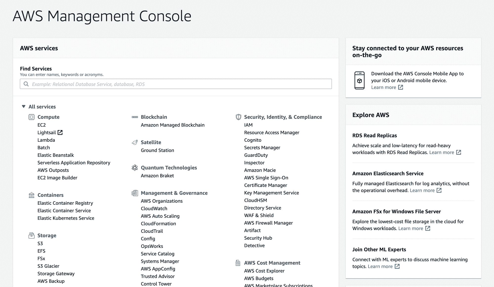

# 你需要知道的关于 AWS S3 的一切

> 原文：<https://www.freecodecamp.org/news/everything-you-need-to-know-about-aws-s3/>

本文将深入介绍 AWS S3——Amazon Web Services 提供的安全、可伸缩、超便宜的存储服务。

如果您曾经做过开发人员，您可能会遇到文件存储用例。从简单的图像到大型视频，在需要时上传、存储和访问这些文件总是很棘手。

对文件存储的通常回答是将它们保存在托管 web 应用程序的同一台服务器上。但是随着无服务器架构和单页面应用程序的出现，在同一服务器上存储文件不是一个好主意。

你可以争辩说你可以在数据库中存储文件。但是相信我，这不会是一次愉快的经历。

那么还有什么选择呢？

## 什么是 S3？

让我们看看 AWS S3。S3 是亚马逊提供的一种易于使用、可扩展且廉价的存储服务。您可以使用 S3 为各种用例存储任意数量的数据。

静态网站托管、数据存档和软件交付是 S3 成为完美工具的几个常见场景。

您可以使用 AWS SDK 通过 S3 轻松推送和提取数据。S3 还支持许多流行的编程语言，所以你可以使用你现有的堆栈，很容易地集成 S3。

AWS Console

S3 还通过 [AWS 控制台](https://aws.amazon.com/console/)提供了一个很棒的用户界面。您可以使用它来查看推送到 S3 的数据以及其他选项，如安全性和版本控制。

### 大量

在 S3，文件存储在桶里。存储桶类似于计算机上的文件夹。

每个存储桶都有自己唯一的名称，只能使用一次。例如，如果有一个名为“freecodecamp”的 bucket，您和其他任何人都不能重用同一个 bucket 名称。

这对于唯一地识别资源和使用域名的静态网站托管非常有用。

一个存储桶中可以存储的文件数量没有限制。Buckets 还提供了额外的特性，比如版本控制和[策略](https://docs.aws.amazon.com/IAM/latest/UserGuide/access_policies.html)。

您也可以为单个应用使用不同的铲斗。例如，存储医疗记录的应用程序可以使用两个存储桶:一个存储私人客户数据，另一个存储包含白皮书的公共存储桶。

S3 也是一个基于对象的存储服务，这意味着 S3 认为每个文件是一个对象。每个对象都有自己的元数据，包括名称、大小、日期和其他信息。

## S3 存储类型

S3 有三个基于一般使用情形的存储类别。

### S3 标准报

当您开始使用 S3 时，S3 标准是您将进入的默认存储计划。标准存储类具有出色的性能、耐用性和可用性。

如果您有需要经常访问的数据，S3 标准是最佳选择。

### S3 很少访问(S3-IA)

与标准计划相比，S3 非频繁访问提供了更低的数据价格。您可以将 S3-IA 用于不经常需要的数据。

S3-IA 非常适合备份和灾难恢复等使用情形。

### 冰川

Glacier 是 S3 最便宜的存储选择，但它是为档案存储而设计的。你从 Glacier 获取数据的速度不能和 Standard 或 S3-IA 一样快，但对于长期数据存档来说，这是一个很好的选择。

除了选择这三个存储类别之一，您还可以在 S3 中设置生命周期策略。这意味着你可以安排文件在一段时间后自动转移到 S3-IA 或 Glacier。

## 为什么用 S3？

网飞、Dropbox 和 Reddit 等公司都是 S3 的忠实用户。流行的文件存储系统 Dropbox 将其全部存储容量建立在亚马逊 S3 之上。

让我们看看 S3 的一些核心特征，并理解为什么它在企业和初创公司中如此受欢迎。

### 它是负担得起的

S3 很便宜。我的意思是，与其他储物解决方案相比，它非常便宜。使用 S3，您只需为您使用的东西付费。没有前期成本，没有设置。只是即插即用。

除了价格合理之外，S3 还提供免费层。这个免费层提供 5GB 的存储空间、20，000 个 GET 请求、2，000 个 PUT、COPY、POST 或 LIST 请求以及 15GB 的数据传输。免费层在第一年每月都可用。

有了 S3，你可以避免为你可能根本不需要的空间或带宽付费。

### 它是可扩展的

S3 随您的应用而扩展。因为你只为你使用的东西付费，所以你可以在 S3 存储的数据没有限制。

这在多种情况下很有帮助，尤其是在用户增长意外激增的情况下。你不必购买额外的空间。S3 会掩护你的。

### 很安全

公司更喜欢 S3 的原因之一是它倾向于安全。虽然您必须保护自定义服务器设置，但默认情况下，S3 是安全的。

这并不意味着你不能在 S3 存储公开信息。除非您明确配置不锁定，否则 S3 会高度安全地锁定您的所有数据。

S3 还维护合规计划，如 PCI-DSS、HIPAA/HITECH、FedRAMP、欧盟数据保护指令和 FISMA，以帮助您满足行业的监管要求。

### 它有版本控制

版本化意味着保存一个文件的多个副本，并跟踪其随时间的变化。这很有用，尤其是在处理敏感数据时。

使用 S3 启用版本控制时，还可以检索意外删除的文件。

但是，如果启用版本控制，您将存储同一文档的多个副本。这可能会影响定价以及您提出的读/写请求。

因此，在为您的应用程序集成版本控制时，请考虑这一点。

默认情况下，S3 禁用版本控制，但您可以使用 AWS 控制台启用版本控制。

### 它是耐用的

数据持久性是 S3 的一个被低估的特性。鉴于数据丢失在公司中是如此普遍，数据持久性是构建企业软件时要考虑的核心因素。

S3 提供高度耐用的存储基础设施。S3 在多个设施中冗余地存储数据，使您的数据在系统发生故障时安全。S3 还执行定期的数据完整性检查，以确保您的数据是完整的。

S3 在给定的一年内提供 99.999999999%的耐用性(称为 9s 耐用性)和 99.99%的可用性。

## S3 用例

### 静态网站托管

你可以使用 S3 作为一个静态网站托管平台。静态网站和动态网站的区别在于，动态网站接收和处理用户输入。静态网站仅用于显示信息。

随着[单页应用](https://en.wikipedia.org/wiki/Single-page_application)的出现，你可以在 S3 上托管一个完整的网络应用，而且通常是免费的。

像 React 和 Angular 这样的框架使得用户输入处理发生在浏览器中。您可以构建一个 SPA 来监听第三方 API，并在 S3 内部托管它。

S3 也有很好的路由支持，所以你也可以使用自己的自定义域。

我最近写了一篇关于使用 S3 和[托管 React web 应用的文章。](https://medium.com/@manishmshiva/aws-s3-hosting-a-react-web-app-on-aws-s3-2ff2e8ca78dd)

### 分析学

您可以在 S3 数据上运行查询，而无需将数据移动到分析平台。这使得 S3 成为构建强大分析应用的绝佳用例。

S3 提供多种选择，包括 S3 精选、亚马逊雅典娜和亚马逊红移光谱。您还可以将这些与 [AWS Lambda](https://aws.amazon.com/lambda/) 结合起来，动态执行数据处理。

### 文件共享

亚马逊 S3 也可以作为一个廉价的文件共享解决方案。正如我在文章前面提到的，著名的文件共享服务 Dropbox 最初是建立在 S3 之上的。

通过灵活的安全策略，您可以为不同的客户配置具有自定义权限的 S3 存储桶。S3 还提供[传输加速](https://aws.amazon.com/s3/transfer-acceleration/#:~:text=S3%20Transfer%20Acceleration%20%28S3TA%29%20reduces,to%20S3%20for%20remote%20applications.)来加速长距离的大文件传输。

## 摘要

亚马逊 S3 是一个很好的工具，可以满足您的 web 或移动应用程序存储需求。S3 以按需定价和可扩展性为核心，一直是小型和大型企业青睐的云存储解决方案。

得益于亚马逊 99.9999999999%的数据持久性承诺，从网飞到 Pinterest 的公司都信任 S3 的数据。

你也可以使用亚马逊 S3 作为个人存储解决方案，或者通过静态网站托管来托管你的下一个项目。简而言之，S3 是一款出色的多功能储物解决方案，可满足各种使用案例的需求。

我定期撰写关于机器学习、网络安全和 AWS 的文章。你可以在这里注册我的 [*周报*](https://www.manishmshiva.com/) *。*