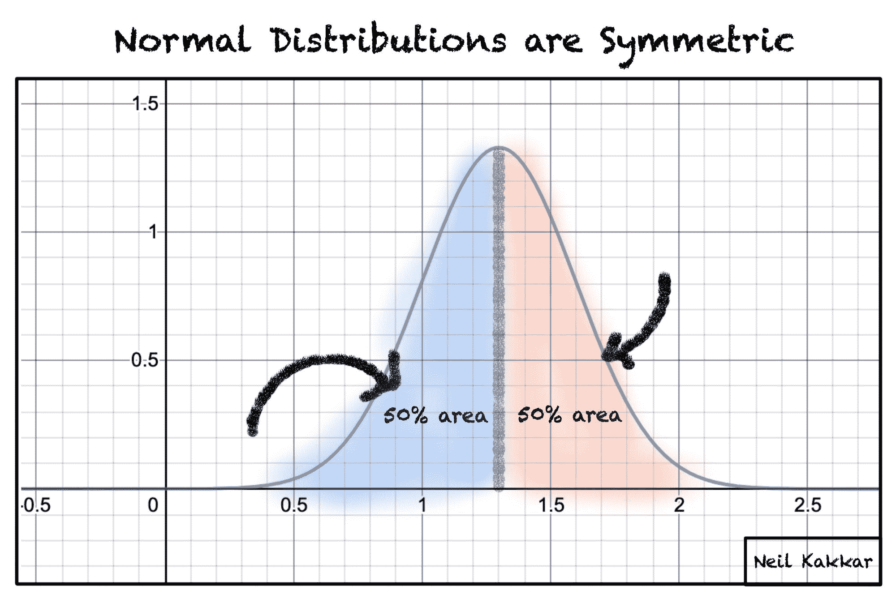
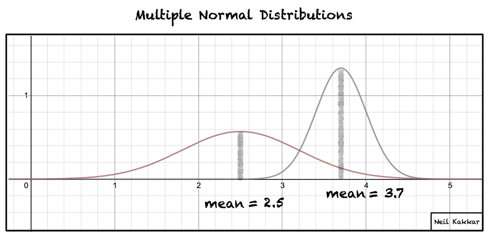
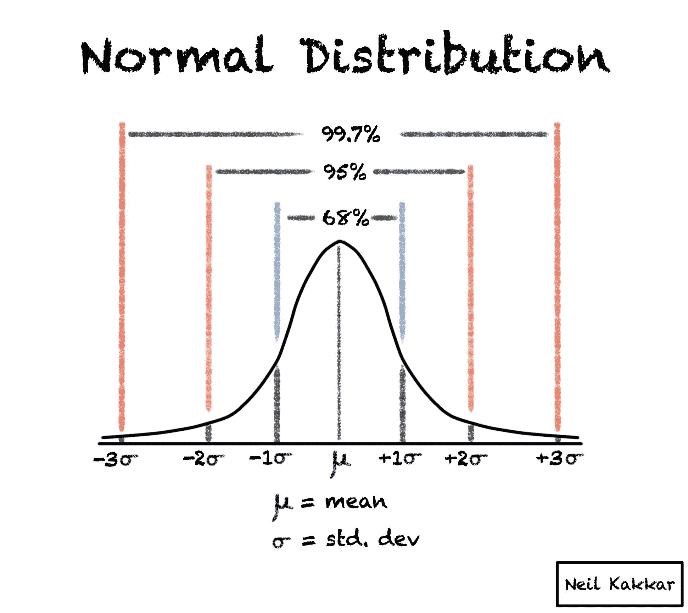
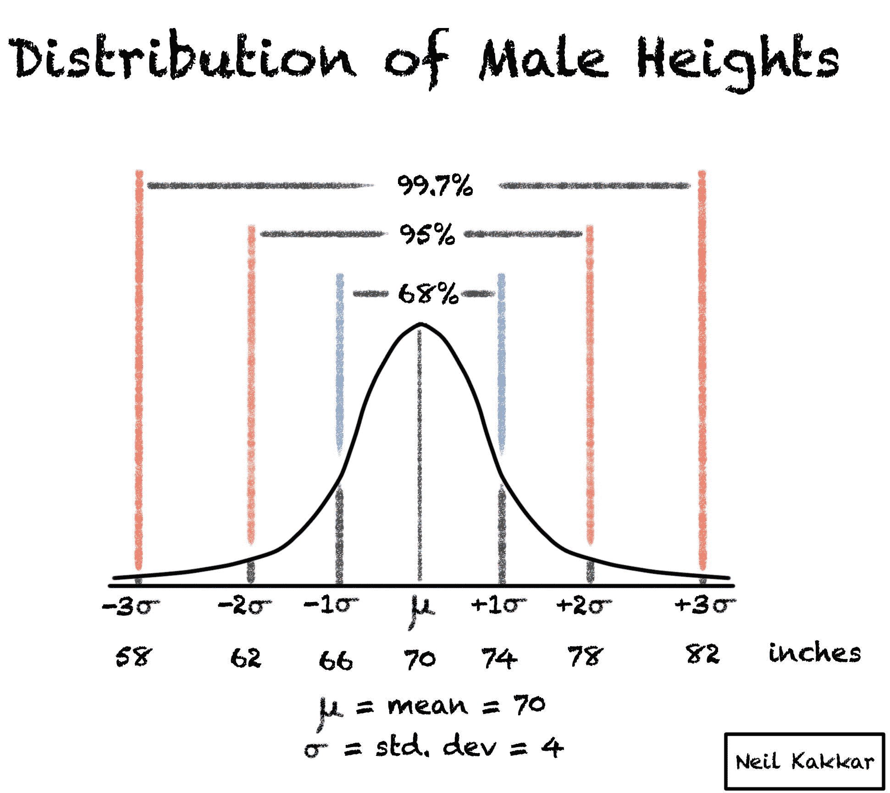
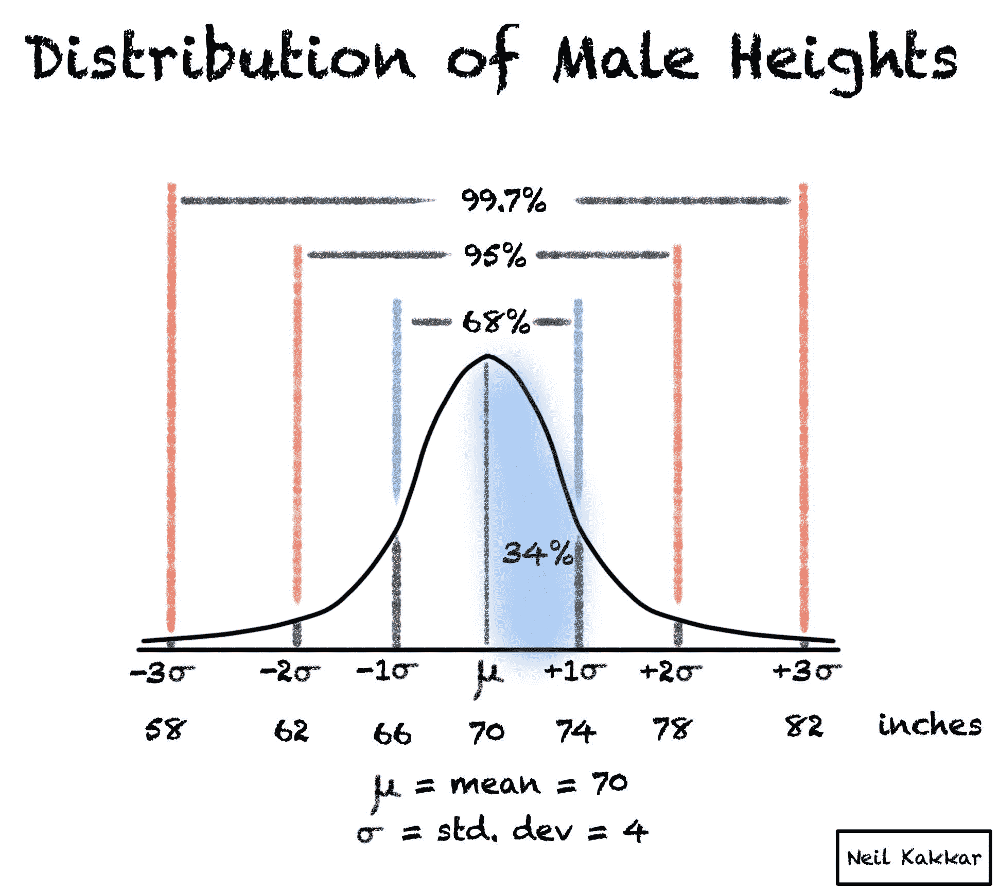
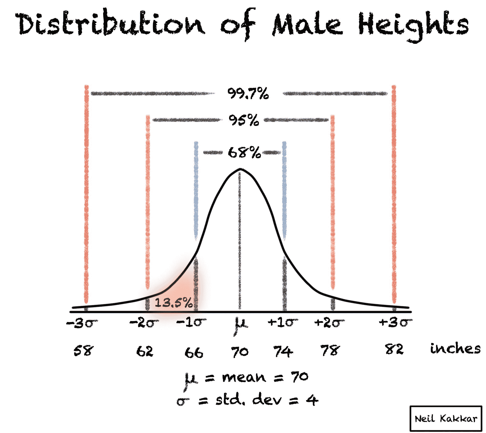
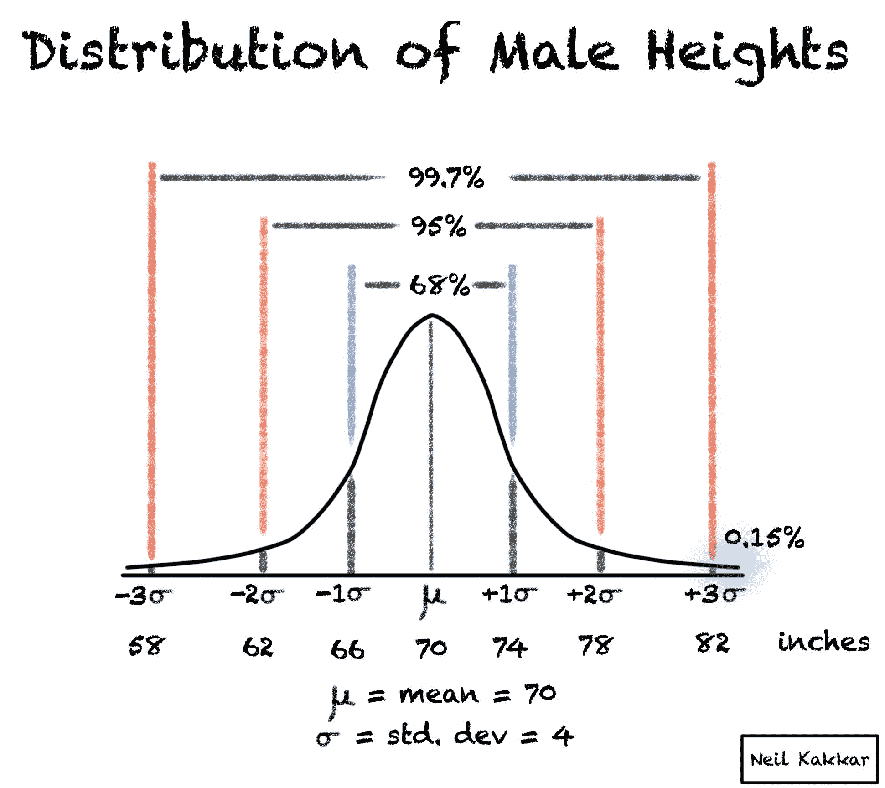

# 68-95-99 法则——用简单的英语解释正态分布

> 原文：<https://www.freecodecamp.org/news/normal-distribution-explained/>

认识一下梅森。他是一个 40 岁的普通美国人:5 英尺 10 英寸高，税前年收入 47，000 美元。

你多久会遇到一个收入是梅森 10 倍的人？

现在，你希望多久能遇到一个比梅森高 10 倍的人？

上面两个问题你的答案不一样，因为数据的分布不一样。在某些情况下，高于平均值 10 倍是常见的。而在另一些地方，这一点都不常见。

## 那么什么是正态分布呢？

今天，我们对正态分布感兴趣。它们由钟形曲线表示:它们在中间有一个峰值，向两边逐渐变小。很多事情都遵循这个分布，比如你的身高，体重，智商。

这种分布令人兴奋，因为它是对称的——这使得它很容易使用。您可以将大量复杂的数学简化为一些经验法则，因为您不需要担心怪异的边缘情况。

例如，峰值总是将分布分成两半。峰值前后的质量相等。

另一个重要的性质是，我们不需要大量的信息来描述一个正态分布。

的确，我们只需要两样东西:

1.  的意思。大多数人只是称之为“平均值”如果你把所有的观察值加起来，然后除以观察次数，就会得到这个值。比如这三个数的平均值:`1, 2, 3 = (1 + 2 + 3) / 3 = 2`
2.  和标准差。这告诉你一个观察将是多么罕见。大多数观察值都在平均值的一个标准差范围内。较少的观察值是平均值的两个标准差。离三个标准差(或更远)的就更少了。

总的来说，平均值和标准差构成了你需要知道的关于分布的一切。

### 六八九五九法则

68-95-99 规则基于平均值和标准差。上面写着:

> 68%的人口在平均值的 1 个标准差以内。
> 
> 95%的人口在平均值的 2 个标准差以内。
> 
> 99.7%的人口在平均值的 3 个标准差以内。

## 如何计算正态分布

继续我们的例子，美国男性的平均身高是 5 英尺 10 英寸，标准差是 4 英寸。这意味着:

现在是有趣的部分:让我们应用我们刚刚学到的东西。

看到身高在 5 英尺 10 英寸到 6 英尺 2 英寸之间的人的几率有多大？(也就是 70 到 74 寸之间。)

是 34%！我们利用这两个属性:分布是对称的，这意味着(66-70)英寸和(70-74)英寸的机会都是 68/2 = 34%。

让我们试试更难的。看到身高在 62 到 66 英寸之间的人的几率有多大？

就是(95-68)/2 = 13.5%。两个外边缘具有相同的百分比。

现在是你的最后(也是最难的测试):看到身高超过 82 英寸的人的几率有多大？

这里，我们也使用最后一个属性:所有的总和必须是 100%。所以外沿(也就是 58 以下的高度和 82 以上的高度)合起来就成了(100% - 99.7%) = 0.3%。

请记住，您可以将此应用于任何正态分布。尝试对女性身高做同样的事情:平均值是 65 英寸，标准差是 3.5 英寸。

所以，看到身高在 65 到 68.5 英寸之间的人的几率是:_ _ _ _。

...

...

34%!和我们第一个例子完全一样。是+1 标准差。

## 结论

知道了这个规则，校准你的感官就变得非常容易。因为我们需要描述的所有正态分布都是平均值和标准偏差，这条规则适用于世界上的*和*正态分布！

事实上，具有挑战性的部分是计算出这种分布是否是正态分布。

想了解更多关于校准你的感官和批判性思维的知识吗？查看[贝叶斯定理:批判性思维的框架](https://neilkakkar.com/Bayes-Theorem-Framework-for-Critical-Thinking.html)。