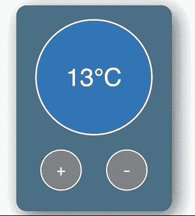
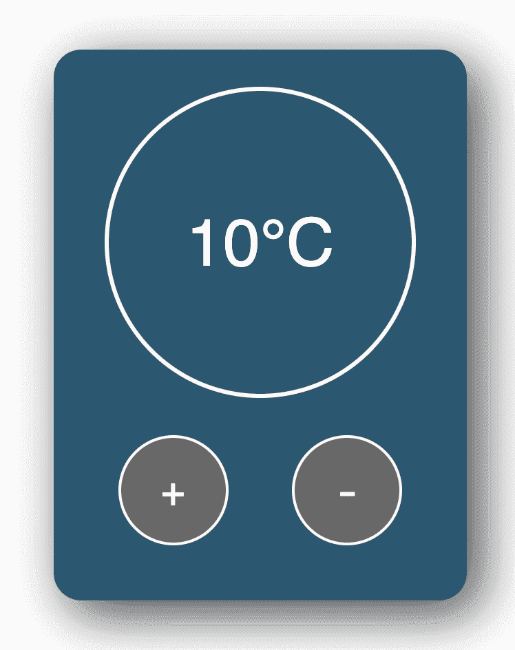

# 如何在 React 中构建温度控制应用程序——包括提示和入门代码

> 原文：<https://www.freecodecamp.org/news/react-beginner-project-tutorial-temperature-control-app/>

## 我们正在建造的东西

在这个初学者 React 项目中，我们将学习如何使用状态挂钩、处理事件、基于状态应用 CSS 等等！看看这个:



### 更喜欢视频教程？

点击这里查看 YouTube 教程。

## 你自己试试

如果你想自己先试一试，这里有一些场景(你也可以从下面获取 CSS/starter 代码):

*   当用户点击“增加按钮”时，温度应该增加
*   温度不能超过 30 度
*   当用户点击“降低按钮”时，温度应该降低
*   温度不能低于零度
*   当温度达到或超过 15 度时，背景颜色应该变成红色(提示:我已经包含了一个你可以使用的叫做“热”的样式)
*   当温度低于 15 度时，背景颜色应该是蓝色(提示:我已经包括了一个你可以使用的叫做“冷”的风格)

## 设置/启动代码

注意:我假设您有一个 React 开发环境设置。如果没有，[看看这个视频，帮助你开始。](https://youtu.be/bZXjHauDNcg)

我们只需要使用 **create-react-app** 就可以开始了。启动终端并运行:

```
npx create-react-app temperature-control 
```

让终端做自己的事情，用 VS 代码(或者你用的任何东西)打开项目。

接下来，进入 **index.js** ，删除所有内容，并粘贴以下内容:

```
import React from 'react';
import ReactDOM from 'react-dom';
import './index.css';
import App from './App';

ReactDOM.render(
	<React.StrictMode>
		<App />
	</React.StrictMode>,
	document.getElementById('root')
); 
```

进入 **index.css** ，删除所有内容，并粘贴以下内容:

```
body {
	font-family: sans-serif;
	text-align: center;
	display: flex;
	flex-direction: column;
	justify-content: center;
	align-items: center;
	text-align: center;
	min-height: 100vh;
}

.app-container {
	height: 400px;
	width: 300px;
	background: #2b5870;
	border-radius: 20px;
	box-shadow: 10px 10px 38px 0px rgba(0, 0, 0, 0.75);
}

.temperature-display-container {
	display: flex;
	justify-content: center;
	align-items: center;
	height: 70%;
}

.temperature-display {
	display: flex;
	border-radius: 50%;
	color: #ffffff;
	height: 220px;
	width: 220px;
	text-align: center;
	justify-content: center;
	align-items: center;
	font-size: 48px;
	border: 3px #ffffff solid;
	transition: background 0.5s;
}

button {
	border-radius: 100px;
	height: 80px;
	width: 80px;
	font-size: 32px;
	color: #ffffff;
	background: rgb(105, 104, 104);
	border: 2px #ffffff solid;
}

button:hover {
	background: rgb(184, 184, 184);
	cursor: pointer;
}

button:focus {
	outline: 0;
}

.button-container {
	display: flex;
	justify-content: space-evenly;
	align-items: center;
}

.neutral {
	background: rgb(184, 184, 184);
}

.cold {
	background: #035aa6;
}

.hot {
	background: #ff5200;
} 
```

最后，进入 **App.js** ，删除所有内容，并粘贴以下内容:

```
import React from 'react';

const App = () => {
	return (
		<div className='app-container'>
			<div className='temperature-display-container'>
				<div className='temperature-display'>10°C</div>
			</div>
			<div className='button-container'>
				<button>+</button>
				<button>-</button>
			</div>
		</div>
	);
};

export default App; 
```

现在，我们可以用 VS 代码打开一个终端并运行以下代码:

```
npm start 
```

如果一切按计划进行，您应该看到以下内容:



万岁！这给了我们一个很好的模板，不用担心任何 CSS。

## 使温度值处于动态使用状态

我们要做的第一件事是使温度值动态化。为此，我们将在状态中存储**温度值。这使得我们以后更容易获得该值，并使用它执行逻辑。**

> 如果你的用户界面发生了变化，把它放到状态中是一个好主意。

在 **App.js** 中导入文件顶部的 **useState** 钩子，如下所示:

```
import React, { useState } from 'react'; 
```

然后，在 **App 函数**中添加以下内容:

```
const [temperatureValue, setTemperatureValue] = useState(10); 
```

快速回顾一下使用状态，它允许我们在组件状态下保存数据。**使用状态**钩子给了我们两件事:

*   保存当前状态值的变量
*   改变状态值的函数。

在本例中，我们调用了状态变量**温度值**，调用了函数**设置温度值**。通过将**值 10** 传递给 useState 钩子，我们已经将我们的 temperatureValue 初始化为值 **10** 。

现在我们有了一个状态值，是时候在我们的代码中使用它了。记住，我们从 **useState** 得到的东西可以像任何旧的 JavaScript 变量和函数一样使用(因为它们就是那样)。

在我们的 JSX 中，我们希望使用我们新奇的状态变量来替换硬编码的温度值。更改此行:

```
<div className='temperature-display'>10°C</div> 
```

所以它变成了这样:

```
<div className='temperature-display'>{temperatureValue}°C</div> 
```

注意我们如何使用 **{}** 来呈现我们的**温度值**变量。现在，当我们的温度值改变时，组件将重新呈现并显示新的温度值。

到目前为止，我们的 **App.js** 文件如下所示:

```
import React, { useState } from 'react';

const App = () => {
	const [temperatureValue, setTemperatureValue] = useState(10);

	return (
		<div className='app-container'>
			<div className='temperature-display-container'>
				<div className='temperature-display'>{temperatureValue}°C</div>
			</div>
			<div className='button-container'>
				<button>+</button>
				<button>-</button>
			</div>
		</div>
	);
};

export default App; 
```

现在，如果您运行应用程序，并查看浏览器，您会发现事情看起来和以前一样。

但是如果你把我们传递给 useState 钩子的初始值**从 10 改成别的值(比如 15)，你会看到应用程序更新了。这意味着我们的国家挂钩正在工作！**

## 点击按钮时改变状态

让我们在点击按钮时使温度值增加/减少。

众所周知，useState 钩子给了我们一个 **setTemperatureValue** 函数，我们可以用它来改变**温度值**。因此，我们有必要将它连接到按钮的 **onClick** 事件。

我们先做增加按钮。用以下内容替换增加按钮:

```
<button onClick={() => setTemperatureValue(temperatureValue + 1)}>+</button> 
```

注意这是如何调用 **setTemperatureValue** 函数的。我们取当前的**温度值**，加 1，并将其作为参数传递。

因此，由于 temperatureValue 从 10 开始，加 1 会将状态值设置为 11。再次点击按钮时，状态设置为 12，依此类推。

接下来，我们将对减少按钮做同样的操作。用以下内容替换当前减少按钮:

```
<button onClick={() => setTemperatureValue(temperatureValue - 1)}>-</button> 
```

这是做同样的事情，除了我们这次降低了**温度值**。

我们的代码现在看起来像这样:

```
import React, { useState } from 'react';

const App = () => {
	const [temperatureValue, setTemperatureValue] = useState(10);

	return (
		<div className='app-container'>
			<div className='temperature-display-container'>
				<div className='temperature-display'>{temperatureValue}°C</div>
			</div>
			<div className='button-container'>
				<button onClick={() => setTemperatureValue(temperatureValue + 1)}>+</button>
				<button onClick={() => setTemperatureValue(temperatureValue - 1)}>-</button>
			</div>
		</div>
	);
};

export default App; 
```

试着在浏览器中运行并点击按钮。这些值将增加/减少。

## 根据状态改变颜色

现在让我们做一些有趣的事情。我们希望显示器的背景颜色根据温度的高低而变化。

如果温度是 15 度或以上，我们想改变背景颜色为红色。如果是 15 以下，我们想把背景色改成蓝色。

如果你看一下 CSS，我提供了两个类:

*   将背景设置为蓝色
*   将背景设置为红色

如果我们将这些类中的任何一个添加到**温度显示** div，它会改变颜色。例如:

```
<div className='temperature-display cold'>{temperatureValue}°C</div> 
```

将为温度显示提供蓝色背景，同时:

```
<div className='temperature-display hot'>{temperatureValue}°C</div> 
```

将使温度显示为红色背景。

好的，这很好，但是我们如何基于状态动态地添加这些类呢？

请记住，将用户界面上可能发生变化的东西放入状态中通常是一个好主意。所以 state 是保存我们想要使用的当前 CSS 类的理想位置。

让我们继续创建另一个状态挂钩来保存**温度颜色**，如下所示:

```
const [temperatureColor, setTemperatureColor] = useState('cold'); 
```

注意，我们用值“cold”初始化我们的 **temperatureColor** 状态对象(因为我们的温度值最初是 10 度，我们希望背景颜色是蓝色)。

然后，我们可以使用**模板文字**来动态添加我们希望使用这个状态变量的类。继续使用以下内容更新代码:

```
<div className={`temperature-display ${temperatureColor}`}>{temperatureValue}°C</div> 
```

这是一个很难理解的语法，所以如果你不能马上理解也不用担心。

所做的就是创建一个字符串并动态应用**温度颜色**变量。每当**温度颜色**变为“热”时，组件将重新呈现，CSS 类“热”将被添加到类名字符串中。

到目前为止，我们的代码如下所示:

```
import React, { useState } from 'react';

const App = () => {
	const [temperatureValue, setTemperatureValue] = useState(10);
	const [temperatureColor, setTemperatureColor] = useState('cold');

	return (
		<div className='app-container'>
			<div className='temperature-display-container'>
				<div className={`temperature-display ${temperatureColor}`}>{temperatureValue}°C</div>
			</div>
			<div className='button-container'>
				<button onClick={() => setTemperatureValue(temperatureValue + 1)}>+</button>
				<button onClick={() => setTemperatureValue(temperatureValue - 1)}>-</button>
			</div>
		</div>
	);
};

export default App; 
```

将初始**温度颜色**状态变量更改为“热”/“冷”，温度显示的背景应会改变。

现在我们知道这是可行的，我们要做的就是改变状态变量。但是我们在哪里做呢？

嗯，我们已经有了一个 **onClick 处理程序来改变 temperatureValue** ，所以向这个处理程序添加新的逻辑是有意义的。

到目前为止，我们已经为我们的点击事件处理程序使用了一个**内联函数**。当我们有一个单行函数时，使用内联函数是很好的。

但是当我们有一个多行函数和一堆逻辑时，最好把函数移到 JSX 之外。这使得我们的代码更加简洁。

继续将下面的内容粘贴到所有州的下面:

```
const increaseTemperature = () => {
	setTemperatureValue(temperatureValue + 1);
};

const decreaseTemperature = () => {
	setTemperatureValue(temperatureValue - 1);
}; 
```

这里我们定义了两个函数——一个提高温度，另一个降低温度。

接下来，我们想要更改按钮的 **onClick** 属性来调用这些函数，而不是之前的内联函数:

```
 <button onClick={increaseTemperature}>+</button>
    <button onClick={decreaseTemperature}>-</button> 
```

现在，我们不再使用内嵌函数，而是向我们的*升温*和*降温*函数传递引用。到目前为止，我们的代码如下所示:

```
import React, { useState } from 'react';

const App = () => {
	const [temperatureValue, setTemperatureValue] = useState(10);
	const [temperatureColor, setTemperatureColor] = useState('cold');

	const increaseTemperature = () => {
		setTemperatureValue(temperatureValue + 1);
	};

	const decreaseTemperature = () => {
		setTemperatureValue(temperatureValue - 1);
	};

	return (
		<div className='app-container'>
			<div className='temperature-display-container'>
				<div className={`temperature-display ${temperatureColor}`}>{temperatureValue}°C</div>
			</div>
			<div className='button-container'>
				<button onClick={increaseTemperature}>+</button>
				<button onClick={decreaseTemperature}>-</button>
			</div>
		</div>
	);
};

export default App; 
```

注意什么都没有改变——我们只是在*重构我们的代码*,为即将到来的变化做准备。

现在，为两个按钮点击事件添加代码逻辑要容易得多——我们只需在适当的函数中编写我们的逻辑，生活就很美好了。

好吧！随着重构乐趣的消失，让我们回到正题。所以我们说过**当温度超过 15 度时，我们想要改变温度颜色状态值**。

我们可以将这个逻辑添加到我们的 **increaseTemperature** 函数中，如下所示:

```
const increaseTemperature = () => {
	const newTemperature = temperatureValue + 1;
	setTemperatureValue(newTemperature);

	if (newTemperature >= 15) {
		setTemperatureColor('hot');
	}
}; 
```

我们做了什么？

*   我们已经创建了一个变量来保存**新温度**值(我们这样做是因为我们将在一些地方使用这个变量)
*   我们像之前一样设置**温度值**
*   我们编写了一个 **if 语句**来检查**新温度**值是否大于或等于 15
*   如果是，那么我们使用 **setTemperatureColor** 函数将**温度颜色**状态值设置为“热”

因此，每当我们点击按钮的次数足够多，以至于**温度值**大于或等于 15 以上时，**温度颜色**变量就会改变，组件会重新呈现，并且“hot”类会像变魔术一样添加到温度显示中。

但是等等！我们还没有处理下降的问题。这基本上类似于增加函数:

```
const decreaseTemperature = () => {
	const newTemperature = temperatureValue - 1;
	setTemperatureValue(newTemperature);
	if (newTemperature < 15) {
		setTemperatureColor('cold');
	}
}; 
```

这一次我们减去 1，并在改变**温度颜色**之前检查新值是否低于 15

我们最终的应用程序代码如下所示:

```
import React, { useState } from 'react';

const App = () => {
	const [temperatureValue, setTemperatureValue] = useState(10);
	const [temperatureColor, setTemperatureColor] = useState('cold');

	const increaseTemperature = () => {
		const newTemperature = temperatureValue + 1;
		setTemperatureValue(newTemperature);

		if (newTemperature >= 15) {
			setTemperatureColor('hot');
		}
	};

	const decreaseTemperature = () => {
		const newTemperature = temperatureValue - 1;
		setTemperatureValue(newTemperature);
		if (newTemperature < 15) {
			setTemperatureColor('cold');
		}
	};

	return (
		<div className='app-container'>
			<div className='temperature-display-container'>
				<div className={`temperature-display ${temperatureColor}`}>{temperatureValue}°C</div>
			</div>
			<div className='button-container'>
				<button onClick={increaseTemperature}>+</button>
				<button onClick={decreaseTemperature}>-</button>
			</div>
		</div>
	);
};

export default App; 
```

运行应用程序，一切都应该工作-万岁！

## 尝试的挑战

你可能已经注意到我们的温度控制不是很安全——用户可以将温度升高到 100 摄氏度，让自己沸腾，或者将温度降低到-100 摄氏度，让自己变成一个巨大的冰块。

如果你选择接受它，挑战是防止温度值**超过 30 摄氏度**，并防止温度值**低于 30 摄氏度**。

提示:**升高温度**和**降低温度**功能是添加这种逻辑的最佳位置！