# 如何使用 YouTube API 将 YouTube 播放列表添加到 Next.js React 应用程序

> 原文：<https://www.freecodecamp.org/news/how-to-add-a-youtube-playlist-to-a-nextjs-react-app-with-the-youtube-api/>

YouTube 为内容创作者提供了大量工具来添加他们的作品供所有人观看。但这些工具只能帮助你管理 YouTube 上的体验。

我们如何利用 YouTube API 将我们的视频内容放到我们自己的网站上？

*   [YouTube 有 API？](#youtube-has-an-api)
*   我们要建造什么？
*   [第 0 步:Next.js 入门](#step-0-getting-started-with-next-js)
*   [第一步:创建一个谷歌开发者项目](#step-1-creating-a-google-developer-project)
*   [步骤 2:从 YouTube API 请求播放列表项目](#step-2-requesting-playlist-items-from-the-youtube-api)
*   [第三步:在页面上显示 YouTube 播放列表视频](#step-3-showing-youtube-playlist-videos-on-the-page)

[https://www.youtube.com/embed/8YWrmZoUYGs?feature=oembed](https://www.youtube.com/embed/8YWrmZoUYGs?feature=oembed)

## YouTube 有 API？

没错。YouTube 和许多其他谷歌服务一样，[有一个 API](https://developers.google.com/youtube) ,我们可以用它在 YouTube 之外的方式利用我们的内容。而且 API 非常广泛。

通过 YouTube 的 API，你可以管理你的视频，访问分析和管理播放。但是我们将使用它从播放列表中抓取视频，以便我们可以将它们添加到页面中。

## 我们要建造什么？

我们将组装一个 [Next.js](https://nextjs.org/) 应用程序，它使用 YouTube API 从播放列表中获取视频。

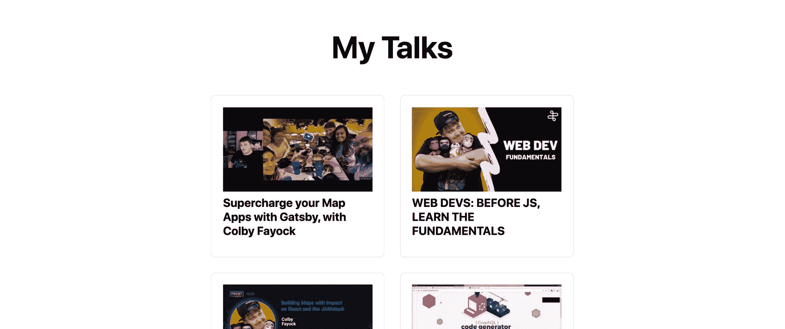

[Demo Playlist Gallery](https://demo-youtube-playlist.vercel.app/)

我们将获取这些视频，并在链接到视频的页面上显示它们的缩略图。

## 步骤 0:开始使用 Next.js

要启动一个应用程序，我们将使用 Next.js。使用 yarn 或 npm，我们可以轻松地创建一个新的应用程序，让我们可以直接进入代码。

因此，要开始，导航到您想要创建项目并运行的位置:

```
yarn create next-app
# or
npx create-next-app 
```

该脚本将提示您输入项目名称。我将使用“我的 youtube 播放列表”，它将安装所有需要的依赖项。

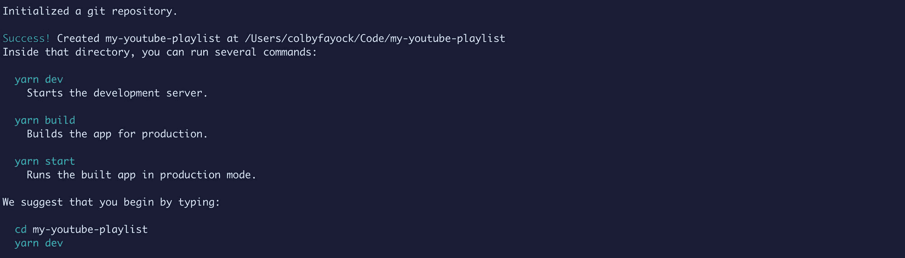

Successfully created a new app with Next.js

然后导航到该目录并运行`yarn dev`来启动您的开发服务器，我们就可以开始了。

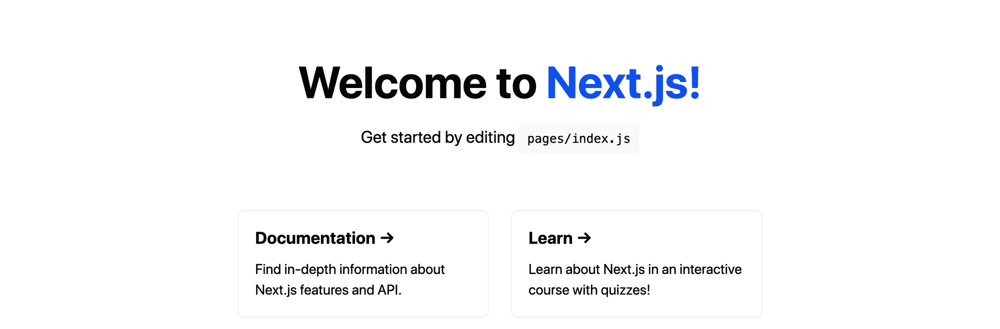

Next.js default page

[跟随提交！](https://github.com/colbyfayock/my-youtube-playlist/commit/f062c01111aa064c43111dad6a23812637ce1f92)

## 步骤 1:创建一个 Google 开发者项目

要使用 API，我们需要在 Google 开发者控制台中添加一个新项目，它将允许我们生成一个 API 密钥来使用服务。

首先，前往:[https://console.developers.google.com/](https://console.developers.google.com/)。

在那里用你的 Google 帐户登录后，我们将创建一个新项目。

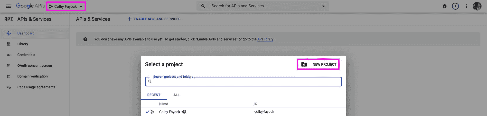

Creating a new project in Google Developer Console

此时，您可以随意命名您的项目。我选“我的 YouTube 播放列表”。然后单击创建。

默认情况下，谷歌不会让你进入新项目。它启动一个任务来创建这个项目，但是一旦完成，您可以打开项目选择器并选择您的新项目。

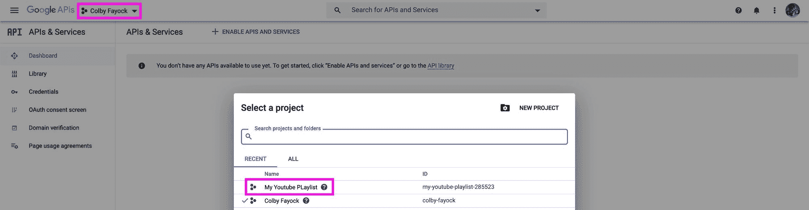

Selecting your project

接下来，我们想要创建一个 API 密钥。导航到凭据，单击创建凭据，然后选择 API 密钥。

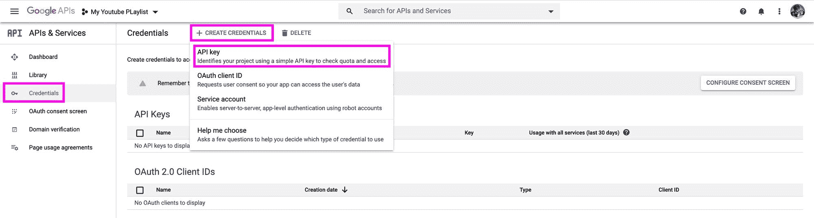

Creating an API Key credential

这将创建一个新的 API 键，您将需要复制并保存它以供以后使用。

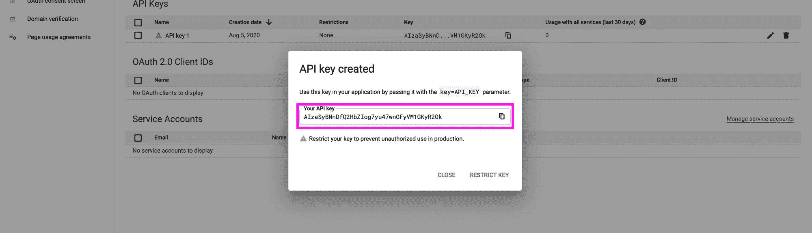

Copying your new API key

注意:这个 API 密匙应该保密。如果你暴露了它或者把它添加到公众可以得到的地方，比如 GitHub，其他人就可以滥用它，让你为此买单。

最后，我们需要添加 YouTube API 作为服务。导航到侧边栏的**库**，搜索“YouTube”，然后选择 **YouTube 数据 API v3** 。

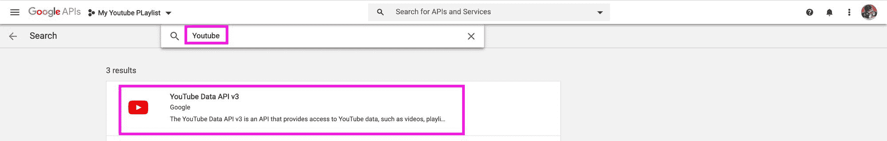

Searching for YouTube API in the Google API Library

最后，在该页面加载后，单击 Enable，这将把您带到一个新的仪表板页面，您就可以开始了。

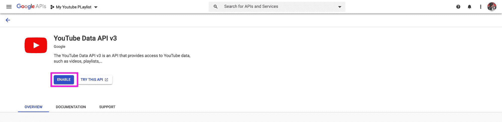

Enabling YouTube Data API v3

## 步骤 2:从 YouTube API 请求播放列表项

为了请求我们的数据，我们将使用 [getServerSideProps](https://nextjs.org/docs/basic-features/data-fetching#getserversideprops-server-side-rendering) 函数。

首先，打开`pages/index.js`文件，在`Home`组件上添加以下内容。

```
const YOUTUBE_PLAYLIST_ITEMS_API = 'https://www.googleapis.com/youtube/v3/playlistItems';

export async function getServerSideProps() {
  const res = await fetch(`${YOUTUBE_PLAYLIST_ITEMS_API}`)
  const data = await res.json();
  return {
    props: {
      data
    }
  }
} 
```

我们正在做的是:

*   我们正在创建一个存储 API 端点的新常量
*   我们正在创建和导出一个新的`getServerSideProps`函数
*   在该函数中，我们获取端点
*   然后我们将其转换成 JSON
*   最后，我们返回数据作为对象中的道具

现在，如果我们从`Home`中析构`data`属性，并如下所示在控制台中注销该数据:

```
export default function Home({ data }) {
  console.log('data', data); 
```

我们现在可以看到我们得到了一个错误:

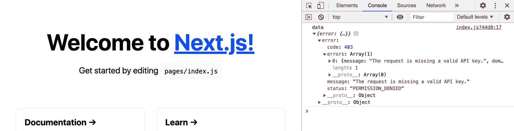

Request error requiring API key

我们没有使用我们的 API 键，所以让我们使用它。

在项目的根目录下创建一个名为`.env.local`的新文件，并添加以下内容:

```
YOUTUBE_API_KEY="[API Key]" 
```

确保用步骤 1 中的 API 密钥替换`[API Key]`。

此时，您需要重启服务器，以便 Next.js 可以看到新变量。

现在，更新`getServerSideProps`函数，将您的密钥添加到 API 请求中:

```
export async function getServerSideProps() {
  const res = await fetch(`${YOUTUBE_PLAYLIST_ITEMS_API}?key=${process.env.YOUTUBE_API_KEY}`) 
```

如果我们重新加载页面，我们再次得到一个错误:

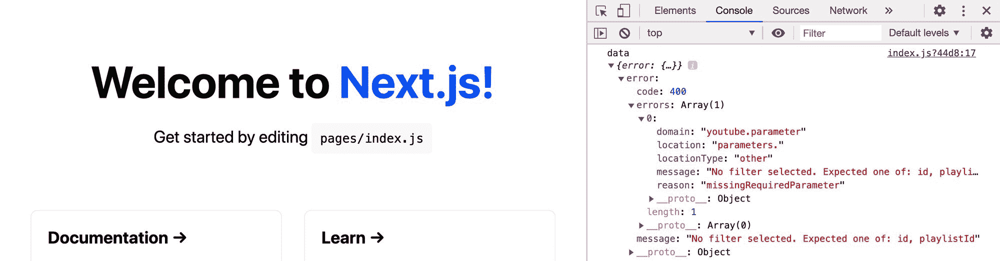

Request error requiring API parameters

现在，我们缺少播放列表 ID 和获取数据所需的过滤器。

使用来自[播放列表项目 API](https://developers.google.com/youtube/v3/docs/playlistItems/list#request) 的参数，让我们再次更新我们的 API 端点:

```
const res = await fetch(`${YOUTUBE_PLAYLIST_ITEMS_API}?part=snippet&maxResults=50&playlistId=[Playlist ID]&key=${process.env.YOUTUBE_API_KEY}`) 
```

在这里，我们添加:

*   这告诉 API 我们想要代码片段
*   `maxResults=50`:这将返回的播放列表项目的最大数量设置为 50
*   `playlistId=[Playlist ID]`:增加了配置播放列表 ID 的参数。这里，您应该将该值更新为您选择的播放列表 ID。

注意:您可以在想要使用的播放列表的 URL 中找到播放列表 ID。

最后，当我们重新加载页面时，我们得到了我们的数据:

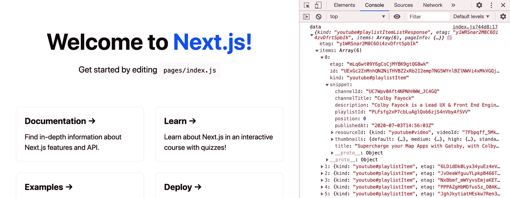

Successfully requested playlist items

[跟随提交！](https://github.com/colbyfayock/my-youtube-playlist/commit/7ca0de9005303950fd1aac4442b8fba7b4b179a7)

## 步骤 3:在页面上显示 YouTube 播放列表视频

现在我们有了数据，我们想显示它。

为了利用我们已经从 Next.js 获得的内容，我们可以将现有的网格转换为 YouTube 缩略图的网格。

让我们将整个`<div>`替换为`styles.grid`的`className`，以:

```
<ul className={styles.grid}>
  {data.items.map(({ id, snippet = {} }) => {
    const { title, thumbnails = {}, resourceId = {} } = snippet;
    const { medium } = thumbnails;
    return (
      <li key={id} className={styles.card}>
        <a href={`https://www.youtube.com/watch?v=${resourceId.videoId}`}>
          <p>
            
          </p>
          <h3>{ title }</h3>
        </a>
      </li>
    )
  })}
</ul> 
```

我们正在做的是:

*   我们将`<div>`改为`<ul>`,这样更有语义
*   我们通过播放列表中的项目创建一个映射来动态创建新项目
*   我们通过获取 id、标题、缩略图和视频 ID 来破坏我们的数据
*   使用 ID，我们将一个密钥添加到我们的`<li>`
*   我们还将`styles.card`的`className`从`<a>`移动到`<li>`
*   对于我们的链接，我们使用 YouTube 视频 ID 来创建视频 URL
*   我们添加缩略图
*   我们用我们的`title`来表示`<h3>`

如果我们重新加载页面，我们可以看到我们的视频在那里，但风格有点偏离。

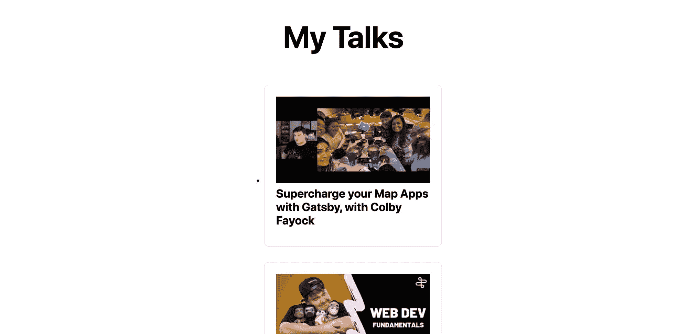

Displaying playlist items on the page

要解决这个问题，我们可以从在`Home.module.css`文件中向`.grid`添加以下样式开始:

```
list-style: none;
padding: 0;
margin-left: 0; 
```

我们也可以改变

```
align-items: center; 
```

到

```
align-items: flex-start; 
```

这将有助于修复我们的视频对齐。

但是我们会注意到我们仍然没有像最初的 Next.js 布局那样有两列。

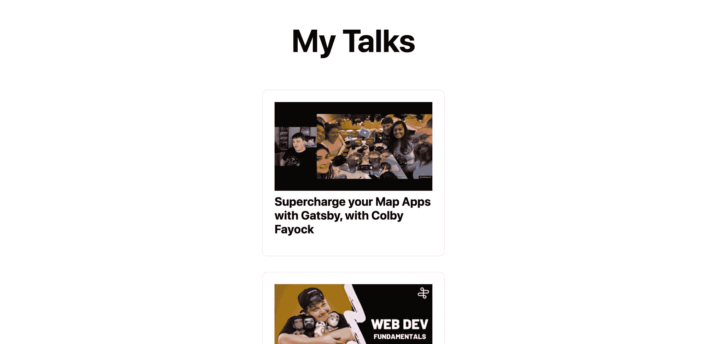

Removing default HTML list styles

在我们刚刚更新的`.grid`类下，添加以下内容:

```
.grid img {
  max-width: 100%;
} 
```

这确保了我们所有的图像不会超出容器。这将防止溢出，并让我们的图像固定在两列。

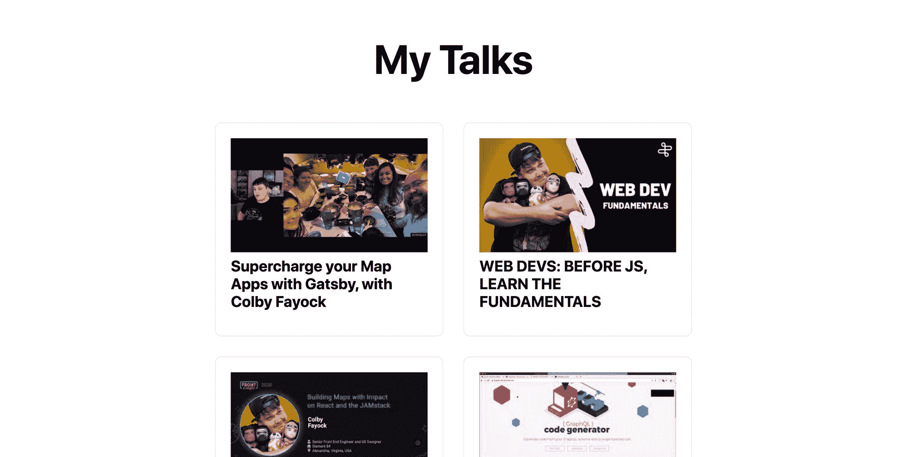

Fixing column sizes

这就是我们的播放列表视频。

[跟随提交！](https://github.com/colbyfayock/my-youtube-playlist/commit/5bc2d374ea706d3ad920a8568097e3dd6e30f568)

## 我们还能做什么？

### 嵌入播放器，点击播放视频

YouTube 也为他们自己的播放器提供控制。因此，使用一些 JavaScript，我们可以利用这一点，当有人点击我们的视频缩略图时，我们可以显示一个嵌入式播放器并播放该视频。

[iframe 嵌入的 YouTube 播放器 API 参考](https://developers.google.com/youtube/iframe_api_reference)

### 获取分析数据

虽然 YouTube 在其仪表板中提供了一些分析，但也许你想要更高级的东西。

您可以使用分析和报告 API 来深入了解您的渠道和视频。

[YouTube 分析和报告 API](https://developers.google.com/youtube/analytics)

[](https://twitter.com/colbyfayock)

*   [？在 Twitter 上关注我](https://twitter.com/colbyfayock)
*   [？️订阅我的 Youtube](https://youtube.com/colbyfayock)
*   [✉️注册我的简讯](https://www.colbyfayock.com/newsletter/)