# heroku Deploy——如何将网络应用或网站推向生产

> 原文：<https://www.freecodecamp.org/news/how-to-deploy-an-application-to-heroku/>

在部署应用程序时，通常有两个选项:一个 [VPS](https://en.wikipedia.org/wiki/Virtual_private_server) 或一个 [PaaS](https://en.wikipedia.org/wiki/Platform_as_a_service) (平台即服务)。本文将向您展示在像 [Heroku](https://www.heroku.com/) 这样的 PaaS 上部署应用程序的方法。

## 步骤 1 -创建项目

第一步是用一些基本文件为我们的项目创建一个简单的结构。对于本文，我将使用 NodeJS 创建一个演示服务器。

在一个新文件夹中，我将打开一个终端并运行命令`npm init -y`来创建一个新项目。虚拟服务器将用 [Express](https://expressjs.com/) 编写，所以我们需要运行`npm install express`命令来安装这个模块。

一旦安装了这个库，我们就可以为我们的项目创建一个名为`app.js`的新文件。在其中，我们将编写简单服务器的代码:

[RAW](https://carbon.now.sh/?bg=rgba(171%2C%20184%2C%20195%2C%201)&t=seti&wt=none&l=javascript&ds=true&dsyoff=20px&dsblur=68px&wc=true&wa=true&pv=56px&ph=56px&ln=false&fl=1&fm=Hack&fs=14px&lh=133%25&si=false&es=2x&wm=false&code=const%2520app%2520%253D%2520require(%2522express%2522)()%253B%250A%250Aconst%2520PORT%2520%253D%2520process.env.PORT%2520%257C%257C%25203000%253B%250A%250Aapp.get(%2522%2522%252C%2520(req%252C%2520res)%2520%253D%253E%2520%257B%250A%2520%2520res.send(%2522Hello%2520world%2522)%253B%250A%257D)%253B%250A%250Aapp.listen(PORT%252C%2520()%2520%253D%253E%2520%257B%250A%2520%2520console.log(%2560App%2520up%2520at%2520port%2520%2524%257BPORT%257D%2560)%253B%250A%257D)%253B)

我们可以通过运行`node app.js`来启动应用程序。然后我们可以在下面的网址`http://localhost:3000`试用一下。此时，你应该在浏览器中看到消息`Hello World`。

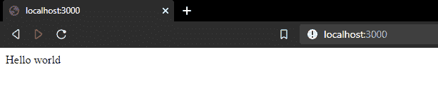

## 步骤 2 -版本控制系统

下一步是选择一个版本控制系统，并将我们的代码放在一个开发平台的存储库中。

最流行的版本控制系统是作为开发平台的 [Git](https://git-scm.com/) 和 [Github](https://github.com/) ，所以这就是我们在这里使用的。

在 GitHub 上，为您的应用程序创建一个新的存储库，如下所示:

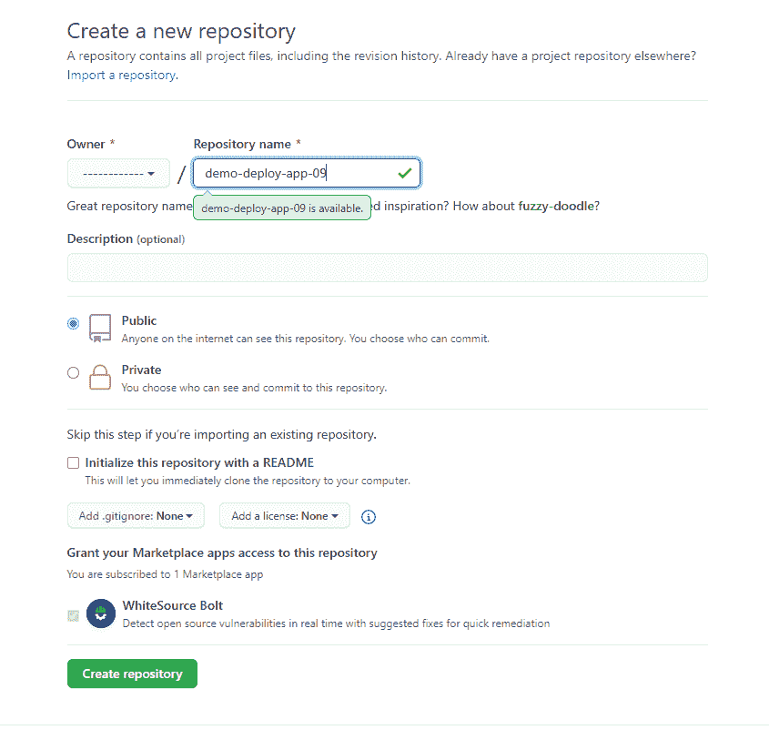

要将您的本地代码上传到存储库中，您需要在单击`Create repository`按钮后运行 Github 上列出的命令:

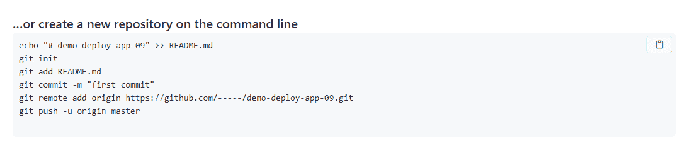

Commands to upload our code to the Github repo

**！**在此之前，我们必须忽略一些文件。我们只想将我们编写的代码上传到存储库中，而不上传依赖项(已安装的模块)。

为此，我们需要创建一个新文件`.gitignore`，并在其中写入我们想要忽略的文件。

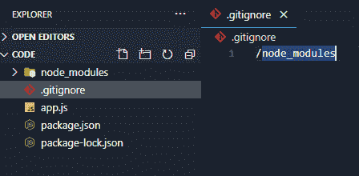

Folder structure and .gitignore file

现在，我们可以编写上图中列出的命令(来自 GitHub 的那个)。

如果您正确运行了命令，那么它将出现在您的存储库页面上。如果你刷新它，你应该看到你的文件，除了你明确忽略的那个，即`node_modules`。

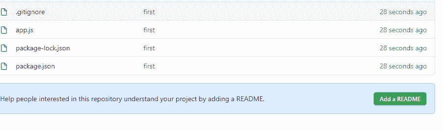

## 步骤 3 -将存储库与 Heroku 链接

在这一步，我们可以将来自 Github 的存储库链接到我们的 Heroku 应用程序。

首先，在 Heroku 上创建一个新的应用程序，并遵循平台上列出的步骤。

创建应用程序后，应该会出现一个类似如下的窗口:

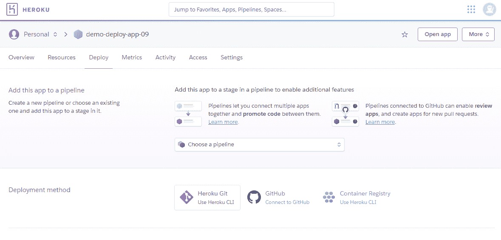

App dashboard

现在，如果你看看顶部的导航，你会看到`Overview`、`Resources`、`Deploy`、`Metrics`等等。确保选择了`Deploy`。然后在第二行，点击 GitHub 图标。

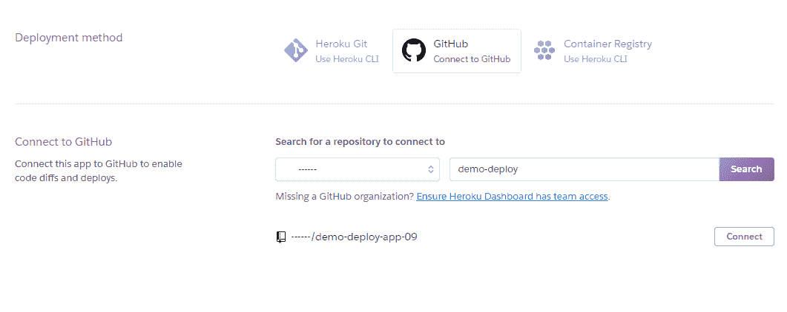

Click connect

搜索所需的应用程序，在我们的例子中是`demo-deploy-app-09`。然后点击`Connect`。

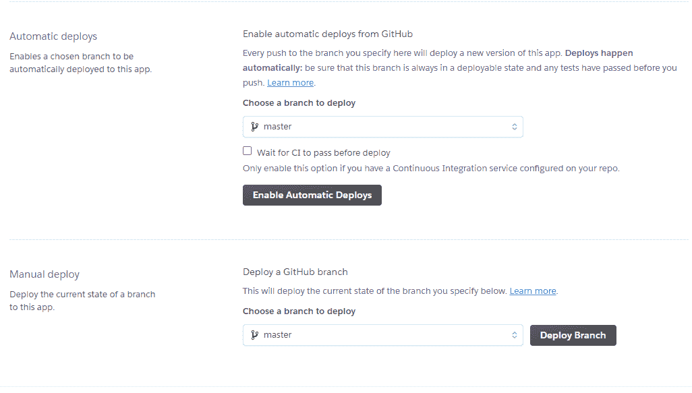

Deploy Branch

应用程序与您的 Heroku 帐户成功连接后，您可以点击`Deploy Branch`来部署您的应用程序。

如果你愿意，你也可以选择选项`Enable Automatic Deploys`,它会在你每次推送代码到你的 Github 库的时候自动从那个库中提取代码。

应用程序部署完成后，您可以点击查看打开您的应用程序。

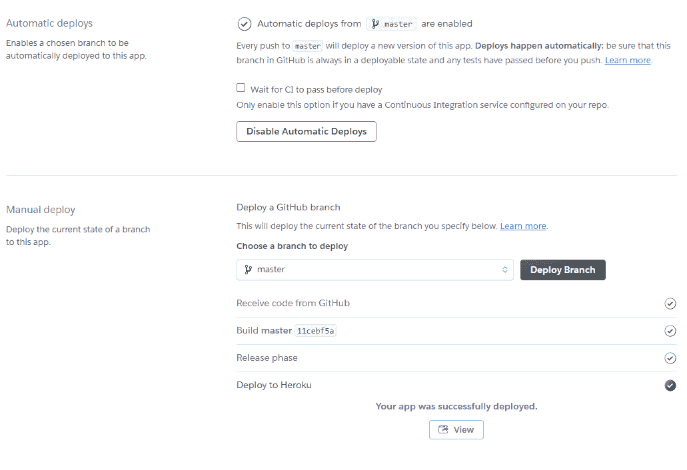

## 步骤 4 -配置 Heroku 以正确运行应用程序

如果您此时打开应用程序，您应该会看到如下内容:

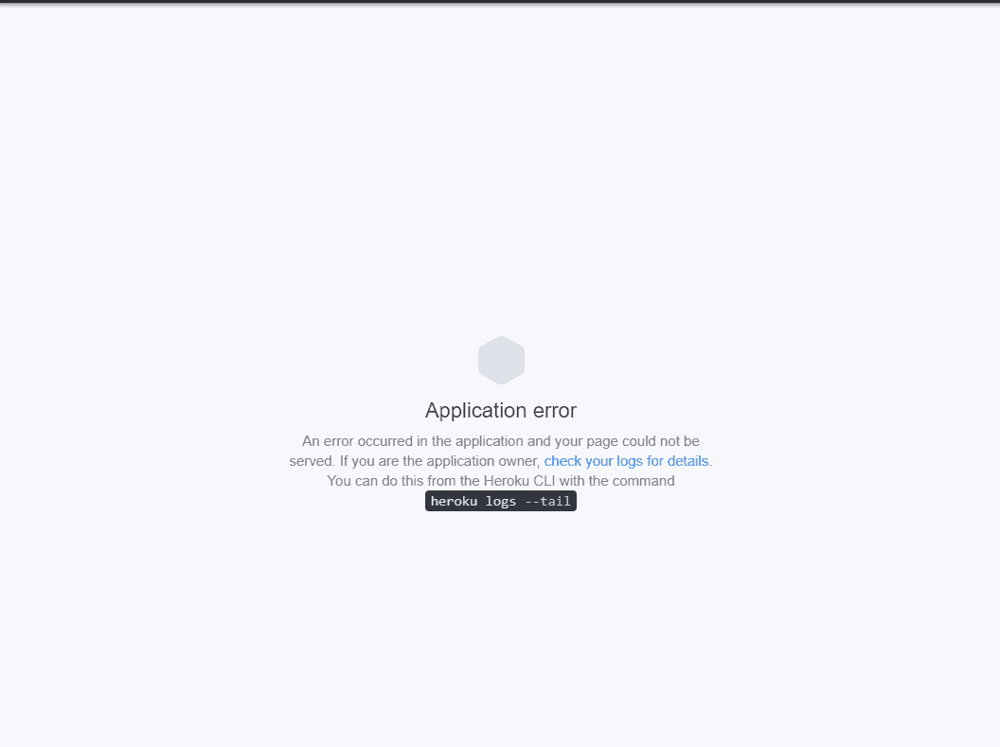

没错，一个错误。那是因为 Heroku 不知道如何启动我们的应用程序。

如果您还记得，我们运行了命令`node app.js`来本地启动应用程序。Heroku 无法知道需要运行什么命令来启动应用程序，这就是它抛出错误的原因。

为了解决这个问题，我们必须创建一个名为`Procfile`的新文件，其内容如下:`web: node ./app.js`。

为了更新我们的应用程序，我们需要做的就是向 GitHub 提交一个新的 commit。如果我们启用了`Automatic Deploys`选项，那么代码将会被自动拉至 Heroku。否则我们需要再次点击`Deploy Branch`。

一旦应用程序被重新构建，我们应该看到它是这样工作的:

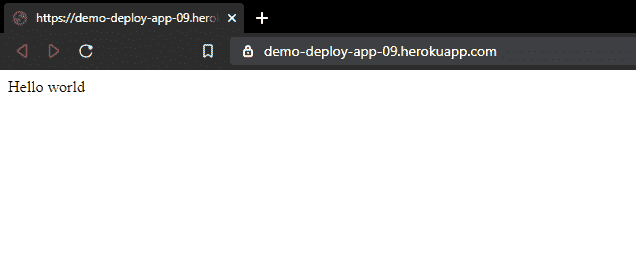

## 步骤 5 -如何添加附加组件

Heroku 提供的一个关键好处是，你可以很容易地将资源以`add-ons`的形式添加到你的项目中。这些外部资源以数据库、日志&监控工具、CI 和 CD 工具或测试工具的形式出现。

现在让我们看看如何向项目中添加新资源。首先，我们将转到参考资料，从那里我们将添加一个新的测试工具。

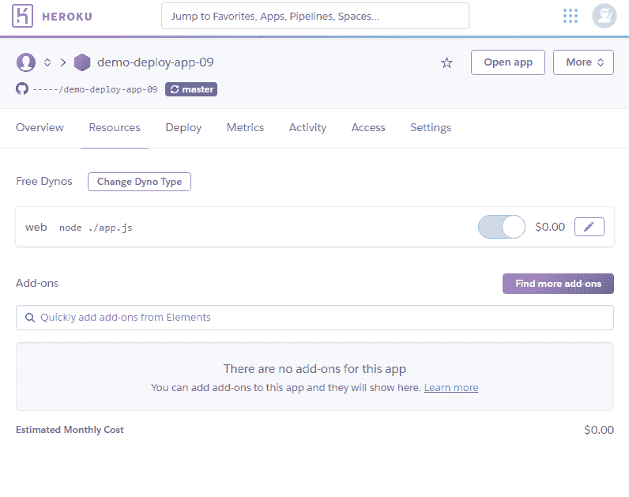

继续点击`Find more add-ons`，然后搜索`Loadmill`。

Loadmill 是一个测试工具，对于回归测试和负载测试来说非常有用。

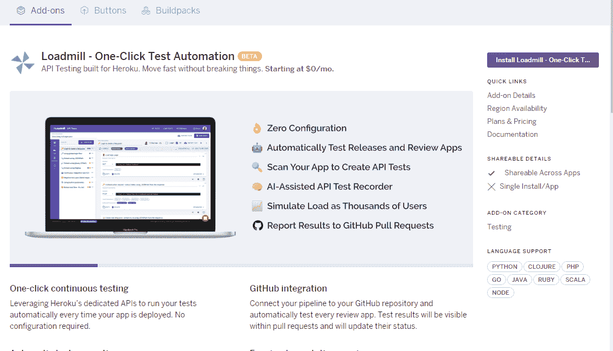

继续点击`Install…`。然后选择您想要链接的应用程序。

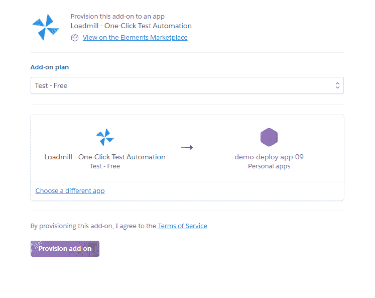

在这一步，Heroku 将自动为您在提供的平台上创建一个新帐户。

在“资源”选项卡上，您可以看到新添加的资源:

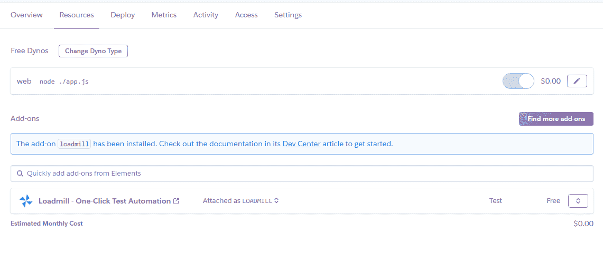

如果您继续操作并访问这个附加组件，您应该会看到它的仪表板上有一个介绍教程和一个为您创建的演示测试。

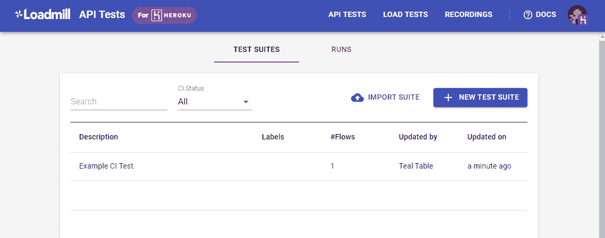

Loadmill dashboard

# 结论

Heroku 允许开发人员在 web 服务器上快速、轻松地部署应用程序。

它还提供了许多插件，您可以将它们集成到您的应用程序中。

PaaS 解决方案将始终允许您比 VPS 解决方案移动得更快，在 VPS 解决方案中，您必须从头开始配置一切。