# 如何将 nRF9160 Feather 连接到自托管的 Mosquitto 实例

> 原文：<https://www.freecodecamp.org/news/how-to-connect-the-nrf9160-feather-to-mosquitto/>

作为一名物联网开发人员，有一件事一直困扰着我，那就是找出传输数据的最佳方式。有许多不同种类的无线电和媒体。除此之外，还需要启动不同的协议。

在撰写本文时，有一个协议在物联网领域占据了至高无上的地位:

MQTT。

与 HTTP 服务器不同，设备可以连接、发布和订阅主题。然后，这些主题被发送到一个代理，并分发到其他订阅的设备。也正好 Nordic 的 nRF9160 上的 MQTT 很受支持。

在本文中，我将向您展示如何将 nRF9160 Feather 连接到自托管的 [Mosquitto](https://github.com/eclipse/mosquitto) 实例。您将学习如何生成您自己的证书，并掌握如何测试您的连接。

准备好玩了吗？我们开始吧。

## 在哪里主持？

如果你想托管 Mosquitto，你需要一台服务器。因为 Mosquitto 是用 C 写的，所以它是轻量级的，几乎可以去任何地方。此外，它 sips 资源，所以你可以安装在一个预算 VPS 没有太多的担心。这就是像 Digital Ocean 或 Vultr 这样的 VPS 提供商的用武之地。

要设置新服务器，以下是一些步骤:

*   登录数字海洋。如果您没有 Digital Ocean，但想要支持，请点击[此处](https://m.do.co/c/9574d3846a29)创建一个帐户。
*   创建新的 Droplet

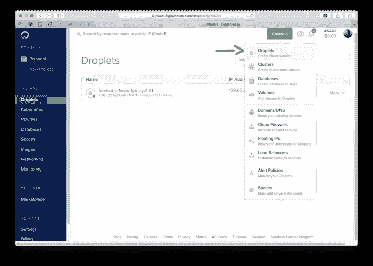

*   选择 UFS 的 FreeBSD 12.1。

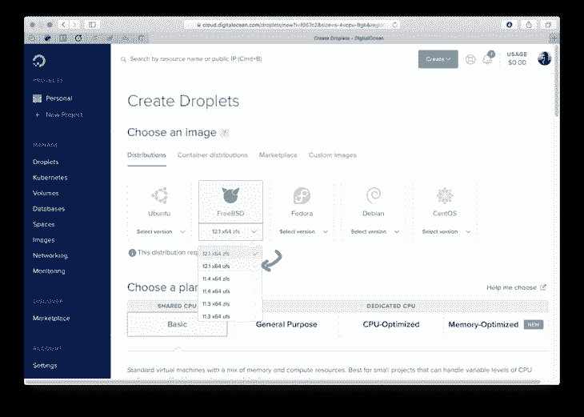

*   选择$5 实例。这通常就足够了。

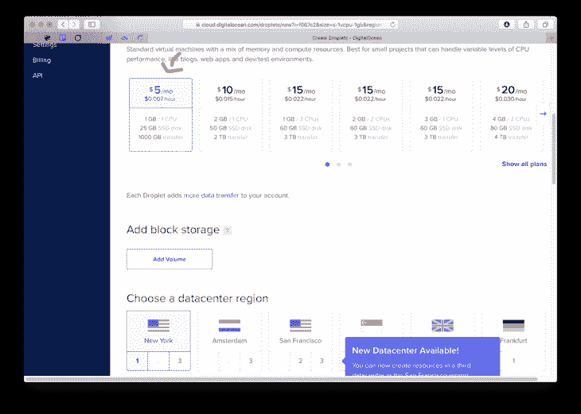

*   请确保导入您的公钥。否则，您将无法立即使用无密码登录。

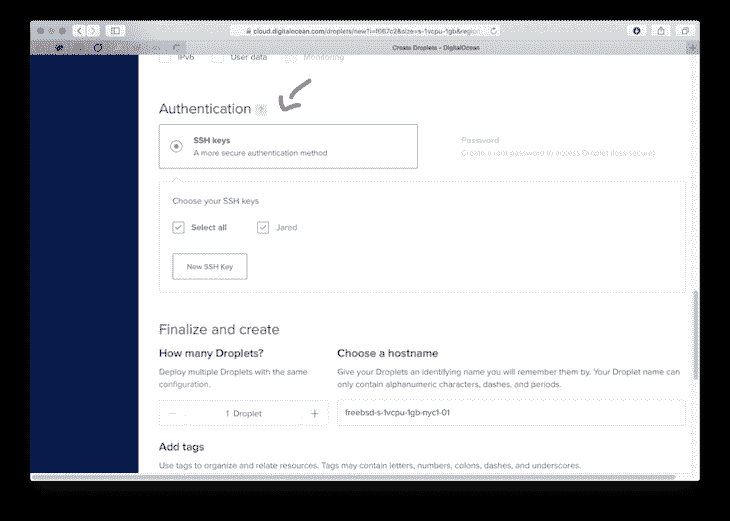

*   点击绿色 ****创建水滴**** 按钮，让我们开始吧。


### 重要的额外步骤

为了让证书与 Mosquitto 一起工作，您必须设置一个域来指向您的 VPS IP 地址。一张 CNAME 或一张唱片就可以了。如果你不确定该怎么做，这里有一个很好的指南。记下你使用了哪个(子)域名。我们一会儿会需要它…

## 安装 Mosquitto

我在 FreeBSD 监狱里用巴士底狱运行我的服务器。在本教程中，我们将跳过监狱部分，专注于让 nRF9160 羽毛工作。

*   您应该使用 FreeBSD 设置一个数字海洋实例(或类似的实例)。如果您还没有这样做，请回过头来看看 ****在哪里托管？**** 节。
*   接下来，在你的 droplet 上安装`mosquitto`，运行`pkg install mosquitto`。如果您运行的不是 FreeBSD，这个命令可能会有所不同。`apt-get install mosquitto`在基于 Debian 的系统上工作。如果您想要最新的存储库，请确保您事先运行了`sudo apt-add-repository ppa:mosquitto-dev/mosquitto-ppa`。FreeBSD 上的完整输出如下所示:

```
$ pkg install mosquitto
The package management tool is not yet installed on your system.
Do you want to fetch and install it now? [y/N]: y
Bootstrapping pkg from pkg+http://pkg.FreeBSD.org/FreeBSD:12:amd64/quarterly, please wait...
Verifying signature with trusted certificate pkg.freebsd.org.2013102301... done
[mosquitto] Installing pkg-1.14.6...
[mosquitto] Extracting pkg-1.14.6: 100%
Updating FreeBSD repository catalogue...
[mosquitto] Fetching meta.conf: 100%    163 B   0.2kB/s    00:01
[mosquitto] Fetching packagesite.txz: 100%    6 MiB   6.6MB/s    00:01
Processing entries: 100%
FreeBSD repository update completed. 31943 packages processed.
All repositories are up to date.
Updating database digests format: 100%
The following 4 package(s) will be affected (of 0 checked):

New packages to be INSTALLED:
        c-ares: 1.16.1
        ca_root_nss: 3.55
        e2fsprogs-libuuid: 1.45.6
        mosquitto: 1.6.7

Number of packages to be installed: 4

The process will require 2 MiB more space.
682 KiB to be downloaded.

Proceed with this action? [y/N]: y
[mosquitto] [1/4] Fetching mosquitto-1.6.7.txz: 100%  226 KiB 231.1kB/s    00:01
[mosquitto] [2/4] Fetching ca_root_nss-3.55.txz: 100%  285 KiB 291.5kB/s    00:01
[mosquitto] [3/4] Fetching e2fsprogs-libuuid-1.45.6.txz: 100%   34 KiB  34.7kB/s    00:01
[mosquitto] [4/4] Fetching c-ares-1.16.1.txz: 100%  138 KiB 140.9kB/s    00:01
Checking integrity... done (0 conflicting)
[mosquitto] [1/4] Installing ca_root_nss-3.55...
[mosquitto] [1/4] Extracting ca_root_nss-3.55: 100%
[mosquitto] [2/4] Installing e2fsprogs-libuuid-1.45.6...
[mosquitto] [2/4] Extracting e2fsprogs-libuuid-1.45.6: 100%
[mosquitto] [3/4] Installing c-ares-1.16.1...
[mosquitto] [3/4] Extracting c-ares-1.16.1: 100%
[mosquitto] [4/4] Installing mosquitto-1.6.7...
===> Creating users
Using existing user 'nobody'.
[mosquitto] [4/4] Extracting mosquitto-1.6.7: 100%
=====
Message from ca_root_nss-3.55:

--
FreeBSD does not, and can not warrant that the certification authorities
whose certificates are included in this package have in any way been
audited for trustworthiness or RFC 3647 compliance.

Assessment and verification of trust is the complete responsibility of the
system administrator.

This package installs symlinks to support root certificates discovery by
default for software that uses OpenSSL.

This enables SSL Certificate Verification by client software without manual
intervention.

If you prefer to do this manually, replace the following symlinks with
either an empty file or your site-local certificate bundle.

  * /etc/ssl/cert.pem
  * /usr/local/etc/ssl/cert.pem
  * /usr/local/openssl/cert.pem
=====
Message from mosquitto-1.6.7:

--
The mosquitto MQTT Python driver is now provided by net/py-paho-mqtt 
```

所有已安装的软件包配置都位于`/usr/local/etc/mosquitto/`。我们需要编辑该文件夹中的`mosquitto.conf`来使用证书。它看起来是这样的:

```
# Daemon configuration
pid_file /var/run/mosquitto.pid
user nobody

# Port to use for the default listener.
port 8885

# At least one of cafile or capath must be defined.
cafile /root/pki/ca.crt

# Path to the PEM encoded server certificate.
certfile /root/pki/issued/mosquitto.crt

# Path to the PEM encoded keyfile.
keyfile /root/pki/private/mosquitto.key

# Path to CRL file
#crlfile /root/pki/crl.pem

# Each client has their own cert
require_certificate true
use_identity_as_username true

# listener port-number [ip address/host name]
listener 1883
protocol mqtt

# listener port-number [ip address/host name]
# listener 8080
# protocol websockets

# =================================================================
# Logging
# =================================================================
log_dest syslog

# Types of messages to log.
log_type all
#log_type warning
# websockets_log_level 127

# -----------------------------------------------------------------
# Default authentication and topic access control
# -----------------------------------------------------------------
# password_file /usr/local/etc/mosquitto/pwfile 
```

在启动服务器之前，我们需要提供一些 RSA 证书。我们将在下一步讨论这个问题。

## 供应证书

您可以使用 ****easy-rsa**** 来生成 CA 服务器和客户端证书。(这些说明来自[本指南](https://github.com/OpenVPN/easy-rsa/blob/master/README.quickstart.md)。)对于生产，您应该在离线机器上生成您的密钥和证书。这样，如果您的服务器成为目标，您的私钥是安全的。

首先，安装`easy-rsa`:

```
$ pkg install easy-rsa
Updating FreeBSD repository catalogue...
FreeBSD repository is up to date.
All repositories are up to date.
The following 1 package(s) will be affected (of 0 checked):

New packages to be INSTALLED:
        easy-rsa: 3.0.7

Number of packages to be installed: 1

44 KiB to be downloaded.

Proceed with this action? [y/N]: y
[mosquitto] [1/1] Fetching easy-rsa-3.0.7.txz: 100%   44 KiB  44.8kB/s    00:01
Checking integrity... done (0 conflicting)
[mosquitto] [1/1] Installing easy-rsa-3.0.7...
[mosquitto] [1/1] Extracting easy-rsa-3.0.7: 100% 
```

然后，让我们开始证书创建过程:

```
$ easyrsa init-pki

Note: using Easy-RSA configuration from: /usr/local/share/easy-rsa/vars

init-pki complete; you may now create a CA or requests.
Your newly created PKI dir is: /root/pki
$
$ easyrsa build-ca

Note: using Easy-RSA configuration from: /usr/local/share/easy-rsa/vars
Using SSL: openssl OpenSSL 1.1.1d-freebsd  10 Sep 2019

Enter New CA Key Passphrase:
Re-Enter New CA Key Passphrase:
Generating RSA private key, 2048 bit long modulus (2 primes)
......................+++++
..................................................................................+++++
e is 65537 (0x010001)
You are about to be asked to enter information that will be incorporated
into your certificate request.
What you are about to enter is what is called a Distinguished Name or a DN.
There are quite a few fields but you can leave some blank
For some fields there will be a default value,
If you enter '.', the field will be left blank.
-----
Common Name (eg: your user, host, or server name) [Easy-RSA CA]:testserver.jaredwolff.com

CA creation complete and you may now import and sign cert requests.
Your new CA certificate file for publishing is at:
/root/pki/ca.crt 
```

****注意:**** 在`build-ca`步骤会提示您输入密码。请确保您将此密码放在手边。

然后，要生成服务器证书，请使用:

```
$ easyrsa gen-req mosquitto nopass

Note: using Easy-RSA configuration from: /usr/local/share/easy-rsa/vars
Using SSL: openssl OpenSSL 1.1.1d-freebsd  10 Sep 2019
Generating a RSA private key
...............+++++
........................................+++++
writing new private key to '/root/pki/easy-rsa-82720.X2NVQ0/tmp.akOxhO'
-----
You are about to be asked to enter information that will be incorporated
into your certificate request.
What you are about to enter is what is called a Distinguished Name or a DN.
There are quite a few fields but you can leave some blank
For some fields there will be a default value,
If you enter '.', the field will be left blank.
-----
Common Name (eg: your user, host, or server name) [mosquitto]:testserver.jaredwolff.com

Keypair and certificate request completed. Your files are:
req: /root/pki/reqs/mosquitto.req
key: /root/pki/private/mosquitto.key
$
$ easyrsa sign-req server mosquitto

Note: using Easy-RSA configuration from: /usr/local/share/easy-rsa/vars
Using SSL: openssl OpenSSL 1.1.1d-freebsd  10 Sep 2019

You are about to sign the following certificate.
Please check over the details shown below for accuracy. Note that this request
has not been cryptographically verified. Please be sure it came from a trusted
source or that you have verified the request checksum with the sender.

Request subject, to be signed as a server certificate for 825 days:

subject=
    commonName                = testserver.jaredwolff.com

Type the word 'yes' to continue, or any other input to abort.
  Confirm request details: yes
Using configuration from /root/pki/easy-rsa-82744.hyuGzt/tmp.lZHLEH
Enter pass phrase for /root/pki/private/ca.key:
Check that the request matches the signature
Signature ok
The Subject's Distinguished Name is as follows
commonName            :ASN.1 12:'testserver.jaredwolff.com'
Certificate is to be certified until Nov  3 01:12:53 2022 GMT (825 days)

Write out database with 1 new entries
Data Base Updated

Certificate created at: /root/pki/issued/mosquitto.crt 
```

在上述步骤中，系统会提示您输入通用名称(即您的服务器名称)和 CA cert 密码。 ****重要的****:****常用名**** 需要和你的服务器的域名匹配！(记得吗，我们之前写下来了？)

要生成 nRF9160 证书，请使用:

```
$ easyrsa gen-req nrf9160 nopass batch
$ easyrsa sign-req client nrf9160 batch 
```

遵循与前面相同的步骤。唯一的区别是，我们生成的是一个 ****客户端**** 证书，而不是一个 ****服务器**** 证书。

一旦完成，我们需要一些文件。以下是完整列表:

****为您的 Mosquitto 服务器****

*   `/root/pki/ca.crt`
*   `/root/pki/private/mosquitto.key`
*   `/root/pki/issued/mosquitto.crt`

****为您的 nRF9160 羽毛****

*   `/root/pki/ca.crt`
*   `/root/pki/private/nrf9160.key`
*   `/root/pki/issued/nrf9160.crt`

如果您正在使用上面的配置，它已经指向您的服务器证书。我们现在要做的就是开始！

```
$ service mosquitto start
Cannot 'start' mosquitto. Set mosquitto_enable to YES in /etc/rc.conf or use 'onestart' instead of 'start'. 
```

如果出现关于`mosquitto_enable`的错误，只需运行:

```
$ sysrc mosquitto_enable=YES
$ service mosquitto start
Starting mosquitto. 
```

这使得`mosquitto`能够在系统启动时启动。

现在，使用`ps aux`检查`mosquitto`是否正在运行:

```
 $ ps aux
USER     PID %CPU %MEM   VSZ  RSS TT  STAT STARTED    TIME COMMAND
root   82401  0.0  0.2 11472 2424  -  SsJ  01:02   0:00.00 /usr/sbin/syslogd -ss
root   82457  0.0  0.2 11408 2284  -  IsJ  01:02   0:00.00 /usr/sbin/cron -J 60 -s
nobody 82900  0.0  0.6 16352 6212  -  SsJ  01:17   0:00.02 /usr/local/sbin/mosquitto -c /usr/local/etc/mosquitto/mosquitto.conf -d
root   82488  0.0  0.3 12096 2848  0  IJ   01:02   0:00.01 login [pam] (login)
root   82489  0.0  0.3 13092 3504  0  SJ   01:02   0:00.03 -csh (csh)
root   82902  0.0  0.3 11704 2540  0  R+J  01:17   0:00.00 ps aux 
```

现在我们已经有了一个加载并运行的服务器，让我们让固件开始工作。

## 固件位

在 nRF9160 Feather 上处理证书分为两步。第一步是使用`at_client`固件加载证书。第二个是加载添加了 TLS 支持的`mqtt_simple`库。让我们先解决证书问题。

### 首先编程`at_client`

将目录更改为`ncs/nrf/samples/nrf9160/at_client/`并开始新的构建:

```
$ west build -b circuitdojo_feather_nrf9160ns -p 
```

然后闪存到您的主板，使用:

```
$ west flash --erase
$ nrfjprog -r 
```

下一步我们需要这个样本放在你的板上。

### 将证书添加到设备

要安装我们的新证书，我们需要安装 nRF Connect Desktop。你可以到这里下载。

您还需要一个定制版本的 ****LTE 链路监控器。**T3 你可以在 docs.jaredwolff.com[上得到修改版。](http://localhost:3000/files/pc-nrfconnect-linkmonitor-1.1.1.tgz)**

首先，安装 nRF Connect 桌面 app。然后，复制 LTE 链路监控器。tgz 文件到`%USERPROFILE%\.nrfconnect-apps\local`(在 Windows 上)或`$HOME/.nrfconnect-apps/local`(在 Linux/macOS 上)。下面是它在 Windows 上的位置示例:

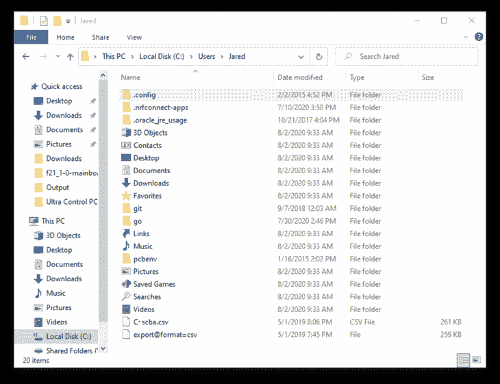

关闭并重新打开 nRF Connect Desktop(如果它已打开)。

然后，点击 1.1.1 版 LTE 链路监控旁边的 **打开** 。它下面还会写有 ****本地**** 。

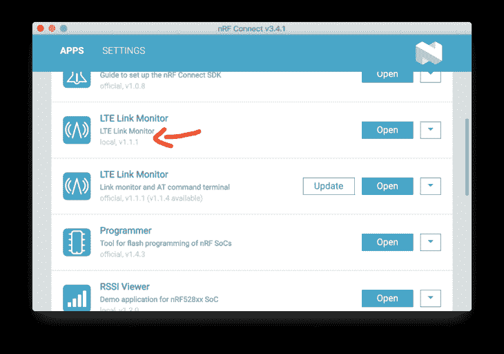

接下来，让我们发射吧！

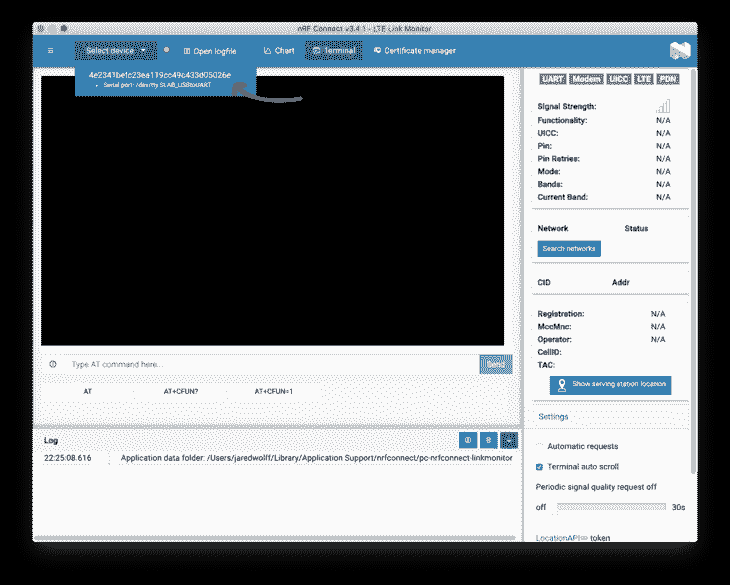

一旦你打开了端口，点击重置按钮。确保您关闭了 ****自动请求。****

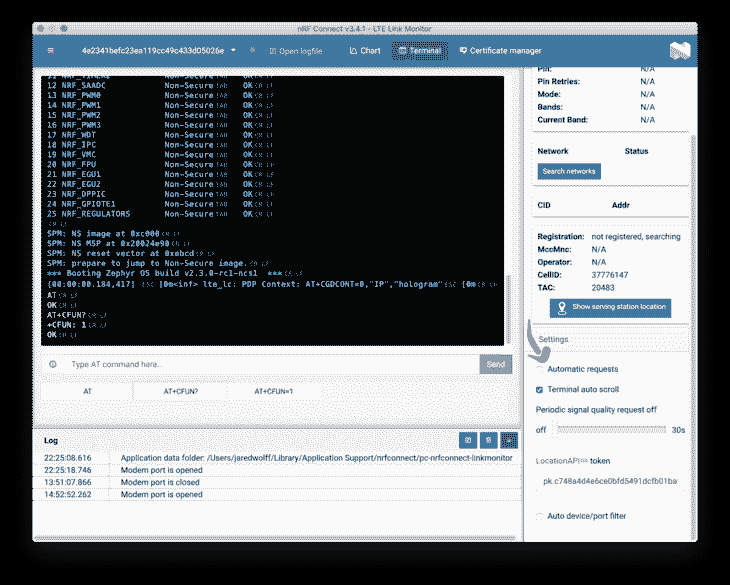

然后在命令框中发送 ****AT+CFUN=4**** 。这将关闭您的调制解调器，以便它可以上传证书。可以在+CFUN 运行 ****？**** 确认您的调制解调器处于该模式。


打开证书管理器。

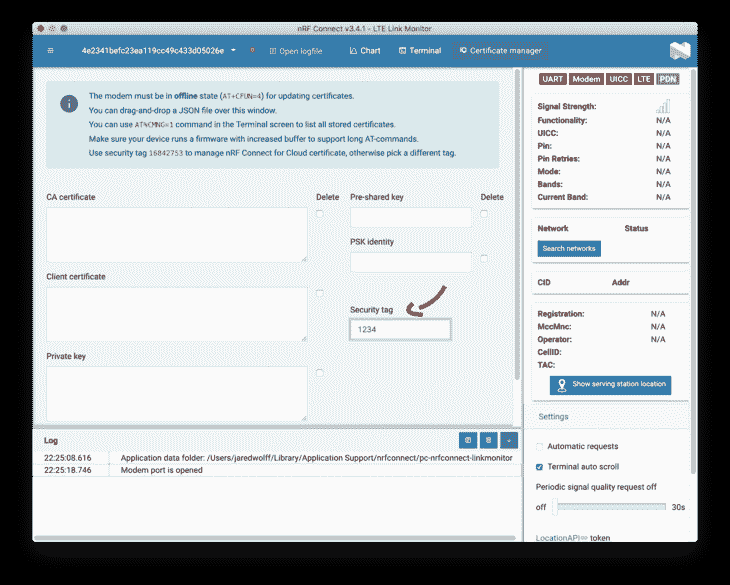

确保设置了安全标签。在这种情况下，我使用的是 1234。这是一个重要的标识符，您稍后会用到它。你想怎么做都行，但我会避免使用 16842753。这是 NRF 云的默认标签。你不会想炸掉你的 nRF 云证书的！

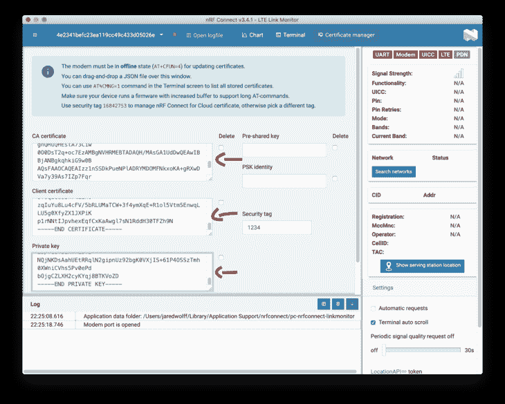

将您的`ca.crt`、`nrf9160.crt`和`nrf9160.key`的内容复制并粘贴到方框中(按此顺序)。在 Unix/Linux 上使用`cat`可以很容易地获得证书:

```
$ cat cat.crt
-----BEGIN CERTIFICATE-----
MIIDdTCCAl2gAwIBAgIUDLkBxLLQO9wosNDtA7E9qvqHOxMwDQYJKoZIhvcNAQEL
BQAwJDEiMCAGA1UEAwwZdGVzdHNlcnZlci5qYXJlZHdvbGZmLmNvbTAeFw0yMDA3
MzEwMTExNDJaFw0zMDA3MjkwMTExNDJaMCQxIjAgBgNVBAMMGXRlc3RzZXJ2ZXIu
amFyZWR3b2xmZi5jb20wggEiMA0GCSqGSIb3DQEBAQUAA4IBDwAwggEKAoIBAQC3
de1v8k+FXzY/Im7Z2YKS7wwbBRft5CUxqP1sdYJgMvheS9LhFufk81URZ0lHD9pK
aNPxU1UEmnLvVDTGLJ+YAmMH08xn17FS1R1UVPYzi2ouwqRM2pR9EStsSlP9Zj44
1MsdizABnnlkZndUVLL/gjc4cNsNncMLBSEbsz6b5WzhtAGg3rOpdAxSSblZVSFw
bquCgg5hb2NUzy+JxGtUIsE5d6CxTDdSs4Z3FK/RRYjmCG6qsaya4N5W35yf8h5O
StfKRecl3kq2kCnWa6P+lErG4wuxIBtMkgz2zV+zd1tz4aHXxSdoZTqLz7dTVbFA
zEVnKD+ZReBG+4fwUL6rAgMBAAGjgZ4wgZswHQYDVR0OBBYEFIvdGnjrxRPzvXQi
7XJ70LzpZSOjMF8GA1UdIwRYMFaAFIvdGnjrxRPzvXQi7XJ70LzpZSOjoSikJjAk
MSIwIAYDVQQDDBl0ZXN0c2VydmVyLmphcmVkd29sZmYuY29tghQMuQHEstA73Ciw
0O0DsT2q+oc7EzAMBgNVHRMEBTADAQH/MAsGA1UdDwQEAwIBBjANBgkqhkiG9w0B
AQsFAAOCAQEAIzz1nSSDkPueNPlADRYMDOMFNkxoKA+gRXwDVa7y39As7IZp7Fqr
KAH79U1XtGyDlt6FPKTvDJ7jtd4y8auIGVQO7z3AG9pVU1imIWZHoIqgBUCEhsjp
uMxD23kRCX5kd9dsmF9WOGGxb4kkMv83Rh2rCONQmvnozuI3fJv2ZFX/ORoADGLP
OPSJPl11x+2rxPxiLi+T8RyzDh3DwqnPVsSnbRWV7hosaN0ip/cbnSTaIul9mbCY
ID6qm9leqlY/gha9aZfg+tv1Lm6PT6o8Pzek2VeDoIS5YERBMOwV84hQrZjV3vIE
jT6y663HGsl7KvqVaWdV3fM6Cr7f0QdR5A==
-----END CERTIFICATE----- 
```

你需要从`-----BEGIN CERTIFICATE-----`到`-----END CERTIFICATE-----`的所有东西

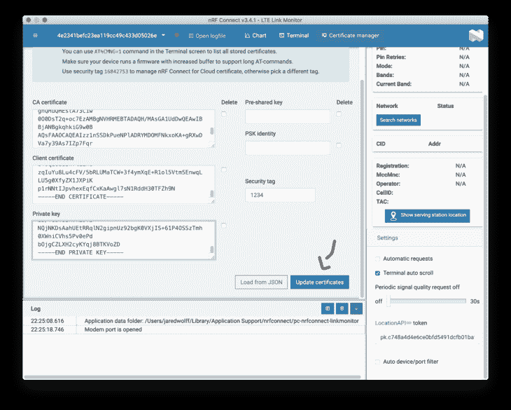

查看 ****日志**** 区域了解更多详情。如果一切顺利，应该说你的证书更新了。

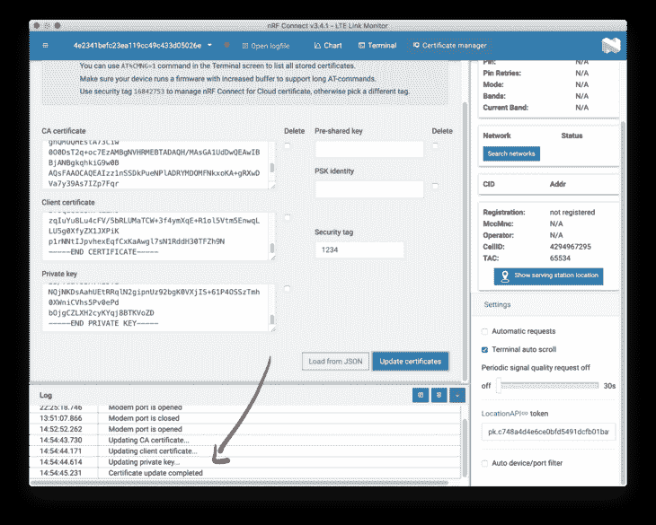

### 使用 mqtt_simple 示例

我们将使用 nRF Connect SDK 存储库中的`mqtt_simple`示例。完整路径为:`ncs/nrf/samples/nrf9160/mqtt_simple`。我们需要做一些编辑来增加完全的 TLS 兼容性。所有的文件都在`mqtt_simple`目录下。

首先，我们必须更新`proj.conf`文件。查看突出显示的差异:

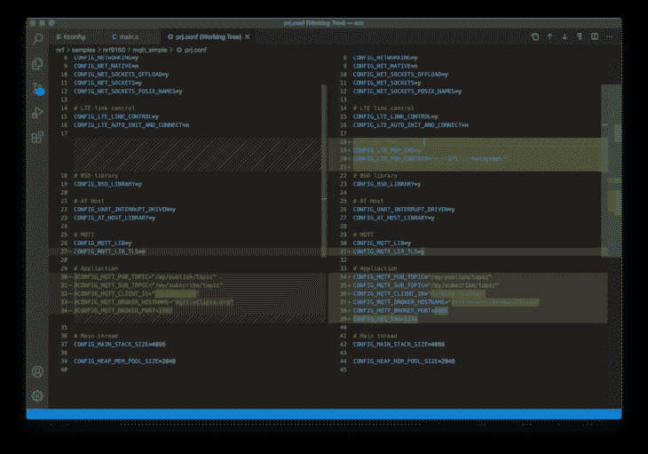

如果您使用的是全息 SIM 卡(nRF9160 Feather 附带)，则`# Set the PDP Context`部分尤为重要。如果您使用的 SIM 卡不需要它，则不需要此部分。

采用您的`CONFIG_MQTT_BROKER_HOSTNAME`作为您的主机名(在本指南开头配置)。

您还必须在`KConfig`中添加这些行:

```
config SEC_TAG
	int "Security tag to use for the connection"
	default 1234

config PEER_VERIFY
	int "Peer verify parameter for mqtt_client"
	default 1
	help
			Set to 0 for VERIFY_NONE, 1 for VERIFY_OPTIONAL, and 2 for VERIFY_REQUIRED. 
```

最后，在 main 中将这个块添加到文件的顶部:

```
#if defined(CONFIG_MQTT_LIB_TLS)
static sec_tag_t sec_tag_list[] = { CONFIG_SEC_TAG };
#endif /* defined(CONFIG_MQTT_LIB_TLS) */ 
```

然后将该块添加到`#if defined(CONFIG_MQTT_LIB_TLS)`下的`client_init`

```
 struct mqtt_sec_config *tls_config = &client->transport.tls.config;

	client->transport.type = MQTT_TRANSPORT_SECURE;

	tls_config->peer_verify = CONFIG_PEER_VERIFY;
	tls_config->cipher_count = 0;
	tls_config->cipher_list = NULL;
	tls_config->sec_tag_count = ARRAY_SIZE(sec_tag_list);
	tls_config->sec_tag_list = sec_tag_list;
	tls_config->hostname = CONFIG_MQTT_BROKER_HOSTNAME; 
```

更改应该如下所示:

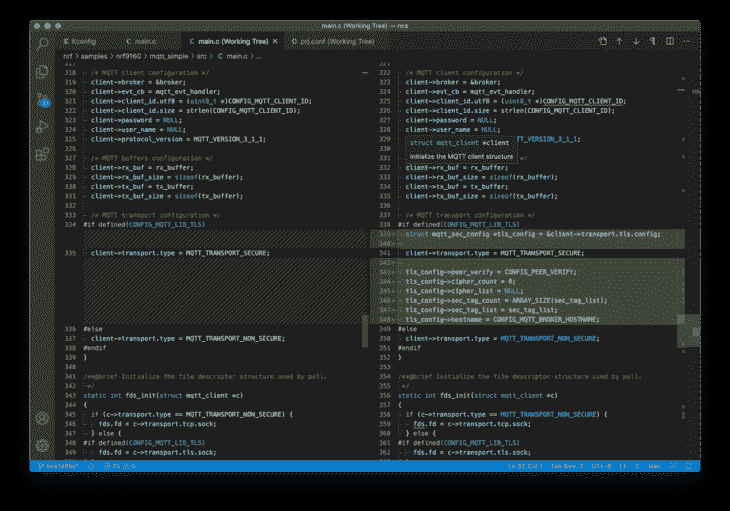

然后构建:

```
$ west build -b circuitdojo_feather_nrf9160ns -p 
```

最后，使用`west flash`进行刷新:

```
$ west flash --erase
$ nrfjprog -r 
```

打开您的串行终端，并仔细检查您的 nRF9160 羽毛连接。您也可以使用 LTE Link Monitor 查看您的进度(如下例所示)。

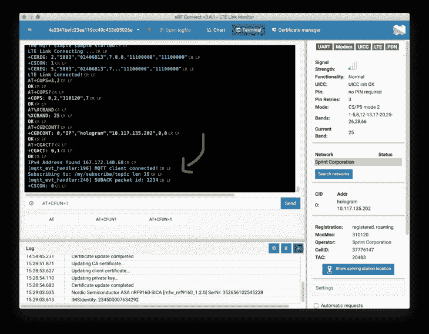

上面的许多信息来自于 [Nordic](https://devzone.nordicsemi.com/nordic/cellular-iot-guides/b/software-and-protocols/posts/enabling-and-testing-tls-in-mqtt_5f00_simple) 关于这个主题的帖子。

## 发送消息

我们快到了！您已经使用自己生成的证书将 nRF9160 Feather 配置为连接到 Mosquitto。最后一部分是连接另一个设备，以查看 nRF9160 Feather 是否回复消息。

为此，我创建了一套新的证书。我称它们为`test`。

```
$ easyrsa gen-req test nopass batch
$ easyrsa sign-req client test batch 
```

我用 CyberDuck(一个很棒的小型可视化 SFTP 客户端)把它们复制到我的桌面上:

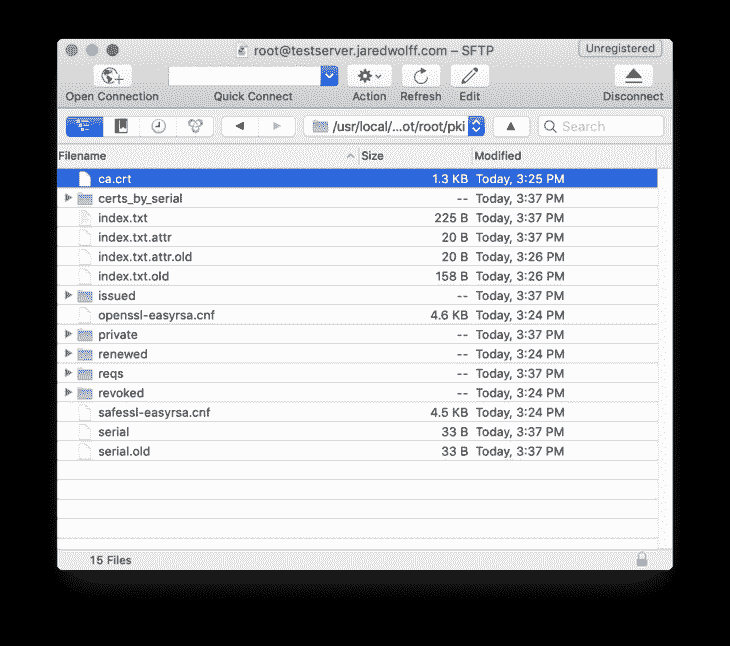

如果你对你的命令行文件传输能力有信心，你也可以使用类似`scp`的东西。然后，打开终端并运行:

```
mosquitto_sub --cafile ca.crt --cert test.crt --key test.key -q 1 -d -h testserver.jaredwolff.com -p 8885 -t "/my/publish/topic" &
mosquitto_pub --cafile ca.crt --cert test.crt --key test.key -q 1 -d -h testserver.jaredwolff.com -p 8885 -t "/my/subscribe/topic" -m "hello there" 
```

您应该会看到如下输出:

```
$ mosquitto_sub --cafile ca.crt --cert test.crt --key test.key -q 1 -d -h testserver.jaredwolff.com -p 8885 -t "/my/publish/topic" &
$ mosquitto_pub --cafile ca.crt --cert test.crt --key test.key -q 1 -d -h testserver.jaredwolff.com -p 8885 -t "/my/subscribe/topic" -m "hello there"
Client mosq-CczskQKzMKdtTo4O4s sending CONNECT
Client mosq-CczskQKzMKdtTo4O4s received CONNACK (0)
Client mosq-CczskQKzMKdtTo4O4s sending PUBLISH (d0, q1, r0, m1, '/my/subscribe/topic', ... (11 bytes))
Client mosq-CczskQKzMKdtTo4O4s received PUBACK (Mid: 1, RC:0)
Client mosq-CczskQKzMKdtTo4O4s sending DISCONNECT
MacBook-Pro:Downloads jaredwolff$ Client mosq-qK8tMlJk0Qri4Z7jUo sending PINGREQ
Client mosq-qK8tMlJk0Qri4Z7jUo received PINGRESP
MacBook-Pro:Downloads jaredwolff$ Client mosq-qK8tMlJk0Qri4Z7jUo received PUBLISH (d0, q0, r0, m0, '/my/publish/topic', ... (11 bytes))
hello there 
```

Booyah！你有一个活跃的工作连接到你自己的服务器。

## 结论

我们已经坚持到最后了！至此，您应该已经运行了一个 Mosquitto 服务器并连接了一个 nRF9160。现在，您可以使用新学到的技能将更多设备添加到您的部署中。

如果你还没有机会玩 nRF9160，你应该看看 nRF9160 羽毛。它拥有北欧半导体的 nRF9160 LTE-M，NB IoT + GPS 组合，加上灵活的电源，外部闪光灯，低功耗关机。

哦，我说过它是 100%开源的吗？通过查看 [GroupGets 和 Hackster Launch 上的活动了解更多信息。](https://www.jaredwolff.com/store/nrf91-feather/)？

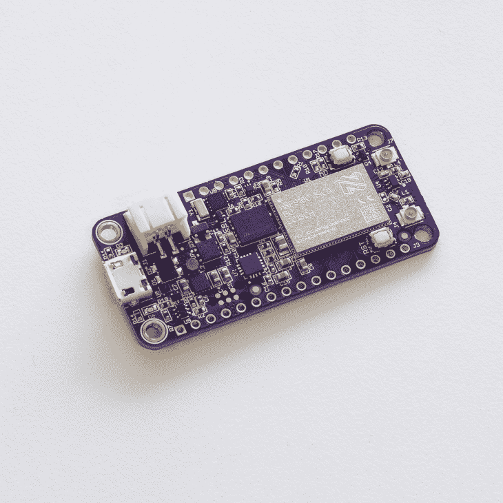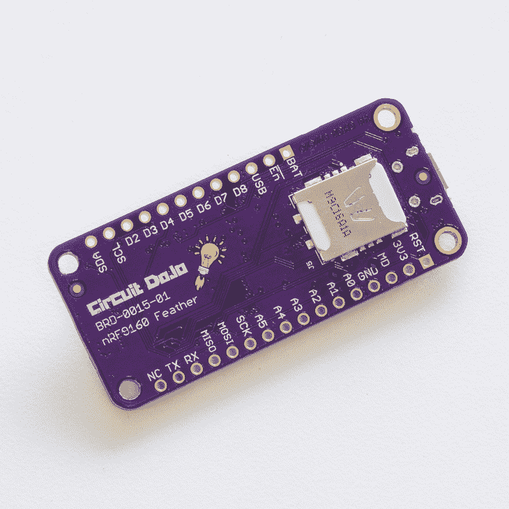

照片归功于[组的牛人](https://www.groupgets.com/)！

你可以在[jaredwolff.com](https://www.jaredwolff.com/how-to-connect-nrf9160-feather-to-mosquitto/)阅读这篇文章和许多其他好东西。