# 如何开发一个端到端的机器学习项目，并用 Flask 部署到 Heroku

> 原文：<https://www.freecodecamp.org/news/end-to-end-machine-learning-project-turorial/>

关于数据科学，我总是会被问到一个问题:

**掌握数据科学最好的方法是什么？什么能让我被录用？**

我的答案保持不变:除了从事[有投资价值的项目](https://towardsdatascience.com/how-to-build-an-effective-data-science-portfolio-56d19b885aa8?source=---------5------------------)之外，别无选择。

即使[通过了 TensorFlow 开发者证书](https://medium.com/@harshit_tyagi/google-certified-tensorflow-developer-learning-plan-tips-faqs-my-journey-9f88016048e3?source=---------7------------------)考试，我还是要说，你只能通过展示你的研究、编程技能、数学背景等等的项目来证明你的能力。

在我的帖子[如何建立有效的数据科学投资组合](https://towardsdatascience.com/how-to-build-an-effective-data-science-portfolio-56d19b885aa8?source=---------5------------------)中，我分享了许多项目想法和其他技巧，以准备一个令人敬畏的投资组合。这篇文章致力于其中的一个想法:构建一个端到端的数据科学/ML 项目。

# 议程

本教程旨在引导您完成一个端到端的机器学习项目的所有主要步骤。对于这个项目，我选择了一个监督学习回归问题。

以下是涵盖的主要主题:

*   ****先决条件和资源****
*   ****数据收集和问题陈述****
*   ****探索性数据分析与熊猫和 NumPy****
*   ****数据准备使用 Sklearn****
*   ****选择并训练几个机器学习模型****
*   ****使用 Sklearn**** 进行交叉验证和超参数调整
*   ****通过 Flask App**** 将最终训练好的模型部署到 Heroku 上

让我们开始构建…

# **先决条件和资源**

要浏览这个项目和教程，您应该熟悉机器学习算法、Python 环境设置和常见的 ML 术语。这里有一些资源可供您参考:

*   阅读这本 100 页的 ML 书的前 2-3 章:[http://themlbook.com/wiki/doku.php](http://themlbook.com/wiki/doku.php)
*   [几乎每个机器学习项目的任务列表](https://towardsdatascience.com/task-cheatsheet-for-almost-every-machine-learning-project-d0946861c6d0?source=---------2------------------) —在进行这个(或任何其他)ML 项目时，请一直参考这个列表。
*   您需要一个 [Python 环境来设置](https://towardsdatascience.com/ideal-python-environment-setup-for-data-science-cdb03a447de8?source=---------18------------------)——一个专用于这个项目的虚拟环境。
*   你应该熟悉 [Jupyter 笔记本](https://towardsdatascience.com/the-complete-guide-to-jupyter-notebooks-for-data-science-8ff3591f69a4?source=---------16------------------)。

就是这样，所以请确保您已经理解了这些概念和工具，并准备好开始！

# **数据收集和问题陈述**

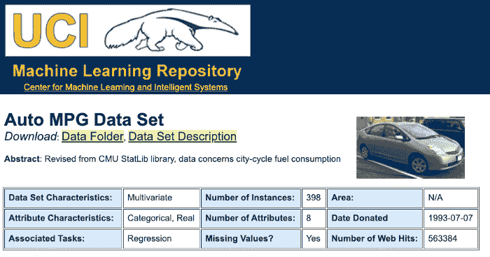

第一步是拿到数据。但是如果你能接触到数据(就像大多数基于产品的公司一样)，那么第一步就是定义你想要解决的问题。我们还没有数据，所以我们打算先收集数据。

我们使用来自 [UCI 机器学习库](http://archive.ics.uci.edu/ml/datasets/Auto+MPG)的自动 MPG 数据集。以下是数据集的链接:

*   [http://archive.ics.uci.edu/ml/datasets/Auto+MPG](http://archive.ics.uci.edu/ml/datasets/Auto+MPG)

> **该数据涉及以英里/加仑为单位的城市循环油耗，根据 3 个多值离散属性和 5 个连续属性进行预测。**

下载完数据后，将其移动到项目目录中，激活 virtualenv，并启动 Jupyter 本地服务器。

您也可以使用`wget`将数据从笔记本下载到您的项目中:

```
!wget "http://archive.ics.uci.edu/ml/machine-learning-databases/auto-mpg/auto-mpg.data" 
```


下一步是将这个`.data`文件加载到 pandas 数据报中。为此，确保您已经安装了 pandas 和其他通用用例库。像这样导入所有通用用例库:

```
import numpy as np
import pandas as pd
import matplotlib.pyplot as plt
import seaborn as sns 
```

然后使用`read_csv()`方法读取文件并将其加载到数据帧中:

```
# defining the column names
cols = ['MPG','Cylinders','Displacement','Horsepower','Weight',
                'Acceleration', 'Model Year', 'Origin']
# reading the .data file using pandas
df = pd.read_csv('./auto-mpg.data', names=cols, na_values = "?",
                comment = '\t',
                sep= " ",
                skipinitialspace=True)
#making a copy of the dataframe
data = df.copy() 
```

接下来，查看数据框架的几行，并阅读网站上对每个属性的描述。这有助于您定义问题陈述。

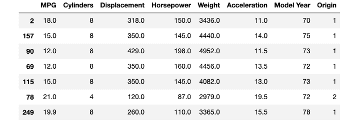

****问题陈述—**** 该数据包含 MPG(英里每加仑)变量，它是连续的数据，告诉我们一辆汽车在 70 年代和 80 年代的燃油消耗效率。

> ***我们的目标是预测一辆车的 MPG 值** e， **假设****我们有那辆车的其他属性。***

# **熊猫和 NumPy 的探索性数据分析**

对于这个相当简单的数据集，探索分为一系列步骤:

### 检查列的数据类型

```
##checking the data info
data.info() 
```

### 检查空值。

```
##checking for all the null values
data.isnull().sum() 
```

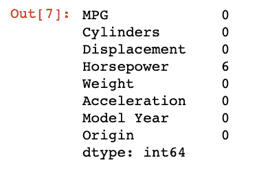

马力列有 6 个缺失值。我们还得再研究一下这个专栏。

### 检查马力栏中的异常值

```
##summary statistics of quantitative variables
data.describe()

##looking at horsepower box plot
sns.boxplot(x=data['Horsepower']) 
```

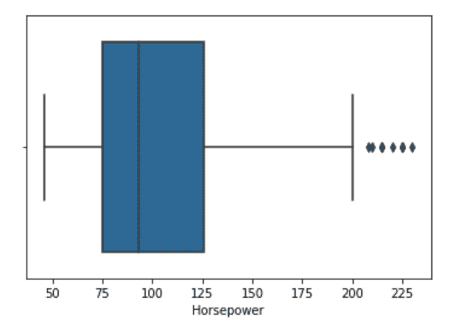

由于有一些异常值，我们可以使用 pandas `median()`方法使用列的中位数来估算缺失值。

```
##imputing the values with median
median = data['Horsepower'].median()
data['Horsepower'] = data['Horsepower'].fillna(median)
data.info() 
```

### 在分类列中查找类别分布

```
##category distribution

data["Cylinders"].value_counts() / len(data)
data['Origin'].value_counts() 
```

这两个分类列是 Cylinders 和 Origin，它们只有几类值。查看这些类别中值的分布将告诉我们数据是如何分布的:

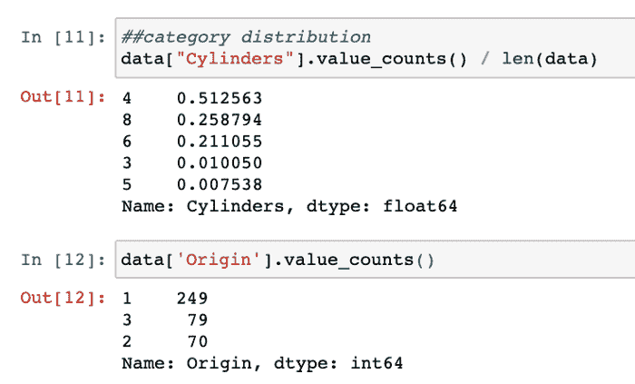

### 相关图

```
##pairplots to get an intuition of potential correlations

sns.pairplot(data[["MPG", "Cylinders", "Displacement", "Weight", "Horsepower"]], diag_kind="kde") 
```

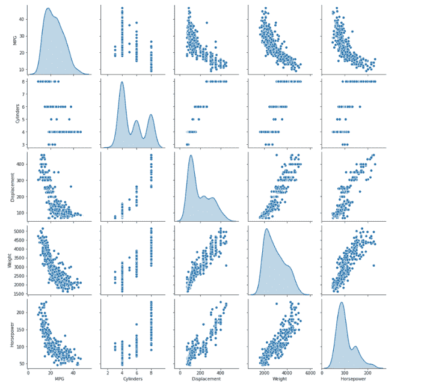

配对图为您提供了每个变量相对于其他变量的行为的简要概述。

例如，MPG 列(我们的目标变量)与排量、重量和马力特性负相关。

### 搁置测试数据集

这是我们应该做的第一件事，因为我们想在看不见的/无偏见的数据上测试我们的最终模型。

有许多方法可以将数据分成训练集和测试集，但是我们希望我们的测试集能够代表总体，而不仅仅是几个特定的类别。因此，我们使用 ****分层抽样，而不是使用 sklearn 简单常用的`train_test_split()`方法。****

> 分层抽样—我们从总体中创建称为阶层的同质子群，并对每个阶层抽样正确数量的实例，以确保测试集代表总体。

在任务 4 中，我们看到了数据是如何分布在圆柱体列的每个类别中的。我们用圆柱来创造地层:

```
from sklearn.model_selection import StratifiedShuffleSplit

split = StratifiedShuffleSplit(n_splits=1, test_size=0.2, random_state=42)
for train_index, test_index in split.split(data, data["Cylinders"]):
    strat_train_set = data.loc[train_index]
    strat_test_set = data.loc[test_index] 
```

正在检查训练集中的分布:

```
##checking for cylinder category distribution in training set

strat_train_set['Cylinders'].value_counts() / len(strat_train_set) 
```


测试集:

```
strat_test_set["Cylinders"].value_counts() / len(strat_test_set) 
```

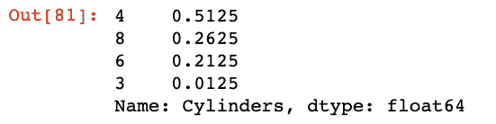

您可以将这些结果与`train_test_split()`的输出进行比较，找出哪一个产生了更好的分割。

### 检查原点列

关于车辆起点的起点列具有看起来像国家代码的离散值。

为了增加复杂性并使其更加清晰，我将这些数字转换为字符串:

```
##converting integer classes to countries in Origin 

columntrain_set['Origin'] = train_set['Origin'].map({1: 'India', 2: 'USA', 3 : 'Germany'})
train_set.sample(10) 
```

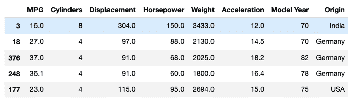

我们必须通过对这些值进行一次性编码来预处理这个分类列:

```
##one hot encoding
train_set = pd.get_dummies(train_set, prefix='', prefix_sep='')
train_set.head() 
```

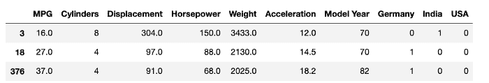

### 测试新变量—分析每个变量与目标变量的相关性

```
 ## testing new variables by checking their correlation w.r.t. MPG
data['displacement_on_power'] = data['Displacement'] / data['Horsepower']
data['weight_on_cylinder'] = data['Weight'] / data['Cylinders']
data['acceleration_on_power'] = data['Acceleration'] / data['Horsepower']
data['acceleration_on_cyl'] = data['Acceleration'] / data['Cylinders']

corr_matrix = data.corr()
corr_matrix['MPG'].sort_values(ascending=False) 
```

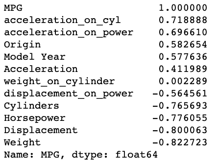

我们发现`acceleration_on_power`和`acceleration_on_cyl`是两个新变量，它们比原来的变量更加正相关。

探索性分析到此结束。我们准备进行下一步，为机器学习准备数据。

# 使用 Sklearn 准备数据

数据准备的一个最重要的方面是，我们必须以函数和类的形式不断自动化我们的步骤。这使得我们更容易将方法和管道集成到主产品中。

以下是准备数据和封装功能的主要任务:

### 预处理分类属性-转换椭圆

```
##onehotencoding the categorical values
from sklearn.preprocessing import OneHotEncoder

cat_encoder = OneHotEncoder()
data_cat_1hot = cat_encoder.fit_transform(data_cat)
data_cat_1hot   # returns a sparse matrix

data_cat_1hot.toarray()[:5] 
```

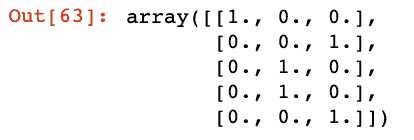

### 数据清理—输入器

我们将使用 Sklearn 库的 impute 模块中的`SimpleImputer`类:

```
##handling missing values
from sklearn.impute import SimpleImputer

imputer = SimpleImputer(strategy="median")imputer.fit(num_data) 
```

### 属性添加—添加自定义转换

为了改变数据集和创建新的变量，sklearn 提供了 BaseEstimator 类。使用它，我们可以通过定义自己的类来开发新的特性。

我们已经创建了一个类来添加上面 ed a 步骤中发现的两个新特性:

*   acc_on_power —加速度除以马力
*   acc_on_cyl —加速度除以气缸数

```
from sklearn.base import BaseEstimator, TransformerMixin

acc_ix, hpower_ix, cyl_ix = 4, 2, 0

##custom class inheriting the BaseEstimator and TransformerMixin
class CustomAttrAdder(BaseEstimator, TransformerMixin):
    def __init__(self, acc_on_power=True):
        self.acc_on_power = acc_on_power  # new optional variable
    def fit(self, X, y=None):
        return self  # nothing else to do
    def transform(self, X):
        acc_on_cyl = X[:, acc_ix] / X[:, cyl_ix] # required new variable
        if self.acc_on_power:
            acc_on_power = X[:, acc_ix] / X[:, hpower_ix]
            return np.c_[X, acc_on_power, acc_on_cyl] # returns a 2D array

        return np.c_[X, acc_on_cyl]

attr_adder = CustomAttrAdder(acc_on_power=True)
data_tr_extra_attrs = attr_adder.transform(data_tr.values)
data_tr_extra_attrs[0] 
```

### 为数值和分类属性设置数据转换管道

正如我所说，我们希望尽可能自动化。Sklearn 提供了大量的类和方法来开发这种自动化的数据转换管道。

主要的转换将在数字列上执行，所以让我们使用`Pipeline`类创建数字管道:

```
def num_pipeline_transformer(data):
    '''
    Function to process numerical transformations
    Argument:
        data: original dataframe 
    Returns:
        num_attrs: numerical dataframe
        num_pipeline: numerical pipeline object

    '''
    numerics = ['float64', 'int64']

    num_attrs = data.select_dtypes(include=numerics)

    num_pipeline = Pipeline([
        ('imputer', SimpleImputer(strategy="median")),
        ('attrs_adder', CustomAttrAdder()),
        ('std_scaler', StandardScaler()),
        ])
    return num_attrs, num_pipeline 
```

在上面的代码片段中，我们级联了一组转换:

*   输入缺失值——使用上面讨论的`SimpleImputer`类。
*   自定义属性添加-使用上面定义的自定义属性类。
*   每个属性的标准缩放——在将值提供给 ML 模型之前，使用`standardScaler`类缩放这些值总是一个好的做法。

## 数字列和分类列的组合管道

我们已经准备好了数值转换。我们拥有的唯一分类列是 Origin，我们需要对其值进行一次性编码。

下面是我们如何使用`ColumnTransformer`类一次捕获这两个任务。

```
def pipeline_transformer(data):
    '''
    Complete transformation pipeline for both
    nuerical and categorical data.

    Argument:
        data: original dataframe 
    Returns:
        prepared_data: transformed data, ready to use
    '''
    cat_attrs = ["Origin"]
    num_attrs, num_pipeline = num_pipeline_transformer(data)
    full_pipeline = ColumnTransformer([
        ("num", num_pipeline, list(num_attrs)),
        ("cat", OneHotEncoder(), cat_attrs),
        ])
    prepared_data = full_pipeline.fit_transform(data)
    return prepared_data 
```

对于实例，提供从上面定义的函数创建的数字管道对象。然后调用`OneHotEncoder()`类处理 Origin 列。

## 最终自动化

定义了这些类和函数之后，我们现在必须将它们集成到一个单一的流中，这个流就是两个简单的函数调用。

1.  预处理 Origin 列以将整数转换为国家名称:

```
##preprocess the Origin column in data
def preprocess_origin_cols(df):
    df["Origin"] = df["Origin"].map({1: "India", 2: "USA", 3: "Germany"})    
    return df 
```

2.调用上面定义的最后一个`pipeline_transformer`函数:

```
##from raw data to processed data in 2 steps

preprocessed_df = preprocess_origin_cols(data)
prepared_data = pipeline_transformer(preprocessed_df)prepared_data 
```

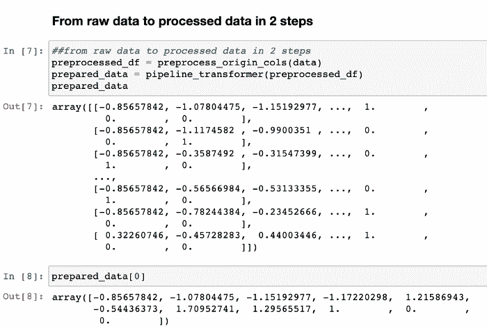

瞧，您的数据只需两步即可使用！

下一步是开始训练我们的 ML 模型。

# **选择和训练机器学习模型**

由于这是一个回归问题，所以我选择训练以下模型:

1.  ****线性回归****
2.  ****决策树回归器****
3.  ****随机森林回归子****
4.  ****SVM**回归者**

我将解释线性回归的流程，然后你可以遵循所有其他的流程。

这是一个简单的 ****4 步流程:****

1.  创建模型类的一个实例。
2.  使用 fit()方法为模型定型。
3.  首先通过管道转换器传递数据来进行预测。
4.  使用均方根误差(回归问题的典型性能指标)评估模型

```
 from sklearn.linear_model import LinearRegression

lin_reg = LinearRegression()
lin_reg.fit(prepared_data, data_labels)

##testing the predictions with first 5 rows
sample_data = data.iloc[:5]
sample_labels = data_labels.iloc[:5]
sample_data_prepared = pipeline_transformer(sample_data)

print("Prediction of samples: ", lin_reg.predict(sample_data_prepared)) 
```

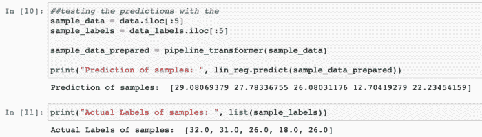

****评估模型:****

```
from sklearn.metrics import mean_squared_error

mpg_predictions = lin_reg.predict(prepared_data)
lin_mse = mean_squared_error(data_labels, mpg_predictions)
lin_rmse = np.sqrt(lin_mse)lin_rmse 
```

****RMSE 进行线性回归:2.95904****

# **使用 Sklearn 进行交叉验证和超参数调整**

现在，如果你对决策树执行同样的操作，你会看到你已经获得了 0.0 的 RMSE 值，这是不可能的——没有“完美”的机器学习模型(我们还没有达到这一点)。

****问题:**** 我们正在用我们训练的相同数据测试我们的模型，这是一个问题。现在，我们还不能使用测试数据，直到我们最终确定了可以投入生产的最佳模型。

****解:**** [****交叉验证****](https://scikit-learn.org/stable/modules/cross_validation.html)

[Scikit-Learn 的 K-fold 交叉验证](https://scikit-learn.org/stable/modules/cross_validation.html)功能将训练集随机分成`K`个不同的子集，称为折叠。然后，它训练和评估模型 K 次，每次选择不同的折叠进行评估，并在其他 K-1 个折叠上进行训练。

结果是一个包含 K 个评估分数的数组。我是这样做 10 倍的:

```
from sklearn.model_selection import cross_val_score

scores = cross_val_score(tree_reg, 
                         prepared_data, 
                         data_labels, 
                         scoring="neg_mean_squared_error", 
                         cv = 10)
tree_reg_rmse_scores = np.sqrt(-scores) 
```

评分方法给出负值来表示错误。所以在计算平方根的时候，我们要明确的加上否定。

对于决策树，以下是所有分数的列表:

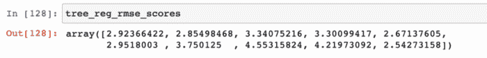

取这些分数的平均值:

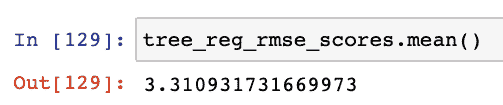

## 微调超参数

在测试了所有模型之后，您会发现 RandomForestRegressor 的表现最好，但仍需要进行微调。

一个模型就像一个广播电台，有很多旋钮需要操作和调谐。现在，您可以手动调整所有这些旋钮，或者提供您想要测试的一系列值/组合。

我们使用 GridSearchCV 为 RandomForest 模型找出超参数的最佳组合:

```
 from sklearn.model_selection import GridSearchCV

param_grid = [
    {'n_estimators': [3, 10, 30], 'max_features': [2, 4, 6, 8]},
    {'bootstrap': [False], 'n_estimators': [3, 10], 'max_features': [2, 3, 4]},
  ]

forest_reg = RandomForestRegressor()

grid_search = GridSearchCV(forest_reg, param_grid,
                           scoring='neg_mean_squared_error',
                           return_train_score=True,
                           cv=10,
                          )

grid_search.fit(prepared_data, data_labels) 
```

GridSearchCV 要求您传递参数网格。这是一个 python 字典，参数名作为键映射到您要测试的参数的值列表。

我们可以将模型、评分方法和交叉验证折叠传递给它。

训练模型，它会返回最佳参数和每个参数组合的结果:

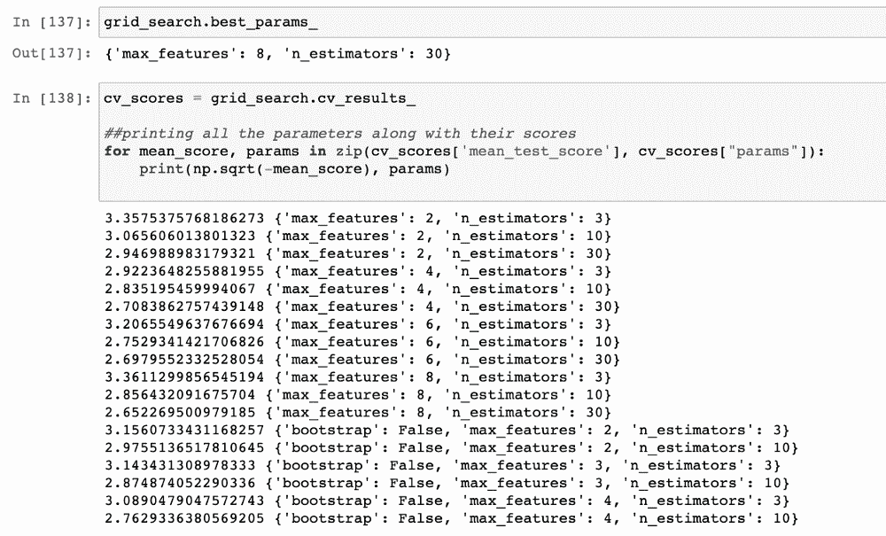

## 检查特征重要性

我们还可以通过登记要素并使用 best_estimator 的要素重要性属性将其压缩来检查要素重要性，如下所示:

```
# feature importances
feature_importances = grid_search.best_estimator_.feature_importances_

extra_attrs = ["acc_on_power", "acc_on_cyl"]
numerics = ['float64', 'int64']
num_attrs = list(data.select_dtypes(include=numerics))

attrs = num_attrs + extra_attrs
sorted(zip(attrs, feature_importances), reverse=True) 
```

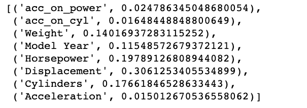

我们看到`acc_on_power`，它是一个派生的特性，已经被证明是最重要的特性。

在最终确定最佳配置之前，您可能希望继续迭代几次。

这个模型现在已经准备好了，并且有了最佳的配置。

# 评估整个系统

是时候评估整个系统了:

```
##capturing the best configuration
final_model = grid_search.best_estimator_

##segregating the target variable from test set
X_test = strat_test_set.drop("MPG", axis=1)
y_test = strat_test_set["MPG"].copy()

##preprocessing the test data origin column
X_test_preprocessed = preprocess_origin_cols(X_test)

##preparing the data with final transformation
X_test_prepared = pipeline_transformer(X_test_preprocessed)

##making final predictions
final_predictions = final_model.predict(X_test_prepared)
final_mse = mean_squared_error(y_test, final_predictions)
final_rmse = np.sqrt(final_mse) 
```

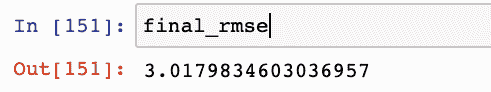

如果你想看我的完整项目，这里是 [GitHub 库:](https://github.com/dswh/fuel-consumption-end-to-end-ml)

这样，你就有了准备投入生产的最终模型。

对于部署，我们使用`pickle`模型将我们的模型保存到一个文件中，并开发一个 ****Flask**** web 服务，部署在 ****Heroku**** 中。现在让我们看看它是如何工作的。

# 部署应用程序需要什么？

为了部署任何经过训练的模型，您需要以下内容:

*   ****一个训练好的模型准备部署**** —将模型保存到一个文件中，供 web 服务进一步加载和使用。
*   ****一个 web 服务****——为你的模型在实践中的使用提供一个目的。对于我们的燃料消耗模型，它可以使用车辆配置来预测其效率。我们将使用 ****烧瓶**** 来开发这个服务。
*   ****云服务提供商**** —你需要专门的云服务器来部署应用。为了简单起见，我们将使用 Heroku(我将在其他文章中介绍 AWS 和 GCP)。

让我们从逐一查看这些流程开始。

# **保存训练好的模型**

一旦您有足够的信心将经过培训和测试的模型带入生产就绪环境，第一步就是将它保存到. h5 或。使用类似于`pickle`的库来绑定文件。

确保您的环境中安装了`pickle`。

接下来，让我们导入模块并将模型转储到一个`.bin`文件中:

```
import pickle

##dump the model into a file
with open("model.bin", 'wb') as f_out:
    pickle.dump(final_model, f_out) # write final_model in .bin file
    f_out.close()  # close the file 
```

这将把您的模型保存在您当前的工作目录中，除非您指定一些其他的路径。

是时候测试我们是否能够使用这个文件来加载我们的模型并进行预测了。我们将使用与上面定义的相同的车辆配置:

```
##vehicle config
vehicle_config = {
    'Cylinders': [4, 6, 8],
    'Displacement': [155.0, 160.0, 165.5],
    'Horsepower': [93.0, 130.0, 98.0],
    'Weight': [2500.0, 3150.0, 2600.0],
    'Acceleration': [15.0, 14.0, 16.0],
    'Model Year': [81, 80, 78],
    'Origin': [3, 2, 1]
} 
```

让我们从文件中加载模型:

```
##loading the model from the saved file
with open('model.bin', 'rb') as f_in:
    model = pickle.load(f_in) 
```

对`vehicle_config`进行预测:

```
##defined in prev_blog
predict_mpg(vehicle_config, model)

##output: array([34.83333333, 18.50666667, 20.56333333]) 
```

输出与我们之前使用`final_model`预测的一样。

# **开发网络服务**

下一步是将这个模型打包到一个 web 服务中，当通过 POST 请求获得数据时，该服务返回 MPG(英里/加仑)预测作为响应。

我使用的是 Flask web 框架，这是一个常用的用 Python 开发 web 服务的轻量级框架。在我看来，这可能是实现 web 服务最简单的方法。

Flask 让您从很少的代码开始，并且您不需要担心处理 HTTP 请求和响应的复杂性。

以下是步骤:

*   为您的 flask 应用程序创建一个新目录。
*   使用 pip 设置安装了依赖项的专用环境。
*   安装以下软件包:

```
pandas
numpy
sklearn
flask
gunicorn
seaborn 
```

下一步是激活这个环境，并开始开发一个简单的端点来测试应用程序:

创建一个新文件`main.py`并导入烧瓶模块:

```
from flask import Flask 
```

通过实例化 Flask 类来创建 Flask 应用程序:

```
##creating a flask app and naming it "app"
app = Flask('app') 
```

创建一个路由和与之对应的函数，该函数将返回一个简单的字符串:

```
@app.route('/test', methods=['GET'])
def test():
    return 'Pinging Model Application!!' 
```

上面的代码利用了 decorator——一种高级的 Python 特性。你可以在这里阅读更多关于装饰者的信息。

我们不需要深入理解 decorator，只需要在`test()`函数之上添加一个 decorator `@app.route`就可以将 web 服务地址分配给该函数。

现在，要运行应用程序，我们需要最后这段代码:

```
if __name__ == ‘__main__’:
    app.run(debug=True, host=’0.0.0.0', port=9696) 
```

run 方法启动我们的 flask 应用程序服务。这 3 个参数指定:

*   `debug=True` —当遇到代码中的任何变化时，自动重启应用程序
*   `host=’0.0.0.0'` —公开 web 服务
*   `port=9696` —我们用来访问应用程序的端口

现在，在您的终端中运行`main.py`:

```
python main.py 
```

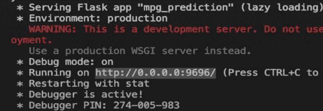

在浏览器中打开 URL[http://0 . 0 . 0 . 0:9696/test](http://http//0.0.0.0:9696/test)将在网页上打印响应字符串:

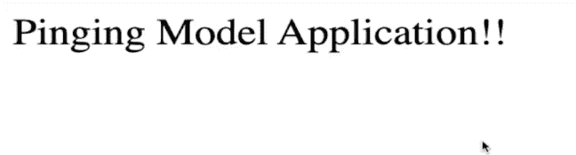

现在应用程序正在运行，让我们运行模型。

创建一个新目录`model_files`来存储所有与模型相关的代码。

在这个目录中，创建一个`ml_model.py file`，它将包含数据准备代码和我们在这里写的的预测函数。

复制并粘贴您在本文前面导入的库和预处理/转换函数。该文件应该如下所示:

```
import numpy as np
import pandas as pd
import matplotlib.pyplot as plt
import seaborn as sns

from sklearn.model_selection import train_test_split
from sklearn.preprocessing import OneHotEncoder
from sklearn.base import BaseEstimator, TransformerMixin
from sklearn.impute import SimpleImputer

from sklearn.pipeline import Pipeline
from sklearn.preprocessing import StandardScaler
from sklearn.compose import ColumnTransformer

##functions

def preprocess_origin_cols(df):
    df["Origin"] = df["Origin"].map({1: "India", 2: "USA", 3: "Germany"})
    return df

acc_ix, hpower_ix, cyl_ix = 3, 5, 1

class CustomAttrAdder(BaseEstimator, TransformerMixin):
    def __init__(self, acc_on_power=True): # no *args or **kargs
        self.acc_on_power = acc_on_power
    def fit(self, X, y=None):
        return self  # nothing else to do
    def transform(self, X):
        acc_on_cyl = X[:, acc_ix] / X[:, cyl_ix]
        if self.acc_on_power:
            acc_on_power = X[:, acc_ix] / X[:, hpower_ix]
            return np.c_[X, acc_on_power, acc_on_cyl]

        return np.c_[X, acc_on_cyl]

def num_pipeline_transformer(data):
    numerics = ['float64', 'int64']

    num_attrs = data.select_dtypes(include=numerics)

    num_pipeline = Pipeline([
        ('imputer', SimpleImputer(strategy="median")),
        ('attrs_adder', CustomAttrAdder()),
        ('std_scaler', StandardScaler()),
        ])
    return num_attrs, num_pipeline

def pipeline_transformer(data):

    cat_attrs = ["Origin"]
    num_attrs, num_pipeline = num_pipeline_transformer(data)

    full_pipeline = ColumnTransformer([
        ("num", num_pipeline, list(num_attrs)),
        ("cat", OneHotEncoder(), cat_attrs),
        ])
    full_pipeline.fit_transform(data)
    return full_pipeline    

def predict_mpg(config, model):

    if type(config) == dict:
        df = pd.DataFrame(config)
    else:
        df = config

    preproc_df = preprocess_origin_cols(df)
    print(preproc_df)
    pipeline = pipeline_transformer(preproc_df)
    prepared_df = pipeline.transform(preproc_df)
    print(len(prepared_df[0]))
    y_pred = model.predict(prepared_df)
    return y_pred 
```

在同一个目录中添加您保存的`model.bin`文件。

现在，在`main.py`中，我们将导入`predict_mpg`函数来进行预测。但是要做到这一点，我们需要创建一个空的`__init__.py` 文件来告诉 Python 这个目录是一个包。

您的目录应该有这样的树:

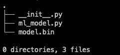

接下来，定义`predict/`路由，它将接受来自 HTTP POST 请求的`vehicle_config`,并使用模型和`predict_mpg()`方法返回预测。

在您的 main.py 中，第一次导入:

```
import pickle
from flask import Flask, request, jsonify
from model_files.ml_model import predict_mpg 
```

然后添加`predict`路线和相应的功能:

```
@app.route('/predict', methods=['POST'])
def predict():
    vehicle = request.get_json()
    print(vehicle)
    with open('./model_files/model.bin', 'rb') as f_in:
        model = pickle.load(f_in)
        f_in.close()
    predictions = predict_mpg(vehicle, model)

    result = {
        'mpg_prediction': list(predictions)
    }
    return jsonify(result) 
```

这里，我们将只接受函数的 POST 请求，因此我们在装饰器中有`methods=[‘POST’]`。

*   首先，我们使用`get_json()`方法从请求中获取数据(vehicle_config ),并将其存储在变量 vehicle 中。
*   然后，我们将训练好的模型从我们在`model_files`文件夹中的文件加载到模型变量中。
*   现在，我们通过调用 predict_mpg 函数并传递`vehicle`和`model`来进行预测。
*   我们为预测变量中返回的数组创建一个 JSON 响应，并将这个 JSON 作为方法响应返回。

我们可以使用 Postman 或`requests`包来测试这个路由，然后启动运行 main.py 的服务器。然后在您的笔记本中，添加以下代码来发送带有`vehicle_config`的 POST 请求:

```
import requests

url = “http://localhost:9696/predict"
r = requests.post(url, json = vehicle_config)
r.text.strip()

##output: '{"mpg_predictions":[34.60333333333333,19.32333333333333,14.893333333333333]}' 
```

太好了！现在，到了最后一部分:当部署在远程服务器上时，同样的功能应该可以工作。

# 在 Heroku 上部署应用程序


要在 Heroku 上部署这个 flask 应用程序，您需要遵循以下非常简单的步骤:

1.  在主目录中创建一个`Procfile`——它包含在服务器上运行应用程序的命令。
2.  在您的`Procfile`中添加以下内容:

```
web: gunicorn wsgi:app 
```

我们使用 gunicorn(之前安装的)来部署应用程序:

> **[Gunicorn](https://gunicorn.org/) 是一个用于 WSGI 应用程序的纯 Python HTTP 服务器。它允许您通过在一个 dyno 中运行多个 Python 进程来同时运行任何 Python 应用程序。它提供了性能、灵活性和配置简单性的完美平衡。**

现在，创建一个`wsgi.py`文件并添加:

```
##importing the app from main file
from main import app

if __name__ == “__main__”: 
    app.run() 
```

确保从`main.py`中删除运行代码。

将所有 python 依赖关系写入`requirements.txt`。

你可以使用`pip freeze > requirements.txt`或者简单地把上面提到的包列表+你的应用程序正在使用的任何其他包。

现在，使用终端，

*   初始化一个空的 git 存储库，
*   将文件添加到临时区域，
*   并将文件提交到本地存储库:

```
$ git init 
$ git add .
$ git commit -m "Initial Commit" 
```

接下来，创建一个 Heroku 账户(如果你还没有)。然后登录 Heroku CLI:

```
heroku login 
```

当页面弹出时，批准从浏览器登录。

现在创建一个烧瓶应用程序:

```
heroku create <name of your app> 
```

我把它命名为`mpg-flask-app`。它将创建一个 flask 应用程序，并会给我们一个应用程序将被部署的 URL。

最后，将所有代码推送到 Heroku remote:

`$ git push heroku master`

瞧！您的 web 服务现在部署在[https://mpg-flask-app.herokuapp.com/predict](https://mpg-flask-app.herokuapp.com/predict)上。

同样，通过发送相同的车辆配置，使用`request`包测试端点:

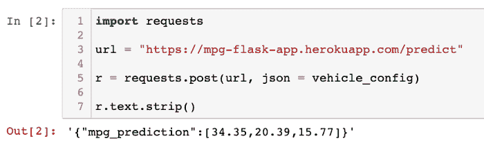

至此，您已经具备了开始构建更复杂的 ML 应用程序所需的所有主要技能。

这个项目可以参考[我的 GitHub 库](https://github.com/dswh/fuel-consumption-end-to-end-ml)。

你可以和我一起开发整个项目:

[https://www.youtube.com/embed/videoseries?list=PLIkXejH7XPT9eeLQXbjMudA8x65E44UF3](https://www.youtube.com/embed/videoseries?list=PLIkXejH7XPT9eeLQXbjMudA8x65E44UF3)

# 后续步骤

这仍然是一个简单的项目。对于接下来的步骤，我建议你着手一个更复杂的数据集——也许拿起[一个分类问题](https://archive.ics.uci.edu/ml/datasets.php?format=&task=cla&att=&area=&numAtt=&numIns=&type=&sort=nameUp&view=table)并重复[这些任务](https://towardsdatascience.com/task-cheatsheet-for-almost-every-machine-learning-project-d0946861c6d0?source=---------2------------------)直到部署。

### 查看[数据科学与 harsh it](https://www.youtube.com/c/DataSciencewithHarshit?sub_confirmation=1)——我的 YouTube 频道

这是我的 YouTube 频道上的完整教程(以播放列表的形式)，你可以在这个项目上跟着我。

[https://www.youtube.com/embed/videoseries?list=PLIkXejH7XPT9eeLQXbjMudA8x65E44UF3](https://www.youtube.com/embed/videoseries?list=PLIkXejH7XPT9eeLQXbjMudA8x65E44UF3)

通过这个渠道，我计划推出几个覆盖整个数据科学领域的[系列](https://towardsdatascience.com/hitchhikers-guide-to-learning-data-science-2cc3d963b1a2?source=---------8------------------)。以下是你应该订阅[频道](https://www.youtube.com/channel/UCH-xwLTKQaABNs2QmGxK2bQ)的原因:

*   这些系列将涵盖每个主题和子主题的所有必需/要求的高质量教程，如 [Python 数据科学基础](https://towardsdatascience.com/python-fundamentals-for-data-science-6c7f9901e1c8?source=---------5------------------)。
*   解释了为什么我们在 ML 和深度学习中这样做的数学和推导。
*   [与谷歌、微软、亚马逊等公司的数据科学家和工程师](https://www.youtube.com/watch?v=a2pkZCleJwM&t=2s)以及大数据驱动型公司的首席执行官的播客。
*   [项目和说明](https://towardsdatascience.com/building-covid-19-analysis-dashboard-using-python-and-voila-ee091f65dcbb?source=---------2------------------)实施到目前为止所学的主题。了解新的认证、训练营以及破解这些认证的资源，例如谷歌的 [****TensorFlow 开发者证书考试。****](https://youtu.be/yapSsspJzAw)

如果这个教程有帮助，你应该看看我在 [Wiplane Academy](https://www.wiplane.com/) 上的数据科学和机器学习课程。它们全面而紧凑，帮助您建立一个坚实的工作基础来展示。