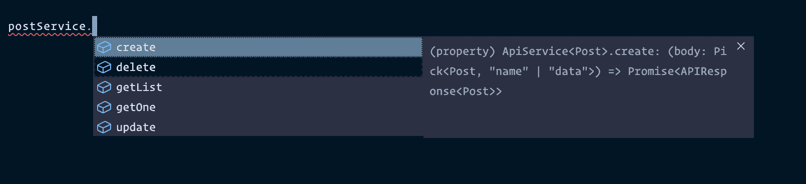

# TypeScript 泛型如何帮助您编写更少的代码

> 原文：<https://www.freecodecamp.org/news/make-typescript-easy-using-basic-ts-generics/>

当开发人员讨论 Typescript 时，他们的一个主要抱怨是，为了达到相同的结果，您必须编写更多的代码。虽然我同意这一点，但我认为 Typescript 泛型可以在很大程度上减少您需要编写的代码。

## 什么是 TypeScript 泛型？

TS 泛型可以用来将抽象引入你的 TS 接口。使用泛型，您可以将一个接口作为参数传递给另一个接口。

下面是一个标准 API 响应的例子，包括一个快乐路径和一个错误情况。

```
// successful response ✅
{
	status: 'ok',
	responseCode: 200,
	data: {...}
}

// error response ❌
{
	responseCode: 500,
	errorMessage: "Something went wrong ?";
} 
```

不用为每个响应编写一个接口并添加这些键，您可以简单地使用泛型来创建如下内容:

```
interface ApiResponse<T>{
	errorMessage?: string;
	responseCode?: string;
	data?: T;
} 
```

```
interface UserData {
	name: string;
	email: string;
}
const response: ApiResponse<UserData> = {} 
```

## 将泛型与函数链接起来

假设我们有一个函数，我们用它向后端发出 API 请求。

```
const getRequestTo = (endpoint: string) => {
	return fetch(process.env.BE_HOST + endpoint).then(res => res.json())
}

const userResponse = getRequestTo('/user-data') 
```

`userResponse`的类型应该是`any`。这里我们可以有一个更好的 TypeScript 实现。

```
const getRequestTo = async <R>(endpoint: string): Promise<ApiResponse<R>> => {
	const request = await fetch(process.env.BE_HOST + endpoint);
	const response = await request.json();
	return response;
}; 
```

我们可以为 POST 请求创建一个类似的函数，它也将 JSON 作为类型`B`的参数，服务器将发送回类型`R`的 JSON 响应:

```
const postRequestTo = async <B, R>(
	endpoint: string,
	body: B
): Promise<ApiResponse<R>> => {
	const request = await fetch(process.env.BE_HOST + endpoint, {
		method: "POST",
		body: JSON.stringify(body),
	});

	const response = await request.json();

	return response;
}; 
```

类似地，也可以有补丁请求功能，其 handle‌s 任何实体的部分更新。

```
const patchRequestTo = async <B, R>(endpoint: string,body: Partial<B>): Promise<ApiResponse> => {
	const request = await fetch(process.env.BE_HOST + endpoint, {
    	method: "PATCH",
	    body: JSON.stringify(body)
    });
	const response = await request.json();
	return response;
}; 
```

下面是如何实现这样的东西:

```
interface RequestBody {}
interface Response {}

const createPost = await postRequestTo<RequestBody, Response>('/post', postData);

const updatePost = await patchRequestTo<RequestBody, Response>('/post', {
	title: "new name"
}); 
```

让我们用一个简单的 JavaScript 类将它们组合在一起:

```
class ApiService<T> {
	constructor(entitySlug: string) {
		this.entitySlug = entitySlug;
	}

	private entitySlug: string;

	getOne = async (id: string): Promise<APIResponse<T>> => {
		const request = await fetch(process.env.BE_HOST + this.entitySlug + '/' + id);
		const response = await request.json();
		return response;
	};

	getList = async (): Promise<APIResponse<T[]>> => {
		const request = await fetch(process.env.BE_HOST + this.entitySlug);
		const response = await request.json();
		return response;
	};

	create = async (body: Omit<T, 'id' | 'created' | 'updated'>): Promise<APIResponse<T>> => {
		const request = await fetch(process.env.BE_HOST + this.entitySlug, {
			method: 'POST',
			body: JSON.stringify(body)
		});

		const response = await request.json();
		return response;
	};

	update = async (
		body: Omit<Partial<T>, 'id' | 'created' | 'updated'>
	): Promise<APIResponse<T>> => {
		const request = await fetch(process.env.BE_HOST + this.entitySlug + '/' + body.id, {
			method: 'PATCH',
			body: JSON.stringify(body)
		});
		const response = await request.json();
		return response;
	};

	delete = async (id: string): Promise<void> => {
		const request = await fetch(process.env.BE_HOST + this.entitySlug + '/' + id, {
			method: 'DELETE'
		});
		const response = await request.json();
		return response;
	};
}; 
```

然后，您可以创建一个实体服务，如下所示:

```
export const postService = new ApiService<Post>('/post');
```

所有的都链接好了，为你准备好了。



VS Code auto-suggesting according to the typescript configuration that we have implemented

如果配置得当，Typescript 有可能将开发人员的体验提高十倍。这些是使配置过程更舒适的一些策略。我希望这有助于您在当前的代码库中更好地使用 Typescript。