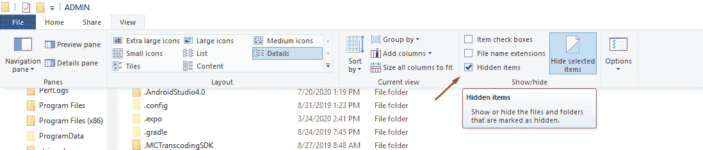
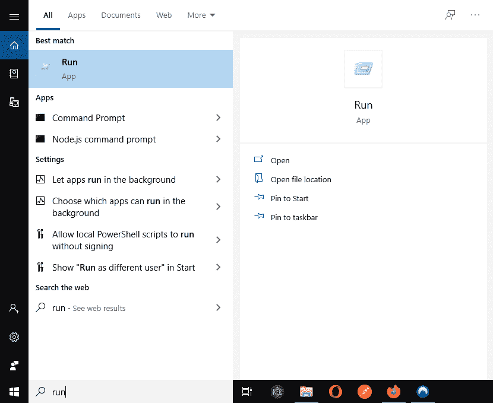
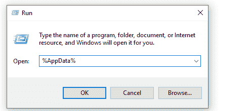

# AppData–在 Windows 10 中哪里可以找到 AppData 文件夹

> 原文：<https://www.freecodecamp.org/news/appdata-where-to-find-the-appdata-folder-in-windows-10/>

AppData 文件夹包含 Windows PC 上的应用程序特有的应用程序设置、文件和数据。默认情况下，该文件夹在 Windows 文件资源管理器中是隐藏的，并且有三个隐藏的子文件夹:本地、本地流和漫游。

您不会经常使用该文件夹，但这是您的重要文件所在的位置。例如，您的书签、保存的会话等。

在本指南中，您将学习如何在 Windows 中查找、取消隐藏和访问 AppData 文件夹。

## 什么是 AppData 文件夹？

windows 中的应用程序通常将其设置和临时数据存储在 AppData 文件夹中。每个 windows 用户帐户都有自己的 AppData 文件夹。正如我前面提到的，AppData 中有三个文件夹——Local、LocalLow 和 Roaming。

本地文件夹用于存储特定于单个 windows 系统的数据，这意味着数据不会在多台电脑之间同步。

LocalLow 文件夹与 Local 文件夹相同，不同之处在于它由以受限安全设置运行的低完整性应用程序使用，例如，在私有模式下运行的 Mozilla Firefox。

漫游文件夹用于存储将在多个 Windows 系统间同步的数据。这通常用于存储书签、保存的密码等设置。

## 如何查看 AppData 文件夹

有两种方法可以访问 AppData 文件夹。您可以手动或使用“AppData”变量名来访问它。

您可以进入您的用户文件夹，手动查看 AppData 文件夹，该文件夹在 c 盘中。在我的例子中，路径是`C:\Users\ADMIN`。

接下来，转到顶部的“查看”选项卡，选中“隐藏项目”复选框，如下所示:

现在，您应该可以在用户文件夹中看到 AppData 文件夹。

也可以使用 AppData 系统变量直接访问 AppData 文件夹。如下图在 windows 搜索中搜索“Run”，或者按 Windows + R 键打开 Run App。

在运行应用程序文本框中，输入“%AppData%”，然后单击确定。Windows 将直接打开 AppData 文件夹中的漫游文件夹。

## 包裹

阅读完本指南后，我希望你能在电脑中找到 AppData 文件夹。

通常，您不必担心 AppData 文件夹中的数据——这就是为什么默认情况下它是隐藏的。它仅由应用程序开发人员用来存储应用程序所需的必要数据。

如果日常 Windows 用户需要创建应用程序数据的备份，他们只需要访问或查看 AppData 文件夹。