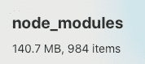
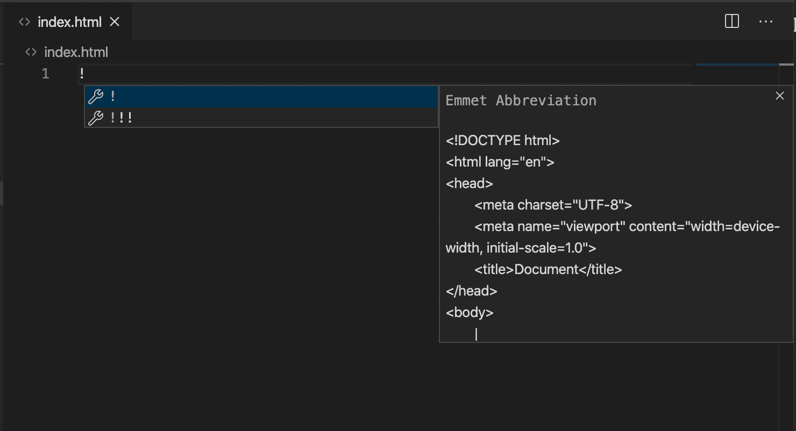
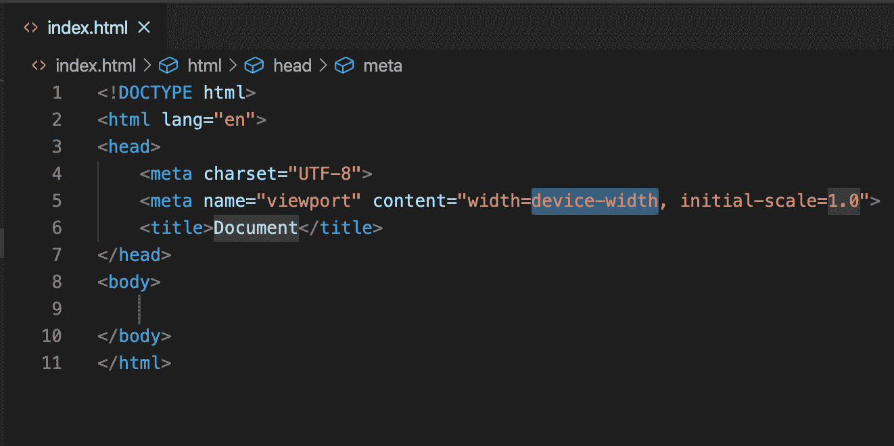
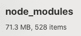

# 如何使用 Parcel 设置 React 应用程序

> 原文：<https://www.freecodecamp.org/news/how-to-up-a-react-app-with-parcel/>

很长一段时间以来，Webpack 是想学习 React 的人最大的障碍之一。有许多样板配置可能会令人困惑，尤其是如果您是反应新手。

即使在试图展示 React 设置有多简单的演讲中，尝试学习设置过程中的每一个步骤也是非常困难的。

React 首次推出测试版后不久，脸书的团队开发了 [create-react-app](https://github.com/facebook/create-react-app) 。这是为了让 React 应用程序(非常完整的版本)变得像输入一个命令一样简单:

```
npx create-react-app my-app
```

不错！老实说，这个？创建一个新的 React 应用程序的方法是很棒的，如果你想要一个从一开始就有很多花里胡哨的东西，**和**你可以让你的应用程序从一个相当重/大的应用程序开始。

这种沉重感来自于自动安装的许多依赖项、加载器、插件等等，它们占据了每个应用程序的大量空间。下面的 Finder 摘要图像来自我的一个 create-react-app 应用程序。？



## 介绍包裹

[Parcel](https://parceljs.org/) 是一个“速度极快、零配置的 web 应用捆绑器”这意味着它为你处理了许多硬捆绑的东西**和**允许你创建一个相对精简的 React 设置(或者任何其他需要[捆绑](https://medium.com/madhash/understanding-the-concept-of-bundling-for-beginners-f2db1adad724)的 web 项目)。

因此，让我们看看如何设置显示`h1`元素的基本“Hello World”React 应用程序。

### 步骤 1:为您的项目创建一个新文件夹

很简单。？

### 第二步:创建你的`package.json`文件

在终端中，将`cd`放入新文件夹并运行:

```
npm init -y
```

这将自动创建`package.json`文件。

### 步骤 3:安装包、反应和反应组件

```
npm install --save-dev parcel-bundler
# Shorthand version: npm i -D parcel-bundler

npm install react react-dom
# Shorthand version: npm i react react-dom
# Note that npm will automatically save dependencies to package.json now, so there's no longer a need to do npm install --save ...
```

### 步骤 4:添加一个“开始”脚本到`package.json`

在`package.json`文件的“脚本”部分，添加以下“启动”脚本:

```
"start": "parcel index.html --open"
```

### 步骤 5:创建`index.html`文件并添加几行

在 VS 代码中，您可以创建一个名为`index.html`的新文件，并使用内置的 [emmet](https://code.visualstudio.com/docs/editor/emmet) 快捷方式创建一个标准的样本 HTML 文件，方法是键入一个感叹号并按下键盘上的 Tab 键。



Type ! and hit the Tab key



? Poof!

在我们继续之前，我们需要添加两件事情:

1.  一个`div`占位符，React 应用程序将被插入其中
2.  一个要读入 JavaScript 条目文件的`script`(我们接下来将创建它)

在`index.html`的`body`中，添加:

```
<body>
    <div id="root"></div>
    <script src="./index.js"></script>
</body>
```

### 第 6 步:创建`index.js`文件

创建一个名为`index.js`的新文件，并输入基本的 React 代码:

```
// index.js
import React from "react"
import ReactDOM from "react-dom"

ReactDOM.render(<h1>Hello world!</h1>, document.getElementById("root")) 
```

### 第七步:启动它！

就是这样！现在，从终端运行:

```
npm start
```

Parcel 将处理剩下的工作，您将拥有一个全功能的 React 应用程序。

## 结论

如果你感兴趣，花些时间[仔细阅读包文档](https://parceljs.org/getting_started.html)以更好地理解使用包带来的所有美妙之处，而不需要你进行任何配置。

开箱即用，package 支持各种常见的 web 开发扩展、transpilers、语法等等。

尽管它不是*小*，包裹应用的 node_modules 在你的电脑上占用的空间少了 50%:



谢谢，包裹！