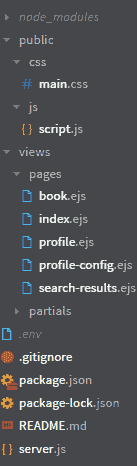
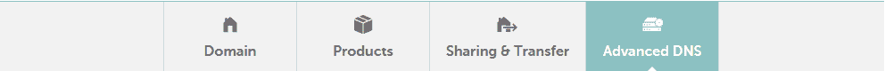
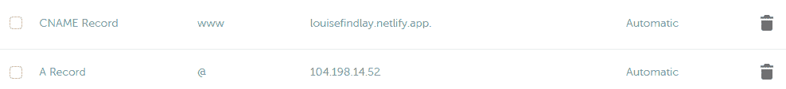
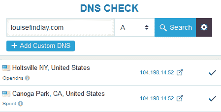

# 如何使用静态站点和 Node.js 开发和部署您的第一个全栈 Web 应用程序

> 原文：<https://www.freecodecamp.org/news/develop-deploy-first-fullstack-web-app/>

本教程将向您展示如何使用 MongoDB、Express、静态 HTML、CSS、JS 和 Node.js 将使用 HTML、CSS 和 JavaScript (JS)的静态网站转换为动态网站。

我们的技术栈将类似于流行的均值/MERN 栈(MongoDB、Express、Angular 或 React 以及 NodeJS)。但是我们不会使用 Angular 或 React，而是使用一个名为 [EJS](https://ejs.co) (嵌入式 JavaScript)的模板引擎。)

其他流行的模板引擎包括 Handlebars、Pug 和 Nunjucks。

之后，我们将把 Node.js web 应用程序部署到 DigitalOcean，并涵盖域名、SSL、反向代理和流程管理器。

学习模板语言可能比学习 JS 框架更容易。您可以只编写 HTML，它允许您在多个位置插入相同的代码片段(称为片段)或传递要在前端显示的服务器端变量(如用户名)。

## 目录

*   [开发您的第一个 Node.js Web 应用](#developingyourfirstnodejswebapp)
    *   [安装 Node.js](#installingnodejs)
    *   [测试安装](#testingtheinstall)
    *   [创建您的第一台服务器](#creatingyourfirstserver)
    *   [接下来的步骤](#nextsteps)
    *   [模板基础知识](#templatingbasics)
    *   [将服务器端数据传递到前端](#passingserversidedatatothefrontend)
*   [部署您的第一个 Node.js Web 应用](#deployingyourfirstnodejswebapp)
    *   [设置数字海洋](#settingupdigitalocean)
    *   [连接到您的 Droplet](#connectingtoyourdroplet)
    *   [部署您的 Node.js Web 应用程序](#deployingyournodejswebapp)
    *   [配置您的域名](#configuringyourdomainname)
    *   [从您的 URL 中删除端口号](#removingtheportnumberfromyoururl)
    *   [启动时运行应用程序(设置进程管理器)](#runningtheapponbootsettingupaprocessmanager)

## 开发您的第一个 Node.js Web 应用程序

### 安装 Node.js

首先，确保您已经在本地机器或 VPS 主机提供商上安装了 Node.js。如果你还没有安装，去 [Node.js 网站](https://nodejs.org/en/)安装。

通过 Node.js，您可以使用特殊形式的 JavaScript 编写服务器端代码，这样您就可以使用已经熟悉的语言。

Node.js 安装程序与软件包管理器 NPM 捆绑在一起。NPM 是节点模块的存储库，节点模块是可以扩展服务器功能的可重用代码。它类似于一个插件库，节点模块可以被认为是代码片段或库(取决于它们有多大)。

*Windows 用户:*需要将节点和 NPM 添加到他们的路径中，以便他们可以在命令行中轻松调用它们。更深入的说明，请参见我的[指南](https://louisefindlay.com/blog/getting-to-grips-with-databases-part1)。

### 测试安装

要测试安装是否正常工作，请打开一个终端窗口，并键入`node -v`和`npm -v`。如果生成的消息以 v 开头，后跟一些数字(表示版本)，则安装成功。现在，您已经准备好创建您的第一台服务器了。

### 创建您的第一台服务器

创建静态网站后，创建 Node.js 应用程序的第一步是创建 Express web 服务器。

首先，移动你网站的所有静态文件(HTML，CSS，JS，图片等。)到一个名为 public 的文件夹中，并在您的网站文件夹的根目录下创建一个名为 server.js 的文件。在 server.js 文件中键入:

```
// Load Node modules
var express = require('express');
// Initialise Express
var app = express();
// Render static files
app.use(express.static('public'));
// Port website will run on
app.listen(8080); 
```

然后在终端中，键入:`npm init`。按 enter 键接受以下所有选项的默认参数，但要确保入口点是 server.js。

最后，键入:`npm start`，然后在浏览器中转到您的 VPS 主机的 IP 地址，或 localhost:8080/index.html(或您的某个网页的名称)。您刚刚创建的 Express 服务器现在应该为您的网站的静态文件提供服务。

### 后续步骤

接下来，我们将讨论如何使用 EJS 模板引擎将静态文件转换成动态文件。然后，我们将看看如何使用片段复制重复的代码，并将服务器端变量注入前端。

### 模板基础

#### 安装 EJS

使用 EJS 的第一步是安装它。一个简单的`npm install ejs --save`就可以了。`--save`参数将模块保存到`package.json`文件中。

这使得任何克隆 git repo(或者下载站点文件)的人都可以使用`npm install`命令安装项目所需的所有节点模块(称为依赖项)。这样他们就不必为他们需要的模块输入`npm install (module name)`。

#### 将静态页面转换为 EJS 文件

接下来，你需要将静态的 HTML 文件转换成动态的 EJS 文件，并按照 EJS 期望的方式设置文件夹结构。

在网站的根目录下，创建一个名为 views 的文件夹。在该文件夹中创建两个子文件夹，分别名为 pages 和 partials。将所有 HTML 文件移动到 pages 子文件夹中，并将。html 文件扩展名为. ejs。

你的文件夹结构应该看起来像下面的图片。



#### 重用代码——创建您的第一个 EJS 片段

当创建静态站点时，通常会有一些代码需要在每个页面上重复，比如页眉(meta 标签所在的位置)、页眉和页脚部分。

如果需要修改的话，在每个页面上修改它们是不方便的(尤其是在较大的网站上)。但是如果你使用 EJS 偏分，那么你就不必这么做了。编辑一个模板(部分)文件将更新包含该文件的每个页面上的代码。

我们将以一个典型的要被模板化的网站的一部分——标题——为例。在 partials 文件夹中创建一个名为 header.ejs 的新文件。将其中一个 EJS 页面上的`<header></header>`标签之间的所有代码复制并粘贴到其中。

最后，在所有带有页眉的页面上，删除`<header></header>`标签之间的代码(与您复制到 header.ejs 部分文件的代码相同)并用`<% include('../partials/header') %>`替换它。现在，你已经创建了你的第一个 EJS 部分。对任何其他重复的代码段(如页眉和页脚部分)重复该过程。

小提示:如果你发现很难区分你的网页和部分网页，因为它们有相同之处。ejs 文件扩展名，在部分(so _ header.ejs)的名称前面加一个下划线会很有帮助。这是一些开发人员使用的命名约定，可能会有所帮助。

#### 呈现 EJS 页面

现在我们到了激动人心的部分:让服务器呈现 EJS 页面和片段，这样您就可以在前端看到它们。

**server.js 示例**

```
// Load Node modules
var express = require('express');
const ejs = require('ejs');
// Initialise Express
var app = express();
// Render static files
app.use(express.static('public'));
// Set the view engine to ejs
app.set('view engine', 'ejs');
// Port website will run on
app.listen(8080);

// *** GET Routes - display pages ***
// Root Route
app.get('/', function (req, res) {
    res.render('pages/index');
}); 
```

首先，我们需要向我们的服务器添加 EJS 节点模块。所以，在`server.js`文件中(见上面的例子)，添加`const ejs = require('ejs');`。

其次，我们需要告诉我们的 Express 服务器使用 EJS，所以添加`app.set('view engine', 'ejs');`。

现在，我们需要配置路由。当用户访问您网站中的某个 URL(如`http://testapp.com/login`)时，路由会告诉服务器该做什么。

有两种类型的路由，GET 和 POST。GET routes 显示页面，POST routes 将数据从前端上传到服务器(通常通过一个表单),通常是在呈现页面和使用上传的数据之前。

由于我们只想显示我们的 EJS 页面，我们将只使用获取路线。将它们添加到`server.js`的`app.listen(8080)`行之后。对于索引页面，路径将是:

```
// *** GET Routes - display pages ***
// Root Route
app.get('/', function (req, res) {
    res.render('pages/index');
}); 
```

“/”指定代码将在其上激活的网站的 URL，`req`代表请求，`res`代表响应。因此，当访问`http://testapp.com`时返回的响应是呈现(显示给浏览器)pages/index.ejs 页面。为您的其他 EJS 页面添加类似的路线。

### 将服务器端数据传递到前端

除了重用代码之外，模板的主要吸引力在于可以将服务器端变量传递到前端。可以是单个变量，如当前用户的用户名，也可以是数组，如每个注册用户的详细信息。

然而，当使用 API 或数据库时，传递服务器端变量的真正优势变得显而易见。

举个基本的例子，下面的代码将在索引页面的 h2 标签中显示“Louise ”:

**server.js**

```
// Route Route
app.get('/', function (req, res) {
    var name = "Louise";
    // Render index page
    res.render('pages/index', {
        // EJS variable and server-side variable
        name: name
    });
}); 
```

第一个`name`是 EJS 变量的名称(在前端显示它的名称)，第二个是包含您想要发送的数据的变量。(它们不必完全相同。)

**索引. ejs】t1**

```
<h2>My name is <%= name %></h2> 
```

对于一个简单的数组，您可以使用这个示例，它将为 listnames 变量中的每个名称创建一个 p 标记:

**server.js**

```
// Route Route
app.get('/', function (req, res) {
    var listnames = ["Louise", "Sadie", "Erik", "Raph", "Gina"];
    // Render index page
    res.render('pages/index', {
        // EJS variable and server-side variable
        listnames: listnames
    });
}); 
```

**索引. ejs】t1**

```
<% listnames.forEach(function(name) { %>
        <p><%= name %></p>
        <% }); %> 
```

恭喜你。您已经完成了第一个 Node.js web 应用程序的开发。在下一部分中，我们将看到如何在 web 上实现(部署)它，以便您可以展示它。

## 部署您的第一个 Node.js Web 应用程序

你可以使用许多托管平台来部署你的 Node.js web 应用，例如[部分](https://www.freecodecamp.org/news/modules/node-js)、 [Heroku](https://www.heroku.com) 、 [Vultr](https://www.vultr.com) 、 [Linode](https://www.linode.com) 、[谷歌云平台](https://console.cloud.google.com)和[亚马逊 web 服务](https://aws.amazon.com)。

在本演练中，我们将使用 [DigitalOcean](https://www.digitalocean.com) 来部署 Node.js 应用程序。

### 设置数字海洋

首先，在数字海洋平台上创建一个帐户。有折扣代码可用于向您的帐户添加免费点数，例如 Github 学生开发包中的代码。请注意，每个帐户只能兑换一个代码。

第二，你需要创建一个水滴。droplet 是一个 VPS(虚拟专用服务器。)它类似于托管在某个服务器场的 Linux VM。

登录您的帐户后，前往管理标题下的 droplets，然后点按创建，然后点按 droplets。

您可以将大多数设置保留为默认设置，但将计划更改为每月 5 美元，其中包含足够您的应用程序使用的资源。如果需要，您可以在以后扩大规模。

此外，选择最接近应用目标受众的数据中心，并将身份验证更改为密码。虽然密码认证不太安全(建议使用 SSH 密钥)，但设置起来要容易得多。因此，出于演示的目的，我们将使用这种方法。

现在剩下的就是选择一个名字(主机名)并点击创建 Droplet。

### 连接到您的 Droplet

不久之后，您会收到一封电子邮件，其中包含您的 droplet 的用户名和密码，您将使用它们登录。

回到 DigitalOcean 网站，在 droplets 下，单击您新创建的 droplet 的名称，然后单击 Console。这将打开一个新的标签，让你控制你的水滴。

或者，您可以使用带有电子邮件中包含的 IP 地址和用户凭证的任何 SSH 客户端。

在您第一次登录时，由于您使用了密码验证，它会提示您设置新密码。生成和存储安全密码的一个很好的方法是像 [LastPass](https://www.lastpass.com) 这样的密码管理器。

### 部署 Node.js Web 应用程序

首先，您需要将 web 应用程序的代码复制到 droplet 中。如果您使用的是诸如 [Git](https://www.freecodecamp.org/news/engineering-education/beginner-guide-to-git/) 之类的源代码控制，那么使用`apt-get install git -y`安装 Git，然后使用 git clone 命令`git clone (link to your repository)`，最后添加到您的存储库的链接就很简单了。

其次，您需要安装 Node。类型:

```
curl -sL https://deb.nodesource.com/setup_14.x | sudo -E bash -
sudo apt-get install -y nodejs 
```

第三，您需要导航到包含您的 web 应用程序的文件夹。键入 ls，然后按 enter 查看当前工作目录(位置)中的所有文件夹。这将类似于下图:


键入 cd，然后键入出现的文件夹的名称。再次键入 ls，您应该会在 web 应用程序的根目录中看到这些文件。

接下来，您需要为您的 web 应用程序安装节点模块(依赖项)。如果您安装了所有结尾带有`-save`的模块，这会将它们保存到 package.json 文件中，那么只需键入`npm install`并按回车键。

否则，当您运行`npm start`时，将会出现模块未找到的错误。键入`npm install (module name)`并按 enter 键，然后再次尝试运行`npm start`。重复该过程，直到错误消失。

如果您需要安装 MongoDB(如果您已经创建了一个 MongoDB 数据库)，那么请遵循这些[指令](https://docs.mongodb.com/manual/tutorial/install-mongodb-on-ubuntu/#install-mongodb-community-edition)。

最后，输入`npm start`启动你的网络应用。现在，您的 web 应用程序正在运行，在新的浏览器标签中，键入您的 droplet 的 IP 地址(在您创建 droplet 时 DigitalOcean 发送的电子邮件中找到)，后跟一个冒号和应用程序运行的端口。比如`167.172.54.51:8080`。

如果您使用的是 Express web 服务器(如果您遵循了我的 [Node.js 入门指南](https://www.section.io/engineering-education/static-site-dynamic-nodejs-web-app/)，您就使用了)，您会在 server.js 文件的`app.listen()`行中找到端口号。例如，`app.listen(8080)`是常用的端口。

恭喜您，您的第一个 Node.js web 应用程序应该会显示在您的 web 浏览器中，该浏览器运行在您的 DigitalOcean droplet 上。

### 配置您的域名

你输入一个 IP 地址和端口号来查看你的网络应用，但是，难道你不想要一个像 yourapp.com 这样的自定义域名吗？

假设您已经购买了一个域名，第一步是添加一个 DNS 记录，这样您的域名将解析为您的 DigitalOcean droplet 的 IP 地址。DNS 记录告诉你的浏览器当他们加载你的域名时该做什么。在这种情况下，它应该转到您的 droplet 的 IP 地址。

如果你还没有购买域名，域名注册商如 [Namecheap](https://www.namecheap.com) 出售域名和其他服务，如电子邮件和静态/CMS 主机服务，尽管与专门的主机和电子邮件提供商合作也有好处。

[Netlify](https://www.netlify.com) 为静态网站提供主机服务，为 CMS 网站提供 [SiteGround](https://www.siteground.co.uk) 。Office365 和 GSuite 是定制电子邮件提供商中的王者。参见我的指南[设置专业邮箱](https://www.section.io/engineering-education/creating-professional-email/)阅读 Office365 和 GSuite 的对比。



登录到您的域注册商，并转到您的域的高级 DNS 设置。例如，在 Namecheap 上，它是管理域屏幕上的高级 DNS 选项卡。



您希望添加一个新记录，如下所示:类型应该设置为 A，主机应该是@或空白(取决于您的提供商)，值应该是您的 droplet 的 IP 地址。对主机 www 重复该过程，这将对您的域的 www 版本执行相同的操作。



处理这些变化可能需要 24-48 小时，但通常需要 15 分钟到 1 小时。检查何时完成的一个快速方法是转到 [DNSChecker](https://www.freecodecamp.org/news/develop-deploy-first-fullstack-web-app/dnschecker.org) 。键入您的域名，并确保类型设置为 a。当结果作为您的 droplet 的 IP 地址返回时，您就成功连接了您的域。

最后的测试是键入您的域名，后跟一个冒号，然后是端口号(例如`yourdomain.com:8080`)。现在，您应该看到您的 web 应用程序正在加载。

### 从您的 URL 中删除端口号

现在你已经有了一个很酷的域名连接到你的网络应用程序，你可能想删除那个讨厌的端口号。

我们可以通过设置所谓的反向代理来做到这一点。一个反向代理将告诉你的 droplet 当一个用户去 yourdomain.com，它应该服务于 yourdomain.com:8080 的网站。我们将使用流行的反向代理 [Nginx](https://www.nginx.com) 来做到这一点。

第一步是安装 Nginx。键入以下内容来更新您的包列表(以便您可以获得最新版本)并安装 Nginx:

```
sudo apt-get update
sudo apt-get install nginx 
```

因为 DigitalOcean droplets 是在启用防火墙的情况下创建的，所以你必须允许 Nginx 通过它，这样它才能正常工作。`sudo ufw allow 'Nginx Full'`会这样做。

要检查安装是否顺利，请转到您的域名的 http 版本，例如`http://yourdomain.com`。如果您看到欢迎使用 Nginx 登录页面，那么它已经成功了。

第二步是保护你的反向代理。目前去`https://yourdomain.com`不行。这是因为我们还没有配置 SSL，我们需要安装一个名为 Certbot 的包来完成这项工作。

要安装 Certbot，请键入以下内容以确保您获得最新版本:

```
sudo add-apt-repository ppa:certbot/certbot
sudo apt-get install python-certbot-nginx 
```

接下来，您需要将您的域添加到 Nginx，以便 Certbot 可以为正确的域生成证书。使用`sudo nano /etc/nginx/sites-available/default`打开配置文件，并将 server_name 行中的下划线替换为您的域。比如`server_name yourdomain.com www.yourdomain.com;`。保存文件并通过键入 CTRL+x，y 退出，然后回车。

要测试文件中是否有错误，键入`sudo nginx -t`，如果没有，键入`sudo systemctl reload nginx`重新加载 Nginx，这样它将使用更新的配置。

现在我们只需要生成 SSL 证书。`sudo certbot --nginx -d yourdomain.com -d www.yourdomain.com`将启动流程。您应该为重定向过程选择选项 2，因为它会将任何试图访问您站点的不安全版本(http)的人转到安全(https)版本。

要测试这一点，请转到`https://yourdomain.com`，您应该会再次看到 Nginx 欢迎屏幕。

最后，我们进入最后一步，为您的 web 应用程序添加 Nginx 配置。出于演示目的，我们将只修改默认的，而不是专门为您的 web 应用程序创建一个新的。如果您需要在一个 droplet 上托管多个 web 应用程序，您需要为每个站点添加新的配置。

键入:`sudo nano /etc/nginx/sites-available/default`编辑默认配置文件。

您需要将`server_name`参数更改为您的域名。例如:yourdomain.com。在位置/下，`proxy_pass`应改为`http://localhost:(port name)`。`ssl_certificate_key`应修改为:`/etc/letsencrypt/live/(domain name)/privkey.pem`。最后，将下面的代码块添加到文件的末尾，然后键入 CTRL+X，再键入 y 退出。

```
server {
    if ($host = auroraspotter.space) {
        return 301 https://$host$request_uri;
    } # managed by Certbot
        listen 80 default_server;
        listen [::]:80 default_server;
        server_name auroraspotter.space;
    return 404; # managed by Certbot 
```

这里有一个完整的例子，它应该是什么样子。**注意:**`server_name`应该是你的域名。

```
server {
        root /var/www/html;      
        index index.html index.htm index.nginx-debian.html;
        server_name auroraspotter.space;

location / {
       proxy_set_header X-Real-IP $remote_addr;
       proxy_set_header X-Forwarded-For $proxy_add_x_forwarded_for;
       proxy_set_header X-NginX-Proxy true;
       proxy_pass http://localhost:8080;
       proxy_set_header Host $http_host;
       proxy_cache_bypass $http_upgrade;
       proxy_redirect off;
 }
    listen [::]:443 ssl ipv6only=on; # managed by Certbot
    listen 443 ssl; # managed by Certbot
    ssl_certificate /etc/letsencrypt/live/auroraspotter.space/fullchain.pem; # managed by Certbot
    ssl_certificate_key /etc/letsencrypt/live/auroraspotter.space/privkey.pem; # managed by Certbot
    include /etc/letsencrypt/options-ssl-nginx.conf; # managed by Certbot
    ssl_dhparam /etc/letsencrypt/ssl-dhparams.pem; # managed by Certbot
}
server {
    if ($host = auroraspotter.space) {
        return 301 https://$host$request_uri;
    } # managed by Certbot

        listen 80 default_server;
        listen [::]:80 default_server;

        server_name auroraspotter.space;
    return 404; # managed by Certbot 
```

要测试文件中是否没有错误，请键入`sudo nginx -t`。如果没有，键入`sudo systemctl reload nginx`重新加载 Nginx，这样它将使用更新的配置。

最后，你应该能够去 yourdomain.com，你的网络应用程序将运行。

### 启动时运行应用程序(设置进程管理器)

你已经把你的域名挂在你的 droplet 上，并配置 Nginx 为你的 web 应用服务，但是你如何让它一直运行，尤其是在重启你的 droplet 之后？

这就是流程管理器的用武之地。它将管理您的 Node.js web 应用程序，记录任何错误，并根据需要启动/停止它。我们将使用名为 PM2 的流程管理器。

第一步是使用`sudo npm install pm2@latest -g`安装 PM2。接下来，要在引导时运行它，运行`pm2 startup systemd`。它应该说设置启动脚本，复制并粘贴下面的命令将是`sudo env PATH=$PATH:/usr/bin /usr/lib/node_modules/pm2/bin/pm2 startup systemd -u (username) --hp /home/(username)`。

如果您使用 DigitalOcean 提供的默认登录，这将是 root。在终端中键入此内容，然后按 enter 键。如果它说命令成功执行(如下所示)，那么它已经工作。

```
[ 'systemctl enable pm2-root' ]
[PM2] Writing init configuration in /etc/systemd/system/pm2-root.service
[PM2] Making script booting at startup...
[PM2] [-] Executing: systemctl enable pm2-root...
[PM2] [v] Command successfully executed. 
```

使用 cd 命令，导航到您的 web 应用程序的文件夹。然后输入`pm2 start server.js`。这将使用 pm2 启动 web 应用程序。之后，键入`pm2 save`，它将保存该文件并在引导时启动。如果它显示保存成功，那么它已经被正确保存。

```
[PM2] Saving current process list...
[PM2] Successfully saved in /root/.pm2/dump.pm2 
```

最后，键入`sudo systemctl start pm2-(username)`。

尝试通过键入 reboot 重新启动您的 droplet，几分钟后，转到`yourdomain.com`。您的 web 应用程序应该正常启动并运行。

如果你想在本教程中学到的技能的基础上更进一步，我建议使用 EJS 模板来处理 API 和数据库。