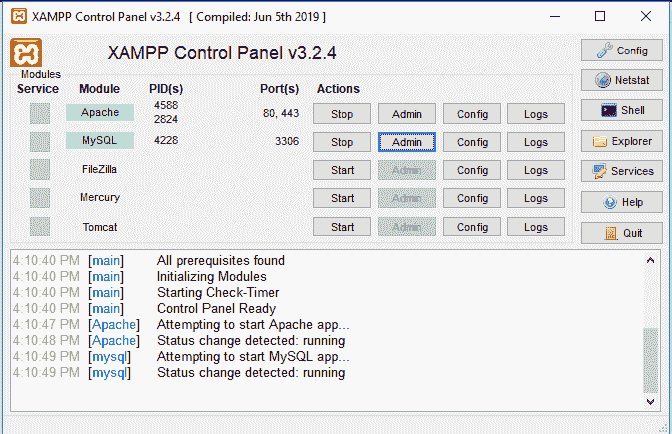
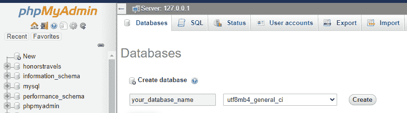
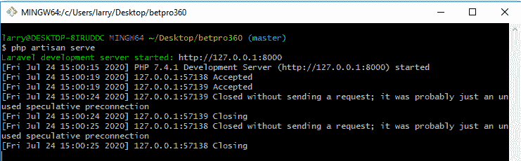
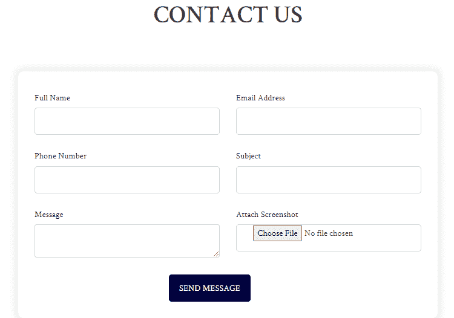
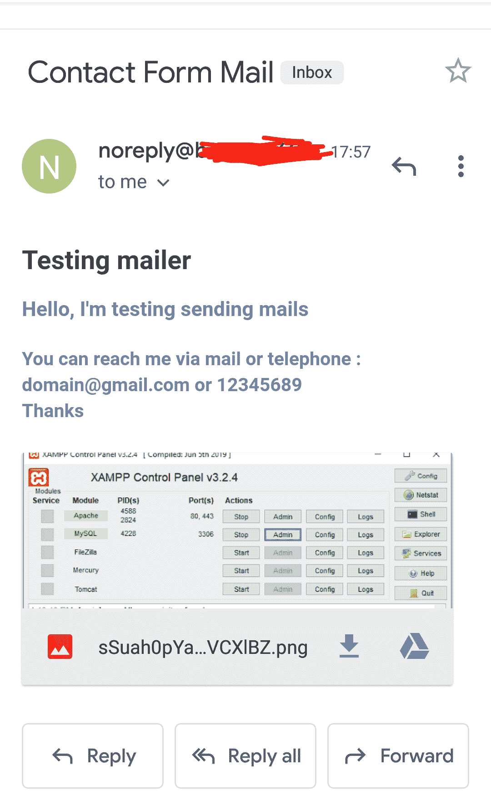

# 如何在 Laravel 中设置带附件和不带附件的联系页面

> 原文：<https://www.freecodecamp.org/news/how-to-setup-a-contact-page-in-laravel/>

最近，当我试图在 Laravel 建立一个联系页面时，我有点纠结。所以我想我应该把我的经历写在博客上，因为它可能会帮助那些想做同样事情的人。

Laravel 是一个用于开发 web 应用程序的[开源](https://opensource.com/resources/what-open-source) PHP 框架。它遵循模型-视图-控制器架构模式。

## 先决条件

1.  [安装作曲者](https://getcomposer.org/download/)
2.  设置您的本地服务器( [xampp](https://www.apachefriends.org/download.html) ， [wamp](https://www.wampserver.com/en/download-wampserver-64bits/) )
3.  确保你已经安装了代码编辑器([崇高文本](https://www.sublimetext.com/3)、 [vs 代码](https://code.visualstudio.com/download)、[原子](https://atom.io/)等)
4.  安装 [Git](https://git-scm.com/downloads) (启用源代码控制&版本控制)

## 入门指南

安装 Git 后，您可以访问 Git bash。使用 bash open，您可以使用终端运行命令，从而轻松安装和使用 Laravel 及其包。

## 通过 composer 安装 Laravel

一旦您满足了上述所有条件，我们将使用下面的命令来设置 Laravel 安装程序:

```
composer global require laravel/installer
```

上面的命令让我们使用之前安装的 composer 下载 Laravel 安装程序。

```
laravel new project_name 
```

这个安装过程需要一段时间，所以请耐心等待。**注意**安装将在您在 bash 终端或您选择使用的任何终端中指定的目录下完成。

## 生成基本身份验证框架

一旦我们安装了 Laravel 应用程序的副本，我们应该生成一个基本的身份验证框架。

```
cd project_name

composer require laravel/ui

php artisan ui vue --auth
```

上述命令将安装布局视图、注册视图和登录视图，以及用于所有用户验证的路由。

## 在中设置环境变量。环境文件

接下来，我们需要设置环境变量，并建立到数据库的连接(在本文中，我们将使用一个共享的虚拟 ip 地址)。

```
DB_CONNECTION=mysql
DB_HOST=127.0.0.1
DB_PORT=3306
DB_DATABASE=your_database_name
DB_USERNAME=server_username
DB_PASSWORD=server_password

MAIL_DRIVER=smtp
MAIL_HOST=domain.com
MAIL_PORT=465
MAIL_USERNAME=noreply@domain.com
MAIL_PASSWORD=domain_password
MAIL_ENCRYPTION=ssl
MAIL_FROM_ADDRESS=noreply@domain.com
MAIL_FROM_NAME="${APP_NAME}"
```

现在我们已经完成了数据库连接的设置。在我的例子中，我使用 Xampp，其中有`DB_USERNAME=root`和`DB_PASSWORD=`。另外，不要忘记启动您的本地服务器，如下所示。



Image of xampp server

## 版本化数据库并启动开发服务器

在 Laravel 中运行迁移之前，您需要建立到数据库的连接。因为我已经在。我可以点击“创建”, phpMyAdmin 将构建一个空数据库。



Adding a database name

在 Git bash 中，导航或 cd 到`project_name`目录并运行下面的命令:

```
cd project_name

php artisan migrate 
```

这将在我们的应用程序中运行所有默认的 Laravel 迁移，只要您已经创建了一个我们上面创建的匹配的`DB_DATABASE`。

```
php artisan serve
```

我们现在可以启动我们的开发服务器了:



Starting development server

## 创建 contact.blade.php 文件

在**资源>视图文件夹**中建立一个联系页面，如下所示:

```
@extends('layouts.client.app')

@section('content')

<!-- contact section -->
    <div class="contact">
        <div class="container">
            <div class="row justify-content-center">
                <div class="col-xl-7 col-lg-8 col-md-8">
                    <div class="section-title">
                        <h2>Contact Us</h2>
                    </div>
                </div>
            </div>

            @if(session('status'))
            <div class="row justify-content-center">
                <div class="col-xl-8 col-lg-8 col-md-8">
                    <div class="alert alert-success alert-dismissible fade show" role="alert">
                        <strong>Success ! </strong>  &nbsp; {{ session('status') }}
                        <button type="button" class="close" data-dismiss="alert" aria-label="Close">
                            <span aria-hidden="true">&times;</span>
                        </button>
                    </div>
                </div>
            </div>
            @endif
        </div>
    </div>
@endsection 
```

上面的代码片段将扩展一个包含标题部分的布局文件。它还包含标题为“联系我们”的部分以及一条消息，当且仅当邮件成功发送时，该消息才会被返回并显示给用户。

这里主要关注的是表单部分，您可以在下一个代码片段中看到:

```
<div class="row justify-content-center">
    <div class="col-xl-8 col-lg-8">
        <div class="login-form">
            <form method="POST" action="{{ route('addContact') }}" enctype="multipart/form-data">
                @csrf
                <div class="row">

                    <div class="col-6">
                        <div class="form-group">
                            <label for="name" class="col-form-label text-md-right">{{ __('Full Name') }}</label>

                            <input type="text" class="form-control @error('fullname') is-invalid @enderror" name="fullname" value="{{ isset(Auth::user()->firstname) ? Auth::user()->firstname : '' }} {{ isset(Auth::user()->lastname) ? Auth::user()->lastname : '' }}" required autocomplete="Fullname" autofocus>

                            @error('fullname')
                                <span class="invalid-feedback" role="alert">
                                    <strong>{{ $message }}</strong>
                                </span>
                            @enderror
                        </div>
                    </div>

                    <div class="col-6">

                        <div class="form-group">
                            <label for="email" class="col-form-label text-md-right">{{ __('Email Address') }}</label>

                            <input type="email" class="form-control @error('email') is-invalid @enderror" name="email" value="{{ isset(Auth::user()->email) ? Auth::user()->email : '' }}" required autocomplete="email" autofocus>

                            @error('email')
                                <span class="invalid-feedback" role="alert">
                                    <strong>{{ $message }}</strong>
                                </span>
                            @enderror
                        </div>

                    </div>

                    <div class="col-6">

                        <div class="form-group">
                            <label for="name" class="col-form-label text-md-right">{{ __('Phone Number') }}</label>

                            <input type="text" class="form-control @error('phone_number') is-invalid @enderror" name="phone_number" value="{{ isset(Auth::user()->phone_number) ? Auth::user()->phone_number : '' }}" required autocomplete="phone_number" autofocus>

                            @error('phone_number')
                                <span class="invalid-feedback" role="alert">
                                    <strong>{{ $message }}</strong>
                                </span>
                            @enderror
                        </div>
                    </div>

                    <div class="col-6">

                        <div class="form-group">
                            <label for="name" class="col-form-label text-md-right">{{ __('Subject') }}</label>

                            <input type="text" class="form-control @error('subject') is-invalid @enderror" name="subject" required autofocus>

                            @error('subject')
                                <span class="invalid-feedback" role="alert">
                                    <strong>{{ $message }}</strong>
                                </span>
                            @enderror
                        </div>
                    </div>

                    <div class="col-6">
                        <div class="form-group">

                            <label for="password" class="col-form-label text-md-right">{{ __('Message') }}</label>

                            <textarea class="form-control @error('message') is-invalid @enderror" name="message" required></textarea>

                            @error('message')
                                <span class="invalid-feedback" role="alert">
                                    <strong>{{ $message }}</strong>
                                </span>
                            @enderror
                        </div>
                    </div>

                    <div class="col-6">

                        <div class="form-group">
                            <label for="name" class="col-form-label text-md-right">{{ __('Attach Screenshot') }}</label>

                            <input type="file" accept="image/*" class="form-control @error('screenshot') is-invalid @enderror" name="screenshot" autofocus>

                        </div>
                    </div>
                </div>

                <div class="form-group row mb-0">
                    <div class="col-md-6 offset-md-4">
                        <button type="submit" class="btn btn-primary">
                            {{ __('Send Message') }}
                        </button>
                    </div>
                </div>
            </form>
        </div>
    </div>
</div>
```

上面的代码片段包含我们将在处理用户信息时使用的各种输入字段。这些字段包括全名、电子邮件地址、电话号码、主题或目的、消息、图片上传(如果有的话)以及最后一个用于处理表单提交的发送消息按钮。

接下来，我们将两个代码片段合并在一起，使它们更有意义。

```
@extends('layouts.client.app')
@section('content')
<div class="contact">
    <div class="container">
        <div class="row justify-content-center">
            <div class="col-xl-7 col-lg-8 col-md-8">
                <div class="section-title">
                    <h2>Contact Us</h2>
                </div>
            </div>
        </div>

        @if(session('status'))
        <div class="row justify-content-center">
            <div class="col-xl-8 col-lg-8 col-md-8">
                <div class="alert alert-success alert-dismissible fade show" role="alert">
                    <strong>Success ! </strong>  &nbsp; {{ session('status') }}
                    <button type="button" class="close" data-dismiss="alert" aria-label="Close">
                        <span aria-hidden="true">&times;</span>
                    </button>
                </div>
            </div>
        </div>
        @endif
        <div class="row justify-content-center">
                <div class="col-xl-8 col-lg-8">
                    <div class="login-form">
                        <form method="POST" action="{{ route('addContact') }}" enctype="multipart/form-data">
                            @csrf
                            <div class="row">

                                <div class="col-6">
                                    <div class="form-group">
                                        <label for="name" class="col-form-label text-md-right">{{ __('Full Name') }}</label>

                                        <input type="text" class="form-control @error('fullname') is-invalid @enderror" name="fullname" value="{{ isset(Auth::user()->firstname) ? Auth::user()->firstname : '' }} {{ isset(Auth::user()->lastname) ? Auth::user()->lastname : '' }}" required autocomplete="Fullname" autofocus>

                                        @error('fullname')
                                            <span class="invalid-feedback" role="alert">
                                                <strong>{{ $message }}</strong>
                                            </span>
                                        @enderror
                                    </div>
                                </div>

                                <div class="col-6">

                                    <div class="form-group">
                                        <label for="email" class="col-form-label text-md-right">{{ __('Email Address') }}</label>

                                        <input type="email" class="form-control @error('email') is-invalid @enderror" name="email" value="{{ isset(Auth::user()->email) ? Auth::user()->email : '' }}" required autocomplete="email" autofocus>

                                        @error('email')
                                            <span class="invalid-feedback" role="alert">
                                                <strong>{{ $message }}</strong>
                                            </span>
                                        @enderror
                                    </div>

                                </div>

                                <div class="col-6">

                                    <div class="form-group">
                                        <label for="name" class="col-form-label text-md-right">{{ __('Phone Number') }}</label>

                                        <input type="text" class="form-control @error('phone_number') is-invalid @enderror" name="phone_number" value="{{ isset(Auth::user()->phone_number) ? Auth::user()->phone_number : '' }}" required autocomplete="phone_number" autofocus>

                                        @error('phone_number')
                                            <span class="invalid-feedback" role="alert">
                                                <strong>{{ $message }}</strong>
                                            </span>
                                        @enderror
                                    </div>
                                </div>

                                <div class="col-6">

                                    <div class="form-group">
                                        <label for="name" class="col-form-label text-md-right">{{ __('Subject') }}</label>

                                        <input type="text" class="form-control @error('subject') is-invalid @enderror" name="subject" required autofocus>

                                        @error('subject')
                                            <span class="invalid-feedback" role="alert">
                                                <strong>{{ $message }}</strong>
                                            </span>
                                        @enderror
                                    </div>
                                </div>

                                <div class="col-6">
                                    <div class="form-group">

                                        <label for="password" class="col-form-label text-md-right">{{ __('Message') }}</label>

                                        <textarea class="form-control @error('message') is-invalid @enderror" name="message" required></textarea>

                                        @error('message')
                                            <span class="invalid-feedback" role="alert">
                                                <strong>{{ $message }}</strong>
                                            </span>
                                        @enderror
                                    </div>
                                </div>

                                <div class="col-6">

                                    <div class="form-group">
                                        <label for="name" class="col-form-label text-md-right">{{ __('Attach Screenshot') }}</label>

                                        <input type="file" accept="image/*" class="form-control @error('screenshot') is-invalid @enderror" name="screenshot" autofocus>

                                    </div>
                                </div>
                            </div>

                            <div class="form-group row mb-0">
                                <div class="col-md-6 offset-md-4">
                                    <button type="submit" class="btn btn-primary">
                                        {{ __('Send Message') }}
                                    </button>
                                </div>
                            </div>
                        </form>
                    </div>
                </div>
        </div>
    </div>
</div>
@endsection
```

下图是目前联系人页面的简单布局。



Contact us page

## 添加路由以启用获取和发布请求

首先，我们将在**routes>web.php**中设置路由，通过 **GET** 请求呈现联系人页面，并通过 **POST** 请求发送邮件(已经在上面的表单属性中指定)。

```
Route::get('/contact', 'HomeController@index')->name('contact');

Route::post('/contact', 'HomeController@send_mail')->name('addContact');
```

## 在 HomeController 中添加逻辑

在 **app > Http >控制器中，** Laravel scaffold 生成了一个 HomeController。

```
<?php

namespace App\Http\Controllers;

use Illuminate\Http\Request;

class HomeController extends Controller
{
	public function index()
    {
        return view('template.client.contact'); //renders the contact page
    }

}
```

控制器文件是应用程序逻辑所在的地方。Laravel Scaffold 已经生成了默认的 HomeController。所以我们将就一下，创建一个名为`index`的函数。每当用户访问应用程序中的路线或 URL 时，我们将使用它来呈现联系我们页面。

```
<?php

use Illuminate\Support\Facades\Mail;

use App\Mail\ContactFormMail;

class HomeController extends Controller
{
    public function send_mail(Request $request)
    {
        $this->validate($request, [
            'fullname' => ['required', 'string', 'max:255' ], 
            'email' => ['required', 'string', 'email', 'max:255' ],
            'phone_number' => ['string', 'max:255'],
            'subject' => ['required', 'string', 'max:255'],
            'message' => ['required', 'string', 'max:255']
        ]);

        $contact = [
            'fullname' => $request['fullname'], 
            'email' => $request['email'],
            'phone_number' => $request['phone_number'],
            'subject' => $request['subject'],
            'message' => $request['message'],
            'screenshot' => $request->file('screenshot')->store('contact', 'public')
        ];

        Mail::to('receipent@domain.com')->send(new ContactFormMail($contact));

        return redirect()->route('contact')->with('status', 'Your Mail has been received');
    }
}
```

在同一个 HomeController 中，我们需要创建另一个名为`send_mail`的函数。该函数将验证所有用户输入，并检查以确保字段不为空，并且正确的数据被解析。

接下来创建一个名为`$create`的变量来存储所有用户数据的数组值，包括上传的图像。

Laravel 附带了一个文件系统，可以让我们轻松地处理图像。`Mail::to(....)`和`send`带有照明\支持\门面，我把它放在了代码片段的顶部。我还附上了一封邮件，我很快会解释。

我们现在需要在消息发出后提醒用户并重定向他们。

现在将代码片段放在一起将使 HomeController 看起来有点像这样:

```
<?php

namespace App\Http\Controllers;

use Illuminate\Http\Request;

use Illuminate\Support\Facades\Mail;

use App\Mail\ContactFormMail;

class HomeController extends Controller
{
	public function index()
    {
        return view('template.client.contact'); //renders the contact page
    }

    public function send_mail(Request $request)
    {
        $this->validate($request, [
            'fullname' => ['required', 'string', 'max:255' ], 
            'email' => ['required', 'string', 'email', 'max:255' ],
            'phone_number' => ['string', 'max:255'],
            'subject' => ['required', 'string', 'max:255'],
            'message' => ['required', 'string', 'max:255']
        ]);

        $contact = [
            'fullname' => $request['fullname'], 
            'email' => $request['email'],
            'phone_number' => $request['phone_number'],
            'subject' => $request['subject'],
            'message' => $request['message'],
            'screenshot' => $request->file('screenshot')->store('contact', 'public')
        ];

        Mail::to('receipent@domain.com')->send(new ContactFormMail($contact));

        return redirect()->route('contact')->with('status', ' Your Mail has been received');
    }
}
```

合并了上述两个功能后，我们就完成了 HomeController 的逻辑。现在我们进行下一步。

## 正在生成 [Laravel 邮件](https://laravel.com/docs/7.x/mail)

Laravel 应用程序中发送的每封邮件都表示为“可邮寄的”,以防您对其名称感到疑惑。让我们为要处理的联系信息创建一个减价邮件:

```
php artisan make:mail ContactFormMail --markdown=template.client.contactform
```

上面的命令将在 ContactFormMail.php 的**资源>视图>模板>客户端**目录中生成一个 markdown 文件，并在 **app > Mail >中创建一个可邮寄文件。**

在 ContactFormMail.php，我们有下面的代码片段，让我们发送不带附件的邮件:

```
<?php

namespace App\Mail;
use App\User;
use Illuminate\Bus\Queueable;
use Illuminate\Contracts\Queue\ShouldQueue;
use Illuminate\Mail\Mailable;
use Illuminate\Queue\SerializesModels;

class ContactFormMail extends Mailable
{
    use Queueable, SerializesModels;

    /**
    * Create a new message instance.
    *
    * @return void
    */

    public function __construct($data)
    {
        $this->user = $data;
    }

    /**
     * Build the message.
     *
     * @return $this
     */
    public function build()
    {
        return $this->from('noreply@domain.com')
                ->markdown('template.client.contactform')
                ->with([
                        'subject' => $this->user['subject'],
                        'message' => $this->user['message'],
                        'email' => $this->user['email'],
                        'phone_number' => $this->user['phone_number'],
                        'fullname' => $this->user['fullname'],
                    ]);
    }
} 
```

让我们把这段代码分解一下。

在`**_construct**`方法中，我将所有用户数据解析为一个参数，并对其重新赋值。在`**build**`方法中，所有可邮寄类的配置都完成了。

方法**`**from**`**指定了邮件发送者，即邮件来自的人(在我的例子中是**noreply@domain.com**)。****

****`**with**` **方法**让您选择定制邮件将如何呈现到生成的减价中。在本文中，我们将把所有字段分配给数组中的键和值对，这样在 markdown 中，我们可以用每个值自己的惟一键来访问每个值。****

****`**markdown**` **方法**接受要用可选数据参数呈现的 markdown 模板的名称(如果我们没有使用`**with**` 方法)。****

****最后，`**to**` **方法**指定邮件的收件人。在上面的 HomeController 中，将“”更改为实际收件人的地址。****

## ****向降价文件添加数据****

****现在我们需要在**资源>视图>模板>客户端**目录中配置 markdown 文件。因为我们已经有了键值对，所以用 markdown 文件中的键进行引用更容易，如下所示:****

```
**`@component('mail::message')
# {{$subject}}

## {{$message}}

Feel free to contact me via {{$phone}} or {{$email}}

Thanks,<br>
{{$fullname}}

{{ config('app.name') }}
@endcomponent`**
```

****现在我们差不多完成了？？？。到目前为止，对这一过程的关注值得称赞。您现在已经学会了如何发送不带附件的电子邮件。现在让我们来看看如何使用附件。****

## ****发送带有附件的邮件****

****Laravel 已经配备了强大的[文件系统](https://laravel.com/docs/7.x/filesystem)，所以发送带有附件的邮件并不太困难。我们将利用这一特性，并为用户创建存储，我们将在应用程序中存储他们的附件。****

```
**`php artisan storage:link`**
```

******注意**:在上面的 HomeController 中，我已经为上传指定了一个存储目录。你应该通过在**存储> app >公共>联系人**中创建一个文件夹(名为**联系人**)来做同样的事情。****

****同样在**配置>filesystems.php**中检查并确保默认文件系统磁盘设置为`return ['default' => 'public']`。****

****现在 actFormMail.php 的 **[比武](https://www.freecodecamp.org/news/p/7a16e74f-8e36-4e21-9344-feba5c03da08/ContactFormMail.php)看起来是这样的。我们现在能够使用引用文件路径的`attachFromStorage`方法。******

```
**`<?php

namespace App\Mail;
use App\User;
use Illuminate\Bus\Queueable;
use Illuminate\Contracts\Queue\ShouldQueue;
use Illuminate\Mail\Mailable;
use Illuminate\Queue\SerializesModels;

class ContactFormMail extends Mailable
{
    use Queueable, SerializesModels;

    /**
    * Create a new message instance.
    *
    * @return void
    */
    public $user;

    public function __construct($data)
    {
        $this->user = $data;
    }

    /**
     * Build the message.
     *
     * @return $this
     */
    public function build()
    {
        return $this->from('noreply@domain.com')
                ->markdown('template.client.contactform')
                ->attachFromStorage($this->user['screenshot'])
                ->with([
                        'subject' => $this->user['subject'],
                        'message' => $this->user['message'],
                        'email' => $this->user['email'],
                        'phone_number' => $this->user['phone_number'],
                        'fullname' => $this->user['fullname']
                    ]);
    }
}`** 
```

****这里唯一增加的是 **attachFromStorage。**用于在整个邮寄过程中处理附件(图像或 pdf)。****

****在我们之前使用的 markdown 文件中，我们可以稍微修改一下，如下所示:****

```
**`<div class="row">
	<h1 class="text-dark">{{$subject}}</h1>

	<h3>{{$message}}</h3> 

	<h4>You can reach me via mail or telephone : {{$email}} or {{$phone_number}}<br/>
	Thanks
	</h4>
</div>`** 
```

****Mail With Attachment without Markdown****

****

Screenshot of successful mail message**** 

****我们现在可以快乐地跳舞了，因为我们终于完成了？？？？？****

 ****[https://giphy.com/embed/zQLjk9d31jlMQ](https://giphy.com/embed/zQLjk9d31jlMQ)

[通过 GIPHY](https://giphy.com/gifs/dancing-dance-woo-zQLjk9d31jlMQ)

现在您已经完成了整篇文章，您应该能够在您的 Laravel 应用程序中实现类似的电子邮件功能。

要了解更多信息，你可以点击这里查看 Laravel 的官方文档。****