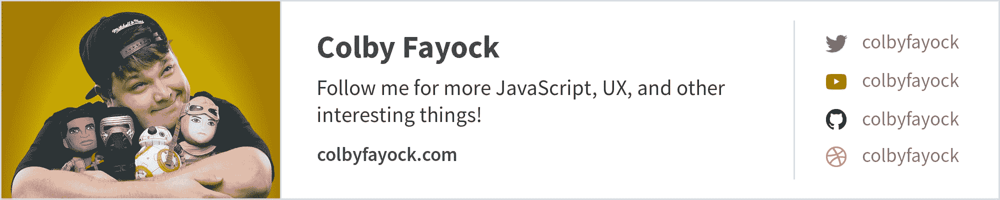

# 让它闪烁 HTML 教程-如何使用闪烁标签，代码示例

> 原文：<https://www.freecodecamp.org/news/make-it-blink-html-tutorial-how-to-use-the-blink-tag-with-code-examples/>

在网络的早期，像 blink 标签这样的 HTML 元素是添加一些动画效果来活跃网页的固有方式。如今，我们如何利用这些动画将 flare 添加到我们的网站和应用程序中？

*   [什么是 HTML 标签 blink？](#what-is-the-html-tag-blink)
*   如何使用眨眼标签？
*   你还能使用眨眼标签吗？
*   [用 CSS 动画重新创建 blink 标签](#recreating-the-blink-tag-with-css-animations)

[https://www.youtube.com/embed/-gU-gkfEA1Q?feature=oembed](https://www.youtube.com/embed/-gU-gkfEA1Q?feature=oembed)

## 什么是 HTML 标签闪烁？

[blink](https://developer.mozilla.org/en-US/docs/Web/HTML/Element/blink) 标签(`<blink>`)是一个过时的 HTML 标签，它使该标签的内容缓慢闪烁。


Google search of "blink tag"

这和其他一些过时的标签如 [marquee](https://developer.mozilla.org/en-US/docs/Web/HTML/Element/marquee) 标签(`<marquee>`)一起，是给你的站点添加简单动画效果的简单方法。

## 如何使用 blink 标签？

因为 blink 标签是一个简单的 HTML 元素，所以你可以根据你的内容来使用它。

例如，如果您希望 blink-182 中的单词“blink”闪烁，您可以编写以下 HTML:

```
<p>
  <blink>blink</blink>-182
</p>
```

## 还能用 blink 标签吗？

正如你在上面的 gif 中注意到的，这个标签已经过时了。


Blink tag browser compatibility

这意味着你不能使用 blink HTML 标签本身。然而，这不应该阻止我们重塑它的辉煌。

注意:由于可访问性问题，Blink 标签已被弃用。请[在尝试使用具有相同效果的解决方案之前做好研究](https://en.wikipedia.org/wiki/Blink_element#Usability_and_accessibility)，因为我们都应该努力使我们的项目尽可能具有包容性。

## 用 CSS 动画重新创建 blink 标签

在今天的 web 开发世界中，动画通常是用 CSS 或 JavaScript 处理的。使用 CSS 动画，我们可以用几行代码重新创建我们的 blink 标记，然后重新开始工作。

使用以下 CSS:

```
.blink {
  animation: blink 1s steps(1, end) infinite;
}

@keyframes blink {
  0% {
    opacity: 1;
  }
  50% {
    opacity: 0;
  }
  100% {
    opacity: 1;
  }
} 
```

您可以将`.blink`类添加到任何 HTML 元素中，使其闪烁。

```
<p>
  <span class="blink">blink</span>-182
</p> 
```


HTML CSS blink effect

## 更新 blink 标签

现在是 2020 年，如果我们想要更平滑的东西呢？

首先，我们可以通过从动画定义中移除`steps`来使动画淡化。

```
.blink {
  animation: blink 1s infinite;
} 
```


Blink fade effect

或者如果我们想让它像科幻效果一样淡出呢？

```
.blink {
  animation: blink 3s infinite;
}

@keyframes blink {
  0% {
    opacity: 1;
  }
  100% {
    opacity: 0;
    color: blue;
  }
} 
```


CSS blink fade sci-fi effect

或者甚至是很好的生长和褪色效果。

```
.blink {
  animation: blink 3s infinite;
}

@keyframes blink {
  0% {
    opacity: 1;
  }
  50% {
    opacity: 0;
    transform: scale(2);
  }
  51% {
    opacity: 0;
    transform: scale(0);
  }
  100% {
    transform: scale(1);
    opacity: 1;
  }
} 
```


CSS blink grow and fade effect

## 用 CSS 控制动画

虽然您可能无法使用 blink 标签，但是您仍然有很多选择。CSS 本身提供了大量的动画选项，所以无论你是想重新创建你最喜欢的 HTML 消遣还是想重新创建外星人的标题序列，几乎都有无限的可能性。

[](https://twitter.com/colbyfayock)

*   [？在 Twitter 上关注我](https://twitter.com/colbyfayock)
*   [？️订阅我的 Youtube](https://youtube.com/colbyfayock)
*   [✉️注册我的简讯](https://www.colbyfayock.com/newsletter/)