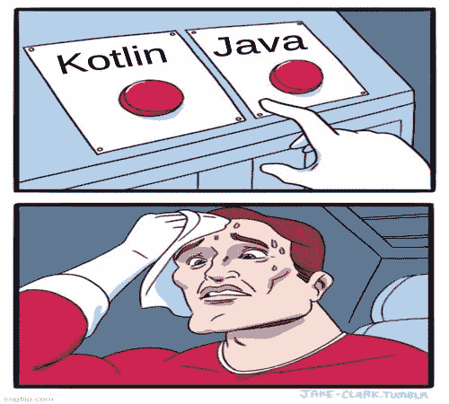
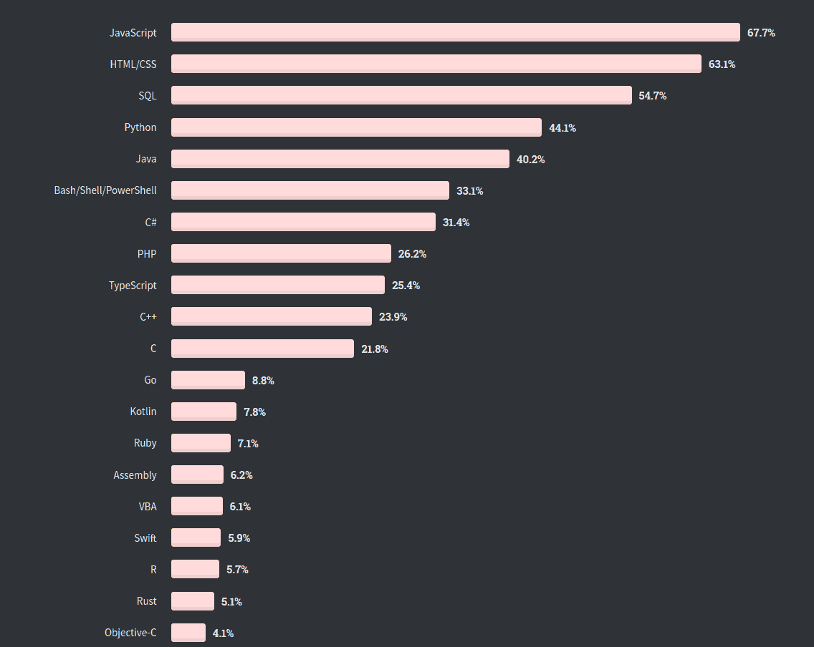

# kot Lin VS Java——2020 年你该学哪种编程语言？

> 原文：<https://www.freecodecamp.org/news/kotlin-vs-java-which-language-to-learn-in-2020/>

Kotlin 出来已经好几年了，一直做的不错。既然是专门为了取代 Java 而创建的，Kotlin 自然就在很多方面与 Java 相提并论。

为了帮助你决定这两种语言中你应该选择哪一种，我将比较每种语言的一些主要特征，这样你就可以选择你想学的那一种。



以下是我将在本文中讨论的 8 点:

*   句法
*   λ表达式
*   零处理
*   模型类
*   全局变量
*   并发
*   扩展功能
*   社区

## 语法比较

首先，让我们做一些基本的语法比较。许多正在阅读这篇文章的人可能已经对 Java 和/或 Kotlin 有了一些了解，但是我将在下面给出一个基本的例子，这样我们可以直接比较它们:

### Java 语言(一种计算机语言，尤用于创建网站)

```
public class HelloClass { 

	public void FullName(String firstName, String lastName) {
    	String fullName = firstName + " " + lastName;
		System.out.println("My name is : " + fullName); 
	} 

    	public void Age() { 
		int age = 21;
		System.out.println("My age is : " + age); 
	} 

	public static void main(String args[]) { 
		HelloClass hello = new HelloClass(); 
		hello.FullName("John","Doe");
        hello.Age();
	} 
} 
```

### 我的锅

```
class NameClass {
    fun FullName(firstName: String, lastName:String) {
        var fullName = "$firstName $lastName"
        println("My Name is : $fullName")
    }
}

fun Age() {
	var age : Int
    age = 21
    println("My age is: $age")
}

fun main(args: Array<String>) {
    NameClass().FullName("John","Doe")
    Age()
}
```

除了方法和类中的一些小的语法变化之外，代码的感觉并没有什么不同。

但是这里真正的区别是 Kotlin 支持类型推断，其中变量类型不需要声明。我们也不再需要分号(`;`)。

我们还可以注意到，Kotlin 并不像 Java 那样严格执行 OOP，在 Java 中所有的东西都必须包含在一个类中。看看例子中的`fun Age`和`fun main`，它们不包含在任何类中。

Kotlin 通常也有较少的代码行，而 Java 更多地遵循传统的方法，使一切都变得冗长。

与 Java 相比，Kotlin 的一个优势是它的灵活性——它可以选择用传统的 OOP 方法做任何事情，也可以走不同的路。

## λ表达式

如果说的是 Java 和 Kotlin，当然就要说著名的 lambda 表达式了。Kotlin 有原生的 lambda 支持(一直都有)，而 Lambda 最初是在 Java 8 中引入的。

让我们看看他们看起来怎么样。

### Java 语言(一种计算机语言，尤用于创建网站)

```
//syntaxes
parameter -> expression
(parameter1, parameter2) -> { code }

//sample usage
ArrayList<Integer> numbers = new ArrayList<Integer>();
numbers.add(5);
numbers.add(9);
numbers.forEach( (n) -> { System.out.println(n); } );
```

### 我的锅

```
//syntax
{ parameter1, parameter2 -> code }

//sample usage
max(strings, { a, b -> a.length < b.length })
```

在 Java 中，括号更加宽松:如果只有一个参数，就不需要括号。但是在 Kotlin 中，括号总是必需的。然而，总的来说，除了语法之外，没有太多的区别。

在我看来，lambda 函数除了用作回调方法之外，不会有太多用途。尽管 lambda 函数有如此多的用途，但可读性问题使得它不太理想。它们会使你的代码更短，但是以后找出代码会更困难。

这只是个人喜好的问题，但是我认为 Kotlin 强制使用括号来提高可读性是有帮助的。

## 零处理

在面向对象语言中，空类型值一直是一个问题。当您试图使用空值的内容时，这个问题会以空指针异常(NPE)的形式出现。

由于 npe 一直是个问题，Java 和 Kotlin 都有自己处理空对象的方式，我将在下面展示。

### Java 语言(一种计算机语言，尤用于创建网站)

```
Object object = objServ.getObject();

//traditional approach of null checking
if(object!=null){
    System.out.println(object.getValue());
}

//Optional was introduced in Java 8 to further help with null values

//Optional nullable will allow null object
Optional<Object> objectOptional = Optional.ofNullable(objServ.getObject());

//Optional.of - throws NullPointerException if passed parameter is null
Optional<Object> objectNotNull = Optional.of(anotherObj);

if(objectOptional.isPresent()){
    Object object = objectOptional.get();
    System.out.println(object.getValue());
}

System.out.println(objectNotNull.getValue());
```

### 我的锅

```
//Kotlin uses null safety mechanism
var a: String = "abc" // Regular initialization means non-null by default
a = null // compilation error

//allowing null only if it is set Nullable
var b: String? = "abc" // can be set null
b = null // ok
print(b)
```

就我记忆所及，Java 一直使用传统的空检查，这很容易出现人为错误。然后 Java 8 推出了可选类，允许更健壮的空检查，特别是从 API/服务器端。

另一方面，Kotlin 提供空安全变量，如果值可以为空，那么变量必须为空。

我还没有真正使用过可选类，但是其机制和目的似乎与 Kotlin 的 null safety 非常相似。两者都有助于您识别哪个变量可以为空，并帮助您确保实现了正确的检查。

有时在代码中可能有太多的变量，太多的变量需要检查。但是到处添加检查会使我们的代码变得难看，没有人喜欢这样，对吗？

不过，在我看来，使用 Java 的 optional 感觉有点乱，因为需要添加大量代码来进行检查。与此同时，在 Kotlin 中，您可以只添加少量代码来为您进行空值检查。

## 模型类

有些人也可能称之为实体类。下面你可以看到这两个类是如何在每种语言中被用作模型类的。

### Java 语言(一种计算机语言，尤用于创建网站)

```
public class Student {

     private String name;
     private Integer age;

     // Default constructor
  	 public Student() { }

     public void setName(String name) {
         this.name = name;
     }

     public String getName() {
         return name;
     }

     public void setAge(Integer age) {
         this.age = age;
     }

     public Integer getAge() {
         return age;
     }
}
```

### 我的锅

```
//Kotlin data class
data class Student(var name: String = "", var age: Int = 0)

//Usage
var student: Student = Student("John Doe", 21)
```

在 Java 中，遵循封装的惯例，属性被声明为私有的。当访问这些属性时，Java 使用 Getters 和 Setters，并在需要时使用 isEqual 或 toString 方法。

在 Kotlin 方面，[数据类](https://kotlinlang.org/docs/reference/data-classes.html)被引入用于模型类的特殊目的。数据类允许直接访问属性。它们还提供了几个内置的实用方法，如 equals()、toString()和 copy()。

对我来说，数据类是 Kotlin 提供的最好的东西之一。他们的目标是减少常规模型类所需的样板代码的数量，他们在这方面做得非常好。


Random Pic because you are halfway there! Photo by [Dino Reichmuth](https://unsplash.com/@dinoreichmuth?utm_source=ghost&utm_medium=referral&utm_campaign=api-credit) / [Unsplash](https://unsplash.com/?utm_source=ghost&utm_medium=referral&utm_campaign=api-credit)

## 全局变量

有时你的代码可能需要一个变量，需要在你的代码库中的任何地方被访问。这就是全局变量的用途。Kotlin 和 Java 都有自己的处理方式。

### Java 语言(一种计算机语言，尤用于创建网站)

```
public class SomeClass {
	public static int globalNumber = 10;
}

//can be called without initializing the class
SomeClass.globalNumber;
```

### 我的锅

```
class SomeClass {
    companion object {
        val globalNumber = 10
    }
}

//called exactly the same like usual
SomeClass.globalNumber
```

你们中的一些人可能已经熟悉了这里的 [static](https://www.javatpoint.com/static-keyword-in-java) 关键字，因为它也在其他语言中使用，比如 C++。它在程序开始执行时被初始化，因为它不是作为对象包含的，所以被 Java 用来提供全局变量。这意味着可以在任何地方访问它，而无需将类初始化为对象。

Kotlin 在这里使用了一种完全不同的方法:它删除了 static 关键字，并用一个与 singleton 非常相似的伴随对象来代替它。它让你实现一些奇特的特性，比如扩展和接口。

Kotlin 中缺少 static 关键字实际上让我很惊讶。您可能会认为使用 static 关键字可能不是一个好的实践，因为它的性质和它很难测试。当然，Kotlin 伴星很容易取代它。

即便如此，对全局变量使用 static 应该足够简单了。如果我们小心对待它，不要让它成为把每一件事情都全球化的习惯，我们应该会做得很好。

伴随对象也可能在接口等方面给我们一些灵活性，但是我们多久会接口一次单例类呢？

我认为静态关键字有助于我们对全局变量保持简洁。

## 并发

如今，并发是一个热门话题。有时，编程语言同时运行几个任务的能力可能会帮助您决定是否选择这种语言。

让我们看看这两种语言是如何处理这个问题的。

### Java 语言(一种计算机语言，尤用于创建网站)

```
 // Java code for thread creation by extending 
// the Thread class 
class MultithreadingDemo extends Thread 
{ 
    public void run() 
    { 
        try
        { 
            // Displaying the thread that is running 
            System.out.println ("Thread " + 
                  Thread.currentThread().getId() + 
                  " is running"); 

        } 
        catch (Exception e) 
        { 
            // Throwing an exception 
            System.out.println ("Exception is caught"); 
        } 
    } 
} 

// Main Class 
public class Multithread 
{ 
    public static void main(String[] args) 
    { 
        int n = 8; // Number of threads 
        for (int i=0; i<n; i++) 
        { 
            MultithreadingDemo object = new MultithreadingDemo(); 
            object.start(); 
        } 
    } 
} 
```

### 我的锅

```
for (i in 1..1000)
    GlobalScope.launch {
        println(i)
    } 
```

Java 大多使用[线程](https://docs.oracle.com/javase/7/docs/api/java/lang/Thread.html)来支持并发。在 Java 中，制作一个线程需要你制作一个扩展到内置 Java thread 类的类。它的其他用法应该非常简单。

虽然线程在 Kotlin 中也是可用的，但是您应该使用它的[协程](https://kotlinlang.org/docs/reference/coroutines-overview.html)。协程基本上是轻量级线程，擅长短时间的非阻塞任务。

并发性一直是一个很难理解的概念(也很难测试)。线程已经被使用了很长时间，有些人可能已经习惯了。

协程程序最近变得更受 Kotlin 和 Go 等语言的欢迎(Go 也有类似的 goroutines)。这个概念与传统线程略有不同—[协程是顺序的，而线程可以并行工作](https://stackoverflow.com/a/1934718/6065825)。

不过，测试协程应该很容易，因为 Kotlin 在他们的[文档](https://kotlinlang.org/docs/reference/coroutines-overview.html)中很好地解释了它们。Kotlin 优于 Java 的一个好处是，Kotlin 中可以删除大量样板代码。

## 扩展功能

您可能会奇怪，既然 Java 本身甚至没有这个特性，我为什么要提出这些。

但我不得不提到它，因为扩展函数是 Kotlin 中引入的一个非常有用的功能。

```
fun Int.plusOne(): Int {
	return this + 1
}

fun main(args: Array<String>) {
    var number = 1
    var result = number.plusOne()
    println("Result is: $result")
}
```

它们允许一个类拥有新的功能，而不需要将它扩展到类中或者使用任何花哨的设计模式。它甚至允许您向 Kotlin 变量类添加功能。

你几乎可以和那些需要你在参数中传递所有东西 lib 方法说再见了。

## 社区

最后但同样重要的是，我们来谈谈非技术性的东西。首先，让我们看看这个显示 2020 年常用编程语言的调查。



taken from [stack overflow survey](https://insights.stackoverflow.com/survey/2020#development-environments-and-tools)

我们可以看到 Java 是最常用的语言之一。虽然 Kotlin 仍然越来越受欢迎，但 Java 社区仍然比 Kotlin 大几倍，而且可能不会很快改变。

那这又有什么关系呢？事实上这很重要。随着 Java 社区中人数的增加，无论是在互联网上还是在现实世界中，当您需要时，查找参考资料和获得帮助都变得更加容易。

许多公司仍然使用 Java 作为他们的基础，即使有了 Kotlin 与 Java 的互操作性，这种情况也不会很快改变。通常，除非公司有非常非常重要的理由，否则进行迁移不会有任何商业目的。

## 包扎

对于那些只是滚动查看摘要的人，下面是我们讨论的内容:

*   语法:除了语法上的细微差别，这些模式没有太大的不同，但是 Kotlin 在几个方面更加灵活。
*   Lambda 表达式:语法几乎相同，但是 Kotlin 使用了花括号来帮助提高可读性。
*   空处理:Java 使用一个类来帮助处理空，而 Kotlin 使用内置的空安全变量。
*   模型类:Java 使用带有私有变量和 setter / getter 的类，而 Kotlin 支持数据类。
*   全局变量:Java 使用 static 关键字，而 Kotlin 使用类似于子类的东西。
*   并发性:Java 使用多线程，而 Kotlin 使用协程(通常更轻)。
*   扩展函数:Kotlin 引入的一个新特性，可以在不扩展功能的情况下轻松地将功能添加到类中。
*   社区:Java 在社区方面仍然占主导地位，这使得学习和获得帮助更加容易。


Photo by [Glenn Carstens-Peters](https://unsplash.com/@glenncarstenspeters?utm_source=ghost&utm_medium=referral&utm_campaign=api-credit) / [Unsplash](https://unsplash.com/?utm_source=ghost&utm_medium=referral&utm_campaign=api-credit)

我们可以在 Java 和 Kotlin 之间比较更多的特性。但在我看来，我在这里讨论的是一些最重要的问题。

我认为科特林现在很值得一试。从开发的角度来看，它可以帮助你去除冗长的样板代码，保持一切简洁明了。如果你已经是一名 Java 程序员，学习 Kotlin 应该不会太难，慢慢来也没关系。

感谢阅读！我希望这篇文章能帮助你决定应该选择哪种编程语言，Java 还是 Kotlin。对于我错过的任何东西，请随时给我留下反馈，我们将非常感谢。