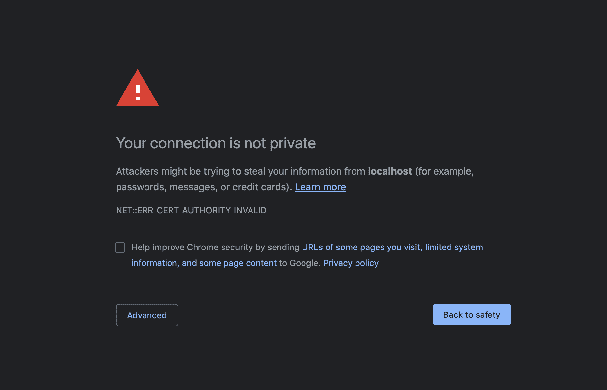
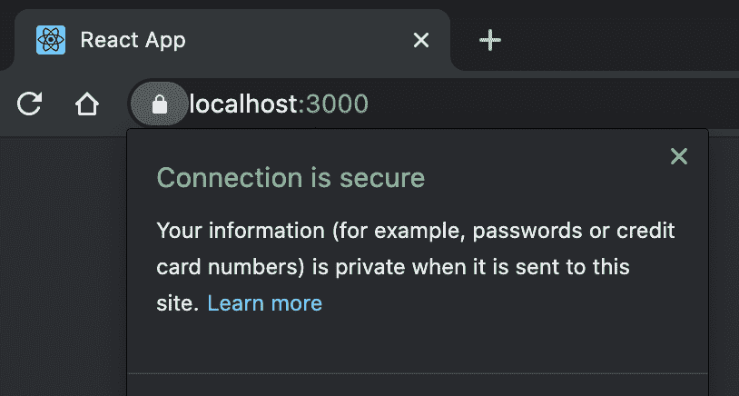

# 如何使用创建-反应-应用程序在本地设置 HTTPS

> 原文：<https://www.freecodecamp.org/news/how-to-set-up-https-locally-with-create-react-app/>

当您需要使用也通过 HTTPS 服务请求的 API 时，在开发中运行 HTTPS 会很有帮助。

在本文中，我们将使用我们自己的 SSL 证书为我们的 create-react-app 设置开发中的 HTTPS。

本指南面向 macOS 用户，要求您已经安装了`[brew](https://brew.sh/)`。

## 添加 HTTPS

在您的`package.json`中，更新**开始**脚本以包含 https:

```
"scripts": {
    "start": "HTTPS=true react-scripts start",
    "build": "react-scripts build",
    "test": "react-scripts test",
    "eject": "react-scripts eject"
  },
```

在此步骤后运行`yarn start`将在您的浏览器中显示此屏幕:



在这个阶段，你已经做好了与`https`合作的准备。但是您没有有效的证书，所以您的连接被认为是不安全的。

## 创建 SSL 证书

获得证书最简单的方法是通过`[mkcert](https://github.com/FiloSottile/mkcert)`。

```
# Install mkcert tool
brew install mkcert

# Install nss (only needed if you use Firefox)
brew install nss

# Setup mkcert on your machine (creates a CA)
mkcert -install
```

运行上面的命令后，您将在您的机器上创建一个 **[认证机构](https://en.wikipedia.org/wiki/Certificate_authority)** ，它使您能够为您将来的所有项目生成证书。

从您的`create-react-app`项目的根目录，您现在应该运行:

```
# Create .cert directory if it doesn't exist
mkdir -p .cert

# Generate the certificate (ran from the root of this project)
mkcert -key-file ./.cert/key.pem -cert-file ./.cert/cert.pem "localhost"
```

我们将把生成的证书存储在`.cert`目录中。这些不应该被提交给版本控制，所以你应该更新你的`.gitignore`来包含`.cert`目录。

接下来，我们需要再次更新`start`脚本，以包含我们新创建的证书:

```
 "scripts": {
    "start": "HTTPS=true SSL_CRT_FILE=./.cert/cert.pem SSL_KEY_FILE=./.cert/key.pem react-scripts start",
    "build": "react-scripts build",
    "test": "react-scripts test",
    "eject": "react-scripts eject"
  },
```

当您再次运行`yarn start`时，您现在应该看到您的连接是安全的。



别见外！如果您有任何问题，请随时写信- [在 Linkedin 上联系我](https://www.linkedin.com/in/braedon-gough-ba92a048/)或[在 Twitter 上关注我](https://twitter.com/bbbraedddon)。